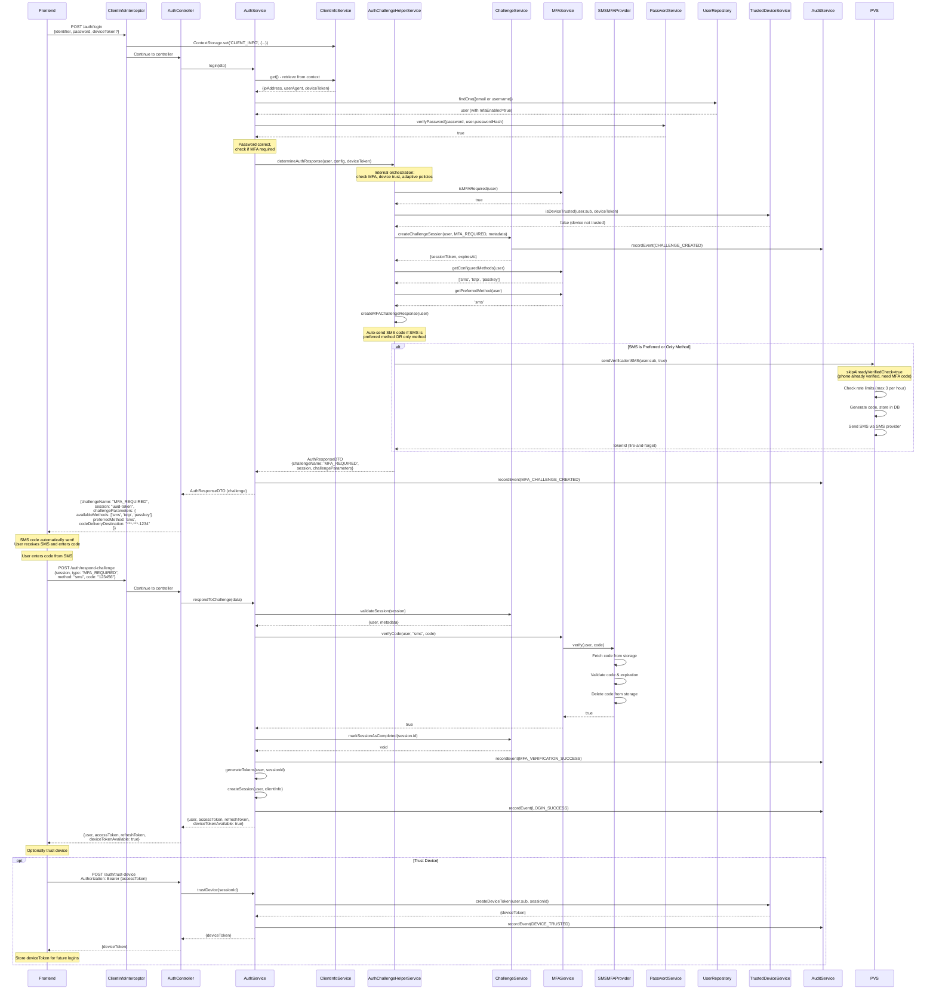
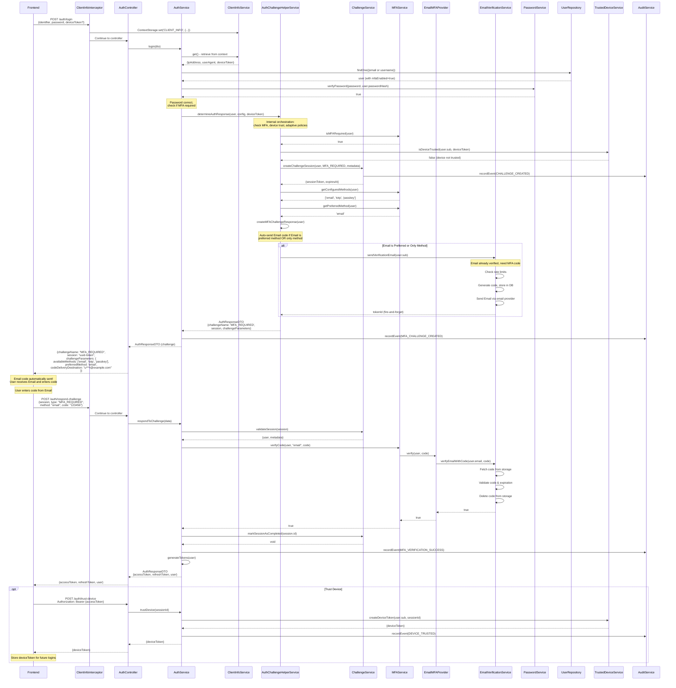
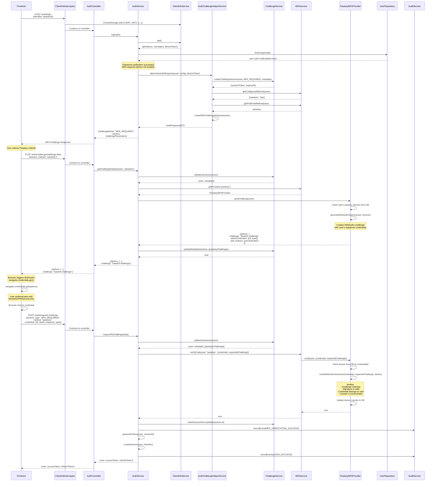
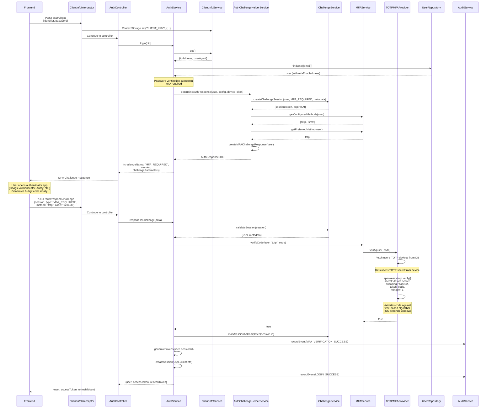
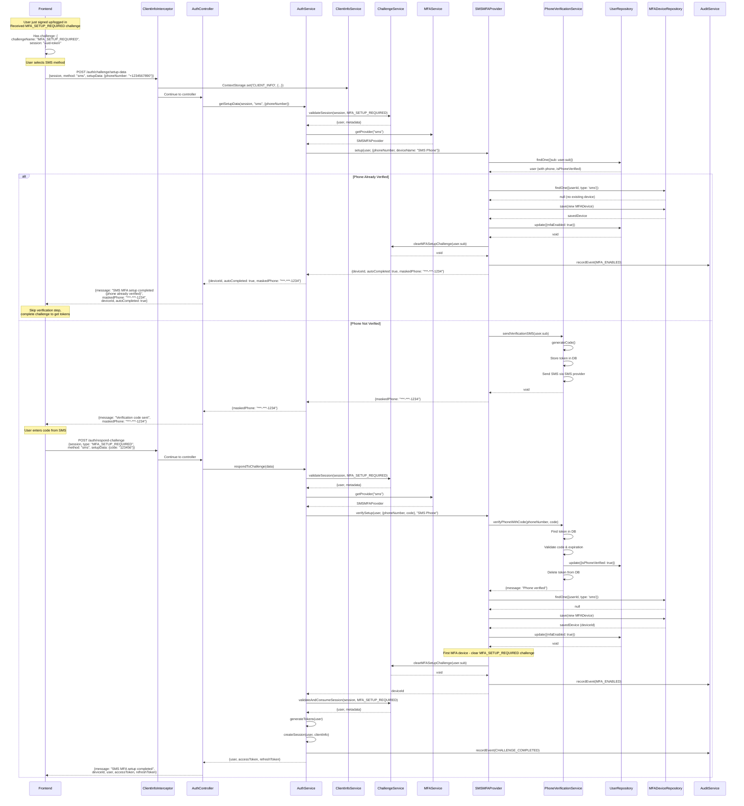
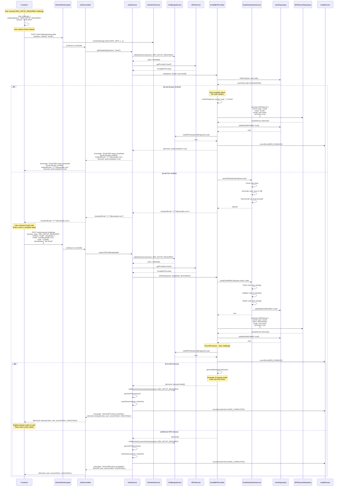
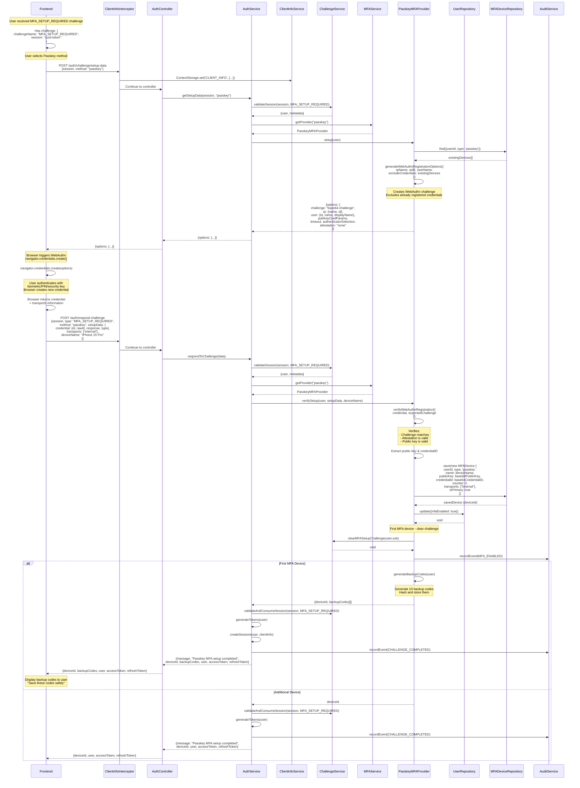

# Authentication Flows - Detailed Sequence Diagrams

This document provides comprehensive sequence diagrams showing the complete authentication flows including signup, login, and MFA verification for different methods (SMS, Passkey, TOTP).

**Architecture Version:** v0.1.0 - Platform-Agnostic with Unified Challenge API

## Key Architecture Principles

- **Platform-Agnostic Core**: All services are pure TypeScript, framework-independent
- **Context-Based Client Info**: `ClientInfoInterceptor` stores IP/UserAgent in `ContextStorage` (AsyncLocalStorage), services retrieve via `ClientInfoService.get()`
- **Unified Challenge API**: Single `respondToChallenge()` endpoint handles all challenge types
- **Helper Methods in AuthService**: `getSetupData()`, `getChallengeData()`, `resendCode()` are public methods in AuthService
- **Internal Orchestration**: `AuthChallengeHelperService.determineAuthResponse()` decides next step internally
- **Internal Session Management**: `ChallengeService` handles low-level CRUD operations on challenge sessions

## Table of Contents

1. [Basic Signup Flow](#1-basic-signup-flow)
2. [Login with SMS MFA Flow](#2-login-with-sms-mfa-flow)
3. [Login with Email MFA Flow](#3-login-with-email-mfa-flow)
4. [Login with Passkey MFA Flow](#4-login-with-passkey-mfa-flow)
5. [Login with TOTP MFA Flow](#5-login-with-totp-mfa-flow)
6. [MFA Setup During Challenge (SMS)](#6-mfa-setup-during-challenge-sms)
7. [MFA Setup During Challenge (Email)](#7-mfa-setup-during-challenge-email)
8. [MFA Setup During Challenge (Passkey)](#8-mfa-setup-during-challenge-passkey)
9. [MFA Setup During Challenge (TOTP)](#9-mfa-setup-during-challenge-totp)

---

## 1. Basic Signup Flow

This diagram shows a user signing up with email and/or phone verification required. Includes rate limiting and retry logic.

```mermaid
sequenceDiagram
    participant FE as Frontend
    participant Interceptor as ClientInfoInterceptor
    participant AC as AuthController
    participant AS as AuthService
    participant CIS as ClientInfoService
    participant CH as AuthChallengeHelperService
    participant CS as ChallengeService
    participant EVS as EmailVerificationService
    participant PVS as PhoneVerificationService
    participant SA as StorageAdapter
    participant PS as PasswordService
    participant UR as UserRepository
    participant AuS as AuditService

    FE->>Interceptor: POST /auth/signup<br/>{email, password, phone?}

    Note over Interceptor: Global interceptor extracts<br/>IP, UserAgent, device info
    Interceptor->>Interceptor: Extract IP from headers/socket
    Interceptor->>Interceptor: Extract UserAgent from headers
    Interceptor->>Interceptor: Extract deviceToken from<br/>header/cookie/body
    Interceptor->>CIS: ContextStorage.set('CLIENT_INFO', clientInfo)
    Interceptor->>CIS: ContextStorage.set('HTTP_RESPONSE', response)

    Interceptor->>AC: Continue to controller

    AC->>AS: signup(dto)

    AS->>CIS: get() - retrieve from context
    CIS-->>AS: {ipAddress, userAgent, deviceToken}

    AS->>UR: findOne({email})
    UR-->>AS: null (user doesn't exist)

    AS->>PS: validatePassword(password, policy)
    PS-->>AS: {valid: true}

    AS->>PS: hashPassword(password)
    PS-->>AS: passwordHash

    AS->>UR: create(new User)
    AS->>UR: save(user)
    UR-->>AS: savedUser

    AS->>CH: determineAuthResponse(user, config)
    Note over CH: Internal orchestration:<br/>Checks priority (VERIFY_EMAIL → VERIFY_PHONE → MFA_SETUP → MFA)

    alt Email Verification Required (verificationMethod: 'email' or 'both')
        CH->>EVS: sendVerificationEmail(user.sub)

        Note over EVS: Rate Limiting Check
        EVS->>SA: incr(rate-limit:email:user.sub)
        SA-->>EVS: count (max 3 per hour)

        alt Rate Limit Exceeded
            EVS-->>CH: throw NAuthException(RATE_LIMIT_EMAIL)
            CH-->>AS: throw error {retryAfter: seconds}
            AS-->>AC: throw error
            AC-->>FE: 429 Too Many Requests<br/>{retryAfter: 3600}
        else Rate Limit OK
            EVS->>EVS: Check resend delay (60s default)
            EVS->>EVS: Generate code, store in DB
            EVS->>EVS: Send email via email provider
            EVS-->>CH: void

            CH->>CS: createChallengeSession(user, VERIFY_EMAIL, metadata)
            CS->>CIS: get() - for audit context
            CIS-->>CS: {ipAddress, userAgent}
            CS->>UR: Save challenge session to DB<br/>(expiresAt: 15min, maxAttempts: 3)
            CS->>AuS: recordEvent(CHALLENGE_CREATED)
            CS-->>CH: {sessionToken, expiresAt}

            CH->>CH: createChallengeResponse(user, VERIFY_EMAIL)
            CH-->>AS: AuthResponseDTO<br/>{challengeName: 'VERIFY_EMAIL',<br/>session, challengeParameters}

            AS->>AuS: recordEvent(SIGNUP_SUCCESS)
            AS-->>AC: AuthResponseDTO (challenge)
            AC-->>FE: {challengeName: "VERIFY_EMAIL",<br/>session: "uuid-token",<br/>challengeParameters: {email}}

            Note over FE: User receives email with code

            loop Retry with incorrect code (max 3 attempts)
                FE->>Interceptor: POST /auth/respond-challenge<br/>{session, type: "VERIFY_EMAIL", code: "123456"}
                Interceptor->>AC: Continue to controller
                AC->>AS: respondToChallenge(data)

                AS->>CS: validateSession(session)
                CS->>UR: Fetch session from DB
                CS->>CS: Check expiration (< 15min)
                CS->>CS: Check attempts (< 3)
                CS-->>AS: {challengeSession, user, metadata}

                AS->>EVS: verifyEmailWithCode(user.sub, code)
                EVS->>UR: Find verification token
                EVS->>EVS: Validate code match
                EVS->>EVS: Check token expiration
                EVS->>EVS: Check token attempts (< 3)

                alt Code Invalid
                    EVS->>UR: Increment token.attempts
                    EVS-->>AS: false

                    AS->>CS: incrementAttempts(session)
                    CS->>UR: session.attempts++
                    CS-->>AS: void

                    AS-->>AC: throw NAuthException(VERIFICATION_CODE_INVALID)
                    AC-->>FE: 400 Bad Request<br/>{error: "Invalid code", attemptsRemaining: 2}
                    Note over FE: User tries again
                else Code Valid
                    EVS->>UR: update({isEmailVerified: true})
                    EVS->>UR: Delete verification token
                    EVS-->>AS: true
                end
            end

            AS->>CS: validateAndConsumeSession(session, VERIFY_EMAIL)
            CS->>UR: Mark session as completed
            CS-->>AS: {user, metadata}

            AS->>UR: findOne({sub: user.sub})
            UR-->>AS: updatedUser (isEmailVerified: true)

            AS->>CH: determineAuthResponse(updatedUser, config)
            Note over CH: Check for next challenge (e.g., VERIFY_PHONE)

            alt Phone Verification Also Required (verificationMethod: 'both')
                CH->>PVS: sendVerificationSMS(user.sub)

                Note over PVS: Rate Limiting Check
                PVS->>SA: incr(rate-limit:sms:user.sub)
                SA-->>PVS: count (max 3 per hour)

                alt Rate Limit Exceeded
                    PVS-->>CH: throw NAuthException(RATE_LIMIT_SMS)
                else Rate Limit OK
                    PVS->>PVS: Check resend delay (60s default)
                    PVS->>PVS: Generate code, store in DB
                    PVS->>PVS: Send SMS via SMS provider
                    PVS-->>CH: void

                    CH->>CS: createChallengeSession(user, VERIFY_PHONE, metadata)
                    CS-->>CH: {sessionToken, expiresAt}

                    CH->>CH: createChallengeResponse(user, VERIFY_PHONE)
                    CH-->>AS: AuthResponseDTO<br/>{challengeName: 'VERIFY_PHONE',<br/>session, challengeParameters}

                    AS-->>AC: AuthResponseDTO (challenge)
                    AC-->>FE: {challengeName: "VERIFY_PHONE",<br/>session: "uuid-token",<br/>challengeParameters: {maskedPhone}}

                    Note over FE: User completes phone verification<br/>(same retry logic as email)

                    FE->>AC: POST /auth/respond-challenge<br/>{session, type: "VERIFY_PHONE", code: "123456"}
                    AC->>AS: respondToChallenge(data)
                    Note over AS: Phone verification with same<br/>rate limits and retry logic
                end
            end

            AS->>AS: generateTokens(user)
            AS->>AS: createSession(user, clientInfo)
            AS-->>AC: {user, accessToken, refreshToken}
            AC-->>FE: {user, accessToken, refreshToken}
        end

    else Phone Verification Only (verificationMethod: 'phone')
        CH->>PVS: sendVerificationSMS(user.sub)

        Note over PVS: Rate Limiting Check
        PVS->>SA: incr(rate-limit:sms:user.sub)
        SA-->>PVS: count (max 3 per hour)

        alt Rate Limit Exceeded
            PVS-->>CH: throw NAuthException(RATE_LIMIT_SMS)
            CH-->>AS: throw error {retryAfter: seconds}
            AS-->>AC: throw error
            AC-->>FE: 429 Too Many Requests<br/>{retryAfter: 3600}
        else Rate Limit OK
            PVS->>PVS: Check resend delay (60s default)
            PVS->>PVS: Generate code, store in DB
            PVS->>PVS: Send SMS via SMS provider
            PVS-->>CH: void

            CH->>CS: createChallengeSession(user, VERIFY_PHONE, metadata)
            CS-->>CH: {sessionToken, expiresAt}

            CH->>CH: createChallengeResponse(user, VERIFY_PHONE)
            CH-->>AS: AuthResponseDTO

            AS->>AuS: recordEvent(SIGNUP_SUCCESS)
            AS-->>AC: AuthResponseDTO (challenge)
            AC-->>FE: {challengeName: "VERIFY_PHONE",<br/>session,<br/>challengeParameters}

            Note over FE: User verifies phone (same retry logic)

            FE->>AC: POST /auth/respond-challenge<br/>{session, type: "VERIFY_PHONE", code: "123456"}
            AC->>AS: respondToChallenge(data)

            AS->>AS: generateTokens(user)
            AS-->>AC: {user, accessToken, refreshToken}
            AC-->>FE: {user, accessToken, refreshToken}
        end

    else No Verification Required (verificationMethod: 'none')
        CH->>AS: No challenges required
        CH-->>AS: AuthResponseDTO (success)

        AS->>AS: generateTokens(user)
        AS->>AS: createSession(user, clientInfo)
        AS->>AuS: recordEvent(SIGNUP_SUCCESS)
        AS-->>AC: {user, accessToken, refreshToken}
        AC-->>FE: {user, accessToken, refreshToken}
    end
```



---

## 2. Login with SMS MFA Flow

This diagram shows login flow when user has SMS MFA enabled.



---

## 3. Login with Email MFA Flow

This diagram shows login flow when user has Email MFA enabled.



---

## 4. Login with Passkey MFA Flow

This diagram shows login flow when user has Passkey MFA enabled.



---

## 5. Login with TOTP MFA Flow

This diagram shows login flow when user has TOTP (Authenticator App) MFA enabled.



---

## 6. MFA Setup During Challenge (SMS)

This diagram shows SMS MFA setup during the `MFA_SETUP_REQUIRED` challenge flow (typically after signup when MFA is enforced).



---

## 7. MFA Setup During Challenge (Email)

This diagram shows Email MFA setup during the `MFA_SETUP_REQUIRED` challenge flow (typically after signup when MFA is enforced).



---

## 8. MFA Setup During Challenge (Passkey)

This diagram shows Passkey MFA setup during the `MFA_SETUP_REQUIRED` challenge flow.



---

## 9. MFA Setup During Challenge (TOTP)

This diagram shows TOTP (Authenticator App) MFA setup during the `MFA_SETUP_REQUIRED` challenge flow.

```mermaid
sequenceDiagram
    participant FE as Frontend
    participant Interceptor as ClientInfoInterceptor
    participant AC as AuthController
    participant AS as AuthService
    participant CIS as ClientInfoService
    participant CS as ChallengeService
    participant MS as MFAService
    participant TOTP as TOTPMFAProvider
    participant UR as UserRepository
    participant MDR as MFADeviceRepository
    participant AuS as AuditService

    Note over FE: User received MFA_SETUP_REQUIRED challenge

    FE->>FE: Has challenge: {<br/>  challengeName: "MFA_SETUP_REQUIRED",<br/>  session: "uuid-token"<br/>}

    Note over FE: User selects TOTP method

    FE->>Interceptor: POST /auth/challenge/setup-data<br/>{session, method: "totp"}
    Interceptor->>CIS: ContextStorage.set('CLIENT_INFO', {...})
    Interceptor->>AC: Continue to controller

    AC->>AS: getSetupData(session, "totp")

    AS->>CS: validateSession(session, MFA_SETUP_REQUIRED)
    CS-->>AS: {user, metadata}

    AS->>MS: getProvider("totp")
    MS-->>AS: TOTPMFAProvider

    AS->>TOTP: setup(user)

    TOTP->>TOTP: speakeasy.generateSecret({<br/>  name: 'NAuth (user@example.com)',<br/>  issuer: 'NAuth',<br/>  length: 32<br/>})
    Note over TOTP: Generate random base32 secret

    TOTP->>TOTP: QRCode.toDataURL(otpauthURL)
    Note over TOTP: Create QR code from URL:<br/>otpauth://totp/NAuth:user@example.com<br/>?secret=BASE32SECRET&issuer=NAuth

    TOTP-->>AS: {<br/>  secret: "BASE32SECRET",<br/>  qrCode: "data:image/png;base64,...",<br/>  manualEntryKey: "BASE32-SECRET",<br/>  issuer: "NAuth",<br/>  accountName: "user@example.com"<br/>}

    AS-->>AC: {secret, qrCode, manualEntryKey,<br/>issuer, accountName}
    AC-->>FE: {secret, qrCode, manualEntryKey,<br/>issuer, accountName}

    Note over FE: Display QR code to user<br/>"Scan with Google Authenticator"<br/>Also show manual entry option

    FE->>FE: User scans QR code with<br/>authenticator app<br/>(Google Authenticator, Authy, etc.)

    Note over FE: Authenticator app generates<br/>6-digit code (refreshes every 30s)

    FE->>Interceptor: POST /auth/respond-challenge<br/>{session, type: "MFA_SETUP_REQUIRED",<br/>method: "totp", setupData: {<br/>  secret: "BASE32SECRET",<br/>  code: "123456",<br/>  deviceName: "Google Authenticator"<br/>}}
    Interceptor->>AC: Continue to controller

    AC->>AS: respondToChallenge(data)

    AS->>CS: validateSession(session, MFA_SETUP_REQUIRED)
    CS-->>AS: {user, metadata}

    AS->>MS: getProvider("totp")
    MS-->>AS: TOTPMFAProvider

    AS->>TOTP: verifySetup(user, setupData, deviceName)

    TOTP->>TOTP: speakeasy.totp.verify({<br/>  secret, encoding: 'base32',<br/>  token: code, window: 1<br/>})
    Note over TOTP: Validates code against secret<br/>(±30 seconds time window)

    alt Code Valid
        TOTP->>MDR: save(new MFADevice {<br/>  userId, type: 'totp',<br/>  name: deviceName,<br/>  secret: encrypted(secret),<br/>  isPrimary: true<br/>})
        MDR-->>TOTP: savedDevice (deviceId)

        TOTP->>UR: update({mfaEnabled: true})
        UR-->>TOTP: void

        Note over TOTP: First MFA device - clear challenge
        TOTP->>CS: clearMFASetupChallenge(user.sub)
        CS-->>TOTP: void

        TOTP->>AuS: recordEvent(MFA_ENABLED)

        alt First MFA Device
            TOTP->>TOTP: generateBackupCodes(user)
            Note over TOTP: Generate 10 backup codes<br/>Hash and store them
            TOTP-->>AS: {deviceId, backupCodes[]}

            AS->>CS: validateAndConsumeSession(session, MFA_SETUP_REQUIRED)
            AS->>AS: generateTokens(user)
            AS->>AS: createSession(user, clientInfo)
            AS->>AuS: recordEvent(CHALLENGE_COMPLETED)

            AS-->>AC: {message: "TOTP MFA setup completed",<br/>deviceId, backupCodes, user, accessToken, refreshToken}
            AC-->>FE: {deviceId, backupCodes, user, accessToken, refreshToken}

            Note over FE: Display backup codes to user<br/>"Save these codes safely"
        else Additional Device
            TOTP-->>AS: deviceId

            AS->>CS: validateAndConsumeSession(session, MFA_SETUP_REQUIRED)
            AS->>AS: generateTokens(user)
            AS->>AuS: recordEvent(CHALLENGE_COMPLETED)

            AS-->>AC: {message: "TOTP MFA setup completed",<br/>deviceId, user, accessToken, refreshToken}
            AC-->>FE: {deviceId, user, accessToken, refreshToken}
        end

    else Code Invalid
        TOTP-->>AS: throw NAuthException(INVALID_MFA_CODE)
        AS-->>AC: throw NAuthException(INVALID_MFA_CODE)
        AC-->>FE: 400 Bad Request<br/>{error: "Invalid verification code"}
        Note over FE: User tries again with new code
    end
```

---

## Key Observations

### Common Patterns Across All Flows:

1. **Client Info Extraction**: `ClientInfoInterceptor` (global) automatically extracts IP address, user agent, and device token from HTTP request, stores them in `ContextStorage` (AsyncLocalStorage), and makes them available via `ClientInfoService.get()`

2. **Challenge Sessions**: All challenge flows use `ChallengeService` to create short-lived (15 min) sessions with:
   - Unique session token (UUID)
   - Challenge type (VERIFY_EMAIL, MFA_REQUIRED, MFA_SETUP_REQUIRED)
   - User reference
   - Metadata (authMethod, authProvider, etc.)
   - Attempt tracking (max 3 attempts)

3. **Unified Challenge Response**: Single `respondToChallenge()` method in `AuthService` handles ALL challenge types via discriminated union pattern

4. **Helper Methods**: All in `AuthService` (public API):
   - `getSetupData(session, method, setupData?)`: Get MFA setup data (QR code, options, etc.)
   - `getChallengeData(session, method)`: Get MFA challenge data (passkey options, send SMS code)
   - `resendCode(session)`: Resend verification code

5. **Internal Orchestration**: `AuthChallengeHelperService.determineAuthResponse()` decides what happens next:
   - Checks challenge priority
   - Determines if MFA required
   - Checks device trust
   - Creates challenge sessions
   - Generates tokens when all challenges passed

6. **MFA Provider Pattern**: All MFA methods implement `IMFAProviderService` interface:
   - `setup(user, setupData?)`: Initialize MFA method
   - `verifySetup(user, verificationData, deviceName?)`: Complete setup
   - `verify(user, code, deviceId?)`: Verify during login
   - `sendChallenge(user)`: (Optional) Send verification code (SMS, Passkey)

6a. **Auto-Send SMS/Email for MFA** - **NEW**: When `MFA_REQUIRED` challenge is created, SMS or Email codes are **automatically sent** if:
   - SMS/Email is the user's **preferred MFA method**, OR
   - SMS/Email is the **ONLY MFA method** the user has set up
   - SMS uses `PhoneVerificationService.sendVerificationSMS()` with full rate limiting (3 per hour)
   - Email uses `EmailVerificationService.sendVerificationEmail()` with full rate limiting
   - Fire-and-forget async operation (doesn't block challenge response)
   - Improves UX by eliminating extra API call

7. **Audit Trail**: All critical events are logged via `AuthAuditService`:
   - SIGNUP_SUCCESS, LOGIN_SUCCESS, LOGIN_FAILED
   - CHALLENGE_CREATED, CHALLENGE_COMPLETED
   - MFA_ENABLED, MFA_VERIFICATION_SUCCESS, MFA_VERIFICATION_FAILED
   - DEVICE_TRUSTED

8. **Token Generation**: Final step after all challenges are completed:
   - Access token (short-lived, typically 15 min)
   - Refresh token (long-lived, typically 7 days)
   - Session ID stored in token payload for revocation

9. **Backup Codes**: Generated automatically on first MFA device setup:
   - 10 single-use codes
   - Hashed before storage
   - Can be used if primary MFA method unavailable

### Security Features:

- **Constant-time operations**: Prevents timing attacks during login
- **Session expiration**: Challenge sessions expire after 15 minutes
- **Attempt limiting**: Max 3 verification attempts per challenge session
- **Device trust**: Optional device tokens for MFA bypass on trusted devices
- **Account lockout**: IP-based lockout after failed login attempts
- **Audit logging**: Complete authentication event trail
- **Password hashing**: Argon2id for secure password storage
- **Context-based architecture**: All services access client info from context (no parameter passing)

---

## Rate Limiting & Retry Logic

### Email Verification Rate Limits

**Sending Verification Emails:**

- **Rate Limit:** Max 3 emails per hour per user (configurable via `signup.emailVerification.rateLimitMax`)
- **Window:** 3600 seconds (1 hour) (configurable via `signup.emailVerification.rateLimitWindow`)
- **Resend Delay:** 60 seconds minimum between requests (configurable via `signup.emailVerification.resendDelay`)
- **Storage:** Uses `StorageAdapter` with key pattern `rate-limit:email:verification:{userSub}`
- **Error:** `RATE_LIMIT_EMAIL` - includes `retryAfter` in seconds

**Example Configuration:**

```typescript
signup: {
  emailVerification: {
    enabled: true,
    rateLimitMax: 3,          // Max emails per window
    rateLimitWindow: 3600,    // Window in seconds (1 hour)
    resendDelay: 60,          // Min seconds between sends
    codeExpiry: 600,          // Code expiry in seconds (10 min)
    maxAttempts: 3,           // Max attempts per code
  }
}
```

**Verification Code Attempts:**

- **Max Attempts:** 3 per verification token (stored in DB)
- **Token Expiration:** 10 minutes default (configurable via `codeExpiry`)
- **Rate Limiting:** No rate limit on verification attempts (protected by max attempts on token)
- **Behavior:** Failed verification increments both:
  - Token attempts (DB record)
  - Challenge session attempts (separate counter)

### Phone Verification Rate Limits

**Sending Verification SMS:**

- **Rate Limit:** Max 3 SMS per hour per user (configurable via `signup.phoneVerification.rateLimitMax`)
- **Window:** 3600 seconds (1 hour) (configurable via `signup.phoneVerification.rateLimitWindow`)
- **Resend Delay:** 60 seconds minimum between requests (configurable via `signup.phoneVerification.resendDelay`)
- **Storage:** Uses `StorageAdapter` with key pattern `rate-limit:sms:verification:{userSub}`
- **Error:** `RATE_LIMIT_SMS` - includes `retryAfter` in seconds

**Example Configuration:**

```typescript
signup: {
  phoneVerification: {
    enabled: true,
    rateLimitMax: 3,          // Max SMS per window
    rateLimitWindow: 3600,    // Window in seconds (1 hour)
    resendDelay: 60,          // Min seconds between sends
    codeExpiry: 600,          // Code expiry in seconds (10 min)
    maxAttempts: 3,           // Max attempts per code
  }
}
```

**Verification Code Attempts:**

- **Max Attempts:** 3 per verification token (stored in DB)
- **Token Expiration:** 10 minutes default (configurable via `codeExpiry`)
- **Additional Rate Limiting:**
  - Per User: Max 10 attempts per hour (key: `verify-attempts:user:{userSub}`)
  - Per IP: Max 20 attempts per hour (key: `verify-attempts:ip:{ipAddress}`)
- **Error:** `VERIFICATION_TOO_MANY_ATTEMPTS`

### Challenge Session Limits

**Session Expiration:**

- **Default:** 15 minutes from creation
- **Storage:** Database record with `expiresAt` timestamp
- **Check:** Validated on every `validateSession()` call
- **Error:** `CHALLENGE_EXPIRED`

**Attempt Tracking:**

- **Max Attempts:** 3 per challenge session (configurable in `createChallengeSession`)
- **Counter:** `attempts` field in `ChallengeSession` entity
- **Increment:** Only on failed verification (not on code send requests)
- **Error:** `CHALLENGE_MAX_ATTEMPTS`

**Session States:**

- **Active:** `isCompleted: false`, `attempts < maxAttempts`, `expiresAt > now`
- **Completed:** `isCompleted: true` (consumed after successful verification)
- **Expired:** `expiresAt <= now`
- **Max Attempts:** `attempts >= maxAttempts`

### MFA Code Rate Limits

**SMS MFA:**

- **Send Rate Limit:** Max 3 codes per 15 minutes per user
- **Storage Key:** `mfa:sms:rate-limit:{userSub}`
- **Window:** 900 seconds (15 minutes)
- **Error:** `RATE_LIMIT_SMS_MFA`

**Verification Attempts:**

- **Storage-based:** Codes stored in `StorageAdapter` with TTL
- **Max Attempts:** No hard limit (codes expire after TTL)
- **Expiry:** 5 minutes default
- **Behavior:** Code is deleted after successful verification

**TOTP MFA:**

- **No Rate Limit:** Time-based, stateless verification
- **Window:** ±30 seconds tolerance (1 window before/after current)
- **Library:** `speakeasy` handles time window validation

**Passkey MFA:**

- **No Rate Limit:** Cryptographic challenge-response
- **Challenge Expiry:** Stored in challenge session (15 min)
- **One-time Use:** Challenge is single-use via session consumption

### Retry Logic Best Practices

**Failed Verification Code:**

1. Increment challenge session attempts
2. Increment verification token attempts
3. Return error with `attemptsRemaining`
4. Allow retry until max attempts reached

**Rate Limit Hit:**

1. Return 429 status code
2. Include `retryAfter` in response (seconds)
3. Frontend should disable retry button for `retryAfter` seconds
4. Show user-friendly message with countdown timer

**Resend Code:**

1. Check if within resend delay window
2. Check if rate limit exceeded
3. If OK, invalidate old token and create new one
4. Reset verification token attempts counter
5. Do NOT reset challenge session attempts (tracks overall session abuse)

**Session Expired:**

1. Return `CHALLENGE_EXPIRED` error
2. User must restart flow (e.g., login again)
3. All rate limits reset on new session creation
4. Previous verification tokens are invalidated

**Example Frontend Handling:**

```typescript
async verifyCode(session: string, code: string) {
  try {
    const result = await this.authService.respondToChallenge({
      session,
      type: 'VERIFY_EMAIL',
      code
    });
    return result;
  } catch (error) {
    if (error.code === 'VERIFICATION_CODE_INVALID') {
      // Show error with attempts remaining
      this.showError(`Invalid code. ${error.metadata.attemptsRemaining} attempts remaining.`);
    } else if (error.code === 'RATE_LIMIT_EMAIL' || error.code === 'RATE_LIMIT_SMS') {
      // Disable resend button for retryAfter seconds
      this.disableResendFor(error.metadata.retryAfter);
      this.showError(`Rate limit exceeded. Try again in ${error.metadata.retryAfter} seconds.`);
    } else if (error.code === 'CHALLENGE_EXPIRED') {
      // Redirect to login
      this.showError('Session expired. Please log in again.');
      this.router.navigate(['/login']);
    } else if (error.code === 'CHALLENGE_MAX_ATTEMPTS') {
      // Request new code
      this.showError('Too many attempts. Please request a new code.');
      this.enableResendButton();
    }
  }
}
```

### Configuration Summary

| Feature             | Config Path                                | Default | Purpose                     |
| ------------------- | ------------------------------------------ | ------- | --------------------------- |
| Email rate limit    | `signup.emailVerification.rateLimitMax`    | 3       | Max emails per window       |
| Email rate window   | `signup.emailVerification.rateLimitWindow` | 3600    | Window in seconds           |
| Email resend delay  | `signup.emailVerification.resendDelay`     | 60      | Min seconds between sends   |
| Email code expiry   | `signup.emailVerification.codeExpiry`      | 600     | Code valid for (seconds)    |
| Email code attempts | `signup.emailVerification.maxAttempts`     | 3       | Max verification attempts   |
| SMS rate limit      | `signup.phoneVerification.rateLimitMax`    | 3       | Max SMS per window          |
| SMS rate window     | `signup.phoneVerification.rateLimitWindow` | 3600    | Window in seconds           |
| SMS resend delay    | `signup.phoneVerification.resendDelay`     | 60      | Min seconds between sends   |
| SMS code expiry     | `signup.phoneVerification.codeExpiry`      | 600     | Code valid for (seconds)    |
| SMS code attempts   | `signup.phoneVerification.maxAttempts`     | 3       | Max verification attempts   |
| Challenge expiry    | N/A (hardcoded)                            | 900     | Session valid for (seconds) |
| Challenge attempts  | N/A (hardcoded)                            | 3       | Max attempts per session    |
