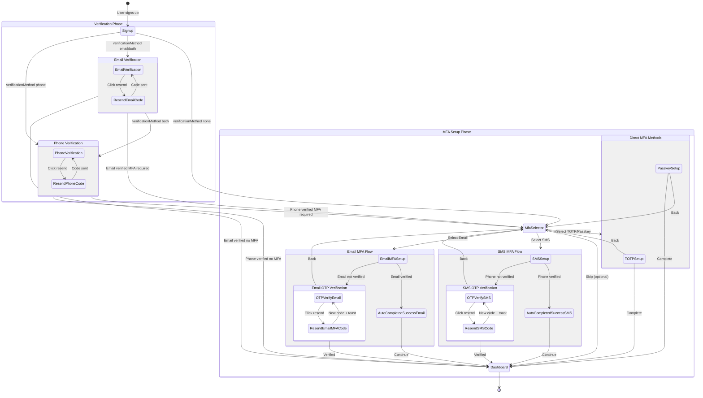
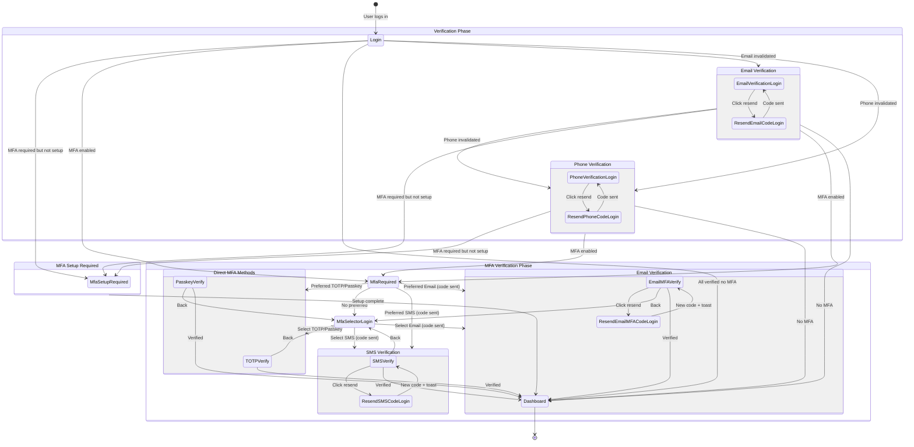
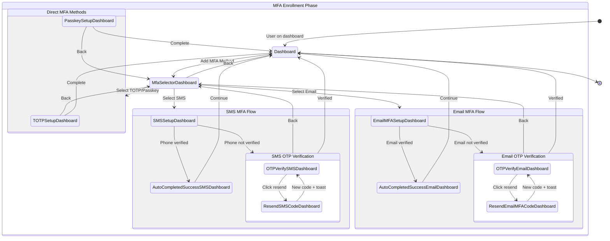
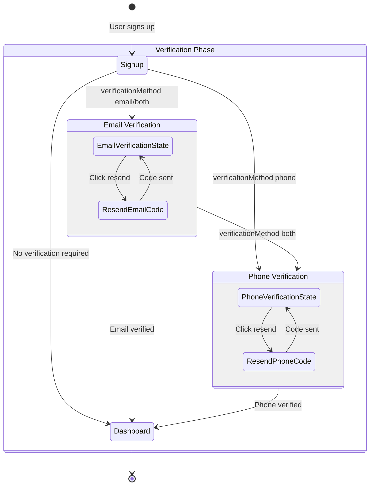
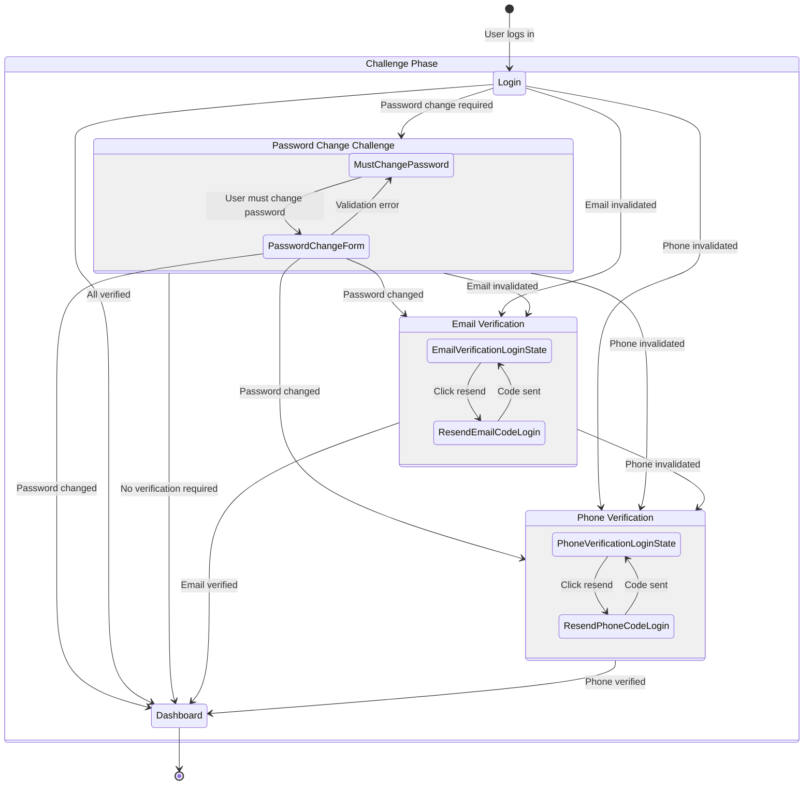
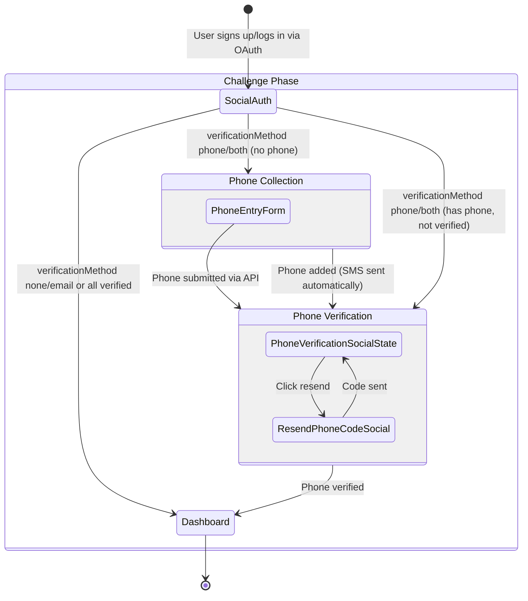

# MFA Flow Scenarios

This document outlines the expected behavior for different authentication configuration scenarios with comprehensive state diagrams.

## Configuration Options

### Verification Methods

- `none`: No email or phone verification required
- `email`: Email verification required
- `phone`: Phone verification required
- `both`: Both email and phone verification required

### MFA Enforcement

- `OPTIONAL`: MFA setup is optional, but if user enables it, MFA is required on login
- `REQUIRED`: All users must setup MFA (can be disabled if `mfa.enabled: false`)
- `ADAPTIVE`: MFA required based on risk factors (currently behaves like REQUIRED)
- `DISABLED`: MFA is completely disabled (`mfa.enabled: false`) - only email/phone verification and password change challenges apply

## Comprehensive State Diagrams

### 1. Unauthenticated Flow (Signup)



### 2. Login Flow (Authenticated)



### 3. Dashboard Flow (Manual Authenticated - Adding MFA)



### 4. MFA Disabled Flow (Signup) - `mfa.enabled: false`



### 5. MFA Disabled Flow (Login) - `mfa.enabled: false`



### 6. Social Authentication Flow (OAuth - Google/Apple/Facebook)

**Note:** Social signup and login use the **same flow** - both go through the challenge system identically. Social users don't have passwords, so password change challenges don't apply.



**Key Points:**

- **Same flow for signup and login** - both use the challenge system identically
- Email is **auto-verified** from OAuth provider (no email verification challenge)
- **No password change challenges** - Social users don't have passwords stored
- If phone verification required and user has NO phone → Phone Collection form first
- If phone verification required and user HAS phone but not verified → Phone Verification directly
- Phone collection must happen before phone verification when phone is missing

**API Flow:**

1. **Initial Challenge**: `POST /auth/social/{provider}/verify` or `POST /auth/social/{provider}/callback` returns:

   ```json
   {
     "challengeName": "VERIFY_PHONE",
     "session": "challenge-session-token",
     "challengeParameters": {
       "requiresPhoneCollection": "true",
       "instructions": "You must add a phone number and verify it to continue"
     },
     "userSub": "user-uuid"
   }
   ```

2. **Phone Collection** (if `requiresPhoneCollection: 'true'`): `POST /auth/respond-challenge`

   ```json
   {
     "session": "challenge-session-token",
     "type": "VERIFY_PHONE",
     "phone": "+1234567890"
   }
   ```

   - Backend updates user phone, sends SMS code automatically
   - Returns same `VERIFY_PHONE` challenge (now with phone set, no `requiresPhoneCollection`)

3. **Phone Verification**: `POST /auth/respond-challenge`

   ```json
   {
     "session": "challenge-session-token",
     "type": "VERIFY_PHONE",
     "code": "123456"
   }
   ```

   - Backend verifies code, completes challenge
   - Returns tokens or next challenge

## Detailed Flow Scenarios

### Signup Flow Scenarios

#### Scenario 1: `verificationMethod: 'none'` + `MFA enforcement: REQUIRED`

1. User signs up → MFA Selector (no email/phone verification)
2. User selects MFA method → Setup/Verify → Dashboard

#### Scenario 2: `verificationMethod: 'none'` + `MFA enforcement: OPTIONAL`

1. User signs up → MFA Selector (optional, can skip)
2. User can skip MFA → Dashboard directly
3. OR User selects MFA method → Setup/Verify → Dashboard

#### Scenario 3: `verificationMethod: 'email'` + `MFA enforcement: REQUIRED`

1. User signs up → Email Verification → MFA Selector → Setup/Verify → Dashboard

#### Scenario 4: `verificationMethod: 'email'` + `MFA enforcement: OPTIONAL`

1. User signs up → Email Verification → MFA Selector (optional) → Dashboard

#### Scenario 5: `verificationMethod: 'phone'` + `MFA enforcement: REQUIRED`

1. User signs up → Phone Verification → MFA Selector → Setup/Verify → Dashboard

#### Scenario 6: `verificationMethod: 'both'` + `MFA enforcement: REQUIRED`

1. User signs up → Email Verification → Phone Verification → MFA Selector → Setup/Verify → Dashboard

### MFA Disabled Flow Scenarios (`mfa.enabled: false`)

#### Scenario 1: `verificationMethod: 'none'` + `mfa.enabled: false`

1. User signs up → Dashboard (no verification, no MFA)
2. **Login**: User logs in → Dashboard (no challenges)

#### Scenario 2: `verificationMethod: 'email'` + `mfa.enabled: false`

1. User signs up → Email Verification → Dashboard
2. **Login**:
   - If email verified → Dashboard
   - If email invalidated → Email Verification → Dashboard

#### Scenario 3: `verificationMethod: 'phone'` + `mfa.enabled: false`

1. User signs up → Phone Verification → Dashboard
2. **Login**:
   - If phone verified → Dashboard
   - If phone invalidated → Phone Verification → Dashboard

#### Scenario 4: `verificationMethod: 'both'` + `mfa.enabled: false`

1. User signs up → Email Verification → Phone Verification → Dashboard
2. **Login**:
   - If both verified → Dashboard
   - If email invalidated → Email Verification → (Phone if invalidated) → Dashboard
   - If phone invalidated → Phone Verification → Dashboard

#### Scenario 5: Password Change Required During Login (`mfa.enabled: false`)

1. User logs in → Must Change Password → Password Change Form → Dashboard
2. **Triggers when**:
   - Password expired
   - Admin forced password reset
   - Security policy requires password change
   - User account flagged for password reset
3. **Priority**: Password change comes FIRST (priority 1), before any verification challenges
4. **Note**: Password change challenge does NOT occur during signup - users set their password during signup, so there's nothing to change

#### Scenario 6: Combined Challenges - Password Change + Email (`mfa.enabled: false`)

1. User logs in → Must Change Password → Password Change Form → Email Verification → Dashboard
2. **Sequence**: Password change must complete FIRST (priority 1), then email verification (priority 2)

#### Scenario 7: Combined Challenges - Password Change + Phone (`mfa.enabled: false`)

1. User logs in → Must Change Password → Password Change Form → Phone Verification → Dashboard
2. **Sequence**: Password change must complete FIRST (priority 1), then phone verification (priority 4)

#### Scenario 8: Combined Challenges - Password Change + Email + Phone (`mfa.enabled: false`)

1. User logs in → Must Change Password → Password Change Form → Email Verification → Phone Verification → Dashboard
2. **Sequence**: Password change FIRST (priority 1), then email verification (priority 2), then phone verification (priority 4)

### Social Authentication Flow Scenarios

**Note:** Social signup and login use the **same flow** - both go through the challenge system identically. The scenarios below apply to both signup and login.

#### Social Auth Scenario 1: `verificationMethod: 'none'` or `'email'`

1. User signs up/logs in via Google/Apple/Facebook → Email auto-verified → Dashboard
2. **No challenges** - Email is automatically verified from OAuth provider
3. **API**: `POST /auth/social/{provider}/verify` returns tokens directly

#### Social Auth Scenario 2: `verificationMethod: 'phone'` (User has NO phone)

1. User signs up/logs in via Google/Apple/Facebook → Email auto-verified → `VERIFY_PHONE` challenge with `requiresPhoneCollection: 'true'`
2. **Step 1 - Phone Collection**: `POST /auth/respond-challenge` with `{ type: 'VERIFY_PHONE', phone: '+1234567890' }`
   - Backend updates user phone, sends SMS code automatically
   - Returns same `VERIFY_PHONE` challenge (phone now set)
3. **Step 2 - Phone Verification**: `POST /auth/respond-challenge` with `{ type: 'VERIFY_PHONE', code: '123456' }`
   - Backend verifies code, returns tokens or next challenge
4. **UI Flow**: Phone entry form must be shown FIRST, then verification code entry

#### Social Auth Scenario 3: `verificationMethod: 'phone'` (User HAS phone, not verified)

1. User signs up/logs in via Google/Apple/Facebook → Email auto-verified → `VERIFY_PHONE` challenge (no `requiresPhoneCollection`)
2. **Phone Verification**: `POST /auth/respond-challenge` with `{ type: 'VERIFY_PHONE', code: '123456' }`
3. **Note**: User already has phone (e.g., from password signup, then linked social account), so goes directly to verification

#### Social Auth Scenario 4: `verificationMethod: 'both'` (User has NO phone)

1. User signs up/logs in via Google/Apple/Facebook → Email auto-verified → `VERIFY_PHONE` challenge with `requiresPhoneCollection: 'true'`
2. **Same flow as Scenario 2** - Phone collection then verification
3. **Note**: Email is auto-verified, so only phone collection/verification is needed
4. **Note**: Social users don't have passwords, so password change challenges don't apply

### Login Flow Scenarios

#### Scenario 1: User with MFA Enabled (Preferred Method Set)

1. User logs in → MFA Required → System checks preferred method
2. **If SMS preferred**: → SMS Verify (code sent automatically with toast) → User can verify or go back to selector
3. **If Email preferred**: → Email Verify (code sent automatically with toast) → User can verify or go back to selector
4. **If TOTP preferred**: → TOTP Verify → User can verify or go back to selector
5. **If Passkey preferred**: → Passkey Verify → User can verify or go back to selector
6. After verification → Dashboard

#### Scenario 1b: User with MFA Enabled (No Preferred Method)

1. User logs in → MFA Required → MFA Selector → User selects method → Verify → Dashboard

#### Scenario 1c: MFA Setup Required During Login

1. User logs in → MFA Setup Required (same flow as Signup MFA Setup)
2. **Triggers when**:
   - User skipped MFA during signup (OPTIONAL) but MFA is now required
   - MFA enforcement changed to REQUIRED after user signed up
   - MFA was enabled later (system-wide or user-level)
3. User completes MFA setup → Dashboard
4. **Next Login**: User will be prompted for MFA verification

#### Scenario 2: User with Invalidated Email

1. User logs in → Email Verification → Check MFA → Dashboard or MFA Required or MFA Setup Required

#### Scenario 3: User with Invalidated Phone

1. User logs in → Phone Verification → Check MFA → Dashboard or MFA Required or MFA Setup Required

#### Scenario 4: User with Both Email and Phone Invalidated

1. User logs in → Email Verification → Phone Verification → Check MFA → Dashboard or MFA Required or MFA Setup Required

#### Scenario 5: User with Invalidated Email + MFA Enabled

1. User logs in → Email Verification → MFA Required → Verify → Dashboard

#### Scenario 6: User with Invalidated Email + MFA Setup Required

1. User logs in → Email Verification → MFA Setup Required → Setup → Dashboard

### Dashboard Flow Scenarios

#### Scenario 1: User Adds MFA (MFA Optional)

1. User on Dashboard → Add MFA Method → Select method → Setup/Verify → Dashboard
2. **Next Login**: User will be prompted for MFA verification

#### Scenario 2: User Adds Additional MFA Method

1. User already has MFA → Add another method → Setup/Verify → Dashboard

## State Descriptions

### Signup State

- **Entry**: User completes signup form
- **Actions**: System determines verification requirements based on `verificationMethod`
- **Exit**:
  - `verificationMethod: 'email'` → Email Verification
  - `verificationMethod: 'phone'` → Phone Verification
  - `verificationMethod: 'both'` → Email Verification (then Phone)
  - `verificationMethod: 'none'` → MFA Selector or Dashboard

### Email Verification State

- **Entry**: After signup when email verification required, or login when email invalidated. **Note**: Password change (if required) must complete first (Priority 1) before email verification (Priority 2)
- **Actions**:
  - Code sent automatically
  - Toast notification (simulation mode)
  - Resend code available (60s cooldown)
- **Exit**:
  - Email verified → Next challenge (Phone/MFA) or Dashboard
  - Back → Login (if during login)

### Phone Collection State

- **Entry**:
  - **Social auth only** - When phone verification is required but user has NO phone number
  - After social signup/login when `verificationMethod: 'phone'` or `'both'` and user.phone is null
  - Triggered when challenge response includes `requiresPhoneCollection: 'true'`
  - **Note**: Social OAuth providers (Google, Apple, Facebook) don't provide phone numbers
- **Actions**:
  - Phone number input form (E.164 format: +[country][number])
  - Country code selector
  - Phone format validation
  - Submit button to add phone
- **API**: `POST /auth/respond-challenge`

  ```json
  {
    "session": "challenge-session-token",
    "type": "VERIFY_PHONE",
    "phone": "+1234567890"
  }
  ```

  - Backend updates user phone, sends SMS code automatically
  - Returns same `VERIFY_PHONE` challenge (phone now set, SMS sent)

- **Exit**:
  - Phone submitted → Phone Verification (code sent automatically)
  - **Note**: Phone collection must happen BEFORE phone verification when phone is missing
  - **Same API endpoint** used for both signup and login - no authentication required (uses challenge session token)

### Phone Verification State

- **Entry**: After signup when phone verification required, or login when phone invalidated. **Note**: For password-based auth, password change (if required) must complete first (Priority 1), then email verification (Priority 2) before phone verification (Priority 4). For social auth, phone collection (if needed) comes before verification. Social users don't have password change challenges.
- **Actions**:
  - Code sent automatically
  - Toast notification (simulation mode)
  - Resend code available (60s cooldown)
- **Exit**:
  - Phone verified → Next challenge (MFA) or Dashboard
  - Back → Login (if during login)

### MFA Selector State

- **Entry**:
  - After verification (if MFA required)
  - Directly after signup (if no verification and MFA required)
  - From any MFA setup screen (back navigation)
- **Actions**:
  - Shows available MFA methods
  - User can select any method
  - Navigation: "Back to Login" (signup/login) or "Back to Dashboard" (dashboard)
- **Exit**:
  - Selected method → Corresponding setup/verify screen
  - Skip (if optional) → Dashboard
  - Back → Previous screen

### MFA Required State (Login Only)

- **Entry**: After login when user has MFA enabled
- **Actions**:
  - System checks user's preferred MFA method
  - If preferred method exists → Directly transitions to that method's verification
  - If SMS/Email preferred → Code sent automatically with toast notification
  - If no preferred method or user wants to change → Transitions to MFA Selector
- **Exit**:
  - Preferred method exists → Directly to that method's verification screen
  - No preferred or user chooses another → MFA Selector

### MFA Setup Required State (Login Only)

- **Entry**: After login when MFA is required but user hasn't set up MFA yet
- **Triggers**:
  - User skipped MFA during signup (when MFA was OPTIONAL) but MFA is now required
  - MFA enforcement changed to REQUIRED after user signed up
  - MFA was enabled later (system-wide or user-level)
- **Actions**:
  - Same flow as Signup MFA Setup Phase (see Signup Flow diagram)
  - User must complete MFA setup before accessing dashboard
- **Exit**:
  - Setup complete → Dashboard
  - **Note**: This uses the same MFA setup flow as signup, so refer to Signup Flow diagram for detailed states

### TOTP Setup/Verify State

- **Entry**: User selects TOTP from MFA selector
- **Actions**:
  - Setup: QR code, manual entry key, code input
  - Verify (login): Code input only
  - Back navigation available
- **Exit**:
  - Verified → Dashboard
  - Back → MFA Selector

### Passkey Setup/Verify State

- **Entry**: User selects Passkey from MFA selector
- **Actions**:
  - Setup: WebAuthn registration prompt
  - Verify (login): WebAuthn authentication prompt
  - Back navigation available
- **Exit**:
  - Verified → Dashboard
  - Back → MFA Selector

### SMS Setup/Verify State

- **Entry**: User selects SMS from MFA selector (signup or dashboard)
- **Actions**:
  - Check if phone already verified
  - If verified → Auto-completed Success state
  - If not verified → Code sent automatically with toast notification (simulation mode)
  - Transitions to OTP Verify state (if not verified)
- **Exit**:
  - Already verified → Auto-completed Success
  - Not verified → OTP Verify state

### Email MFA Setup/Verify State

- **Entry**: User selects Email from MFA selector
- **Actions**:
  - Check if email already verified
  - If verified → Auto-completed Success state
  - If not verified → Code sent, transitions to OTP Verify state
- **Exit**:
  - Already verified → Auto-completed Success
  - Not verified → OTP Verify state

### OTP Verify State

- **Entry**:
  - After SMS/Email setup (code sent) - signup/dashboard flow
  - Preferred SMS/Email method selected - login flow (code sent automatically)
  - User selects SMS/Email from MFA selector - login flow
  - After resend code action
- **Actions**:
  - 6-digit OTP input field
  - Resend Code button (60s cooldown timer)
  - Back navigation available (goes to MFA Selector to choose another method, or Dashboard for dashboard flow)
  - Toast notification shows code (simulation mode)
  - **Resend always triggers toast**: When user clicks resend, new code is sent AND toast notification appears
- **Exit**:
  - Code verified → Dashboard
  - Back → MFA Selector (user can choose another method) or Dashboard (dashboard flow)
  - Resend → Same state (new code sent + toast shown)

### Auto-Completed Success State

- **Entry**:
  - Email MFA selected and email already verified
  - SMS MFA selected and phone already verified
- **Actions**:
  - Success message displayed
  - "Your [email/phone] is already verified. MFA successfully setup."
  - Continue button
- **Exit**: Continue → Dashboard
- **Note**: Two separate states exist: `AutoCompletedSuccessSMS` and `AutoCompletedSuccessEmail` for clarity in the diagram

### Must Change Password State

- **Entry**:
  - **FIRST** (Priority 1) - Before any verification challenges
  - **Login only** - Does NOT occur during signup (users set password during signup)
  - Admin forced password reset
  - Password expired
  - Security policy requires password change
  - User account flagged for password reset
- **Actions**:
  - Displays message explaining password change requirement
  - "You must change your password before continuing"
  - Continue button to proceed to password change form
- **Exit**:
  - Continue → Password Change Form
  - **Note**: This is a mandatory challenge that cannot be skipped. Has highest priority (1) and must complete before email/phone verification challenges. Only occurs during login, never during signup.

### Password Change Form State

- **Entry**: After Must Change Password state
- **Actions**:
  - Current password field (if required by policy)
  - New password field with strength indicator
  - Confirm new password field
  - Password requirements displayed
  - Submit button
  - Validation on form fields
- **Exit**:
  - Password changed successfully → Dashboard
  - Validation error → Same state (error message displayed)
  - **Note**: User cannot proceed to dashboard until password is successfully changed

## Common Behaviors

### Resend Code Functionality

- Works for SMS and Email methods
- Button disabled during 60-second countdown timer
- **Always shows toast**: When user clicks resend, new code is sent AND toast notification appears (simulation mode)
- Old toast dismissed before showing new one
- This is a critical requirement - resend must always trigger toast notification

### Navigation

- Users can navigate back and forth between MFA methods
- "Back to Login" appears during signup/login flow
- "Back to Dashboard" appears during authenticated flow
- "Back to Method Selection" appears when setting up a specific method

### Toast Notifications (Simulation Mode)

- Toast appears automatically when code is sent
- Toast shows verification code for SMS/Email methods
- Toast dismissed when new code is sent (replaces old toast)
- Toast delay: 500ms to allow code to be saved to database

### Error Handling

- Invalid codes show error message
- Expired sessions redirect appropriately
- Network errors handled gracefully

## Configuration Matrix

| verificationMethod | MFA Enforcement | Signup Flow                                              | Login Flow                                                           |
| ------------------ | --------------- | -------------------------------------------------------- | -------------------------------------------------------------------- |
| `none`             | `OPTIONAL`      | → Dashboard (MFA optional)                               | → Dashboard (if no MFA) or MFA Required                              |
| `none`             | `REQUIRED`      | → MFA Selector → Dashboard                               | → MFA Required → Dashboard                                           |
| `none`             | `DISABLED`      | → Dashboard (no MFA)                                     | → Dashboard (no MFA) or Password Change (if required)                |
| `email`            | `OPTIONAL`      | → Email Verify → Dashboard (MFA optional)                | → Email Verify (if invalidated) → Dashboard or MFA Required          |
| `email`            | `REQUIRED`      | → Email Verify → MFA Selector → Dashboard                | → Email Verify (if invalidated) → MFA Required → Dashboard           |
| `email`            | `DISABLED`      | → Email Verify → Dashboard                               | → Email Verify (if invalidated) → Dashboard or Password Change       |
| `phone`            | `OPTIONAL`      | → Phone Verify → Dashboard (MFA optional)                | → Phone Verify (if invalidated) → Dashboard or MFA Required          |
| `phone`            | `REQUIRED`      | → Phone Verify → MFA Selector → Dashboard                | → Phone Verify (if invalidated) → MFA Required → Dashboard           |
| `phone`            | `DISABLED`      | → Phone Verify → Dashboard                               | → Phone Verify (if invalidated) → Dashboard or Password Change       |
| `both`             | `OPTIONAL`      | → Email Verify → Phone Verify → Dashboard (MFA optional) | → Email/Phone Verify (if invalidated) → Dashboard or MFA Required    |
| `both`             | `REQUIRED`      | → Email Verify → Phone Verify → MFA Selector → Dashboard | → Email/Phone Verify (if invalidated) → MFA Required → Dashboard     |
| `both`             | `DISABLED`      | → Email Verify → Phone Verify → Dashboard                | → Email/Phone Verify (if invalidated) → Dashboard or Password Change |

## Notes

- All flows support going back and changing MFA method selection
- Resend code works consistently across all scenarios
- Toast notifications only appear in simulation mode (test mode)
- Authenticated flows (dashboard) do not have challenge sessions, so toast may not work (test controller limitation)
- Auto-completed setups (already verified phone/email) show success screen instead of code entry
- Login flows can trigger email/phone verification if credentials were invalidated
- Verification challenges during login are separate from MFA challenges
- Multiple verification challenges can occur sequentially (email → phone → MFA)
- MFA OPTIONAL: User can skip MFA setup during signup, but if they enable it later on dashboard, MFA will be required on subsequent logins
- MFA REQUIRED: User must setup MFA during signup (or within grace period)
- MFA can be disabled entirely with `mfa.enabled: false`
- **MFA DISABLED**: When `mfa.enabled: false`, no MFA challenges occur. Only email/phone verification and password change challenges apply
- **Password Change Challenge**: **Login only** - Does NOT occur during signup (users set their password during signup). Mandatory when triggered and cannot be skipped
- **Challenge Order** (Priority-based, from `auth-flow-state-definitions.ts`): When multiple challenges are required during login, the order is: **Password Change (Priority 1)** → Email Verification (Priority 2) → Phone Verification (Priority 4) → Dashboard (MFA challenges only apply when MFA is enabled)
- Password change challenge has the highest priority (1) and must be completed before any verification challenges
- Password change challenge can be triggered by: expired password, admin forced reset, security policy, or account flag
- **Social Authentication (OAuth)**:
  - **Signup and login use the SAME flow** - both go through the challenge system identically
  - **Social users don't have passwords** - password change challenges don't apply to social auth users
  - Email is **automatically verified** from OAuth provider (Google, Apple, Facebook) - no email verification challenge
  - Social OAuth providers **do NOT provide phone numbers** during signup/login
  - **Phone Collection API** (when `requiresPhoneCollection: 'true'`): `POST /auth/respond-challenge` with `{ type: 'VERIFY_PHONE', phone: '+1234567890' }`
    - User is **unauthenticated** - uses challenge session token (not auth token)
    - Backend updates user phone, sends SMS code automatically
    - Returns same `VERIFY_PHONE` challenge (phone now set)
  - **Phone Verification API**: `POST /auth/respond-challenge` with `{ type: 'VERIFY_PHONE', code: '123456' }`
    - Backend verifies code, completes challenge
    - Returns tokens or next challenge
  - If phone verification is required (`verificationMethod: 'phone'` or `'both'`) and user has NO phone:
    - UI must show **Phone Collection form FIRST** (user enters phone number)
    - After phone is added via API, system sends verification code automatically
    - UI then shows **Phone Verification form** (user enters code)
  - If phone verification is required and user HAS phone (e.g., from previous signup or account linking):
    - UI goes directly to **Phone Verification** (no collection needed)
  - Phone collection state (Priority 3) comes before phone verification (Priority 4) when phone is missing
