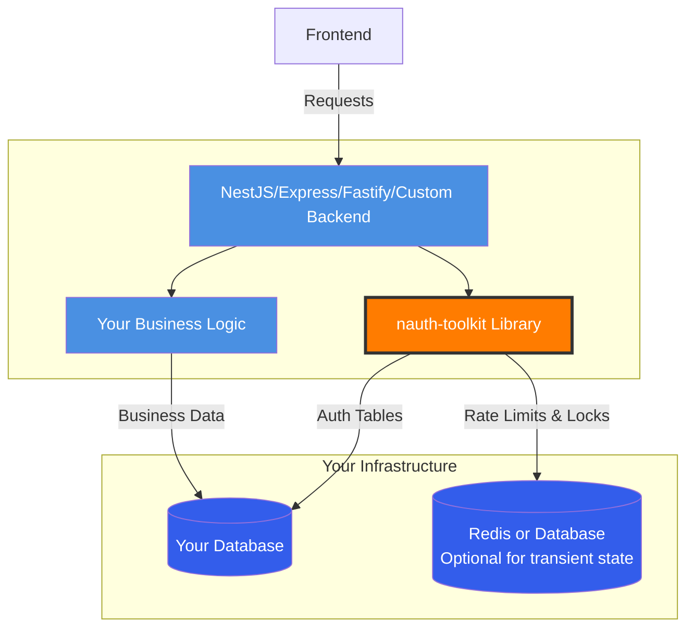
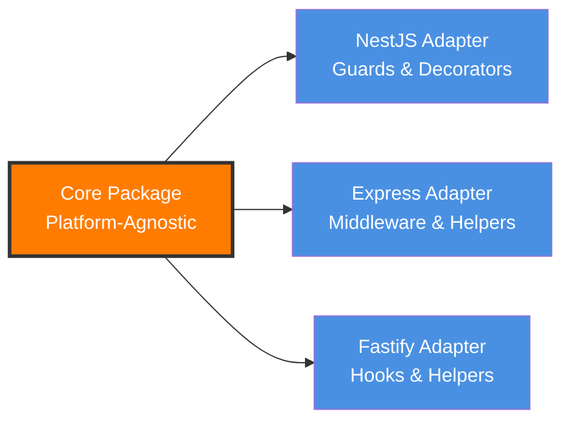

# Architecture

nauth-toolkit is a **library that runs inside your application**, not a separate service. Authentication logic executes in your Node.js process using your database.

## Core Concept



**What This Means:**

- nauth-toolkit runs **in-process** alongside your business logic
- Uses **your existing database** (adds auth-specific tables)
- **Optionally** uses Redis or database for transient storage (rate limiting, locks)
- **No external API calls** to separate auth services
- **No separate microservice** to deploy

## Platform-Agnostic Core

The core is pure TypeScript with **zero framework dependencies**.

```typescript
// Core services are plain TypeScript classes
class AuthService {
  async login(email: string, password: string) {
    // Pure business logic, no framework code
  }
}
```

**What This Enables:**

- Works with NestJS, Express, Fastify, or any Node.js framework
- Easy to test (no framework mocking)
- Future-proof (switch frameworks without rewriting auth)
- No vendor lock-in

### Framework Adapters



- **NestJS** (`@nauth-toolkit/nestjs`): Guards, interceptors, decorators, modules
- **Express** (`@nauth-toolkit/core`): Built-in `ExpressAdapter` with middleware
- **Fastify** (`@nauth-toolkit/core`): Built-in `FastifyAdapter` with hooks

### Platform Abstraction

Core handlers operate on generic interfaces, not framework-specific objects:

```typescript
// Generic interfaces - handlers use these
interface NAuthRequest {
  method: string;
  path: string;
  body: any;
  headers: Record<string, string>;
  cookies: Record<string, string>;
  ip: string;
}

interface NAuthResponse {
  status(code: number): this;
  setCookie(name: string, value: string, options?: any): this;
  json(body: any): void;
}
```

Adapters wrap framework-specific req/res into these interfaces and handle:

- Request/response wrapping
- AsyncLocalStorage context management
- Middleware/hook registration

## Modular Design

Install only what you need:

```
@nauth-toolkit/
├── core                    ← Required (includes Express/Fastify adapters)
├── nestjs                  ← NestJS adapter
├── database/
│   ├── typeorm-postgres   ← Database adapter
│   └── typeorm-mysql
├── storage/
│   ├── redis              ← Production (recommended)
│   ├── database           ← Alternative
│   └── memory             ← Development only
├── mfa/                    ← Optional features
│   ├── totp
│   ├── sms
│   ├── email
│   └── passkey
└── social/                 ← Optional features
    ├── google
    ├── apple
    └── facebook
```

## Key Architecture Features

### Challenge-Based Flow

Instead of errors, nauth-toolkit returns **challenges** when verification is needed. Learn more in [Challenge System](/docs/concepts/challenge-system).

```typescript
const result = await authService.login(credentials);

if (result.challengeName) {
  // Verification needed (email, MFA, etc.)
  handleChallenge(result);
} else {
  // Authentication complete
  handleSuccess(result);
}
```

### Dual Storage System

nauth-toolkit uses two types of storage:

1. **Database (Persistent)**: Users, sessions, MFA devices - always required
2. **Transient Storage Adapter**: Rate limits, locks - choose one:
   - **Redis** (recommended for production)
   - **Database** (simpler, no Redis needed)
   - **Memory** (development only)

See [Storage](/docs/concepts/storage) for details.

### Configuration Validation

All configuration is validated at startup using Zod schemas:

```typescript
NAuth.create({
  config: {
    signup: { verificationMethod: 'email' },
    // Error: emailProvider required when verification enabled
  },
  dataSource,
  adapter: new ExpressAdapter(),
});
```

**Cross-dependency validation:**

- Email verification requires email provider
- SMS verification requires SMS provider
- MFA requires providers for enabled methods
- JWT algorithms validated against key types

## Why This Architecture

### 1. No External Dependencies

```
Traditional SaaS:
Your App → Network → Auth0/Cognito → Network → Your App
         (latency)                  (latency)

nauth-toolkit:
Your App → nauth-toolkit (in-process) → Your Database
         (microseconds)
```

**Benefits:**

- No network latency
- Works offline/air-gapped environments
- No external service outages

### 2. Data Ownership

```
SaaS Auth:
Users → Their Database
        └─ Export required for migration

nauth-toolkit:
Users → Your Database
        └─ Direct SQL access anytime
```

**Benefits:**

- Full control over user data
- Easy backups and exports
- Compliance-friendly (data residency)

### 3. Free & Open Source

```
SaaS Auth:
Monthly Active Users × $X = Costs grow

nauth-toolkit:
MIT licensed = $0 forever
Only pay for your infrastructure
```

### 4. Complete Customization

```
SaaS Auth:
Limited configuration options

nauth-toolkit:
Full source code access
Lifecycle hooks at every step
Extend any service
```

## Next Steps

- **[Challenge System](/docs/concepts/challenge-system)** - How to handle verification flows
- **[Storage](/docs/concepts/storage)** - Understanding database and transient storage
- **[Error Handling](/docs/concepts/error-handling)** - Handling exceptions
- **[Core Services](/docs/api/core/services/overview)** - Available services and their purpose
- **[Configuration](/docs/concepts/configuration)** - Complete configuration reference
