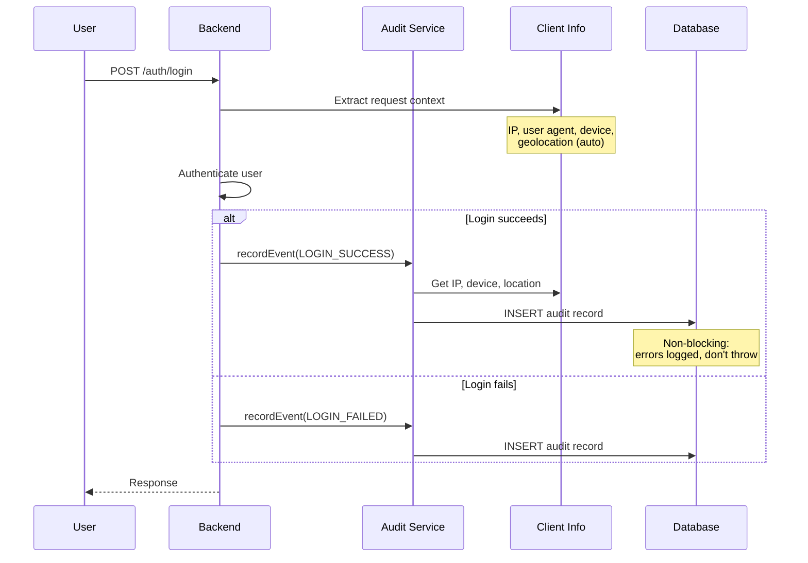

# Audit Logs

nauth-toolkit records an audit trail of every authentication and security event --- logins, signups, password changes, MFA operations, social auth, and suspicious activity. Audit logging is enabled by default and requires no additional setup.

## How It Works



:::tip[Non-Blocking Design]
Audit recording never interrupts authentication flows. If an audit write fails, the error is logged but the auth operation completes normally.
:::

## Event Types

nauth-toolkit records 60+ event types across 12 categories. Every event has a `status` of `SUCCESS`, `FAILURE`, `INFO`, or `SUSPICIOUS`.

### Authentication

| Event | Status | When |
|---|---|---|
| `LOGIN_ATTEMPT` | INFO | Credentials validated, risk assessed |
| `LOGIN_SUCCESS` | SUCCESS | User authenticated |
| `LOGIN_FAILED` | FAILURE | Invalid credentials, account locked |
| `LOGIN_BLOCKED` | FAILURE | IP blocked or account locked |

### Sessions

| Event | Status | When |
|---|---|---|
| `SESSION_CREATED` | INFO | After successful authentication |
| `SESSION_REVOKED` | INFO | Logout, security violation, or admin action |
| `GLOBAL_SIGNOUT` | INFO | All sessions revoked |

### Passwords

| Event | Status | When |
|---|---|---|
| `PASSWORD_CHANGED` | SUCCESS | User changed password |
| `PASSWORD_RESET_REQUESTED` | INFO | Reset email/SMS sent |
| `PASSWORD_RESET_COMPLETED` | SUCCESS | Reset successful |
| `PASSWORD_FORCE_CHANGE_SET` | INFO | By admin or policy |
| `PASSWORD_FORCE_CHANGE_COMPLETED` | SUCCESS | User completed forced change |
| `ADMIN_PASSWORD_RESET_INITIATED` | INFO | Admin sent reset code to user |
| `ADMIN_PASSWORD_RESET_COMPLETED` | SUCCESS | Admin reset completed |
| `ADMIN_PASSWORD_RESET_FAILED` | FAILURE | Invalid code, expired |

### MFA

| Event | Status | When |
|---|---|---|
| `MFA_ENABLED` | INFO | MFA enabled for account |
| `MFA_DISABLED` | INFO | MFA disabled for account |
| `MFA_DEVICE_ADDED` | INFO | New device registered (TOTP, SMS, Passkey) |
| `MFA_DEVICE_REMOVED` | INFO | Device removed |
| `MFA_DEVICE_UPDATED` | INFO | Device name/primary flag changed |
| `MFA_VERIFICATION_SUCCESS` | SUCCESS | Correct MFA code |
| `MFA_VERIFICATION_FAILED` | FAILURE | Invalid code, expired |
| `MFA_EXEMPTION_GRANTED` | INFO | Admin exempted user from MFA |
| `MFA_EXEMPTION_REVOKED` | INFO | Exemption removed |
| `MFA_BACKUP_CODES_GENERATED` | INFO | Backup codes created |
| `MFA_BACKUP_CODE_USED` | INFO | Backup code consumed |
| `MFA_PREFERRED_METHOD_UPDATED` | INFO | Default method changed |
| `DEVICE_TRUSTED` | INFO | User opted to remember device |
| `DEVICE_UNTRUSTED` | INFO | Trusted device revoked/expired |

### Adaptive MFA

| Event | Status | When |
|---|---|---|
| `ADAPTIVE_MFA_RISK_ASSESSED` | INFO | Risk evaluation completed |
| `ADAPTIVE_MFA_TRIGGERED` | INFO | MFA required due to risk |
| `ADAPTIVE_MFA_BYPASSED` | INFO | Low risk, MFA skipped |

### Verification

| Event | Status | When |
|---|---|---|
| `EMAIL_VERIFIED` | SUCCESS | Email address confirmed |
| `EMAIL_VERIFICATION_REQUESTED` | INFO | Verification code sent |
| `EMAIL_VERIFICATION_FAILED` | FAILURE | Invalid code, expired |
| `PHONE_VERIFIED` | SUCCESS | Phone number confirmed |
| `PHONE_VERIFICATION_REQUESTED` | INFO | SMS code sent |
| `PHONE_VERIFICATION_FAILED` | FAILURE | Invalid code, expired |

### Account Management

| Event | Status | When |
|---|---|---|
| `ACCOUNT_CREATED` | INFO | New signup |
| `ACCOUNT_ACTIVATED` | INFO | Account activated |
| `ACCOUNT_DEACTIVATED` | INFO | Account deactivated |
| `ACCOUNT_LOCKED` | INFO | Security lockout |
| `ACCOUNT_UNLOCKED` | INFO | Admin or auto-unlock |
| `ACCOUNT_DISABLED` | INFO | Admin disabled account |
| `ACCOUNT_ENABLED` | INFO | Admin enabled account |
| `ACCOUNT_DELETED` | INFO | Account deleted |

### Profile Updates

| Event | Status | When |
|---|---|---|
| `PROFILE_UPDATED` | INFO | General profile update |
| `EMAIL_CHANGED` | INFO | Email address changed |
| `PHONE_CHANGED` | INFO | Phone number changed |
| `USERNAME_CHANGED` | INFO | Username changed |
| `EMAIL_VERIFICATION_STATUS_UPDATED` | INFO | Admin updated verification status |
| `PHONE_VERIFICATION_STATUS_UPDATED` | INFO | Admin updated verification status |

### Social Authentication

| Event | Status | When |
|---|---|---|
| `SOCIAL_LOGIN` | SUCCESS | Authenticated via social provider |
| `SOCIAL_ACCOUNT_LINKED` | INFO | Social account linked |
| `SOCIAL_ACCOUNT_UNLINKED` | INFO | Social account unlinked |

### Challenge Flow

| Event | Status | When |
|---|---|---|
| `CHALLENGE_CREATED` | INFO | Challenge session started |
| `CHALLENGE_COMPLETED` | SUCCESS | Challenge passed |
| `CHALLENGE_ATTEMPT_FAILED` | FAILURE | Wrong code, max attempts |

### OpenID Connect Provider

Only when [`@nauth-toolkit/oidc-provider`](/docs/guides/oauth-provider/how-oauth-provider-works) is installed.

| Event | Status | When |
|---|---|---|
| `OIDC_LOGIN_COMPLETED` | SUCCESS | A completed login was released to a relying party |
| `OIDC_CONSENT_GRANTED` | SUCCESS | The user approved an application's request |
| `OIDC_CONSENT_DENIED` | INFO | The user refused it |
| `OIDC_ACCESS_DENIED` | FAILURE | The account may not be vouched for (disabled, locked) |

Each carries `authMethod: 'oidc'` and a `clientId` in metadata, so you can answer "which application signed this user in?" --- the ordinary `LOGIN_SUCCESS` cannot, because the authorization request is still parked when the user types their password.

### Security

| Event | Status | When |
|---|---|---|
| `SUSPICIOUS_ACTIVITY` | SUSPICIOUS | Token reuse, impossible travel |

:::info[TOKEN_REFRESHED Excluded]
Token refreshes are intentionally not audited --- they occur too frequently and would create excessive noise. Only security-relevant token operations (reuse detection, revocation) are recorded.
:::

## Data Model

Every audit record captures:

### Core Fields

| Field | Type | Description |
|---|---|---|
| `id` | `number` | Auto-increment primary key |
| `userId` | `number` | Internal user ID (foreign key) |
| `eventType` | `string` | Event type from catalog above |
| `eventStatus` | `string` | `SUCCESS`, `FAILURE`, `INFO`, or `SUSPICIOUS` |
| `createdAt` | `Date` | When the event occurred |

### Client Information (Auto-Captured)

These fields are automatically populated from request context --- no manual input required:

| Field | Type | Example |
|---|---|---|
| `ipAddress` | `string` | `203.0.113.42` |
| `ipCountry` | `string` | `US` |
| `ipCity` | `string` | `San Francisco` |
| `ipLatitude` | `number` | `37.7749` |
| `ipLongitude` | `number` | `-122.4194` |
| `userAgent` | `string` | `Mozilla/5.0 (Macintosh; ...)` |
| `platform` | `string` | `macOS`, `iOS`, `Android`, `Windows` |
| `browser` | `string` | `Chrome`, `Safari`, `Firefox` |
| `deviceId` | `string` | UUID device identifier |
| `deviceName` | `string` | `iPhone 15 Pro`, `Chrome on MacBook` |
| `deviceType` | `string` | `mobile`, `desktop`, `tablet` |

:::note[Geolocation Required]
`ipCountry`, `ipCity`, `ipLatitude`, and `ipLongitude` are only populated when [Geolocation](/docs/guides/geolocation) is configured.
:::

### Context Fields

| Field | Type | Description |
|---|---|---|
| `sessionId` | `number` | Related session (if applicable) |
| `challengeSessionId` | `number` | Related challenge (if applicable) |
| `authMethod` | `string` | `password`, `google`, `apple`, `facebook` |
| `performedBy` | `string` | Who performed the action (auto-populated) |

### Event Details

| Field | Type | Description |
|---|---|---|
| `reason` | `string` | Why it happened (security events, locks) |
| `description` | `string` | Human-readable event summary |
| `metadata` | `JSON` | Event-specific data (flexible, no schema changes needed) |

### Risk Assessment Fields

| Field | Type | Description |
|---|---|---|
| `riskFactor` | `number` | Risk score 0--100 (adaptive MFA) |
| `riskFactors` | `string[]` | Contributing factors: `new_device`, `new_ip`, `new_country`, `impossible_travel` |
| `adaptiveMfaTriggered` | `boolean` | Whether MFA was required due to risk |

## Metadata Examples

The `metadata` field stores event-specific details as flexible JSON:

```typescript
// Account creation
{
  email: 'user@example.com',
  verificationMethod: 'email',
  gracePeriodActive: true,
  gracePeriodEndsAt: '2025-02-01T00:00:00.000Z',
}

// Social login
{
  provider: 'google',
  isNewUser: true,
}

// MFA device added
{
  deviceType: 'totp',
  deviceName: 'iPhone Authenticator',
}

// Token reuse (suspicious)
{
  tokenFamily: 'abc123',
  action: 'token_family_revoked',
}

// Admin action on another user
{
  performedByName: 'Jane Admin',
  reason: 'Security review',
}

// OIDC_CONSENT_GRANTED --- which application, and what it may see
{
  clientId: 'partner',
  interactionUid: 'kPz3Q8sLm2',
  requestedScopes: ['openid', 'email', 'profile'],
  grantedScopes: ['openid', 'email'],
}
```

## performedBy Field

The `performedBy` field tracks **who** performed each action:

| Scenario | `performedBy` value |
|---|---|
| User changes own password | User's `sub` (UUID) |
| Admin disables user account | Admin's `sub` (UUID) |
| System auto-locks account | `system` |
| CLI migration script | `cli-migration-2025` |

When an admin performs an action on another user, `metadata.performedByName` is automatically enriched with the admin's name or email.

## Query Methods

`AuthAuditService` provides four query methods:

| Method | Purpose | Filters |
|---|---|---|
| `getUserAuthHistory()` | Full history for a user | Event types, status, date range, pagination |
| `getEventsByType()` | All events of a specific type | Date range, pagination |
| `getSuspiciousActivity()` | Events with `SUSPICIOUS` status | Optional user filter |
| `getRiskAssessmentHistory()` | Adaptive MFA risk events | Per user |

All query methods accept `sub` (UUID) and resolve to `userId` internally for efficient database queries.

## Database Indexes

Audit records are indexed for common query patterns:

| Index | Use Case |
|---|---|
| `userId + createdAt` | User history queries |
| `eventType + createdAt` | Event type filtering |
| `eventStatus + createdAt` | Status filtering |
| `riskFactor + createdAt` | Risk analysis |
| `userId + eventType + createdAt` | User-specific event queries |
| `userId + ipAddress` | IP-based risk detection |

## What's Next

- **[Audit Logs Guide](/docs/guides/audit-logs)** --- Configure audit logging, query from backend and frontend, admin operations
- **[Lifecycle Hooks](/docs/concepts/lifecycle-hooks)** --- React to auth events with custom logic
- **[Configuration](/docs/concepts/configuration)** --- Full configuration reference
- **[Geolocation](/docs/guides/geolocation)** --- Enable location data in audit records
