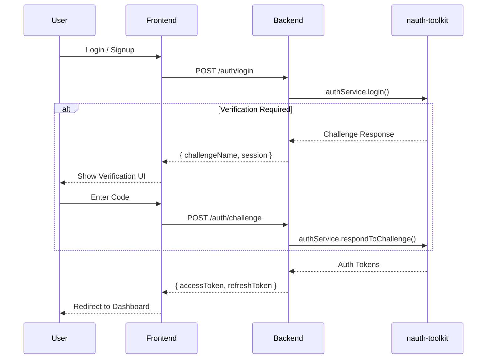

# Auth Challenge System

The nauth-toolkit uses a **challenge-based architecture**. Instead of failing with an error when verification is required (e.g., "Email not verified"), the system returns a **Challenge Response**.

This allows for complex, multi-step authentication flows (like MFA, email verification, or password resets) to be handled uniformly.

import Tabs from '@theme/Tabs';
import TabItem from '@theme/TabItem';

## How It Works

1.  **User Action**: A user attempts to Signup, Login, or use Social Auth.
2.  **System Check**: The system checks if any verification is required (e.g., Email Verification, MFA).
3.  **Challenge Issued**: If verification is needed, the system returns a `Challenge` object instead of Auth Tokens.
4.  **User Response**: The frontend prompts the user (e.g., "Enter SMS code") and sends the code back.
5.  **Completion**: If the code is correct, the system returns Auth Tokens (or the next Challenge if multiple steps are required).



## The Unified API

You don't need separate endpoints for every verification type. The toolkit provides a single, unified method to handle all challenges.

### Backend Implementation

<Tabs groupId="platform">
  <TabItem value="nestjs" label="NestJS" default>

```typescript
import { Controller, Post, Body } from '@nestjs/common';
import { AuthService, Public } from '@nauth-toolkit/nestjs';
import { AuthErrorCode, NAuthException } from '@nauth-toolkit/core';

@Controller('auth')
export class AuthController {
  constructor(private readonly authService: AuthService) {}

  @Public()
  @Post('login')
  async login(@Body() loginDto: LoginDTO) {
    const result = await this.authService.login(loginDto);

    // Check if challenge is required
    if (result.challengeName) {
      return {
        challengeName: result.challengeName,
        session: result.session,
        challengeParameters: result.challengeParameters,
      };
    }

    // Return tokens if no challenge
    return result;
  }

  @Public()
  @Post('challenge')
  async respondToChallenge(@Body() dto: RespondToChallengeDTO) {
    // Single endpoint for ALL challenge types
    return this.authService.respondToChallenge({
      session: dto.session,
      type: dto.challengeType,
      code: dto.code,
    });
  }
}
```

  </TabItem>
  <TabItem value="express" label="Express">

```typescript
import { Router } from 'express';
import { NAuthExpress } from '@nauth-toolkit/express';
import { AuthErrorCode, NAuthException } from '@nauth-toolkit/core';

export function createAuthRoutes(nauth: NAuthExpress) {
  const router = Router();

  router.post('/login', async (req, res) => {
    const result = await nauth.authService.login(req.body);

    // Check if challenge is required
    if (result.challengeName) {
      return res.status(200).json({
        challengeName: result.challengeName,
        session: result.session,
        challengeParameters: result.challengeParameters,
      });
    }

    // Return tokens if no challenge
    res.status(200).json(result);
  });

  router.post('/challenge', async (req, res) => {
    // Single endpoint for ALL challenge types
    const result = await nauth.authService.respondToChallenge({
      session: req.body.session,
      type: req.body.challengeType,
      code: req.body.code,
    });

    res.status(200).json(result);
  });

  return router;
}
```

  </TabItem>
  <TabItem value="fastify" label="Fastify">

```typescript
import { FastifyInstance } from 'fastify';
import { createNAuth } from '@nauth-toolkit/fastify';

export async function registerAuthRoutes(fastify: FastifyInstance, nauth: Awaited<ReturnType<typeof createNAuth>>) {
  fastify.post('/auth/login', nauth.adapter.wrapRouteHandler(async (req) => {
    const result = await nauth.authService.login(req.body);

    if (result.challengeName) {
      return {
        challengeName: result.challengeName,
        session: result.session,
        challengeParameters: result.challengeParameters,
      };
    }

    return result;
  }));

  fastify.post('/auth/challenge', nauth.adapter.wrapRouteHandler(async (req) => {
    return nauth.authService.respondToChallenge({
      session: (req.body as any).session,
      type: (req.body as any).challengeType,
      code: (req.body as any).code,
    });
  }));
}
```

  </TabItem>
</Tabs>

### Frontend Implementation

Your frontend needs to handle two states: **Authenticated** (Tokens) and **Challenged** (Verification Needed).

```typescript
async function handleAuthResponse(response) {
  // Case 1: Challenge Received
  if (response.challengeName) {
    switch (response.challengeName) {
      case 'VERIFY_EMAIL':
        showEmailVerificationScreen(response.session);
        break;
      case 'VERIFY_PHONE':
        showSmsInputScreen(response.session);
        break;
      case 'MFA_REQUIRED':
        showMfaInputScreen(response.session);
        break;
    }
    return;
  }

  // Case 2: Success (Tokens Received)
  if (response.accessToken) {
    // Tokens are automatically stored in cookies if using cookie mode
    // Otherwise, store them in localStorage/sessionStorage
    // Use your router/navigation here
  }
}

// Example: Login flow
async function login(email: string, password: string) {
  const response = await fetch('/auth/login', {
    method: 'POST',
    headers: { 'Content-Type': 'application/json' },
    credentials: 'include', // Important for cookies
    body: JSON.stringify({ email, password }),
  });

  const data = await response.json();
  await handleAuthResponse(data);
}

// Example: Responding to a challenge
async function submitVerificationCode(session: string, code: string, challengeType: string) {
  const response = await fetch('/auth/challenge', {
    method: 'POST',
    headers: { 'Content-Type': 'application/json' },
    credentials: 'include',
    body: JSON.stringify({ session, code, challengeType }),
  });

  const data = await response.json();
  await handleAuthResponse(data); // May return another challenge or tokens
}
```

## Common Challenge Types

### 1. `VERIFY_EMAIL`

Issued when a user signs up with an email address and `verificationMethod` is set to `email` or `both`.

**User Action**: Enter the OTP sent to their email.

**Next Step**: Auth Tokens or `VERIFY_PHONE` (if both email and phone verification are required).

**Example Response**:

```json
{
  "challengeName": "VERIFY_EMAIL",
  "session": "challenge-session-uuid",
  "challengeParameters": {
    "email": "user@example.com",
    "codeDeliveryDestination": "u***@example.com"
  }
}
```

### 2. `VERIFY_PHONE`

Issued when:

- User signs up with a phone number
- User logs in via Social Auth but your app requires phone verification
- Both email and phone verification are required (after email is verified)

**User Action**: Enter the SMS code sent to their phone.

**Example Response**:

```json
{
  "challengeName": "VERIFY_PHONE",
  "session": "challenge-session-uuid",
  "challengeParameters": {
    "phone": "+1234567890",
    "codeDeliveryDestination": "+***7890"
  }
}
```

### 3. `MFA_REQUIRED`

Issued during login if the user has 2FA enabled.

**User Action**: Enter TOTP code from authenticator app, SMS code, or use passkey.

**Example Response**:

```json
{
  "challengeName": "MFA_REQUIRED",
  "session": "challenge-session-uuid",
  "challengeParameters": {
    "mfaMethods": ["TOTP", "SMS"]
  }
}
```

### 4. `MFA_SETUP_REQUIRED`

Issued during login when **MFA enforcement is enabled** and the user is required to set up MFA before being allowed to sign in.

**When you’ll see it:**

- `mfa.enabled = true`
- `mfa.enforcement = 'REQUIRED'` (and the grace period has expired or is disabled)

**User Action**: Take the user through MFA setup (e.g., TOTP QR code, SMS enrollment, passkey registration).

**Next Step**: Complete MFA setup, then call the challenge completion endpoint to finish the login.

Related:

- [Configuration → MFA](/docs/concepts/configuration#multi-factor-authentication)
- [MFAService API](/docs/api/core/services/mfa-service)

### 5. Email + Phone verification (chained challenges)

If your configuration requires both verifications (`signup.verificationMethod = 'both'`), challenges are returned **sequentially**:

1. `VERIFY_EMAIL`
2. then `VERIFY_PHONE`

## Progressive Challenge Flow

Challenges can be chained. Here's an example of a multi-step flow:

```
1. User signs up with email and phone
2. Response: { challengeName: 'VERIFY_EMAIL', session: '...' }
3. User verifies email
4. Response: { challengeName: 'VERIFY_PHONE', session: '...' }
5. User verifies phone
6. Response: { accessToken: '...', refreshToken: '...' }
```

## Challenge Session Details

- **Expiration**: Challenge sessions expire after 15 minutes
- **Max Attempts**: 3 attempts per session
- **Session Reuse**: Each challenge response may return a new session token
- **Security**: Sessions are single-use and tied to the specific user and challenge type

## Error Handling

<Tabs groupId="platform">
  <TabItem value="nestjs" label="NestJS" default>

```typescript
@Public()
@Post('challenge')
async respondToChallenge(@Body() dto: RespondToChallengeDTO) {
  try {
    return await this.authService.respondToChallenge({
      session: dto.session,
      type: dto.challengeType,
      code: dto.code,
    });
  } catch (error) {
    if (error instanceof NAuthException) {
      // Handle specific error codes
      if (error.code === AuthErrorCode.VERIFICATION_CODE_INVALID) {
        throw new BadRequestException('Invalid verification code');
      }
      if (error.code === AuthErrorCode.VERIFICATION_CODE_EXPIRED) {
        throw new BadRequestException('Code expired. Please request a new one');
      }
    }
    throw error;
  }
}
```

  </TabItem>
  <TabItem value="express" label="Express">

```typescript
router.post('/challenge', async (req, res) => {
  try {
    const result = await nauth.authService.respondToChallenge({
      session: req.body.session,
      type: req.body.challengeType,
      code: req.body.code,
    });
    res.status(200).json(result);
  } catch (error) {
    if (error instanceof NAuthException) {
      // Handle specific error codes
      if (error.code === AuthErrorCode.VERIFICATION_CODE_INVALID) {
        return res.status(400).json({ error: 'Invalid verification code' });
      }
      if (error.code === AuthErrorCode.VERIFICATION_CODE_EXPIRED) {
        return res.status(400).json({ error: 'Code expired. Please request a new one' });
      }
    }
    res.status(500).json({ error: 'Internal server error' });
  }
});
```

  </TabItem>
  <TabItem value="fastify" label="Fastify">

```typescript
fastify.post('/auth/challenge', nauth.adapter.wrapRouteHandler(async (req) => {
  try {
    return await nauth.authService.respondToChallenge({
      session: (req.body as any).session,
      type: (req.body as any).challengeType,
      code: (req.body as any).code,
    });
  } catch (error) {
    if (error instanceof NAuthException) {
      if (error.code === AuthErrorCode.VERIFICATION_CODE_INVALID) {
        throw new Error('Invalid verification code');
      }
      if (error.code === AuthErrorCode.VERIFICATION_CODE_EXPIRED) {
        throw new Error('Code expired. Please request a new one');
      }
    }
    throw error;
  }
}));
```

  </TabItem>
</Tabs>

## Why This Approach?

1.  **Security**: No half-authenticated accounts. Users are only fully authenticated when they complete all required verifications.
2.  **Flexibility**: Add new verification steps (Terms Acceptance, Identity Proofing, etc.) without changing the core authentication flow.
3.  **User Experience**: Handles complex flows like "Social Login → Phone Verification → MFA" seamlessly with a consistent API.
4.  **Unified Interface**: Single `respondToChallenge` method handles all challenge types, reducing code duplication.
5.  **Progressive Disclosure**: Users only see verification steps that are actually required for their specific situation.
