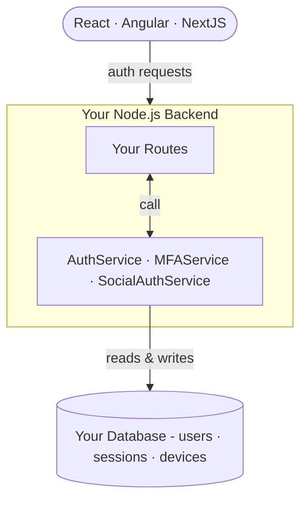

import Tabs from '@theme/Tabs';
import TabItem from '@theme/TabItem';
import FeatureCard from '@site/src/components/FeatureCard';

# How It Works

nauth-toolkit lives inside your backend. You configure it once — it gives you services you call from your routes. No separate process, no external API, no SDK calls over the network.

## Where It Lives



Your routes call nauth services. nauth reads and writes to your database. Your frontend talks to your backend as normal — nothing in the middle.

:::warning Authentication only — not authorization
nauth-toolkit verifies identity and issues tokens. It does **not** check permissions, roles, or access control. Authorization is your responsibility — use your own guards, policies, or an RBAC library on top.
:::

## What You Configure

Two things, once, at startup:

<div className="feature-grid">

<FeatureCard
  icon="fa-duotone fa-light fa-sliders"
  heading="NAuthConfig"
  description="One object controls everything — JWT settings, password policy, signup verification, MFA enforcement, token delivery mode, and rate limits."
  link="/docs/concepts/configuration"
/>

<FeatureCard
  icon="fa-duotone fa-light fa-plug"
  heading="Providers"
  description="Plug in your infrastructure: database (PostgreSQL or MySQL), transient storage (Redis or DB), email, SMS, and social OAuth providers."
  link="/docs/concepts/storage"
/>

</div>

## What You Write

### Backend — thin route handlers

You define endpoints that map to nauth service calls. Your route handlers are thin — nauth handles everything behind the service call (password hashing, JWT issuance, session management, rate limiting, audit logging):

<Tabs groupId="platform">
<TabItem value="nestjs" label="NestJS">

```typescript
@Post('signup')
@Public()
async signup(@Body() body: SignupDTO): Promise<AuthResponseDTO> {
  return this.authService.signup(body);
}

@Post('login')
@Public()
async login(@Body() body: LoginDTO): Promise<AuthResponseDTO> {
  return this.authService.login(body);
}

@Get('profile')
@UseGuards(AuthGuard)
profile(@CurrentUser() user: NAuthUser): NAuthUser {
  return user;
}
```

</TabItem>
<TabItem value="express" label="Express">

```typescript
router.post('/signup', nauth.helpers.public(), async (req, res, next) => {
  try {
    res.status(201).json(await authService.signup(req.body));
  } catch (err) { next(err); }
});

router.post('/login', nauth.helpers.public(), async (req, res, next) => {
  try {
    res.json(await authService.login(req.body));
  } catch (err) { next(err); }
});

router.get('/profile', nauth.helpers.requireAuth(), (_req, res, next) => {
  try {
    res.json(nauth.helpers.getCurrentUser());
  } catch (err) { next(err); }
});
```

</TabItem>
<TabItem value="fastify" label="Fastify">

```typescript
fastify.post('/auth/signup',
  { preHandler: [nauth.helpers.public()] },
  nauth.adapter.wrapRouteHandler(async (req, res) => {
    res.status(201).json(await authService.signup(req.body));
  })
);

fastify.post('/auth/login',
  { preHandler: [nauth.helpers.public()] },
  nauth.adapter.wrapRouteHandler(async (req, res) => {
    res.json(await authService.login(req.body));
  })
);

fastify.get('/auth/profile',
  { preHandler: [nauth.helpers.requireAuth()] },
  nauth.adapter.wrapRouteHandler(async (_req, res) => {
    res.json(nauth.helpers.getCurrentUser());
  })
);
```

</TabItem>
</Tabs>

You choose which endpoints to expose. The same `authService.signup()` and `authService.login()` calls work identically across all three frameworks.

| Service | What you get |
|---------|-------------|
| [`AuthService`](/docs/api/core/services/auth-service) | Signup, login, logout, password reset, token refresh, email/phone verification |
| [`MFAService`](/docs/api/core/services/mfa-service) | Enroll and verify TOTP, SMS, email, and passkey methods |
| [`SocialAuthService`](/docs/api/core/services/social-auth-service) | Google, Apple, Facebook — redirect flows and native mobile token verification |

### Frontend — SDK with challenge routing

The client SDK (`@nauth-toolkit/client`) handles token storage, CSRF, and auth state. Your frontend calls SDK methods and responds to challenges:

```typescript
// Login — SDK returns tokens or a challenge
const result = await auth.login(email, password);

// Challenge? Route the user to the right screen
if (result.challengeName) {
  // 'MFA_REQUIRED', 'VERIFY_EMAIL', 'MFA_SETUP_REQUIRED', etc.
  navigateToChallenge(result);
  return;
}

// No challenge — user is authenticated
navigateToDashboard();
```

Challenges can chain: signup may require email verification → then MFA setup → then login MFA. The SDK tracks the session across steps. When the final challenge is resolved, tokens are issued.

→ [Challenge System](/docs/concepts/challenge-system) — all challenge types and how to resolve them

## Request Processing Pipeline

Every request passes through a fixed handler chain before reaching your route. The order is the same across all frameworks — only the registration mechanism differs:


| Order | Handler | Responsibility |
|-------|---------|----------------|
| 1 | **ClientInfoHandler** | Extracts IP, user-agent, device token, and geo data from the request. Initializes the `AsyncLocalStorage` context that all downstream handlers depend on. |
| 2 | **CsrfHandler** | Validates the CSRF token when token delivery uses cookies or hybrid mode. Skipped for JSON-only delivery. |
| 3 | **AuthHandler** | Validates the JWT access token and attaches the authenticated user to the request context. Routes marked `@Public()` skip validation. |
| 4 | **TokenDeliveryHandler** | Response interceptor — rewrites the outgoing response to deliver tokens via `Set-Cookie` headers (cookie/hybrid mode) or leaves them in the JSON body (JSON mode). |

:::note Framework specifics
- **NestJS** — Handlers 1-3 run as global guards (`NAuthContextGuard` → `CsrfGuard`); handler 4 runs as a global interceptor (`CookieTokenInterceptor`).
- **Express** — Handlers 1-3 register as middleware via `app.use()`; handler 4 registers via `registerResponseInterceptor()`.
- **Fastify** — Handlers 1-3 register as `onRequest`/`preHandler` hooks; handler 4 registers as an `onSend` hook. Each hook restores the `AsyncLocalStorage` context from the request object.
:::

## Framework Support

nauth-toolkit has a framework-agnostic core. The same services work across all three integrations:

| Framework   | How you add it                                                                  |
| ----------- | ------------------------------------------------------------------------------- |
| **NestJS**  | Import `AuthModule.forRoot()` — guards and decorators are wired automatically  |
| **Express** | Call `NAuth.create()` with `ExpressAdapter` — middleware registered on your app |
| **Fastify** | Call `NAuth.create()` with `FastifyAdapter` — hooks registered on your instance |

→ [Quick Start](/docs/quick-start/nestjs) — get running in minutes

## What's Next

- [Quick Start — NestJS](/docs/quick-start/nestjs) — working authentication in minutes
- [Challenge System](/docs/concepts/challenge-system) — how verification flows work
- [Configuration](/docs/concepts/configuration) — full `NAuthConfig` reference
- [Storage](/docs/concepts/storage) — choosing between Redis and database storage
