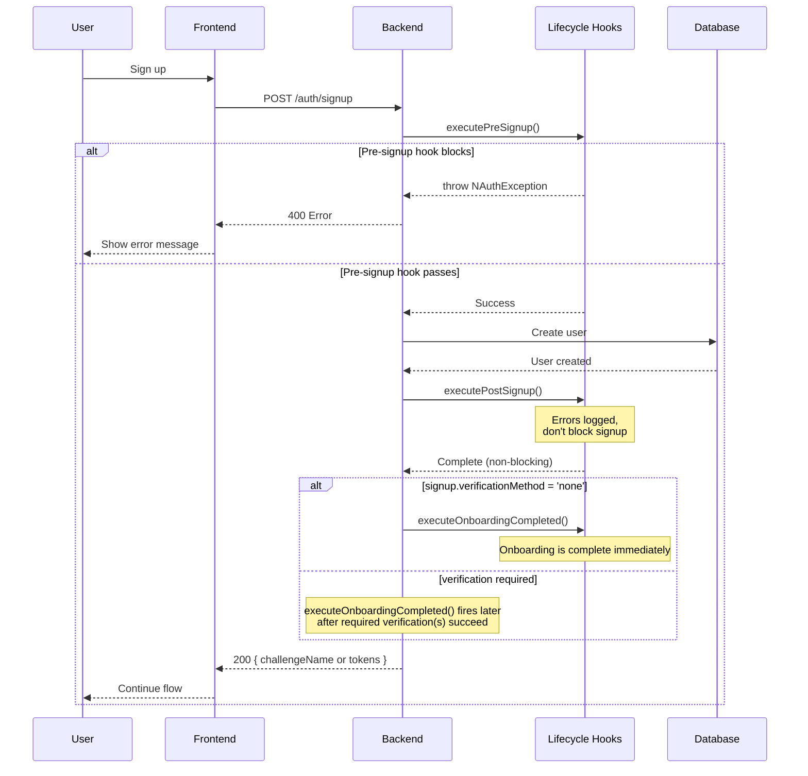

# Lifecycle Hooks

Lifecycle hooks let you inject custom logic at specific points in the authentication flow --- validation, notifications, integrations, and business logic without modifying core authentication code.

## How Hooks Work



## Available Hooks

### User Lifecycle Hooks

| Hook | When | Can Block? | Use Cases |
|---|---|---|---|
| [**preSignup**](/docs/api/core/hooks/pre-signup-hook-provider) | Before user creation | Yes | Validation, domain whitelisting, invite codes |
| [**postSignup**](/docs/api/core/hooks/post-signup-hook-provider) | After user creation | No | Analytics, CRM sync, resource provisioning |
| [**onboardingCompleted**](/docs/api/core/hooks/onboarding-completed-hook) | When onboarding is complete | No | Welcome emails, onboarding flows, "account ready" notifications |
| [**userProfileUpdated**](/docs/api/core/hooks/user-profile-updated-hook) | After profile attribute changes | No | CRM sync, analytics tracking, audit logging |

### Security & Authentication Hooks

| Hook | When | Can Block? | Use Cases |
|---|---|---|---|
| [**passwordChanged**](/docs/api/core/hooks/password-changed-hook) | After password change | No | Security alerts, force logout notifications |
| [**mfaFirstEnabled**](/docs/api/core/hooks/mfa-first-enabled-hook) | After first MFA device setup | No | Congratulations email, security confirmation |
| [**mfaDeviceRemoved**](/docs/api/core/hooks/mfa-device-removed-hook) | After MFA device deletion | No | Security alerts, backup device reminders |
| [**mfaMethodAdded**](/docs/api/core/hooks/mfa-method-added-hook) | After MFA method added | No | Security alerts, inventory tracking |
| [**adaptiveMfaRiskDetected**](/docs/api/core/hooks/adaptive-mfa-risk-detected-hook) | When adaptive MFA risk evaluation runs and `notifyUser: true` | No | Risk alert emails, admin notifications, SIEM logging |

### Account Management Hooks

| Hook | When | Can Block? | Use Cases |
|---|---|---|---|
| [**accountStatusChanged**](/docs/api/core/hooks/account-status-changed-hook) | After account enable/disable | No | Account disabled notifications, re-enablement confirmations |
| [**emailChanged**](/docs/api/core/hooks/email-changed-hook) | After email address change | No | Dual notification (old + new email), security alerts |
| [**accountLocked**](/docs/api/core/hooks/account-locked-hook) | After account lockout | No | Lockout notifications, unlock instructions |
| [**sessionsRevoked**](/docs/api/core/hooks/sessions-revoked-hook) | After sessions revoked | No | Security alerts, forced logout notifications |

## Hook Behavior

### Blocking vs Non-Blocking

- **Blocking Hooks** (`preSignup`): Can throw exceptions to prevent the operation
- **Non-Blocking Hooks** (all others): Errors are logged but don't affect the operation

### Execution Order

Hooks execute in **priority order** (lower values first). Multiple hooks with the same priority execute in registration order:

```typescript
// NestJS with decorators
@PasswordChangedHook({ priority: 1 }) // Executes first
export class EmailNotificationHook implements IPasswordChangedHook {}

@PasswordChangedHook({ priority: 2 }) // Executes second
export class AnalyticsHook implements IPasswordChangedHook {}

@PasswordChangedHook() // Default priority 100, executes last
export class CrmSyncHook implements IPasswordChangedHook {}

// Express/Fastify manual registration
hookRegistry.registerPasswordChanged(new EmailNotificationHook());
hookRegistry.registerPasswordChanged(new AnalyticsHook());
hookRegistry.registerPasswordChanged(new CrmSyncHook());
// Registration order determines execution order
```

### Error Handling

**Non-blocking hooks** catch and log errors automatically:

```typescript
// Hook throws error → Error logged → Next hook still executes
try {
  await hook.execute(metadata);
} catch (error) {
  logger.error('Hook failed:', error);
  // Continue with next hook
}
```

## API Reference

### Interfaces

| Interface | Description | Documentation |
|---|---|---|
| `IPreSignupHookProvider` | Pre-signup hook interface | [IPreSignupHookProvider](/docs/api/core/hooks/pre-signup-hook-provider) |
| `IPostSignupHookProvider` | Post-signup hook interface | [IPostSignupHookProvider](/docs/api/core/hooks/post-signup-hook-provider) |
| `IOnboardingCompletedHook` | Onboarding completed hook interface | [IOnboardingCompletedHook](/docs/api/core/hooks/onboarding-completed-hook) |
| `IUserProfileUpdatedHook` | User profile updated hook interface | [IUserProfileUpdatedHook](/docs/api/core/hooks/user-profile-updated-hook) |
| `IPasswordChangedHook` | Password changed hook interface | [IPasswordChangedHook](/docs/api/core/hooks/password-changed-hook) |
| `IMFAFirstEnabledHook` | MFA first enabled hook interface | [IMFAFirstEnabledHook](/docs/api/core/hooks/mfa-first-enabled-hook) |
| `IMFADeviceRemovedHook` | MFA device removed hook interface | [IMFADeviceRemovedHook](/docs/api/core/hooks/mfa-device-removed-hook) |
| `IMFAMethodAddedHook` | MFA method added hook interface | [IMFAMethodAddedHook](/docs/api/core/hooks/mfa-method-added-hook) |
| `IAdaptiveMFARiskDetectedHook` | Adaptive MFA risk detected hook | [IAdaptiveMFARiskDetectedHook](/docs/api/core/hooks/adaptive-mfa-risk-detected-hook) |
| `IAccountStatusChangedHook` | Account status changed hook interface | [IAccountStatusChangedHook](/docs/api/core/hooks/account-status-changed-hook) |
| `IEmailChangedHook` | Email changed hook interface | [IEmailChangedHook](/docs/api/core/hooks/email-changed-hook) |
| `IAccountLockedHook` | Account locked hook interface | [IAccountLockedHook](/docs/api/core/hooks/account-locked-hook) |
| `ISessionsRevokedHook` | Sessions revoked hook interface | [ISessionsRevokedHook](/docs/api/core/hooks/sessions-revoked-hook) |

### Services

| Service | Description | Documentation |
|---|---|---|
| `HookRegistryService` | Hook registration service | [HookRegistryService](/docs/api/core/services/hook-registry-service) |

### NestJS Decorators

:::note
There is currently no `@OnboardingCompletedHook()` decorator.
If you need custom onboarding-completed behavior in NestJS, register an `IOnboardingCompletedHook` via [`HookRegistryService`](/docs/api/core/services/hook-registry-service).
:::

| Decorator | Description | Documentation |
|---|---|---|
| `@PreSignupHook()` | Pre-signup hook decorator | [@PreSignupHook()](/docs/api/nestjs/decorators/pre-signup-hook) |
| `@PostSignupHook()` | Post-signup hook decorator | [@PostSignupHook()](/docs/api/nestjs/decorators/post-signup-hook) |
| `@PasswordChangedHook()` | Password changed hook decorator | [@PasswordChangedHook()](/docs/api/nestjs/decorators/password-changed-hook) |
| `@MFAFirstEnabledHook()` | MFA first enabled hook decorator | [@MFAFirstEnabledHook()](/docs/api/nestjs/decorators/mfa-first-enabled-hook) |
| `@MFADeviceRemovedHook()` | MFA device removed hook decorator | [@MFADeviceRemovedHook()](/docs/api/nestjs/decorators/mfa-device-removed-hook) |
| `@AdaptiveMFARiskDetectedHook()` | Adaptive MFA risk detected hook | [@AdaptiveMFARiskDetectedHook()](/docs/api/nestjs/decorators/adaptive-mfa-risk-detected-hook) |
| `@AccountStatusChangedHook()` | Account status changed hook decorator | [@AccountStatusChangedHook()](/docs/api/nestjs/decorators/account-status-changed-hook) |
| `@EmailChangedHook()` | Email changed hook decorator | [@EmailChangedHook()](/docs/api/nestjs/decorators/email-changed-hook) |
| `@AccountLockedHook()` | Account locked hook decorator | [@AccountLockedHook()](/docs/api/nestjs/decorators/account-locked-hook) |
| `@SessionsRevokedHook()` | Sessions revoked hook decorator | [@SessionsRevokedHook()](/docs/api/nestjs/decorators/sessions-revoked-hook) |
| `@UserProfileUpdatedHook()` | User profile updated hook decorator | [@UserProfileUpdatedHook()](/docs/api/nestjs/decorators/user-profile-updated-hook) |
| `NAuthHooksModule` | Hook registration module | [NAuthHooksModule](/docs/api/nestjs/decorators/nauth-hooks-module) |

## What's Next

- **[Lifecycle Hooks Guide](/docs/guides/lifecycle-hooks)** --- Step-by-step implementation with best practices
- **[Notifications & Templates](/docs/concepts/notifications)** --- Built-in email and SMS notification system
- **[Challenge System](/docs/concepts/challenge-system)** --- Understanding authentication flows
- **[Error Handling](/docs/concepts/error-handling)** --- Exception handling patterns
