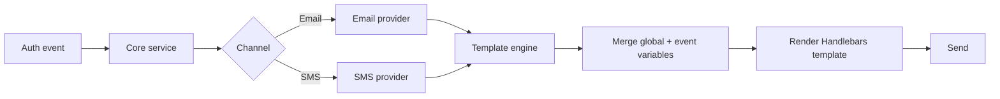

# Notifications & Templates

nauth-toolkit sends emails and SMS messages automatically during authentication flows --- verification codes, password resets, MFA challenges, and security alerts. Both systems use **Handlebars** templates that you can override with your own branding and wording.

## How It Works



1. A core service (signup, password reset, MFA, etc.) triggers a notification
2. The appropriate provider (email or SMS) receives event-specific variables (code, link, expiry, etc.)
3. The template engine merges **global variables** (branding) with **event variables**
4. Handlebars renders the template
5. The message is sent via your configured transport

`@nauth-toolkit/email-nodemailer` ships with production-ready responsive HTML templates for all 18 email types. SMS ships with 3 default templates. You only need to override the ones you want to customize.

## Email Templates

### Template Types

#### Core authentication emails

These emails are sent automatically during authentication flows. They cannot be suppressed individually (except via the global kill switch `emailNotifications.enabled: false`).

| Template Type | When Sent | Required Variables |
|---|---|---|
| `verification` | Email verification during signup | `code`, `link`, `expiryMinutes` |
| `mfaEmailCode` | Email MFA challenge code | `code`, `expiryMinutes` |
| `passwordReset` | User requests password reset | `link`, `expiryMinutes` |
| `adminPasswordReset` | Admin initiates password reset | `code`, `link`, `expiryMinutes` |
| `welcome` | After onboarding completes (post-verification or immediately if verification is disabled) | (none) |

:::note[Understanding "required variables"]
The validator checks that your template **mentions** each variable (e.g. `{{code}}` or `{{#if code}}`). At runtime, some variables may be `undefined` --- for example, `link` is only provided when a `baseUrl` is configured. Use Handlebars conditionals to handle this:

```handlebars
{{#if link}}<a href="{{link}}">Reset Password</a>{{/if}}
```
:::

#### Security notification emails

These emails are **suppressed by default**. Enable them individually via `emailNotifications.suppress`:

```typescript
{
  emailNotifications: {
    enabled: true,
    suppress: {
      passwordChanged: false,     // Enable password changed notifications
      accountLockout: false,      // Enable lockout notifications
      sessionsRevoked: false,     // Enable session revocation notifications
    },
  },
}
```

| Template Type | When Sent | Required Variables |
|---|---|---|
| `passwordChanged` | Password successfully changed | (none) |
| `accountLockout` | Account locked (failed login attempts) | `reason`, `durationMinutes` |
| `newDevice` | New device detected during login | `deviceName`, `timestamp` |
| `sessionsRevoked` | All sessions terminated | `revokedCount` |
| `adaptiveMfaRiskAlert` | Adaptive MFA risk detected with `notifyUser: true` | `riskLevel`, `riskFactors` |

#### Account management emails

| Template Type | When Sent | Required Variables |
|---|---|---|
| `accountDisabled` | Account disabled by admin | `reason` |
| `accountEnabled` | Account re-enabled by admin | (none) |
| `emailChangedOld` | Email changed (sent to **old** address) | (none) |
| `emailChangedNew` | Email changed (sent to **new** address) | (none) |
| `emailChanged` | Email changed (legacy single-email template) | `userEmail` |

#### MFA notification emails

| Template Type | When Sent | Required Variables |
|---|---|---|
| `mfaEnabled` | First MFA method enabled | (none) |
| `mfaDeviceRemoved` | MFA device removed | (none) |
| `mfaMethodAdded` | Additional MFA method added | (none) |

### Suppression Keys vs Template Keys

The `emailNotifications.suppress` keys do **not always match** the `TemplateType` keys:

| Suppress Key | Template Type |
|---|---|
| `mfaFirstEnabled` | `mfaEnabled` |
| `adaptiveMfaRiskDetected` | `adaptiveMfaRiskAlert` |
| `emailChangedOld` | `emailChangedOld` |
| `emailChangedNew` | `emailChangedNew` |
| `accountLockout` | `accountLockout` |

Use **template type keys** for `customTemplates` and **suppress keys** for `emailNotifications.suppress`.

### Email Template Variables

#### Global variables (available to all templates)

| Variable | Source | Description |
|---|---|---|
| `appName` | Global | Application name |
| `companyName` | Global | Company name |
| `companyAddress` | Global | Company address |
| `supportEmail` | Global | Support email |
| `brandColor` | Global | Brand hex color |
| `logoUrl` | Global | Logo URL |
| `dashboardUrl` | Global | Dashboard URL |
| `footerDisclaimer` | Global | Custom footer text |
| `currentYear` | Auto | Current year (e.g. `2026`) |
| `subject` | Auto | Rendered subject (available inside HTML/text body) |
| `previewText` | Auto | Email preview text (defaults to subject) |
| `userName` | Auto | Derived from email prefix (e.g. `john` from `john@example.com`) |
| `userEmail` | Auto | Recipient email address |

#### Event-specific variables

| Template Type | Variables | Notes |
|---|---|---|
| `verification` | `code`, `link`, `expiryMinutes` | `link` only present when `signup.emailVerification.baseUrl` is configured |
| `mfaEmailCode` | `code`, `expiryMinutes` | |
| `passwordReset` | `code`, `link`, `expiryMinutes` | `link` only present when `baseUrl` is provided in the `forgotPassword` request |
| `adminPasswordReset` | `code`, `link`, `expiryMinutes` | `link` only present when `baseUrl` is provided |
| `welcome` | (none) | Uses global variables only |
| `accountLockout` | `reason`, `durationMinutes`, `lockType`, `lockDuration`, `lockedUntil`, `ipAddress`, `failedAttempts` | `lockType` is `'temporary'` or `'permanent'` |
| `newDevice` | `deviceName`, `deviceType`, `ipAddress`, `location`, `timestamp` | |
| `passwordChanged` | `changedBy`, `sessionsRevoked`, `timestamp` | `changedBy` is `'user'`, `'admin'`, or `'reset'` |
| `sessionsRevoked` | `revokedCount`, `reason`, `triggerEvent`, `timestamp` | |
| `adaptiveMfaRiskAlert` | `riskScore`, `riskLevel`, `riskFactors`, `action`, `timestamp` | `riskLevel` is `'low'`, `'medium'`, or `'high'` |
| `accountDisabled` | `reason`, `performedBy`, `timestamp` | |
| `accountEnabled` | `reason`, `performedBy`, `timestamp` | |
| `emailChangedOld` | `newEmail`, `deactivatedMFADevices`, `timestamp`, `isOldEmail` | Sent to the **old** email |
| `emailChangedNew` | `oldEmail`, `timestamp`, `isOldEmail` | Sent to the **new** email |
| `mfaEnabled` | `firstMethod`, `deviceName`, `timestamp` | |
| `mfaDeviceRemoved` | `deviceType`, `deviceName`, `removedBy`, `reason`, `remainingDeviceCount` | `removedBy` is `'user'`, `'admin'`, or `'system'` |
| `mfaMethodAdded` | `method`, `enabledMethods`, `deviceName`, `timestamp` | `enabledMethods` is an array |

#### Password reset: code + optional link

The password reset flow always sends a `code`. The `link` is only included when `baseUrl` is provided in the request. Your template should handle both scenarios:

```handlebars
{{#if link}}
  <p><a href="{{link}}">Reset Password</a></p>
  <p>Or enter this code manually: <strong>{{code}}</strong></p>
{{else}}
  <p>Your password reset code: <strong>{{code}}</strong></p>
{{/if}}
<p>This code expires in {{expiryMinutes}} minutes.</p>
```

This pattern applies equally to `verification` and `adminPasswordReset` templates.

## SMS Templates

### Template Types

| Template Type | When Sent | Required Variables |
|---|---|---|
| `verification` | Phone verification during signup or phone number update | `code`, `expiryMinutes` |
| `mfa` | MFA code for two-factor authentication via SMS | `code`, `expiryMinutes` |
| `passwordReset` | Password reset via SMS (when configured for SMS delivery) | `code`, `expiryMinutes` |

:::note
The template type is determined automatically by the core service:
- Phone verification sends `verification` (or `mfa` if the phone is already verified and the check is for MFA)
- SMS MFA challenge sends `mfa`
- Password reset via SMS sends `passwordReset`
:::

### Default SMS Templates

If you don't override any templates, these defaults are used:

**`verification`:**
```text
{{#if appName}}{{appName}}: {{/if}}Your verification code is: {{code}}. Valid for {{expiryMinutes}} minutes.
```

**`mfa`:**
```text
{{#if appName}}{{appName}}: {{/if}}Your MFA code is: {{code}}. Valid for {{expiryMinutes}} minutes.
```

**`passwordReset`:**
```text
{{#if appName}}{{appName}}: {{/if}}Your password reset code is: {{code}}. Valid for {{expiryMinutes}} minutes.
```

### SMS Template Variables

| Variable | Source | Description | Example |
|---|---|---|---|
| `code` | Event | Verification/MFA/reset code | `123456` |
| `expiryMinutes` | Event | Code expiration time in minutes | `5` |
| `appName` | Global | Application name | `My App` |
| `firstName` | Event | User's first name | `John` |
| `lastName` | Event | User's last name | `Doe` |
| `userName` | Event | Username | `john_doe` |
| `userEmail` | Event | Email address | `john@example.com` |
| `phone` | Event | Phone number (E.164) | `+1234567890` |
| `companyName` | Global | Company name | `My Company Inc.` |
| `supportPhone` | Global | Support phone number | `+1-800-123-4567` |

:::note
You can add any additional custom variables to `globalVariables`. They will be available in all templates via `{{variableName}}`.
:::

## Handlebars Syntax Reference

### Email templates (full syntax)

Email templates support the full Handlebars feature set:

**Variables:**
```handlebars
<p>Welcome to {{appName}}!</p>
<p>Your code is: {{code}}</p>
<p>&copy; {{currentYear}} {{companyName}}</p>
```

**Conditionals:**
```handlebars
{{#if firstName}}
  <p>Hello {{firstName}}!</p>
{{else}}
  <p>Hello!</p>
{{/if}}

{{#unless isVerified}}
  <p>Please verify your email.</p>
{{/unless}}
```

**Loops:**
```handlebars
{{#each riskFactors}}
  <li>{{this}}</li>
{{/each}}
```

**Built-in helpers:**

```handlebars
{{#if (eq changedBy "admin")}}
  <p>An administrator changed your password.</p>
{{/if}}

{{#if (gt riskScore 80)}}
  <p>High risk detected!</p>
{{/if}}

<p>Date: {{formatDate timestamp}}</p>
```

| Helper | Description |
|---|---|
| `eq` | Equal: `(eq a b)` |
| `ne` | Not equal: `(ne a b)` |
| `gt` | Greater than: `(gt a b)` |
| `lt` | Less than: `(lt a b)` |
| `and` | Logical AND: `(and a b)` |
| `or` | Logical OR: `(or a b)` |
| `formatDate` | Format date: `{{formatDate timestamp}}` |

**Greeting pattern:**

```handlebars
{{#if firstName}}
  <p>Hi {{firstName}},</p>
{{else}}
  {{#if userName}}<p>Hi {{userName}},</p>{{else}}<p>Hi,</p>{{/if}}
{{/if}}
```

### SMS templates (subset only)

SMS templates use a lightweight Handlebars-like engine that supports `{{variable}}` and `{{#if variable}}...{{/if}}` only.

```text
{{#if appName}}{{appName}}: {{/if}}Your code is {{code}}.
```

:::warning
Advanced Handlebars features (`{{#each}}`, `{{#unless}}`, `{{#with}}`, nested helpers) are **not** supported in SMS templates. Use email templates for complex logic.
:::

## What's Next

- **[Email Templates](/docs/guides/email-templates)** --- Override email templates and enable security notifications
- **[SMS Templates](/docs/guides/sms-templates)** --- Override SMS templates with custom wording
- **[Email & SMS Providers](/docs/guides/email-sms-providers)** --- Configure SMTP, AWS SES, SendGrid, AWS SNS, or a custom provider
- **[Configuration](/docs/concepts/configuration)** --- Full configuration reference
