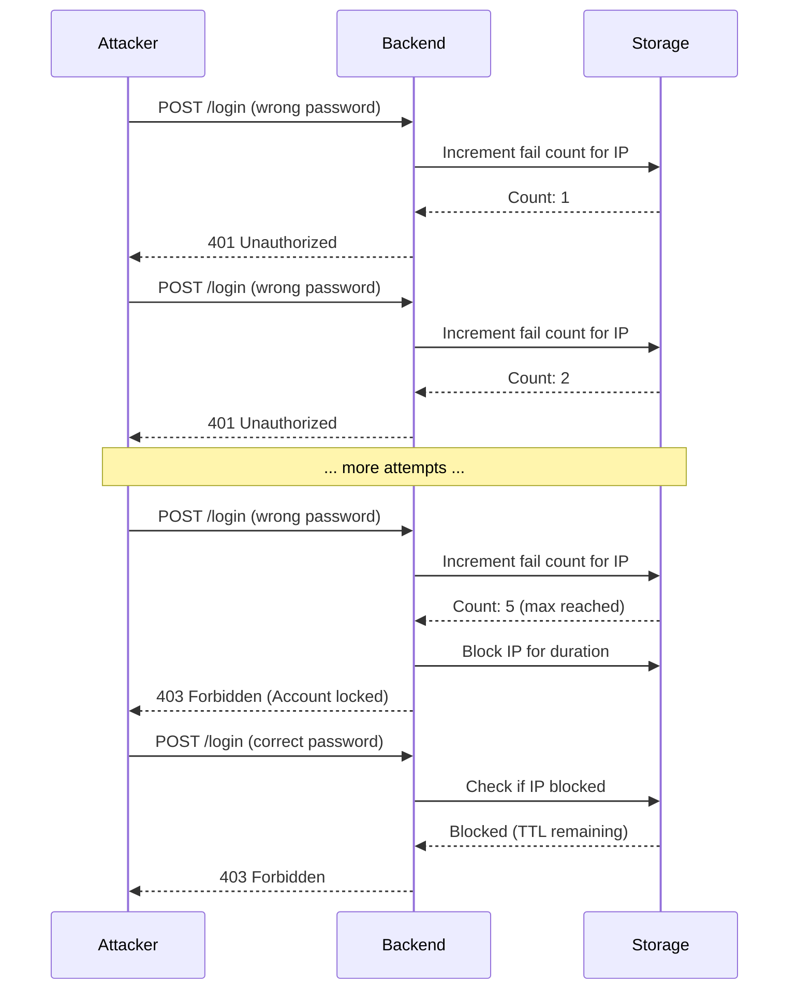
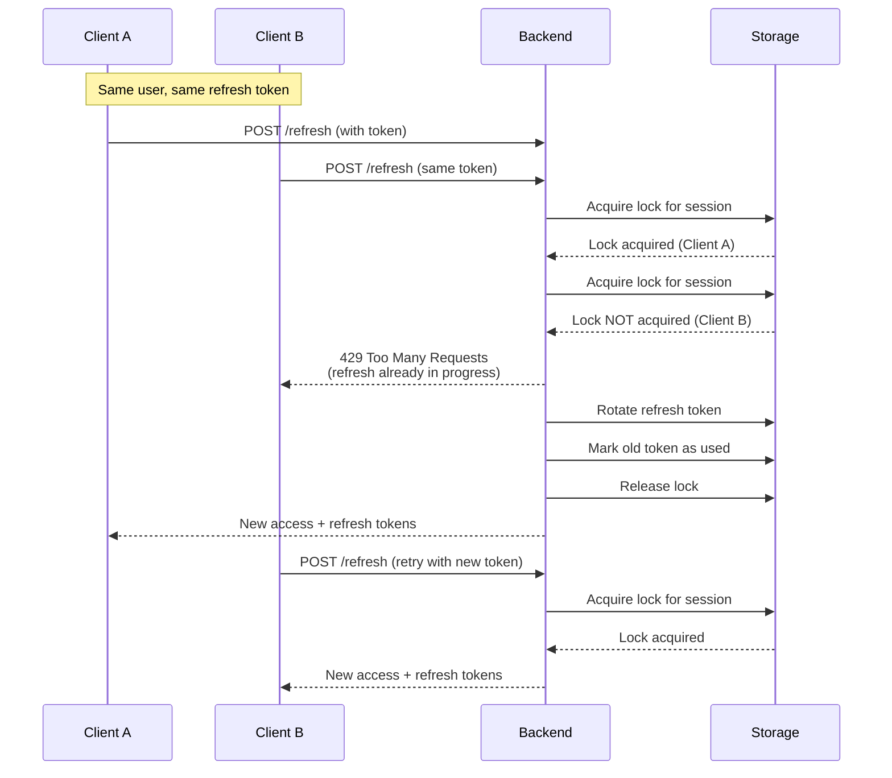

import Tabs from '@theme/Tabs';
import TabItem from '@theme/TabItem';

# Rate Limiting & Throttling

nauth-toolkit implements comprehensive rate limiting to protect against brute-force attacks, abuse, and resource exhaustion. This page explains the various rate limiting mechanisms, how they're calculated, and how to configure them.

## Overview

Rate limiting operates at multiple layers:

| Layer | Purpose | Tracks | Window Type |
|-------|---------|--------|-------------|
| **IP-based lockout** | Prevent brute-force login attempts | Failed logins per IP | Sliding window |
| **Password reset rate limit** | Prevent reset abuse | Requests per user | Sliding window |
| **Verification code sending** | Prevent SMS/email bombing | Codes sent per user | Sliding window |
| **Verification attempt throttling** | Prevent code guessing | Attempts per user/IP | Sliding window |
| **Token refresh locking** | Prevent concurrent refresh abuse | Per session | Distributed lock |
| **Resend delay** | Prevent rapid code resending | Per user | Fixed window |

:::tip Why Multiple Layers?
Each layer protects against different attack vectors. IP-based lockout stops automated attacks, per-user limits prevent account targeting, and distributed locks prevent race conditions.
:::

## IP-based account lockout

Prevents brute-force password guessing by temporarily blocking IP addresses after too many failed login attempts.

### How it works



### Configuration

```typescript
{
  lockout: {
    // Enable IP-based lockout
    enabled: true,

    // Maximum failed login attempts before lockout
    // Default: 5
    maxAttempts: 5,

    // Lockout duration in seconds
    // Default: 900 (15 minutes)
    duration: 900,

    // Reset counter on successful login
    // Default: true
    resetOnSuccess: true,
  }
}
```

### Window calculation

**Type:** Sliding window with counter reset

**How it works:**

1. First failed login: Counter starts at 1, TTL set to `duration`
2. Subsequent failed logins: Counter increments, TTL remains
3. Counter reaches `maxAttempts`: IP is blocked for `duration` seconds
4. Successful login (if `resetOnSuccess: true`): Counter resets to 0
5. After `duration` expires: Counter resets to 0 automatically

**Example:**

```
Time    Event                    Counter  TTL      Status
-----   ----------------------   -------  -------  ------
12:00   Failed login            1        900s     OK
12:01   Failed login            2        899s     OK
12:02   Failed login            3        898s     OK
12:03   Failed login            4        897s     OK
12:04   Failed login (5th)      5        896s     BLOCKED
12:05   Login attempt           5        896s     BLOCKED
12:06   Login attempt           5        896s     BLOCKED
...
12:19   (15 min elapsed)        0        -        OK (reset)
```

### Error handling

<Tabs groupId="platform">
<TabItem value="nestjs" label="NestJS" default>

```typescript
try {
  const result = await this.authService.login(dto);
  return result;
} catch (error) {
  if (error instanceof NAuthException) {
    if (error.code === AuthErrorCode.ACCOUNT_LOCKED) {
      throw new ForbiddenException({
        message: 'Too many failed login attempts. Please try again later.',
        retryAfter: error.details?.retryAfter, // Seconds until unblock
      });
    }
  }
  throw error;
}
```

</TabItem>
<TabItem value="express" label="Express">

```typescript
router.post('/login', async (req, res, next) => {
  try {
    const result = await nauth.authService.login(req.body);
    res.json(result);
  } catch (error) {
    if (error instanceof NAuthException && error.code === AuthErrorCode.ACCOUNT_LOCKED) {
      return res.status(403).json({
        error: 'Too many failed login attempts. Please try again later.',
        retryAfter: error.details?.retryAfter,
      });
    }
    next(error);
  }
});
```

</TabItem>
<TabItem value="fastify" label="Fastify">

```typescript
fastify.post('/login', async (request, reply) => {
  try {
    const result = await nauth.authService.login(request.body);
    return result;
  } catch (error) {
    if (error instanceof NAuthException && error.code === AuthErrorCode.ACCOUNT_LOCKED) {
      reply.code(403);
      return {
        error: 'Too many failed login attempts. Please try again later.',
        retryAfter: error.details?.retryAfter,
      };
    }
    throw error;
  }
});
```

</TabItem>
</Tabs>

:::info Why IP-based?
IP-based lockout (not user-based) prevents attackers from locking out legitimate users by guessing their email/username.
:::

## Password reset rate limiting

Prevents abuse of the password reset flow by limiting reset requests per user.

### Configuration

```typescript
{
  password: {
    passwordReset: {
      // Maximum reset requests per user per window
      // Default: 3
      rateLimitMax: 3,

      // Rate limit window in seconds
      // Default: 3600 (1 hour)
      rateLimitWindow: 3600,

      // Code expiry in seconds
      // Default: 900 (15 minutes)
      expiresIn: 900,

      // Maximum verification attempts per code
      // Default: 3
      maxAttempts: 3,
    },
  }
}
```

### Window calculation

**Type:** Sliding window with automatic reset

**How it works:**

1. First request: Counter starts at 1, TTL set to `rateLimitWindow`
2. Subsequent requests: Counter increments, TTL remains
3. Counter exceeds `rateLimitMax`: Request rejected with `RATE_LIMIT_PASSWORD_RESET`
4. After `rateLimitWindow` expires: Counter resets to 0

**Example (3 requests per hour):**

```
Time    Event                         Counter  TTL     Status
-----   ---------------------------   -------  ------  ------
13:00   Forgot password request       1        3600s   OK
13:10   Forgot password request       2        3480s   OK
13:20   Forgot password request       3        3360s   OK
13:30   Forgot password request       4        3240s   BLOCKED (rate limit hit)
13:40   Forgot password request       4        3120s   BLOCKED
14:00   (1 hour elapsed from first)   0        -       OK (reset)
```

### Error handling

```typescript
try {
  const result = await this.authService.forgotPassword(dto);
  return result;
} catch (error) {
  if (error instanceof NAuthException) {
    if (error.code === AuthErrorCode.RATE_LIMIT_PASSWORD_RESET) {
      throw new TooManyRequestsException({
        message: 'Too many password reset requests. Please try again later.',
        retryAfter: error.details?.retryAfter, // Seconds until reset
        maxAttempts: error.details?.maxAttempts,
      });
    }
  }
  throw error;
}
```

## Email verification rate limiting

Controls how often users can request email verification codes.

### Configuration

```typescript
{
  signup: {
    emailVerification: {
      // Code expiry in seconds
      // Default: 600 (10 minutes)
      expiresIn: 600,

      // Maximum codes per user per window
      // Default: 3
      rateLimitMax: 3,

      // Rate limit window in seconds
      // Default: 3600 (1 hour)
      rateLimitWindow: 3600,

      // Delay between resend requests in seconds
      // Default: 60
      resendDelay: 60,

      // Maximum attempts per code
      // Default: 3
      maxAttempts: 3,

      // Maximum verification attempts per user per window
      // Default: 10
      maxAttemptsPerUser: 10,

      // Maximum verification attempts per IP per window
      // Default: 20
      maxAttemptsPerIP: 20,

      // Verification attempt window in seconds
      // Default: 3600 (1 hour)
      attemptWindow: 3600,
    },
  }
}
```

### Window calculations

#### Code sending limit

**Type:** Sliding window with automatic reset

Controls how many email codes can be sent to a user.

**Example (3 codes per hour):**

```
Time    Event                    Counter  TTL     Status
-----   ----------------------   -------  ------  ------
10:00   Send verification code   1        3600s   OK
10:02   Resend code (too soon)   1        3598s   BLOCKED (resendDelay)
10:02   Resend code              2        3598s   OK (after 60s)
10:15   Resend code              3        3285s   OK
10:30   Resend code              4        3000s   BLOCKED (rate limit)
11:00   (1 hour elapsed)         0        -       OK (reset)
```

#### Verification attempt throttling

**Type:** Sliding window per user AND per IP

Controls how many times a user can attempt to verify with codes.

**Example (10 attempts per user, 20 per IP, 1 hour window):**

```
User attempts:
Time    Event                Counter  Status
-----   ------------------   -------  ------
14:00   Verify (wrong code)  1        OK
14:01   Verify (wrong code)  2        OK
...
14:09   Verify (wrong code)  10       OK
14:10   Verify (wrong code)  11       BLOCKED (maxAttemptsPerUser)

IP attempts (from same IP):
Time    Event                      Counter  Status
-----   ------------------------   -------  ------
14:00   User A verify (wrong)      1        OK
14:01   User B verify (wrong)      2        OK
...
14:19   User T verify (wrong)      20       OK
14:20   User U verify (wrong)      21       BLOCKED (maxAttemptsPerIP)
```

### Error handling

```typescript
try {
  await this.emailVerificationService.sendVerificationEmail(dto);
} catch (error) {
  if (error instanceof NAuthException) {
    switch (error.code) {
      case AuthErrorCode.RATE_LIMIT_EMAIL:
        // Too many codes sent
        throw new TooManyRequestsException({
          message: 'Too many verification emails sent. Please try again later.',
          retryAfter: error.details?.retryAfter,
        });

      case AuthErrorCode.RATE_LIMIT_RESEND:
        // Resending too quickly
        throw new TooManyRequestsException({
          message: `Please wait ${error.details?.retryAfter} seconds before requesting a new code.`,
          retryAfter: error.details?.retryAfter,
        });

      case AuthErrorCode.VERIFICATION_TOO_MANY_ATTEMPTS:
        // Too many verification attempts
        throw new TooManyRequestsException({
          message: 'Too many verification attempts. Please request a new code.',
        });
    }
  }
  throw error;
}
```

## Phone/SMS verification rate limiting

Controls SMS code sending and verification attempts (similar to email but often stricter due to SMS costs).

### Configuration

```typescript
{
  signup: {
    phoneVerification: {
      // Code expiry in seconds
      // Default: 300 (5 minutes)
      expiresIn: 300,

      // Maximum SMS codes per user per window
      // Default: 3
      rateLimitMax: 3,

      // Rate limit window in seconds
      // Default: 3600 (1 hour)
      rateLimitWindow: 3600,

      // Delay between resend requests in seconds
      // Default: 60
      resendDelay: 60,

      // Maximum attempts per code
      // Default: 3
      maxAttempts: 3,

      // Maximum verification attempts per user per window
      // Default: 10
      maxAttemptsPerUser: 10,

      // Maximum verification attempts per IP per window
      // Default: 20
      maxAttemptsPerIP: 20,

      // Verification attempt window in seconds
      // Default: 3600 (1 hour)
      attemptWindow: 3600,
    },
  }
}
```

### Window calculation

Same as email verification (sliding window with automatic reset).

**Why stricter defaults?**

SMS has real costs and is more vulnerable to abuse:
- Each SMS costs money (unlike email)
- Carrier rate limits can block your number
- Users are more sensitive to SMS spam

:::tip SMS Best Practices
- Set `rateLimitMax: 3` or lower
- Use longer `resendDelay` (60-120 seconds)
- Monitor SMS provider costs and rate limits
- Consider email as fallback verification method
:::

### Error codes

Same error codes as email verification:
- `RATE_LIMIT_SMS` - Too many SMS codes sent
- `RATE_LIMIT_RESEND` - Resending too quickly
- `VERIFICATION_TOO_MANY_ATTEMPTS` - Too many verification attempts

## Token refresh throttling

Prevents concurrent refresh token abuse using distributed locks.

### How it works

Token refresh uses a **distributed lock** instead of rate limiting to prevent race conditions:



### Configuration

**No explicit configuration needed.** Lock behavior is automatic:

- **Lock key**: `session-refresh:${sessionId}`
- **Lock TTL**: 10 seconds (with ±5% jitter to prevent thundering herd)
- **Lock release**: Automatic on TTL or manual after refresh completes

### Why distributed locks?

Rate limiting alone can't prevent race conditions where multiple requests with the same refresh token arrive simultaneously. Distributed locks ensure:

1. **Only one refresh per session** can happen at a time
2. **Token reuse detection** works correctly
3. **Token rotation** is atomic

### Error handling

```typescript
try {
  const result = await this.authService.refreshToken(dto);
  return result;
} catch (error) {
  if (error instanceof NAuthException) {
    if (error.code === AuthErrorCode.RATE_LIMIT_LOGIN) {
      // This error code is reused for refresh throttling
      throw new TooManyRequestsException({
        message: 'Token refresh already in progress. Please retry.',
        retryAfter: error.details?.retryAfter || 5,
      });
    }
  }
  throw error;
}
```

:::warning Token Reuse Attack
If a refresh token is used twice (detected as reuse attack), the entire session and its token family are invalidated immediately. This is not rate limiting but security enforcement.
:::

## Resend delay vs. rate limit window

Understanding the difference between these two mechanisms:

### Resend delay

**Purpose:** Prevent rapid successive requests

**Implementation:** Fixed cooldown between requests

**Example:**

```typescript
resendDelay: 60 // seconds
```

**Behavior:**

```
Time    Event                    Status
-----   ----------------------   ------
10:00   Send code                OK
10:15   Resend (15s later)       BLOCKED (need to wait 60s)
10:30   Resend (30s later)       BLOCKED (need to wait 60s)
11:00   Resend (60s later)       OK
11:05   Resend (65s later)       BLOCKED (need to wait 60s from last send)
```

### Rate limit window

**Purpose:** Prevent total abuse over time period

**Implementation:** Counter with sliding window

**Example:**

```typescript
rateLimitMax: 3,
rateLimitWindow: 3600 // 1 hour
```

**Behavior:**

```
Time    Event        Count  Status
-----   ----------   -----  ------
10:00   Send code    1/3    OK
10:02   Resend       2/3    OK (after resendDelay)
10:05   Resend       3/3    OK (after resendDelay)
10:10   Resend       4/3    BLOCKED (hit rate limit, wait until 11:00)
```

**Both work together:**

```
resendDelay: 60,        // Can't send more often than every 60s
rateLimitMax: 3,        // Can't send more than 3 codes
rateLimitWindow: 3600,  // ...within 1 hour
```

This means:
- Earliest possible 3 codes: 0s, 60s, 120s (3 minutes)
- Maximum codes per hour: 3
- After 3 codes: Wait until window expires (1 hour from first code)

## Storage backend considerations

Rate limiting relies on storage backend operations:

### Redis (Recommended)

**Advantages:**
- Native atomic operations (`INCR`, `EXPIRE`, `SET NX`)
- High performance (sub-millisecond operations)
- Automatic key expiration (no cleanup needed)
- Distributed lock support

**Operations used:**

| Operation | Purpose | Performance |
|-----------|---------|-------------|
| `INCR` | Increment counter | O(1) |
| `EXPIRE` | Set TTL | O(1) |
| `TTL` | Get remaining time | O(1) |
| `SET NX` | Distributed lock | O(1) |
| `DEL` | Reset counter | O(1) |

### PostgreSQL/MySQL (Database)

**Advantages:**
- No additional infrastructure
- Transactional consistency
- Audit trail (if needed)

**Considerations:**
- Slower than Redis (milliseconds vs. microseconds)
- Requires periodic cleanup of expired records
- Higher database load under heavy traffic
- Pessimistic locking for distributed locks

**Recommended for:**
- Low to medium traffic applications
- Simple deployment requirements
- When Redis infrastructure is not available

### In-Memory (Development only)

**Do NOT use in production** - not shared across multiple servers.

## Monitoring and observability

### Metrics to track

1. **Lockout events per hour**
   - High values indicate brute-force attacks
   - Normal: < 10/hour
   - Alert threshold: > 100/hour

2. **Rate limit hits per endpoint**
   - `/forgot-password`: Alert if > 50/hour
   - `/send-verification`: Alert if > 100/hour
   - `/verify-email`: Alert if > 200/hour

3. **Refresh lock contention**
   - Lock acquisition failures per second
   - High contention may indicate client issues

4. **Top blocked IPs**
   - Identify persistent attackers
   - Consider permanent IP blacklisting

### Logging examples

```typescript
{
  hooks: {
    onRateLimitExceeded: async (payload) => {
      logger.warn('Rate limit exceeded', {
        endpoint: payload.endpoint,
        identifier: payload.identifier,
        currentCount: payload.currentCount,
        maxAllowed: payload.maxAllowed,
        retryAfter: payload.retryAfter,
        ipAddress: payload.ipAddress,
      });

      // Alert if same IP hits limit repeatedly
      if (payload.currentCount > payload.maxAllowed * 2) {
        await sendSecurityAlert({
          type: 'REPEATED_RATE_LIMIT_VIOLATION',
          ip: payload.ipAddress,
          endpoint: payload.endpoint,
        });
      }
    },

    onAccountLocked: async (payload) => {
      logger.warn('IP address locked', {
        ipAddress: payload.ipAddress,
        failedAttempts: payload.failedAttempts,
        lockDuration: payload.lockDuration,
        reason: payload.reason,
      });

      // Track lockout events for security monitoring
      metrics.increment('auth.lockout.count', {
        reason: payload.reason,
      });
    },
  }
}
```

## Troubleshooting

### Users complaining about rate limits

**Symptom:** Legitimate users hitting rate limits.

**Causes:**

1. **Shared IP addresses** (corporate NAT, VPN)
   - Multiple users appear as same IP
   - IP-based lockout affects entire office

2. **Overly aggressive limits**
   - 3 verification codes per hour too strict for some use cases

3. **Frontend retry bugs**
   - Client automatically retries failed requests
   - Exhausts rate limits quickly

**Solutions:**

1. Increase limits for specific scenarios:
   ```typescript
   emailVerification: {
     rateLimitMax: 5, // Allow more codes
     rateLimitWindow: 3600,
   }
   ```

2. Implement user-based rate limits (in addition to IP):
   ```typescript
   // Already implemented for verification attempts
   maxAttemptsPerUser: 10,
   maxAttemptsPerIP: 20,
   ```

3. Provide clear error messages with `retryAfter`:
   ```json
   {
     "error": "Too many requests",
     "retryAfter": 450,
     "message": "Please try again in 7 minutes"
   }
   ```

### Rate limits not working

**Symptom:** No rate limiting is enforced.

**Causes:**

1. **Storage adapter not configured correctly**
2. **Multiple server instances without shared storage**
3. **Clock skew between servers**

**Solutions:**

1. Verify storage adapter connection:
   ```typescript
   // Test rate limit storage
   const count = await storageAdapter.incr('test-key', 60);
   console.log('Rate limit test:', count); // Should increment
   ```

2. Ensure shared storage (Redis) for multi-server deployments:
   ```typescript
   storage: {
     type: 'redis',
     redis: {
       host: 'redis.example.com',
       // Shared across all servers
     },
   }
   ```

3. Synchronize server clocks (use NTP):
   ```bash
   # Linux
   sudo timedatectl set-ntp true

   # Check clock sync
   timedatectl status
   ```

### Different limits for different user tiers

**Requirement:** Premium users get higher rate limits.

**Solution:** Implement custom rate limiting middleware:

```typescript
// Custom rate limit override
app.use((req, res, next) => {
  if (req.user?.tier === 'premium') {
    // Override config for this request
    req.nauthConfig = {
      ...req.nauthConfig,
      signup: {
        emailVerification: {
          rateLimitMax: 10, // Premium: 10 codes
          rateLimitWindow: 3600,
        },
      },
    };
  }
  next();
});
```

## Best practices

1. **Start conservative, relax as needed**
   - Begin with strict limits (3 requests/hour)
   - Monitor real usage patterns
   - Adjust based on legitimate use cases

2. **Different limits for different operations**
   - SMS: Stricter (costs money)
   - Email: Moderate
   - Password reset: Strict (security-critical)
   - Email verification: Moderate (user convenience)

3. **Clear user communication**
   - Always return `retryAfter` in error responses
   - Show countdown timers in UI
   - Explain why limits exist (security)

4. **Monitor and alert**
   - Track rate limit hits per endpoint
   - Alert on unusual patterns
   - Review blocked IPs regularly

5. **Consider user experience**
   - Don't block legitimate users
   - Provide alternative methods (email vs. SMS)
   - Allow manual override for support cases

6. **Use Redis for production**
   - Database storage is acceptable for low traffic
   - Redis is essential for high-traffic applications
   - Distributed locks require atomic operations

## Related documentation

- [Configuration Guide](/docs/concepts/configuration) - Full rate limit configuration reference
- [Error Handling](/docs/concepts/error-handling) - Handle rate limit errors
- [Storage Backends](/docs/concepts/storage) - Redis vs. Database storage
- [MFA Feature](/docs/features/mfa) - Adaptive MFA and risk-based authentication

