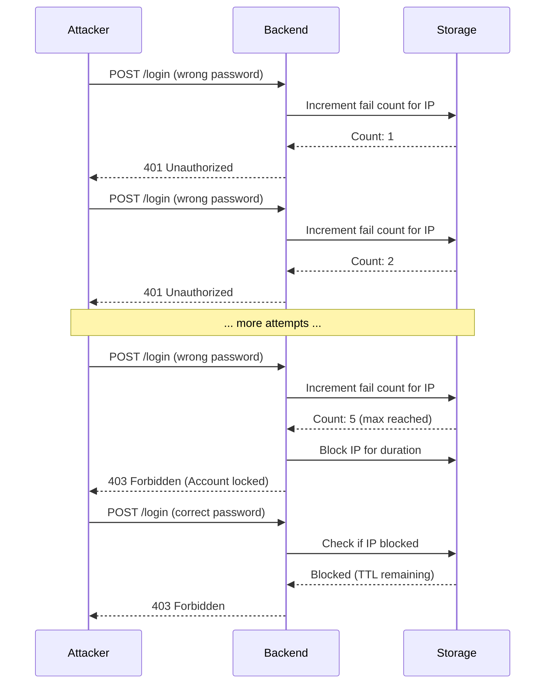
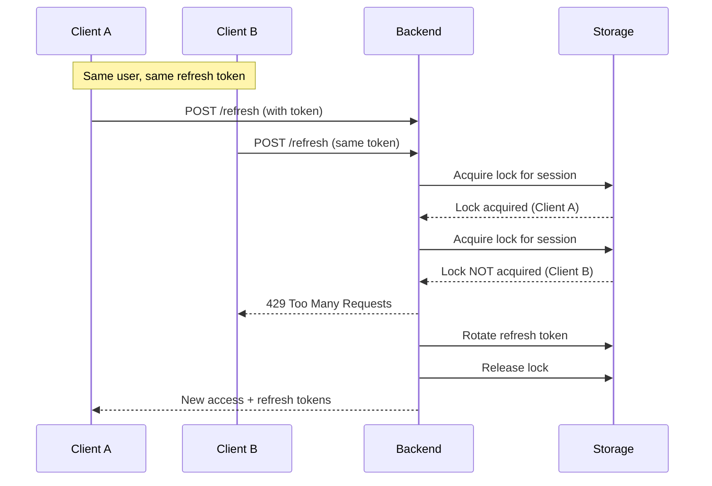

# Rate Limiting & Throttling

nauth-toolkit implements rate limiting at multiple layers to protect against brute-force attacks, abuse, and resource exhaustion. Each layer uses a **sliding window** counter tracked in your storage backend (Redis or database).

## Protection Layers

| Layer | Purpose | Tracks | Window Type |
|---|---|---|---|
| **IP-based lockout** | Prevent brute-force login attempts | Failed logins per IP | Sliding window |
| **Password reset rate limit** | Prevent reset abuse | Requests per user | Sliding window |
| **Verification code sending** | Prevent SMS/email bombing | Codes sent per user | Sliding window |
| **Verification attempt throttling** | Prevent code guessing | Attempts per user/IP | Sliding window |
| **Token refresh locking** | Prevent concurrent refresh abuse | Per session | Distributed lock |
| **Resend delay** | Prevent rapid code resending | Per user | Fixed cooldown |

:::tip[Why Multiple Layers?]
Each layer protects against different attack vectors. IP-based lockout stops automated attacks, per-user limits prevent account targeting, and distributed locks prevent race conditions.
:::

## IP-Based Lockout

Prevents brute-force password guessing by temporarily blocking IP addresses after too many failed login attempts.



### Window Calculation

1. First failed login: Counter starts at 1, TTL set to `duration`
2. Subsequent failed logins: Counter increments, TTL remains
3. Counter reaches `maxAttempts`: IP is blocked for `duration` seconds
4. Successful login (if `resetOnSuccess: true`): Counter resets to 0
5. After `duration` expires: Counter resets automatically

```
Time    Event                    Counter  TTL      Status
-----   ----------------------   -------  -------  ------
12:00   Failed login            1        900s     OK
12:01   Failed login            2        899s     OK
12:02   Failed login            3        898s     OK
12:03   Failed login            4        897s     OK
12:04   Failed login (5th)      5        896s     BLOCKED
12:05   Login attempt           5        896s     BLOCKED
...
12:19   (15 min elapsed)        0        -        OK (reset)
```

:::info[Why IP-based?]
IP-based lockout (not user-based) prevents attackers from locking out legitimate users by guessing their email/username.
:::

## Verification Code Rate Limits

Controls how often users can request email/SMS verification codes and how many verification attempts are allowed.

### Code Sending Limit

**Sliding window** --- limits how many codes can be sent to a user per window.

```
Time    Event                    Counter  TTL     Status
-----   ----------------------   -------  ------  ------
10:00   Send verification code   1        3600s   OK
10:02   Resend code (too soon)   1        3598s   BLOCKED (resendDelay)
10:02   Resend code              2        3598s   OK (after 60s)
10:15   Resend code              3        3285s   OK
10:30   Resend code              4        3000s   BLOCKED (rate limit)
11:00   (1 hour elapsed)         0        -       OK (reset)
```

### Verification Attempt Throttling

**Sliding window per user AND per IP** --- limits how many times codes can be guessed.

```
User attempts (maxAttemptsPerUser: 10):
Time    Event                Counter  Status
-----   ------------------   -------  ------
14:00   Verify (wrong code)  1        OK
...
14:09   Verify (wrong code)  10       OK
14:10   Verify (wrong code)  11       BLOCKED

IP attempts (maxAttemptsPerIP: 20):
Time    Event                      Counter  Status
-----   ------------------------   -------  ------
14:00   User A verify (wrong)      1        OK
...
14:19   User T verify (wrong)      20       OK
14:20   User U verify (wrong)      21       BLOCKED
```

## Resend Delay vs Rate Limit Window

Two mechanisms that work together:

| Mechanism | Purpose | Example |
|---|---|---|
| **Resend delay** | Fixed cooldown between successive requests | `resendDelay: 60` --- can't resend within 60s |
| **Rate limit window** | Total cap over time period | `rateLimitMax: 3, rateLimitWindow: 3600` --- max 3 codes per hour |

Combined: earliest possible 3 codes at 0s, 60s, 120s. After 3 codes, wait until window expires.

## Token Refresh Locking

Uses a **distributed lock** (not rate limiting) to prevent race conditions when multiple requests use the same refresh token simultaneously.



- **Lock key**: `session-refresh:${sessionId}`
- **Lock TTL**: 10 seconds (with jitter to prevent thundering herd)
- **Lock release**: Automatic on TTL or manual after refresh completes

:::warning[Token Reuse Attack]
If a refresh token is used twice (detected as reuse attack), the entire session and its token family are invalidated immediately. This is security enforcement, not rate limiting.
:::

## Storage Backend Considerations

### Redis (Recommended)

- Native atomic operations (`INCR`, `EXPIRE`, `SET NX`)
- Sub-millisecond performance
- Automatic key expiration
- Distributed lock support

### Database (PostgreSQL/MySQL)

- No additional infrastructure
- Slower than Redis (milliseconds vs microseconds)
- Requires periodic cleanup of expired records
- Suitable for low to medium traffic

### In-Memory (Development only)

Not shared across multiple servers. **Do NOT use in production.**

## What's Next

- **[Rate Limiting Guide](/docs/guides/rate-limiting)** --- Configure rate limits, handle errors, monitor and troubleshoot
- **[Storage](/docs/concepts/storage)** --- Redis vs database storage setup
- **[Error Handling](/docs/concepts/error-handling)** --- Exception handling patterns
- **[Configuration](/docs/concepts/configuration)** --- Full configuration reference
