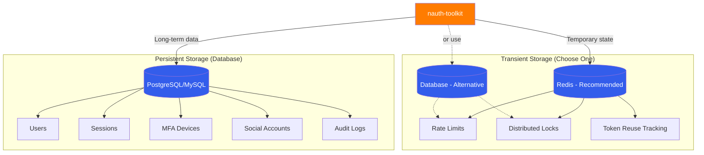

# Storage

nauth-toolkit uses **two types of storage** with different purposes and characteristics.

import Tabs from '@theme/Tabs';
import TabItem from '@theme/TabItem';

## Storage Types Overview



| Storage Type  | Purpose                              | Data Lifespan                | Critical                     | Options                                     |
| ------------- | ------------------------------------ | ---------------------------- | ---------------------------- | ------------------------------------------- |
| **Database**  | User accounts, sessions, MFA devices | Permanent                    | Yes - data loss catastrophic | PostgreSQL, MySQL                           |
| **Transient** | Rate limits, locks, counters         | Temporary (seconds to hours) | No - data loss acceptable    | Redis (recommended) or Database (required) |

## Database Storage (Persistent)

### Purpose

Stores all permanent authentication data in your existing database.

### Supported Databases

<Tabs>
  <TabItem value="postgres" label="PostgreSQL" default>

```bash npm2yarn
npm install @nauth-toolkit/database-typeorm-postgres
```

<Tabs groupId="platform">
  <TabItem value="nestjs" label="NestJS" default>

```typescript
import { TypeOrmModule } from '@nestjs/typeorm';
import { AuthModule } from '@nauth-toolkit/nestjs';
import { getNAuthEntities } from '@nauth-toolkit/database-typeorm-postgres';

@Module({
  imports: [
    TypeOrmModule.forRoot({
      type: 'postgres',
      host: process.env.DB_HOST,
      port: 5432,
      username: process.env.DB_USER,
      password: process.env.DB_PASSWORD,
      database: process.env.DB_NAME,
      entities: [...getNAuthEntities() /* your entities */],
    }),
    AuthModule.forRoot({
      /* config */
    }),
  ],
})
export class AppModule {}
```

  </TabItem>
  <TabItem value="express" label="Express">

```typescript
import { DataSource } from 'typeorm';
import { createNAuth } from '@nauth-toolkit/express';
import { getNAuthEntities } from '@nauth-toolkit/database-typeorm-postgres';

const dataSource = new DataSource({
  type: 'postgres',
  host: process.env.DB_HOST,
  port: 5432,
  username: process.env.DB_USER,
  password: process.env.DB_PASSWORD,
  database: process.env.DB_NAME,
  entities: getNAuthEntities(),
});

await dataSource.initialize();
const nauth = await createNAuth(config, dataSource);
```

  </TabItem>
  <TabItem value="fastify" label="Fastify">

```typescript
import { DataSource } from 'typeorm';
import { createNAuth } from '@nauth-toolkit/fastify';
import { getNAuthEntities } from '@nauth-toolkit/database-typeorm-postgres';

const dataSource = new DataSource({
  type: 'postgres',
  host: process.env.DB_HOST,
  port: 5432,
  username: process.env.DB_USER,
  password: process.env.DB_PASSWORD,
  database: process.env.DB_NAME,
  entities: getNAuthEntities(),
});

await dataSource.initialize();
const nauth = await createNAuth(config, dataSource);
```

  </TabItem>
</Tabs>

  </TabItem>
  <TabItem value="mysql" label="MySQL">

```bash npm2yarn
npm install @nauth-toolkit/database-typeorm-mysql
```

<Tabs groupId="platform">
  <TabItem value="nestjs" label="NestJS" default>

```typescript
import { TypeOrmModule } from '@nestjs/typeorm';
import { AuthModule } from '@nauth-toolkit/nestjs';
import { getNAuthEntities } from '@nauth-toolkit/database-typeorm-mysql';

@Module({
  imports: [
    TypeOrmModule.forRoot({
      type: 'mysql',
      host: process.env.DB_HOST,
      port: 3306,
      username: process.env.DB_USER,
      password: process.env.DB_PASSWORD,
      database: process.env.DB_NAME,
      entities: [...getNAuthEntities() /* your entities */],
    }),
    AuthModule.forRoot({
      /* config */
    }),
  ],
})
export class AppModule {}
```

  </TabItem>
  <TabItem value="express" label="Express">

```typescript
import { DataSource } from 'typeorm';
import { createNAuth } from '@nauth-toolkit/express';
import { getNAuthEntities } from '@nauth-toolkit/database-typeorm-mysql';

const dataSource = new DataSource({
  type: 'mysql',
  host: process.env.DB_HOST,
  port: 3306,
  username: process.env.DB_USER,
  password: process.env.DB_PASSWORD,
  database: process.env.DB_NAME,
  entities: getNAuthEntities(),
});

await dataSource.initialize();
const nauth = await createNAuth(config, dataSource);
```

  </TabItem>
  <TabItem value="fastify" label="Fastify">

```typescript
import { DataSource } from 'typeorm';
import { createNAuth } from '@nauth-toolkit/fastify';
import { getNAuthEntities } from '@nauth-toolkit/database-typeorm-mysql';

const dataSource = new DataSource({
  type: 'mysql',
  host: process.env.DB_HOST,
  port: 3306,
  username: process.env.DB_USER,
  password: process.env.DB_PASSWORD,
  database: process.env.DB_NAME,
  entities: getNAuthEntities(),
});

await dataSource.initialize();
const nauth = await createNAuth(config, dataSource);
```

  </TabItem>
</Tabs>

</TabItem>
</Tabs>

### Database Setup

Include `getNAuthEntities()` in your TypeORM entities array. Both PostgreSQL and MySQL are supported - choose based on your existing infrastructure.

## Transient Storage (Adapters)

### Purpose

Handles temporary authentication state (rate limits, locks, token tracking) that needs to be shared across your application instances.

**Which Adapter to Choose?**

- **Redis**: Best performance, **required** for multi-server deployments
- **Database**: Simpler setup, adequate for single-server or low-traffic apps

:::important
**Storage adapter is REQUIRED.** You must configure either `DatabaseStorageAdapter` or `RedisStorageAdapter`. If you don't provide one explicitly, `DatabaseStorageAdapter` will be auto-created if storage entities are available in your TypeORM configuration.
:::

### Adapter Options

<Tabs>
  <TabItem value="redis" label="Redis (Recommended)" default>

**Best for:** Production, multi-server deployments

```bash npm2yarn
npm install @nauth-toolkit/storage-redis redis
```

<Tabs groupId="platform">
  <TabItem value="nestjs" label="NestJS" default>

```typescript
import { AuthModule } from '@nauth-toolkit/nestjs';
import { RedisStorageAdapter } from '@nauth-toolkit/storage-redis';
import { createClient } from 'redis';

// Create Redis client
const redisClient = createClient({
  url: process.env.REDIS_URL || 'redis://localhost:6379',
});
await redisClient.connect();

@Module({
  imports: [
    AuthModule.forRoot({
      storageAdapter: new RedisStorageAdapter(redisClient),
      // ... other config
    }),
  ],
})
export class AppModule {}
```

  </TabItem>
  <TabItem value="express" label="Express">

```typescript
import { createNAuth } from '@nauth-toolkit/express';
import { RedisStorageAdapter } from '@nauth-toolkit/storage-redis';
import { createClient } from 'redis';

const redisClient = createClient({
  url: process.env.REDIS_URL || 'redis://localhost:6379',
});
await redisClient.connect();

const nauth = await createNAuth(
  {
    storageAdapter: new RedisStorageAdapter(redisClient),
    // ... other config
  },
  dataSource,
);
```

  </TabItem>
  <TabItem value="fastify" label="Fastify">

```typescript
import { createNAuth } from '@nauth-toolkit/fastify';
import { RedisStorageAdapter } from '@nauth-toolkit/storage-redis';
import { createClient } from 'redis';

const redisClient = createClient({
  url: process.env.REDIS_URL || 'redis://localhost:6379',
});
await redisClient.connect();

const nauth = await createNAuth(
  {
    storageAdapter: new RedisStorageAdapter(redisClient),
    // ... other config
  },
  dataSource,
);
```

  </TabItem>
</Tabs>

**Features:**

- High performance (in-memory)
- Shared across all server instances
- Native TTL support
- Cluster support for high availability
- Automatic expiration

</TabItem>
<TabItem value="database" label="Database">

**Best for:** Low-traffic apps, simplicity (no Redis needed)

```bash npm2yarn
npm install @nauth-toolkit/storage-database
```

<Tabs groupId="platform">
  <TabItem value="nestjs" label="NestJS" default>

```typescript
import { AuthModule, createDatabaseStorageAdapter } from '@nauth-toolkit/nestjs';

@Module({
  imports: [
    AuthModule.forRoot({
      storageAdapter: createDatabaseStorageAdapter(),
      // ... other config
    }),
  ],
})
export class AppModule {}
```

  </TabItem>
  <TabItem value="express" label="Express">

```typescript
import { createNAuth } from '@nauth-toolkit/express';
import { DatabaseStorageAdapter } from '@nauth-toolkit/storage-database';

const nauth = await createNAuth(
  {
    storageAdapter: new DatabaseStorageAdapter(),
    // ... other config
  },
  dataSource,
);
```

  </TabItem>
  <TabItem value="fastify" label="Fastify">

```typescript
import { createNAuth } from '@nauth-toolkit/fastify';
import { DatabaseStorageAdapter } from '@nauth-toolkit/storage-database';

const nauth = await createNAuth(
  {
    storageAdapter: new DatabaseStorageAdapter(),
    // ... other config
  },
  dataSource,
);
```

  </TabItem>
</Tabs>

**Features:**

- No additional infrastructure needed
- Shares database connection with persistent storage
- Adequate for low to medium traffic
- Slower than Redis
- Requires periodic cleanup job

**TypeORM entities:**

When using the **Database** storage adapter, include transient storage entities in your TypeORM configuration:

<Tabs groupId="platform">
  <TabItem value="nestjs" label="NestJS" default>

```typescript
import { TypeOrmModule } from '@nestjs/typeorm';
import { getNAuthEntities, getNAuthTransientStorageEntities } from '@nauth-toolkit/database-typeorm-postgres';

TypeOrmModule.forRoot({
  entities: [...getNAuthEntities(), ...getNAuthTransientStorageEntities()],
});
```

  </TabItem>
  <TabItem value="express" label="Express">

```typescript
import { DataSource } from 'typeorm';
import { getNAuthEntities, getNAuthTransientStorageEntities } from '@nauth-toolkit/database-typeorm-postgres';

const dataSource = new DataSource({
  // ... connection options
  entities: [...getNAuthEntities(), ...getNAuthTransientStorageEntities()],
});
```

  </TabItem>
  <TabItem value="fastify" label="Fastify">

```typescript
import { DataSource } from 'typeorm';
import { getNAuthEntities, getNAuthTransientStorageEntities } from '@nauth-toolkit/database-typeorm-postgres';

const dataSource = new DataSource({
  // ... connection options
  entities: [...getNAuthEntities(), ...getNAuthTransientStorageEntities()],
});
```

  </TabItem>
</Tabs>

  </TabItem>
</Tabs>

### Auto-Detection

If you don't explicitly provide a `storageAdapter` in your config, nauth-toolkit will automatically create a `DatabaseStorageAdapter` if:

1. Storage entities (`RateLimit`, `StorageLock`) are included in your TypeORM configuration
2. The `@nauth-toolkit/storage-database` package is installed

This makes it easy to get started without explicit configuration, but **explicit configuration is recommended** for production clarity.

**Example (auto-detection):**

<Tabs groupId="platform">
  <TabItem value="nestjs" label="NestJS" default>

```typescript
import { getNAuthEntities, getNAuthTransientStorageEntities } from '@nauth-toolkit/database-typeorm-postgres';

TypeOrmModule.forRoot({
  entities: [
    ...getNAuthEntities(),
    ...getNAuthTransientStorageEntities(), // Storage entities enable auto-detection
  ],
});

// No storageAdapter needed - DatabaseStorageAdapter will be auto-created
AuthModule.forRoot({
  // ... other config (no storageAdapter)
});
```

  </TabItem>
  <TabItem value="express" label="Express">

```typescript
import { DataSource } from 'typeorm';
import { createNAuth } from '@nauth-toolkit/express';
import { getNAuthEntities, getNAuthTransientStorageEntities } from '@nauth-toolkit/database-typeorm-postgres';

const dataSource = new DataSource({
  // ... connection options
  entities: [...getNAuthEntities(), ...getNAuthTransientStorageEntities()],
});

await dataSource.initialize();

// No storageAdapter needed - DatabaseStorageAdapter will be auto-created
const nauth = await createNAuth(
  {
    // ... other config (no storageAdapter)
  },
  dataSource,
);
```

  </TabItem>
  <TabItem value="fastify" label="Fastify">

```typescript
import { DataSource } from 'typeorm';
import { createNAuth } from '@nauth-toolkit/fastify';
import { getNAuthEntities, getNAuthTransientStorageEntities } from '@nauth-toolkit/database-typeorm-postgres';

const dataSource = new DataSource({
  // ... connection options
  entities: [...getNAuthEntities(), ...getNAuthTransientStorageEntities()],
});

await dataSource.initialize();

// No storageAdapter needed - DatabaseStorageAdapter will be auto-created
const nauth = await createNAuth(
  {
    // ... other config (no storageAdapter)
  },
  dataSource,
);
```

  </TabItem>
</Tabs>

## Production Recommendations

### Single Server Deployment

**Minimum:**

<Tabs groupId="platform">
  <TabItem value="nestjs" label="NestJS" default>

```typescript
import { createDatabaseStorageAdapter } from '@nauth-toolkit/nestjs';

storageAdapter: createDatabaseStorageAdapter(),
```

  </TabItem>
  <TabItem value="express" label="Express">

```typescript
import { DatabaseStorageAdapter } from '@nauth-toolkit/storage-database';

storageAdapter: new DatabaseStorageAdapter(),
```

  </TabItem>
  <TabItem value="fastify" label="Fastify">

```typescript
import { DatabaseStorageAdapter } from '@nauth-toolkit/storage-database';

storageAdapter: new DatabaseStorageAdapter(),
```

  </TabItem>
</Tabs>

**Recommended (higher throughput / multi-instance-ready):** Use Redis.

<Tabs groupId="platform">
  <TabItem value="nestjs" label="NestJS" default>

```typescript
import { RedisStorageAdapter } from '@nauth-toolkit/storage-redis';
import { createClient } from 'redis';

const redisClient = createClient({ url: process.env.REDIS_URL });
await redisClient.connect();

storageAdapter: new RedisStorageAdapter(redisClient),
```

  </TabItem>
  <TabItem value="express" label="Express">

```typescript
import { RedisStorageAdapter } from '@nauth-toolkit/storage-redis';
import { createClient } from 'redis';

const redisClient = createClient({ url: process.env.REDIS_URL });
await redisClient.connect();

storageAdapter: new RedisStorageAdapter(redisClient),
```

  </TabItem>
  <TabItem value="fastify" label="Fastify">

```typescript
import { RedisStorageAdapter } from '@nauth-toolkit/storage-redis';
import { createClient } from 'redis';

const redisClient = createClient({ url: process.env.REDIS_URL });
await redisClient.connect();

storageAdapter: new RedisStorageAdapter(redisClient),
```

  </TabItem>
</Tabs>

### Multi-Server Deployment

**Required:**

<Tabs groupId="platform">
  <TabItem value="nestjs" label="NestJS" default>

```typescript
import { RedisStorageAdapter } from '@nauth-toolkit/storage-redis';
import { createClient } from 'redis';

const redisClient = createClient({ url: process.env.REDIS_URL });
await redisClient.connect();

storageAdapter: new RedisStorageAdapter(redisClient),
```

  </TabItem>
  <TabItem value="express" label="Express">

```typescript
import { RedisStorageAdapter } from '@nauth-toolkit/storage-redis';
import { createClient } from 'redis';

const redisClient = createClient({ url: process.env.REDIS_URL });
await redisClient.connect();

storageAdapter: new RedisStorageAdapter(redisClient),
```

  </TabItem>
  <TabItem value="fastify" label="Fastify">

```typescript
import { RedisStorageAdapter } from '@nauth-toolkit/storage-redis';
import { createClient } from 'redis';

const redisClient = createClient({ url: process.env.REDIS_URL });
await redisClient.connect();

storageAdapter: new RedisStorageAdapter(redisClient),
```

  </TabItem>
</Tabs>

Why? Rate limiting and distributed locks MUST be shared across all application instances to work correctly.

### High-Availability Production

```typescript
import { createCluster } from 'redis';

// Use Redis Cluster for HA
const redisCluster = createCluster({
  rootNodes: [{ url: 'redis://node1:6379' }, { url: 'redis://node2:6379' }, { url: 'redis://node3:6379' }],
});
await redisCluster.connect();

storageAdapter: new RedisStorageAdapter(redisCluster);
```


## Migration from Database to Redis

If you started with `DatabaseStorageAdapter` and want to migrate to Redis for better performance:

<Tabs groupId="platform">
  <TabItem value="nestjs" label="NestJS" default>

```typescript
// Before (Database adapter)
import { createDatabaseStorageAdapter } from '@nauth-toolkit/nestjs';

AuthModule.forRoot({
  storageAdapter: createDatabaseStorageAdapter(),
});

// After (Redis adapter)
import { RedisStorageAdapter } from '@nauth-toolkit/storage-redis';
import { createClient } from 'redis';

const redisClient = createClient({
  url: process.env.REDIS_URL,
});
await redisClient.connect();

AuthModule.forRoot({
  storageAdapter: new RedisStorageAdapter(redisClient),
});
```

**Note:** After migrating to Redis, you can remove `getNAuthTransientStorageEntities()` from your TypeORM entities array (Redis doesn't need storage entities).

  </TabItem>
  <TabItem value="express" label="Express">

```typescript
// Before (Database adapter)
import { DatabaseStorageAdapter } from '@nauth-toolkit/storage-database';

const nauth = await createNAuth(
  {
    storageAdapter: new DatabaseStorageAdapter(),
  },
  dataSource,
);

// After (Redis adapter)
import { RedisStorageAdapter } from '@nauth-toolkit/storage-redis';
import { createClient } from 'redis';

const redisClient = createClient({
  url: process.env.REDIS_URL,
});
await redisClient.connect();

const nauth = await createNAuth(
  {
    storageAdapter: new RedisStorageAdapter(redisClient),
  },
  dataSource,
);
```

**Note:** After migrating to Redis, you should remove `getNAuthTransientStorageEntities()` from your TypeORM entities array (Redis doesn't need storage entities).

  </TabItem>
  <TabItem value="fastify" label="Fastify">

```typescript
// Before (Database adapter)
import { DatabaseStorageAdapter } from '@nauth-toolkit/storage-database';
import { createNAuth } from '@nauth-toolkit/fastify';

const nauth = await createNAuth(
  {
    storageAdapter: new DatabaseStorageAdapter(),
  },
  dataSource,
);

// After (Redis adapter)
import { RedisStorageAdapter } from '@nauth-toolkit/storage-redis';
import { createClient } from 'redis';

const redisClient = createClient({
  url: process.env.REDIS_URL,
});
await redisClient.connect();

const nauthRedis = await createNAuth(
  {
    storageAdapter: new RedisStorageAdapter(redisClient),
  },
  dataSource,
);
```

**Note:** After migrating to Redis, you should remove `getNAuthTransientStorageEntities()` from your TypeORM entities array (Redis doesn't need storage entities).

  </TabItem>
</Tabs>

**No migration needed** - transient storage data is temporary and can be lost.

## Next Steps

- **[Core Services](/docs/api/core/services/overview)** - Services that use storage
- **[Deployment](/docs/features/deployment)** - Production deployment guide
- **[Configuration](/docs/concepts/configuration)** - Complete configuration reference
