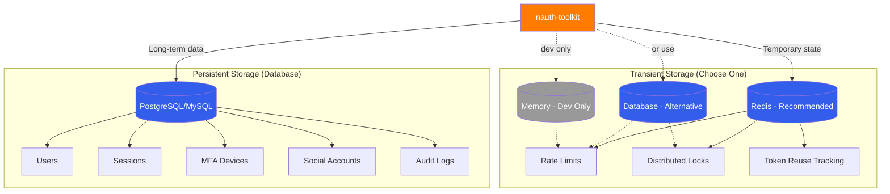

# Storage

nauth-toolkit uses **two types of storage** with different purposes and characteristics.

import Tabs from '@theme/Tabs';
import TabItem from '@theme/TabItem';

## Storage Types Overview



| Storage Type  | Purpose                              | Data Lifespan                | Critical                     | Options                                     |
| ------------- | ------------------------------------ | ---------------------------- | ---------------------------- | ------------------------------------------- |
| **Database**  | User accounts, sessions, MFA devices | Permanent                    | Yes - data loss catastrophic | PostgreSQL, MySQL                           |
| **Transient** | Rate limits, locks, counters         | Temporary (seconds to hours) | No - data loss acceptable    | Redis (recommended), Database, Memory (dev) |

## Database Storage (Persistent)

### Purpose

Stores all permanent authentication data in your existing database.

### Supported Databases

<Tabs>
  <TabItem value="postgres" label="PostgreSQL" default>

```bash
yarn add @nauth-toolkit/database-typeorm-postgres
```

**NestJS:**

```typescript
import { TypeOrmModule } from '@nestjs/typeorm';
import { AuthModule } from '@nauth-toolkit/nestjs';
import { getNAuthEntities } from '@nauth-toolkit/database-typeorm-postgres';

@Module({
  imports: [
    TypeOrmModule.forRoot({
      type: 'postgres',
      host: process.env.DB_HOST,
      port: 5432,
      username: process.env.DB_USER,
      password: process.env.DB_PASSWORD,
      database: process.env.DB_NAME,
      // Import nauth entities
      entities: [...getNAuthEntities() /* your entities */],
      synchronize: true, // Dev only
    }),
    AuthModule.forRoot({
      /* config */
    }),
  ],
})
export class AppModule {}
```

**Express:**

```typescript
import { DataSource } from 'typeorm';
import { createNAuth } from '@nauth-toolkit/express';
import { getNAuthEntities } from '@nauth-toolkit/database-typeorm-postgres';

const dataSource = new DataSource({
  type: 'postgres',
  host: process.env.DB_HOST,
  port: 5432,
  username: process.env.DB_USER,
  password: process.env.DB_PASSWORD,
  database: process.env.DB_NAME,
  entities: getNAuthEntities(),
  synchronize: true, // Dev only
});

await dataSource.initialize();
const nauth = await createNAuth(config, dataSource);
```

  </TabItem>
  <TabItem value="mysql" label="MySQL">

```bash
yarn add @nauth-toolkit/database-typeorm-mysql
```

**NestJS:**

```typescript
import { TypeOrmModule } from '@nestjs/typeorm';
import { AuthModule } from '@nauth-toolkit/nestjs';
import { getNAuthEntities } from '@nauth-toolkit/database-typeorm-mysql';

@Module({
  imports: [
    TypeOrmModule.forRoot({
      type: 'mysql',
      host: process.env.DB_HOST,
      port: 3306,
      username: process.env.DB_USER,
      password: process.env.DB_PASSWORD,
      database: process.env.DB_NAME,
      entities: [...getNAuthEntities() /* your entities */],
      synchronize: true, // Dev only
    }),
    AuthModule.forRoot({
      /* config */
    }),
  ],
})
export class AppModule {}
```

**Express:**

```typescript
import { DataSource } from 'typeorm';
import { createNAuth } from '@nauth-toolkit/express';
import { getNAuthEntities } from '@nauth-toolkit/database-typeorm-mysql';

const dataSource = new DataSource({
  type: 'mysql',
  host: process.env.DB_HOST,
  port: 3306,
  username: process.env.DB_USER,
  password: process.env.DB_PASSWORD,
  database: process.env.DB_NAME,
  entities: getNAuthEntities(),
  synchronize: true, // Dev only
});

await dataSource.initialize();
const nauth = await createNAuth(config, dataSource);
```

  </TabItem>
</Tabs>

### Database Entities

The `getNAuthEntities()` helper returns all required entities:

| Entity                | Purpose                  | Key Fields                           |
| --------------------- | ------------------------ | ------------------------------------ |
| **User**              | User accounts            | email, passwordHash, MFA settings    |
| **Session**           | Active user sessions     | token, userId, expiresAt             |
| **MFADevice**         | Enrolled MFA devices     | userId, type, secret                 |
| **SocialAccount**     | Social login connections | userId, provider, providerId         |
| **ChallengeSession**  | Active challenge flows   | userId, challengeName, code          |
| **VerificationToken** | Email/phone verification | userId, token, type, expiresAt       |
| **TrustedDevice**     | Remember device tokens   | userId, deviceId, expiresAt          |
| **AuthAudit**         | Audit trail              | userId, action, ipAddress, timestamp |
| **LoginAttempt**      | Failed login tracking    | email, ipAddress, attemptedAt        |

### Entity Architecture

Entities use **inheritance** to keep database adapters clean:

```typescript
// Core: Base entity (database-agnostic)
class BaseUser {
  id: number;
  sub: string;
  email: string;
  passwordHash?: string;
  // ... all fields defined here
}

// Database adapter: Add ORM decorators only
@Entity('nauth_users')
class User extends BaseUser {
  @PrimaryGeneratedColumn()
  declare id: number;

  @Column({ unique: true })
  declare email: string;

  // No field duplication!
}
```

**Benefits:**

- Single source of truth for entity structure
- Easy to add new database adapters
- No code duplication

### PostgreSQL vs MySQL

Both adapters provide the same entities and functionality. The only differences are:

| Feature             | PostgreSQL                           | MySQL                             |
| ------------------- | ------------------------------------ | --------------------------------- |
| **UUID Generation** | Native `uuid` type                   | `CHAR(36)`                        |
| **JSON Storage**    | `jsonb` (indexed)                    | `json`                            |
| **Timestamps**      | `timestamptz` (timezone-aware)       | `timestamp`                       |
| **Arrays**          | Native array support                 | `simple-array` (comma-separated)  |
| **Performance**     | Generally faster for complex queries | Generally faster for simple reads |

**Recommendation:** Use PostgreSQL if starting fresh. Use MySQL if your app already uses it.

## Transient Storage (Adapters)

### Purpose

Stores temporary state that doesn't need persistence:

- Rate limiting counters (reset hourly)
- Distributed locks (prevent race conditions)
- Token reuse detection (TTL-based)

**Why Separate?**

- Different performance characteristics (high-speed reads/writes)
- Automatic expiration (TTL)
- Shared across app instances (distributed deployments)
- Data loss is acceptable (not critical)

**Which Adapter to Choose?**

- **Redis**: Best performance, required for multi-server deployments
- **Database**: Simpler setup, adequate for single-server or low-traffic apps
- **Memory**: Development/testing only (data lost on restart)

### Adapter Options

<Tabs>
  <TabItem value="redis" label="Redis (Recommended)" default>

**Best for:** Production, multi-server deployments

```bash
yarn add @nauth-toolkit/storage-redis redis
```

**NestJS:**

```typescript
import { AuthModule } from '@nauth-toolkit/nestjs';
import { RedisStorageAdapter } from '@nauth-toolkit/storage-redis';
import { createClient } from 'redis';

// Create Redis client
const redisClient = createClient({
  url: process.env.REDIS_URL || 'redis://localhost:6379',
});
await redisClient.connect();

@Module({
  imports: [
    AuthModule.forRoot({
      storageAdapter: new RedisStorageAdapter(redisClient),
      // ... other config
    }),
  ],
})
export class AppModule {}
```

**Express:**

```typescript
import { createNAuth } from '@nauth-toolkit/express';
import { RedisStorageAdapter } from '@nauth-toolkit/storage-redis';
import { createClient } from 'redis';

const redisClient = createClient({
  url: process.env.REDIS_URL || 'redis://localhost:6379',
});
await redisClient.connect();

const nauth = await createNAuth(
  {
    storageAdapter: new RedisStorageAdapter(redisClient),
    // ... other config
  },
  dataSource,
);
```

**Features:**

✅ High performance (in-memory)
✅ Shared across all server instances
✅ Native TTL support
✅ Cluster support for high availability
✅ Automatic expiration

  </TabItem>
  <TabItem value="database" label="Database">

**Best for:** Low-traffic apps, simplicity (no Redis needed)

```bash
yarn add @nauth-toolkit/storage-database
```

**NestJS:**

```typescript
import { AuthModule } from '@nauth-toolkit/nestjs';
import { DatabaseStorageAdapter } from '@nauth-toolkit/storage-database';

@Module({
  imports: [
    AuthModule.forRoot({
      storageAdapter: new DatabaseStorageAdapter(),
      // ... other config
    }),
  ],
})
export class AppModule {}
```

**Express:**

```typescript
import { createNAuth } from '@nauth-toolkit/express';
import { DatabaseStorageAdapter } from '@nauth-toolkit/storage-database';

const nauth = await createNAuth(
  {
    storageAdapter: new DatabaseStorageAdapter(),
    // ... other config
  },
  dataSource,
);
```

**Features:**

✅ No additional infrastructure needed
✅ Shares database connection with persistent storage
✅ Adequate for low to medium traffic
⚠️ Slower than Redis
⚠️ Requires periodic cleanup job

**Additional Entities:**

When using database adapter, add transient storage entities:

```typescript
import { getNAuthEntities, getNAuthTransientStorageEntities } from '@nauth-toolkit/database-typeorm-postgres';

TypeOrmModule.forRoot({
  entities: [
    ...getNAuthEntities(),
    ...getNAuthTransientStorageEntities(), // Add this
  ],
});
```

  </TabItem>
  <TabItem value="memory" label="Memory (Dev Only)">

**Best for:** Development, testing

**NestJS:**

```typescript
import { AuthModule } from '@nauth-toolkit/nestjs';
import { MemoryStorageAdapter } from '@nauth-toolkit/core';

@Module({
  imports: [
    AuthModule.forRoot({
      storageAdapter: new MemoryStorageAdapter(),
      // ... other config
    }),
  ],
})
export class AppModule {}
```

**Express:**

```typescript
import { createNAuth } from '@nauth-toolkit/express';
import { MemoryStorageAdapter } from '@nauth-toolkit/core';

const nauth = await createNAuth(
  {
    storageAdapter: new MemoryStorageAdapter(),
    // ... other config
  },
  dataSource,
);
```

**⚠️ Critical Limitations:**

❌ Data lost on server restart
❌ NOT shared across multiple server instances
❌ Rate limiting bypassed in multi-container deployments
❌ **NEVER use in production**

  </TabItem>
</Tabs>

## Storage Adapter Interface

All storage adapters implement the same interface:

```typescript
interface StorageAdapter {
  // Key-value operations
  get(key: string): Promise<string | null>;
  set(key: string, value: string, ttl?: number): Promise<void>;
  del(key: string): Promise<void>;
  exists(key: string): Promise<boolean>;

  // Atomic operations (for rate limiting)
  incr(key: string, ttl?: number): Promise<number>;
  decr(key: string): Promise<number>;
  expire(key: string, ttl: number): Promise<void>;

  // Hash operations (for complex data)
  hget(key: string, field: string): Promise<string | null>;
  hset(key: string, field: string, value: string): Promise<void>;
  hgetall(key: string): Promise<Record<string, string>>;

  // List operations (for token families)
  lpush(key: string, value: string): Promise<void>;
  lrange(key: string, start: number, stop: number): Promise<string[]>;

  // Lifecycle
  initialize(): Promise<void>;
  isHealthy(): Promise<boolean>;
  disconnect(): Promise<void>;
}
```

## Production Recommendations

### Single Server Deployment

**Minimum:**

```typescript
// Use database adapter
storageAdapter: new DatabaseStorageAdapter();
```

**Recommended:**

```typescript
// Use Redis for better performance
storageAdapter: new RedisStorageAdapter(redisClient);
```

### Multi-Server Deployment

**Required:**

```typescript
// Redis is MANDATORY for multi-server
storageAdapter: new RedisStorageAdapter(redisClient);
```

Why? Rate limiting and distributed locks MUST be shared across all application instances to work correctly.

### High-Availability Production

```typescript
import { createCluster } from 'redis';

// Use Redis Cluster for HA
const redisCluster = createCluster({
  rootNodes: [{ url: 'redis://node1:6379' }, { url: 'redis://node2:6379' }, { url: 'redis://node3:6379' }],
});
await redisCluster.connect();

storageAdapter: new RedisStorageAdapter(redisCluster);
```

## What Gets Stored Where?

| Data Type             | Storage   | Why                        |
| --------------------- | --------- | -------------------------- |
| User accounts         | Database  | Permanent, critical        |
| User sessions         | Database  | Permanent until expiry     |
| MFA devices           | Database  | Permanent, user-configured |
| Social logins         | Database  | Permanent linking          |
| Audit logs            | Database  | Compliance, investigation  |
| Rate limit counters   | Transient | Temporary (1 hour TTL)     |
| Distributed locks     | Transient | Very temporary (seconds)   |
| Token reuse detection | Transient | Short-lived (15 min TTL)   |
| Challenge codes       | Database  | Tracked for security audit |

## Migration from Memory to Redis

If you started with `MemoryStorageAdapter` in development:

<Tabs>
  <TabItem value="nestjs" label="NestJS" default>

```typescript
// Before (dev)
AuthModule.forRoot({
  storageAdapter: new MemoryStorageAdapter(),
});

// After (production)
import { createClient } from 'redis';

const redisClient = createClient({
  url: process.env.REDIS_URL,
});
await redisClient.connect();

AuthModule.forRoot({
  storageAdapter: new RedisStorageAdapter(redisClient),
});
```

  </TabItem>
  <TabItem value="express" label="Express">

```typescript
// Before (dev)
const nauth = await createNAuth(
  {
    storageAdapter: new MemoryStorageAdapter(),
  },
  dataSource,
);

// After (production)
import { createClient } from 'redis';

const redisClient = createClient({
  url: process.env.REDIS_URL,
});
await redisClient.connect();

const nauth = await createNAuth(
  {
    storageAdapter: new RedisStorageAdapter(redisClient),
  },
  dataSource,
);
```

  </TabItem>
</Tabs>

**No migration needed** - transient storage data is temporary and can be lost.

## Next Steps

- **[Core Services](/docs/api/core/services/overview)** - Services that use storage
- **[Deployment](/docs/features/deployment)** - Production deployment guide
- **[Configuration](/docs/concepts/configuration)** - Complete configuration reference
