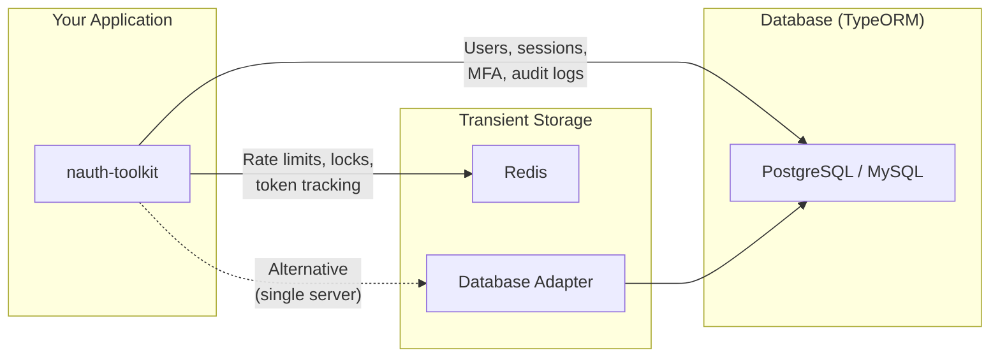

import Tabs from '@theme/Tabs';
import TabItem from '@theme/TabItem';

# Storage

nauth-toolkit uses two storage layers: a **database** for permanent authentication data (users, sessions, MFA devices) and a **transient storage adapter** for temporary state (rate limits, distributed locks, token tracking). Both are required --- the database is provided by a TypeORM DataSource, and the transient adapter is either Redis or a database-backed fallback.

## How It Works



| Layer | Purpose | Data Lifespan | Loss Impact | Options |
|---|---|---|---|---|
| **Database** | User accounts, sessions, MFA devices, audit logs | Permanent | Catastrophic | PostgreSQL, MySQL |
| **Transient** | Rate limits, distributed locks, token reuse tracking | Seconds to hours | Acceptable --- rebuilds automatically | Redis (recommended), Database |

## Database Storage

The database stores all persistent authentication data through TypeORM entities. You include these entities in your DataSource, and nauth-toolkit manages them through its services.

### Entities

`getNAuthEntities()` returns the full set of persistent entities:

| Entity | Purpose |
|---|---|
| `User` | User accounts and credentials |
| `Session` | Active auth sessions |
| `LoginAttempt` | Login attempt tracking for lockout |
| `VerificationToken` | Email/phone verification codes |
| `SocialAccount` | Linked OAuth provider accounts |
| `ChallengeSession` | Active challenge flows (MFA, verification) |
| `MFADevice` | Registered MFA devices (TOTP, SMS, Email, Passkey) |
| `AuthAudit` | Authentication audit trail |
| `TrustedDevice` | Remembered/trusted devices for MFA bypass |
| `SocialProviderSecret` | Encrypted social provider state (PKCE, nonces) |

### Supported Databases

<Tabs>
<TabItem value="postgres" label="PostgreSQL" default>

```bash npm2yarn
npm install @nauth-toolkit/database-typeorm-postgres
```

```typescript
import { getNAuthEntities } from '@nauth-toolkit/database-typeorm-postgres';

// Include in your TypeORM DataSource or TypeOrmModule
entities: [...getNAuthEntities(), /* your entities */],
```

</TabItem>
<TabItem value="mysql" label="MySQL">

```bash npm2yarn
npm install @nauth-toolkit/database-typeorm-mysql
```

```typescript
import { getNAuthEntities } from '@nauth-toolkit/database-typeorm-mysql';

entities: [...getNAuthEntities(), /* your entities */],
```

</TabItem>
</Tabs>

## Transient Storage

Transient storage handles short-lived authentication state that must be shared across application instances. The `StorageAdapter` interface provides key-value, hash, and list operations with TTL support.

### What It Stores

| Data | Purpose | TTL |
|---|---|---|
| Rate limit counters | Prevent brute force (login attempts, SMS/email sends) | Configured per limit |
| Distributed locks | Prevent concurrent token refresh race conditions | Seconds |
| Token reuse markers | Detect refresh token replay attacks | Matches refresh token TTL |
| Token families | Track token lineage for rotation | Matches refresh token TTL |

### StorageAdapter Interface

Any transient storage backend must implement `StorageAdapter`. The interface has 21 methods across six categories:

<details>
<summary>Full method reference</summary>

**Key-value operations**

| Method | Signature | Description |
|--------|-----------|-------------|
| `get` | `(key: string) => Promise<string \| null>` | Retrieve a value by key |
| `set` | `(key: string, value: string, ttlSeconds?: number, options?: { nx?: boolean }) => Promise<string \| null \| void>` | Store a value with optional TTL and `nx` (set-if-not-exists) |
| `del` | `(key: string) => Promise<void>` | Delete a key |
| `exists` | `(key: string) => Promise<boolean>` | Check if a key exists |

**Atomic operations**

| Method | Signature | Description |
|--------|-----------|-------------|
| `incr` | `(key: string, ttlSeconds?: number) => Promise<number>` | Increment a counter (used by rate limiting) |
| `decr` | `(key: string) => Promise<number>` | Decrement a counter |
| `expire` | `(key: string, ttl: number) => Promise<void>` | Set TTL on an existing key |
| `ttl` | `(key: string) => Promise<number>` | Get remaining TTL in seconds |

**Hash operations**

| Method | Signature | Description |
|--------|-----------|-------------|
| `hget` | `(key: string, field: string) => Promise<string \| null>` | Get a single hash field |
| `hset` | `(key: string, field: string, value: string) => Promise<void>` | Set a single hash field |
| `hgetall` | `(key: string) => Promise<Record<string, string>>` | Get all fields in a hash |
| `hdel` | `(key: string, ...fields: string[]) => Promise<number>` | Delete hash fields |

**List operations** (used for token families)

| Method | Signature | Description |
|--------|-----------|-------------|
| `lpush` | `(key: string, value: string) => Promise<void>` | Push to the head of a list |
| `lrange` | `(key: string, start: number, stop: number) => Promise<string[]>` | Get a range of list elements |
| `llen` | `(key: string) => Promise<number>` | Get the length of a list |

**Pattern operations**

| Method | Signature | Description |
|--------|-----------|-------------|
| `keys` | `(pattern: string) => Promise<string[]>` | Find keys matching a glob pattern |
| `scan` | `(cursor: number, pattern: string, count: number) => Promise<[number, string[]]>` | Incrementally iterate keys |

**Lifecycle**

| Method | Signature | Description |
|--------|-----------|-------------|
| `initialize` | `() => Promise<void>` | Called once at startup |
| `isHealthy` | `() => Promise<boolean>` | Health check for readiness probes |
| `cleanup` | `() => Promise<void>` | Release resources (graceful shutdown) |
| `disconnect` | `() => Promise<void>` | Close the underlying connection |

</details>

### Redis Adapter (Recommended)

Best for production and multi-server deployments. Required when running multiple application instances --- rate limits and locks must be shared.

```bash npm2yarn
npm install @nauth-toolkit/storage-redis redis
```

<Tabs groupId="platform">
<TabItem value="nestjs" label="NestJS" default>

```typescript
import { RedisStorageAdapter } from '@nauth-toolkit/storage-redis';
import { createClient } from 'redis';

const redisClient = createClient({ url: process.env.REDIS_URL });
await redisClient.connect();

AuthModule.forRoot({
  storageAdapter: new RedisStorageAdapter(redisClient),
});
```

</TabItem>
<TabItem value="express" label="Express / Fastify">

```typescript
import { NAuth } from '@nauth-toolkit/core';
import { RedisStorageAdapter } from '@nauth-toolkit/storage-redis';
import { createClient } from 'redis';

const redisClient = createClient({ url: process.env.REDIS_URL });
await redisClient.connect();

const nauth = await NAuth.create({
  config: {
    storageAdapter: new RedisStorageAdapter(redisClient),
    // ... other config
  },
  dataSource,
  adapter: new ExpressAdapter(), // or new FastifyAdapter()
});
```

</TabItem>
</Tabs>

:::tip Redis Cluster
For high availability, `RedisStorageAdapter` also accepts a cluster client:

```typescript
import { createCluster } from 'redis';

const cluster = createCluster({
  rootNodes: [
    { url: 'redis://node1:6379' },
    { url: 'redis://node2:6379' },
    { url: 'redis://node3:6379' },
  ],
});
await cluster.connect();

storageAdapter: new RedisStorageAdapter(cluster),
```

:::

### Database Adapter

Simpler setup --- uses your existing database for transient state. Adequate for single-server or low-traffic applications.

```bash npm2yarn
npm install @nauth-toolkit/storage-database
```

When using the database adapter, include transient storage entities in your TypeORM configuration:

```typescript
import {
  getNAuthEntities,
  getNAuthTransientStorageEntities,
} from '@nauth-toolkit/database-typeorm-postgres';

entities: [...getNAuthEntities(), ...getNAuthTransientStorageEntities()],
```

`getNAuthTransientStorageEntities()` returns two entities: `RateLimit` and `StorageLock`.

<Tabs groupId="platform">
<TabItem value="nestjs" label="NestJS" default>

```typescript
import { createDatabaseStorageAdapter } from '@nauth-toolkit/nestjs';

AuthModule.forRoot({
  storageAdapter: createDatabaseStorageAdapter(),
});
```

:::note
`createDatabaseStorageAdapter()` is a NestJS-specific factory that handles repository injection automatically. For Express/Fastify, use `DatabaseStorageAdapter` directly.
:::

</TabItem>
<TabItem value="express" label="Express / Fastify">

```typescript
import { NAuth } from '@nauth-toolkit/core';
import { DatabaseStorageAdapter } from '@nauth-toolkit/storage-database';

// Pass null repositories — NAuth.create() injects them from the DataSource
const nauth = await NAuth.create({
  config: {
    storageAdapter: new DatabaseStorageAdapter(null, null),
    // ... other config
  },
  dataSource,
  adapter: new ExpressAdapter(), // or new FastifyAdapter()
});
```

</TabItem>
</Tabs>

<details>
<summary>Database vs Redis trade-offs</summary>

| | Redis | Database |
|---|---|---|
| **Performance** | In-memory, sub-millisecond | Disk I/O, slower under load |
| **TTL handling** | Native, automatic expiration | Requires periodic cleanup |
| **Multi-server** | Shared state across instances | Shared via same database |
| **Infrastructure** | Requires Redis server | No additional infrastructure |
| **Best for** | Production, multi-instance | Development, single server |

</details>

### Auto-Detection

If you don't provide a `storageAdapter` in your config, nauth-toolkit automatically creates a `DatabaseStorageAdapter` when:

1. Transient storage entities (`RateLimit`, `StorageLock`) are included in your TypeORM DataSource
2. The `@nauth-toolkit/storage-database` package is installed

This is convenient for getting started, but **explicit configuration is recommended** for production clarity.

:::warning Multi-Server Deployments
Database adapter auto-detection works for single-server setups. If you run multiple application instances, you **must** use `RedisStorageAdapter` --- rate limits and distributed locks need to be shared across all instances to work correctly.
:::

## Migrating from Database to Redis

Transient storage data is temporary by design --- no data migration is needed. Switch the adapter and the system rebuilds state as new requests come in.

<Tabs groupId="platform">
<TabItem value="nestjs" label="NestJS" default>

```typescript
// Before
import { createDatabaseStorageAdapter } from '@nauth-toolkit/nestjs';
storageAdapter: createDatabaseStorageAdapter(),

// After
import { RedisStorageAdapter } from '@nauth-toolkit/storage-redis';
import { createClient } from 'redis';
const redisClient = createClient({ url: process.env.REDIS_URL });
await redisClient.connect();
storageAdapter: new RedisStorageAdapter(redisClient),
```

</TabItem>
<TabItem value="express" label="Express / Fastify">

```typescript
// Before
import { DatabaseStorageAdapter } from '@nauth-toolkit/storage-database';
storageAdapter: new DatabaseStorageAdapter(null, null),

// After
import { RedisStorageAdapter } from '@nauth-toolkit/storage-redis';
import { createClient } from 'redis';
const redisClient = createClient({ url: process.env.REDIS_URL });
await redisClient.connect();
storageAdapter: new RedisStorageAdapter(redisClient),
```

</TabItem>
</Tabs>

After migrating, you can remove `getNAuthTransientStorageEntities()` from your TypeORM entities array --- Redis handles its own storage.

## What's Next

- **[Configuration](/docs/concepts/configuration)** --- Full configuration reference including storage options
- **[Rate Limiting](/docs/guides/rate-limiting)** --- Configure rate limits that use transient storage
- **[Token Management](/docs/concepts/token-management)** --- How token refresh rotation uses transient storage
- **[Quick Start](/docs/quick-start/nestjs)** --- End-to-end setup including storage configuration
