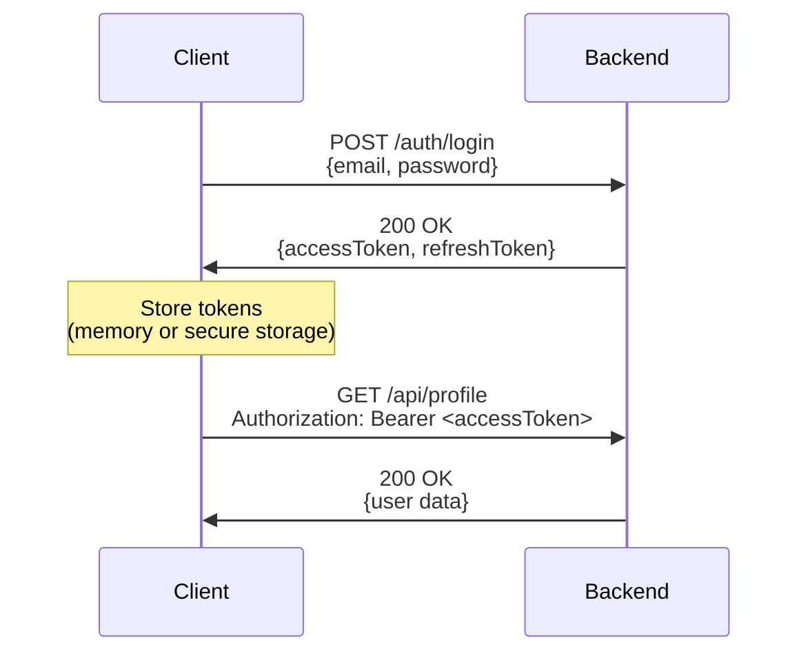
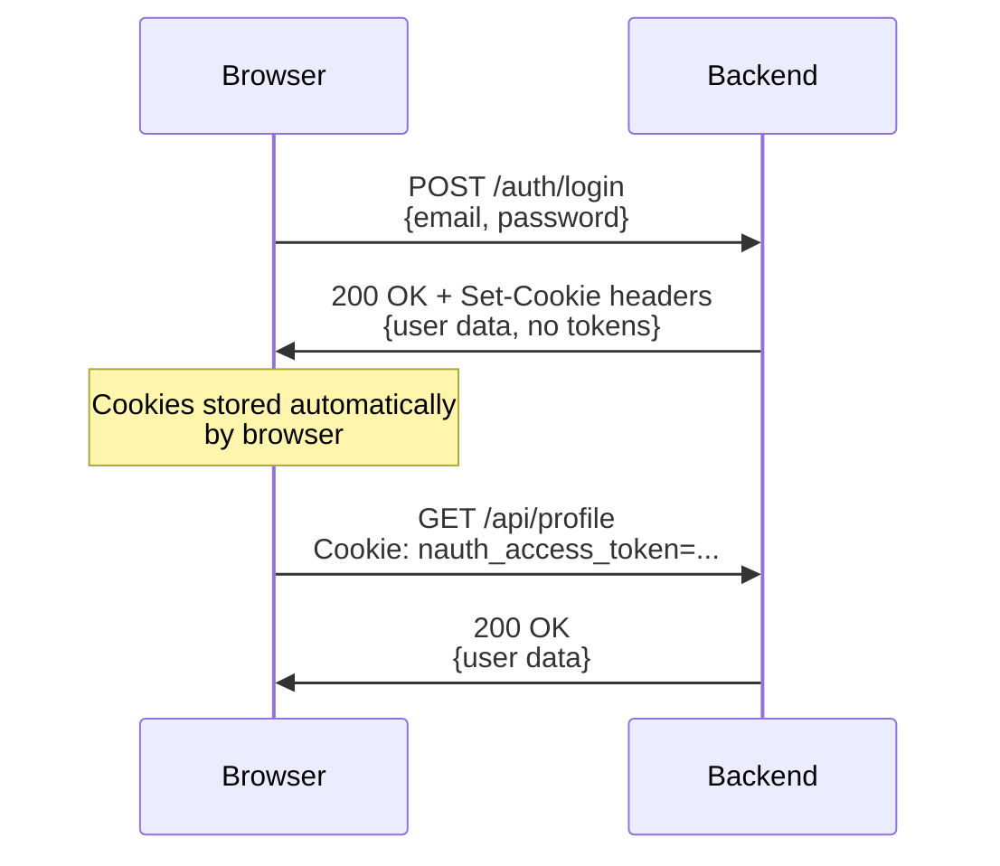
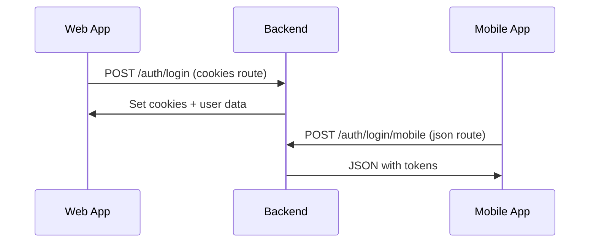
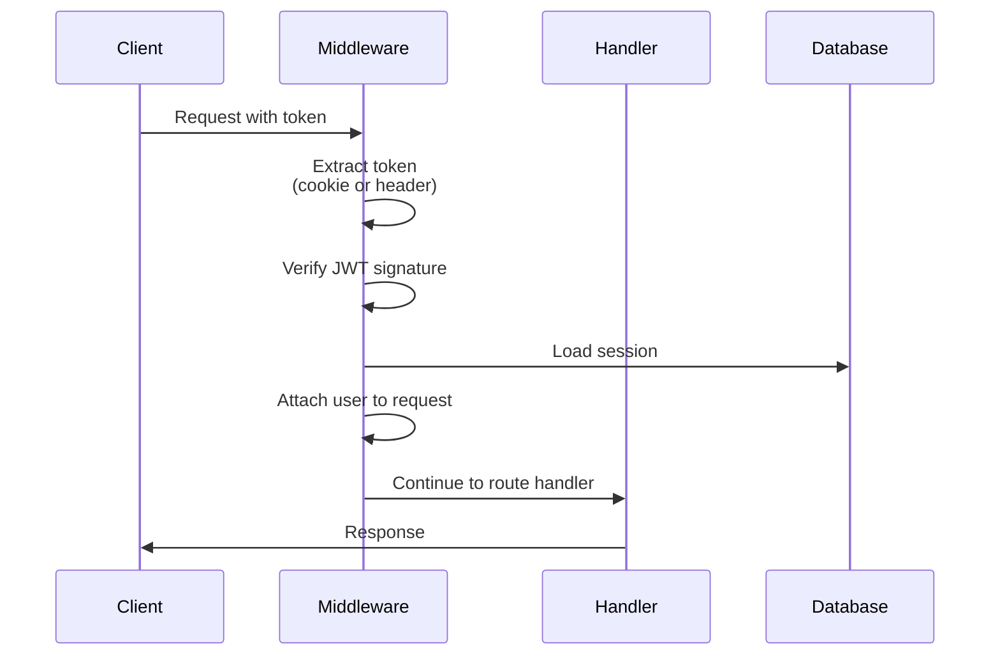
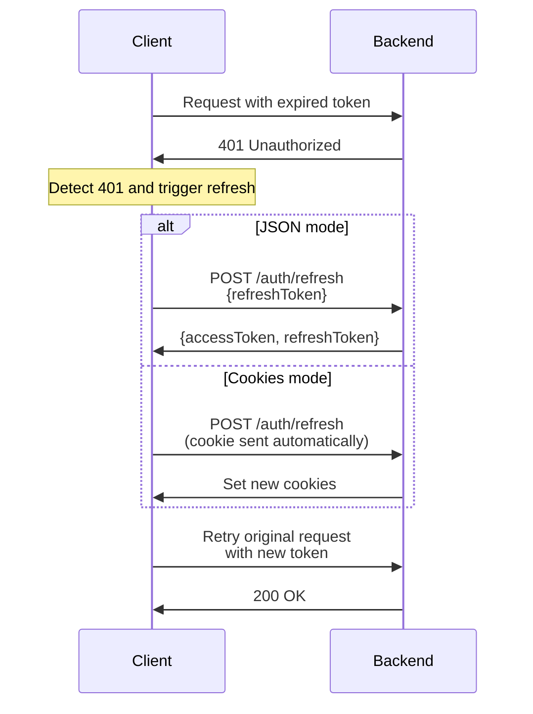
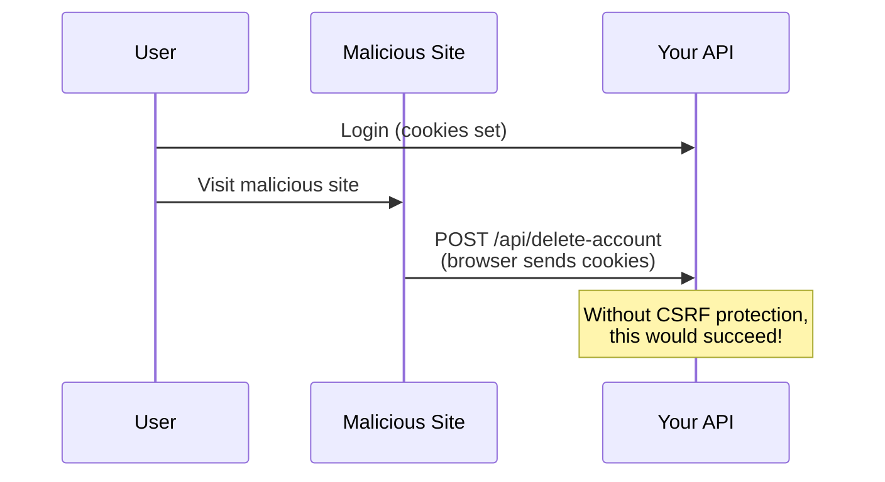
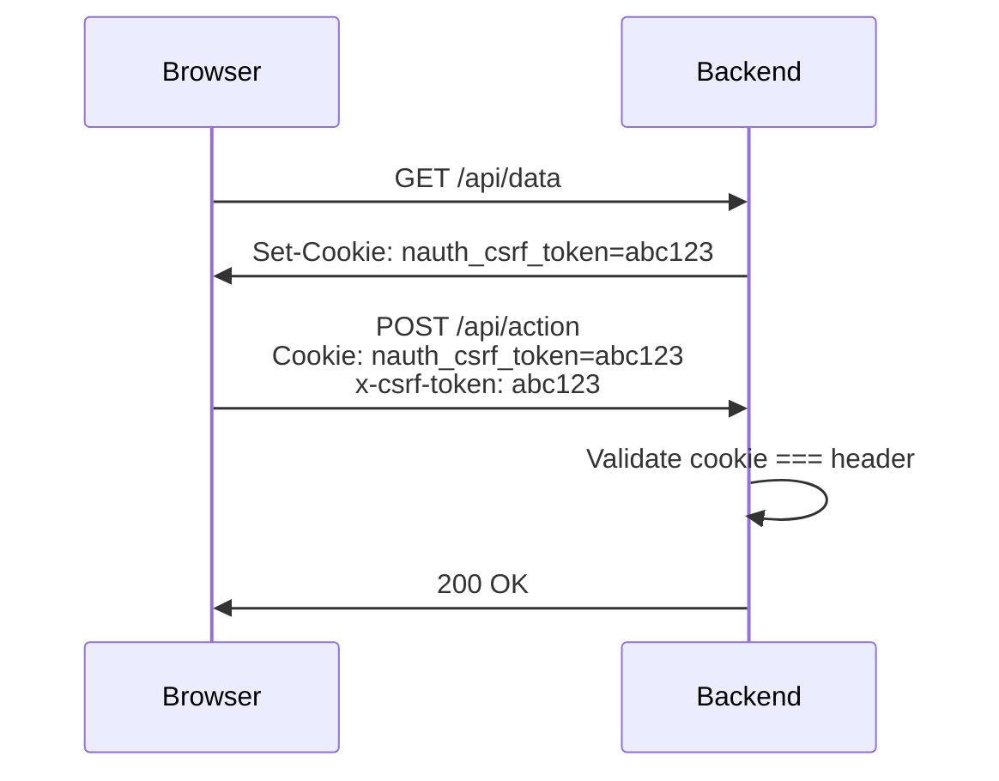

import Tabs from '@theme/Tabs';
import TabItem from '@theme/TabItem';

# Token Management

This page explains how nauth-toolkit manages JWT tokens throughout the authentication lifecycle—from initial login to token refresh to protected API calls.

## Overview

nauth-toolkit handles token management automatically, but you need to understand three key concepts:

1. **Token delivery mode** - How tokens travel between backend and frontend
2. **Token validation** - How the backend verifies tokens on protected requests
3. **Token refresh** - How expired tokens are replaced without re-login

The backend and frontend must agree on the token delivery mode for everything to work correctly.

## Token delivery modes

Your backend configuration determines how tokens are sent to clients. Choose **one mode** for each client type:

| Mode | Best For | Tokens In | Frontend Sends | CSRF Required |
|------|----------|-----------|----------------|---------------|
| `json` | Mobile apps, SPAs | Response body | `Authorization: Bearer` header | No |
| `cookies` | Web apps (most secure) | HTTP-only cookies | Automatic (cookies) | Yes |
| `hybrid` | Web + Mobile from same backend | Varies by route | Depends on endpoint | Yes (for cookie routes) |

### Configuration

Set the mode in your backend configuration:

```typescript
// nauth.config.ts
{
  tokenDelivery: {
    method: 'json',  // or 'cookies' or 'hybrid'
  }
}
```

:::tip
Pick `cookies` for web-only apps (best security), `json` for mobile-only apps (simplicity), or `hybrid` when you need to support both from a single backend.
:::

## How token delivery works

### JSON mode (Bearer tokens)

The simplest mode. Tokens are returned in the response body and the frontend manages storage.



**What you need to do:**

1. Backend: Set `tokenDelivery.method = 'json'`
2. Frontend: Store tokens securely (avoid localStorage for web apps)
3. Frontend: Send access token in `Authorization: Bearer <token>` header

**Response example:**

```json
{
  "accessToken": "eyJhbGciOiJIUzI1NiIsInR5cCI6IkpXVCJ9...",
  "refreshToken": "eyJhbGciOiJIUzI1NiIsInR5cCI6IkpXVCJ9...",
  "accessTokenExpiresAt": 1735000000,
  "refreshTokenExpiresAt": 1735604800,
  "user": { ... }
}
```

:::warning Security Consideration
For web applications, storing tokens in `localStorage`—they're vulnerable to XSS attacks. Opt for httpOnly secure cookies mode
:::

### Cookies mode (HTTP-only cookies)

The most secure mode for web browsers. Tokens are set as HTTP-only cookies that JavaScript cannot access.



**What you need to do:**

1. Backend: Set `tokenDelivery.method = 'cookies'`
2. Frontend: Send `credentials: 'include'` with fetch/axios
3. Frontend: Include CSRF token in headers (see [CSRF Protection](#csrf-protection))

**Response example:**

```http
HTTP/1.1 200 OK
Set-Cookie: nauth_access_token=eyJ...; HttpOnly; Secure; SameSite=Strict; Path=/
Set-Cookie: nauth_refresh_token=eyJ...; HttpOnly; Secure; SameSite=Strict; Path=/
Set-Cookie: nauth_csrf_token=abc123; Secure; SameSite=Strict; Path=/

{
  "user": { ... }
}
```

:::info
Notice the response body does **not** contain tokens—they're in the `Set-Cookie` headers. The frontend never sees the actual token values.
:::

### Hybrid mode (flexible routing)

Hybrid mode lets one backend serve both web (cookies) and mobile (json) clients using separate routes.



**What you need to do:**

1. Backend: Set `tokenDelivery.method = 'hybrid'`
2. Backend: Create separate routes with explicit delivery mode (see examples below)
3. Frontend (web): Call `/auth/login` and use cookie mode
4. Frontend (mobile): Call `/auth/login/mobile` and use json mode

:::tip Route Naming Convention
Use a clear pattern like `/auth/*` for cookie routes and `/auth/*/mobile` for JSON routes. This makes it obvious which client should call which endpoint.
:::

## Setting up token delivery per route

When using `hybrid` mode, you must tell each route which delivery mode to use.

<Tabs groupId="platform">
<TabItem value="nestjs" label="NestJS">

Use the `@TokenDelivery()` decorator:

```typescript
import { Controller, Post, Body } from '@nestjs/common';
import { Public, TokenDelivery } from '@nauth-toolkit/nestjs';
import { AuthService, LoginDTO, AuthResponseDTO } from '@nauth-toolkit/core';

@Controller('auth')
export class AuthController {
  constructor(private readonly authService: AuthService) {}

  // Web client endpoint (cookies)
  @Public()
  @Post('login')
  @TokenDelivery('cookies') // Only required when tokenDelivery: 'hybrid'
  async loginWeb(@Body() dto: LoginDTO): Promise<AuthResponseDTO> {
    return await this.authService.login(dto);
  }

  // Mobile client endpoint (json)
  @Public()
  @Post('login/mobile')
  @TokenDelivery('json') // Only required when tokenDelivery: 'hybrid'
  async loginMobile(@Body() dto: LoginDTO): Promise<AuthResponseDTO> {
    return await this.authService.login(dto);
  }
}
```

</TabItem>
<TabItem value="express" label="Express">

Use the `tokenDelivery()` helper:

```typescript
import { Router } from 'express';

const router = Router();

// Web client endpoint (cookies)
router.post(
  '/login',
  nauth.helpers.public(),
  nauth.helpers.tokenDelivery('cookies'), // Only required when tokenDelivery: 'hybrid'
  async (req, res, next) => {
    try {
      const dto = Object.assign(new LoginDTO(), req.body);
      const result = await nauth.authService.login(dto);
      res.json(result);
    } catch (error) {
      next(error);
    }
  }
);

// Mobile client endpoint (json)
router.post(
  '/login/mobile',
  nauth.helpers.public(),
  nauth.helpers.tokenDelivery('json'), // Only required when tokenDelivery: 'hybrid'
  async (req, res, next) => {
    try {
      const dto = Object.assign(new LoginDTO(), req.body);
      const result = await nauth.authService.login(dto);
      res.json(result);
    } catch (error) {
      next(error);
    }
  }
);
```

</TabItem>
<TabItem value="fastify" label="Fastify">

Use the `tokenDelivery()` helper in preHandler:

```typescript
// Web client endpoint (cookies)
fastify.post(
  '/login',
  {
    preHandler: [
      nauth.helpers.public() as any,
      nauth.helpers.tokenDelivery('cookies') as any // Only required when tokenDelivery: 'hybrid'
    ]
  },
  nauth.adapter.wrapRouteHandler(async (req) => {
    const dto = Object.assign(new LoginDTO(), req.body);
    return nauth.authService.login(dto);
  })
);

// Mobile client endpoint (json)
fastify.post(
  '/login/mobile',
  {
    preHandler: [
      nauth.helpers.public() as any,
      nauth.helpers.tokenDelivery('json') as any // Only required when tokenDelivery: 'hybrid'
    ]
  },
  nauth.adapter.wrapRouteHandler(async (req) => {
    const dto = Object.assign(new LoginDTO(), req.body);
    return nauth.authService.login(dto);
  })
);
```

</TabItem>
</Tabs>

## Token validation on protected routes

When a client makes a request to a protected endpoint, nauth-toolkit automatically validates the access token.



**What happens automatically:**

1. Token is extracted from the correct source (cookie or `Authorization` header)
2. JWT signature is validated
3. Token expiration is checked
4. Session is loaded from storage
5. User object is attached to the request context

**Access the authenticated user:**

<Tabs groupId="platform">
<TabItem value="nestjs" label="NestJS">

```typescript
import { Controller, Get } from '@nestjs/common';
import { CurrentUser } from '@nauth-toolkit/nestjs';
import { IUser } from '@nauth-toolkit/core';

@Controller('profile')
export class ProfileController {
  @Get()
  getProfile(@CurrentUser() user: IUser) {
    return { user };
  }
}
```

</TabItem>
<TabItem value="express" label="Express">

```typescript
router.get('/profile', nauth.helpers.requireAuth(), (req, res) => {
  const user = nauth.helpers.getCurrentUser();
  res.json({ user });
});
```

</TabItem>
<TabItem value="fastify" label="Fastify">

```typescript
fastify.get(
  '/profile',
  { preHandler: nauth.helpers.requireAuth() as any },
  nauth.adapter.wrapRouteHandler(async () => {
    const user = nauth.helpers.getCurrentUser();
    return { user };
  })
);
```

</TabItem>
</Tabs>

:::info Authentication is Optional by Default
Routes are **not** protected by default. Use `requireAuth()` (Express/Fastify) or apply guards (NestJS) to enforce authentication.
:::

## Token refresh flow

Access tokens have short lifetimes (typically 15 minutes). When they expire, use the refresh token to get new ones without requiring the user to log in again.



### Implementing refresh endpoints

The refresh endpoint calls `AuthService.refreshToken()` but extracts the refresh token differently depending on the mode.

<Tabs groupId="platform">
<TabItem value="nestjs" label="NestJS">

**JSON mode:**

```typescript
@Public()
@Post('refresh')
async refresh(@Body() dto: RefreshTokenDTO): Promise<TokenResponse> {
  return await this.authService.refreshToken(dto);
}
```

**Cookies mode:**

```typescript
@Public()
@Post('refresh')
async refresh(@Req() req: any): Promise<TokenResponse> {
  const token = req?.cookies?.['nauth_refresh_token'];
  if (!token) {
    throw new UnauthorizedException('Refresh token missing');
  }

  const dto = new RefreshTokenDTO();
  dto.refreshToken = token;
  return await this.authService.refreshToken(dto);
}
```

**Hybrid mode:**

```typescript
// Cookie endpoint
@Public()
@Post('refresh')
@TokenDelivery('cookies')
async refreshWeb(@Req() req: any): Promise<TokenResponse> {
  const token = req?.cookies?.['nauth_refresh_token'];
  if (!token) {
    throw new UnauthorizedException('Refresh token missing');
  }

  const dto = new RefreshTokenDTO();
  dto.refreshToken = token;
  return await this.authService.refreshToken(dto);
}

// JSON endpoint
@Public()
@Post('refresh/mobile')
@TokenDelivery('json')
async refreshMobile(@Body() dto: RefreshTokenDTO): Promise<TokenResponse> {
  return await this.authService.refreshToken(dto);
}
```

</TabItem>
<TabItem value="express" label="Express">

**JSON mode:**

```typescript
router.post('/refresh', nauth.helpers.public(), async (req, res, next) => {
  try {
    const dto = Object.assign(new RefreshTokenDTO(), req.body);
    const result = await nauth.authService.refreshToken(dto);
    res.json(result);
  } catch (error) {
    next(error);
  }
});
```

**Cookies mode:**

```typescript
router.post('/refresh', nauth.helpers.public(), async (req, res, next) => {
  try {
    const token = req.cookies?.['nauth_refresh_token'];
    if (!token) {
      return res.status(401).json({ error: 'Refresh token missing' });
    }

    const dto = new RefreshTokenDTO();
    dto.refreshToken = token;
    const result = await nauth.authService.refreshToken(dto);
    res.json(result);
  } catch (error) {
    next(error);
  }
});
```

**Hybrid mode:**

```typescript
// Cookie endpoint
router.post(
  '/refresh',
  nauth.helpers.public(),
  nauth.helpers.tokenDelivery('cookies'),
  async (req, res, next) => {
    try {
      const token = req.cookies?.['nauth_refresh_token'];
      if (!token) {
        return res.status(401).json({ error: 'Refresh token missing' });
      }

      const dto = new RefreshTokenDTO();
      dto.refreshToken = token;
      const result = await nauth.authService.refreshToken(dto);
      res.json(result);
    } catch (error) {
      next(error);
    }
  }
);

// JSON endpoint
router.post(
  '/refresh/mobile',
  nauth.helpers.public(),
  nauth.helpers.tokenDelivery('json'),
  async (req, res, next) => {
    try {
      const dto = Object.assign(new RefreshTokenDTO(), req.body);
      const result = await nauth.authService.refreshToken(dto);
      res.json(result);
    } catch (error) {
      next(error);
    }
  }
);
```

</TabItem>
<TabItem value="fastify" label="Fastify">

**JSON mode:**

```typescript
fastify.post(
  '/refresh',
  { preHandler: nauth.helpers.public() as any },
  nauth.adapter.wrapRouteHandler(async (req) => {
    const dto = Object.assign(new RefreshTokenDTO(), req.body);
    return nauth.authService.refreshToken(dto);
  })
);
```

**Cookies mode:**

```typescript
fastify.post(
  '/refresh',
  { preHandler: nauth.helpers.public() as any },
  nauth.adapter.wrapRouteHandler(async (req, reply) => {
    const token = req.cookies?.['nauth_refresh_token'];
    if (!token) {
      reply.code(401);
      throw new Error('Refresh token missing');
    }

    const dto = new RefreshTokenDTO();
    dto.refreshToken = token;
    return nauth.authService.refreshToken(dto);
  })
);
```

**Hybrid mode:**

```typescript
// Cookie endpoint
fastify.post(
  '/refresh',
  {
    preHandler: [
      nauth.helpers.public() as any,
      nauth.helpers.tokenDelivery('cookies') as any
    ]
  },
  nauth.adapter.wrapRouteHandler(async (req, reply) => {
    const token = req.cookies?.['nauth_refresh_token'];
    if (!token) {
      reply.code(401);
      throw new Error('Refresh token missing');
    }

    const dto = new RefreshTokenDTO();
    dto.refreshToken = token;
    return nauth.authService.refreshToken(dto);
  })
);

// JSON endpoint
fastify.post(
  '/refresh/mobile',
  {
    preHandler: [
      nauth.helpers.public() as any,
      nauth.helpers.tokenDelivery('json') as any
    ]
  },
  nauth.adapter.wrapRouteHandler(async (req) => {
    const dto = Object.assign(new RefreshTokenDTO(), req.body);
    return nauth.authService.refreshToken(dto);
  })
);
```

</TabItem>
</Tabs>

:::tip Frontend SDK
If you're using `@nauth-toolkit/client`, token refresh is handled automatically. The SDK intercepts 401 responses, calls the refresh endpoint, and retries the original request.
:::

## CSRF protection

When using `cookies` or `hybrid` mode, Cross-Site Request Forgery (CSRF) protection is **mandatory**.

### Why CSRF protection is needed

With cookies, the browser automatically sends them with **every request** to your domain—even requests initiated by malicious sites.



### How nauth-toolkit prevents CSRF

nauth-toolkit uses the **double-submit cookie pattern**:

1. Server sets a CSRF token as a **readable** cookie
2. Frontend reads the cookie and sends the value in a custom header
3. Server validates that the cookie and header match



### Configuration

CSRF is enabled automatically when you use cookies/hybrid mode. Customize via `security.csrf`:

```typescript
{
  tokenDelivery: { method: 'cookies' },
  security: {
    csrf: {
      cookieName: 'nauth_csrf_token',  // Readable cookie name
      headerName: 'x-csrf-token',      // Header the client must send
      excludedPaths: ['/webhooks/*'],  // Paths that bypass CSRF
    },
  },
}
```

### Frontend implementation

Read the CSRF token from cookies and send it in the header:

```typescript
function getCsrfToken(): string {
  const cookies = document.cookie.split(';');
  const csrfCookie = cookies.find(c => c.trim().startsWith('nauth_csrf_token='));
  return csrfCookie ? csrfCookie.split('=')[1] : '';
}

// Send with every request
fetch('/api/protected', {
  method: 'POST',
  credentials: 'include',  // Send cookies
  headers: {
    'Content-Type': 'application/json',
    'x-csrf-token': getCsrfToken(),  // CSRF token
  },
  body: JSON.stringify({ ... }),
});
```

:::danger Never Disable CSRF
CSRF protection is **required** for cookie-based authentication. Disabling it leaves your application vulnerable to CSRF attacks where malicious sites can perform actions on behalf of your users.
:::

## JWT algorithm configuration

JWT tokens are signed using a cryptographic algorithm configured in your backend.

### Supported algorithms

| Algorithm | Type | Key Requirement |
|-----------|------|-----------------|
| HS256 | Symmetric (HMAC) | Shared secret |
| HS384 | Symmetric (HMAC) | Shared secret |
| HS512 | Symmetric (HMAC) | Shared secret |
| RS256 | Asymmetric (RSA) | Public/private key pair |
| RS384 | Asymmetric (RSA) | Public/private key pair |
| RS512 | Asymmetric (RSA) | Public/private key pair |

### Configuration

<Tabs>
<TabItem value="symmetric" label="Symmetric (HS256)" default>

```typescript
{
  jwt: {
    algorithm: 'HS256',  // Default
    accessToken: {
      secret: process.env.JWT_SECRET,  // At least 32 characters
      expiresIn: '15m',
    },
    refreshToken: {
      secret: process.env.JWT_REFRESH_SECRET,
      expiresIn: '7d',
    },
  },
}
```

</TabItem>
<TabItem value="asymmetric" label="Asymmetric (RS256)">

```typescript
{
  jwt: {
    algorithm: 'RS256',
    accessToken: {
      privateKey: process.env.JWT_PRIVATE_KEY,
      publicKey: process.env.JWT_PUBLIC_KEY,
      expiresIn: '15m',
    },
    refreshToken: {
      privateKey: process.env.JWT_REFRESH_PRIVATE_KEY,
      publicKey: process.env.JWT_REFRESH_PUBLIC_KEY,
      expiresIn: '7d',
    },
  },
}
```

</TabItem>
</Tabs>

:::danger Never Change Algorithm After Launch
Changing `jwt.algorithm` after users have active sessions will **break all existing tokens**. Users will be blocked and not be able to sign in their existing password hashes. Plan your algorithm choice carefully before going to production.
:::

## Common cookie and token names

Understanding the cookie and header names helps with debugging and frontend integration.

### Cookies (when using `cookies` or `hybrid` mode)

| Cookie Name | Purpose | HTTP-Only | Accessible to JS |
|-------------|---------|-----------|------------------|
| `nauth_access_token` | Access token | Yes | No |
| `nauth_refresh_token` | Refresh token | Yes | No |
| `nauth_csrf_token` | CSRF token | No | Yes (required) |
| `nauth_device_id` | Trusted device token | Yes | No |

### Headers

| Header Name | Direction | Purpose |
|-------------|-----------|---------|
| `Authorization: Bearer <token>` | Client to Server | Access token (JSON mode) |
| `x-csrf-token` | Client to Server | CSRF validation (cookies mode) |

## Troubleshooting

### "Token invalid" or "Token expired" errors

**Symptom:** Users get logged out immediately or see authentication errors.

**Common causes:**

1. **Clock skew:** Server and client clocks are out of sync
   - Solution: Use NTP to synchronize server time

2. **Algorithm mismatch:** Changed `jwt.algorithm` after tokens were issued
   - Solution: Clear all sessions or wait for tokens to expire naturally

3. **Wrong secret:** Using different secrets between environments
   - Solution: Ensure environment variables are set correctly

### CSRF token errors

**Symptom:** Requests fail with "CSRF token missing" or "CSRF token mismatch".

**Common causes:**

1. **Missing header:** Frontend not sending `x-csrf-token` header
   - Solution: Read cookie and include in request headers

2. **CORS issues:** Credentials not being sent cross-origin
   - Solution: Ensure `credentials: 'include'` and proper CORS config

3. **Cookie domain mismatch:** CSRF cookie not accessible
   - Solution: Check `tokenDelivery.cookieOptions.domain` setting

### Refresh token not working

**Symptom:** Refresh endpoint fails or returns 401.

**Common causes:**

1. **Mode mismatch:** Using JSON refresh endpoint with cookies mode
   - Solution: Implement correct refresh endpoint for your mode

2. **Cookie not sent:** Browser not sending `nauth_refresh_token` cookie
   - Solution: Ensure `credentials: 'include'` in refresh request

3. **Token rotation:** Refresh token was already used
   - Solution: This is expected with token rotation—get new tokens from refresh response

## Related documentation

- [Token Delivery Modes](/docs/features/token-delivery) - Detailed comparison of delivery modes
- [Configuration Guide](/docs/concepts/configuration) - Full configuration reference
- [Authentication Routes](/docs/features/routes) - Complete API endpoint examples
- [Challenge System](/docs/concepts/challenge-system) - Understanding auth challenges
- [Error Handling](/docs/concepts/error-handling) - Handling auth errors gracefully
