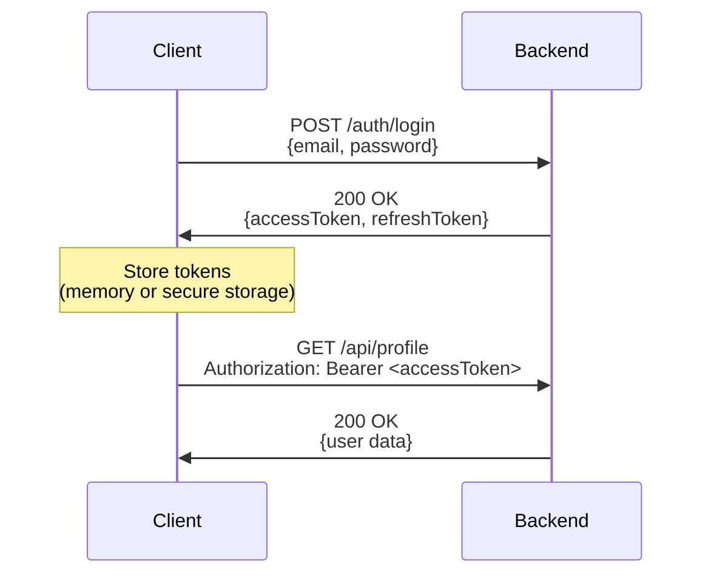
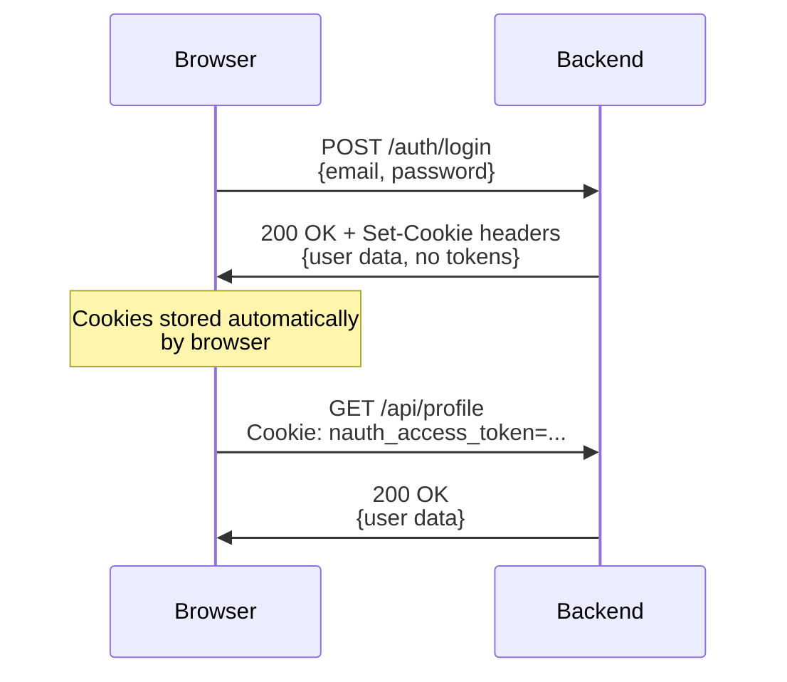
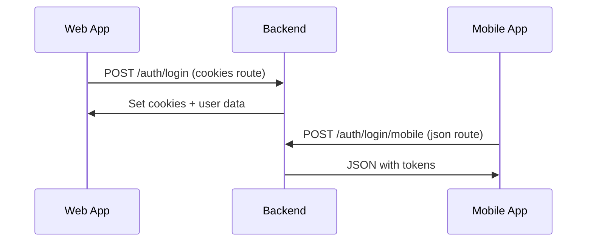
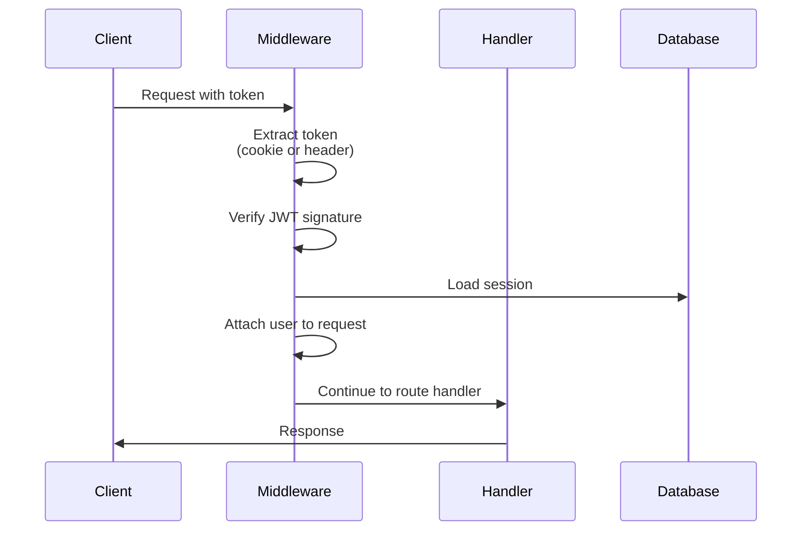
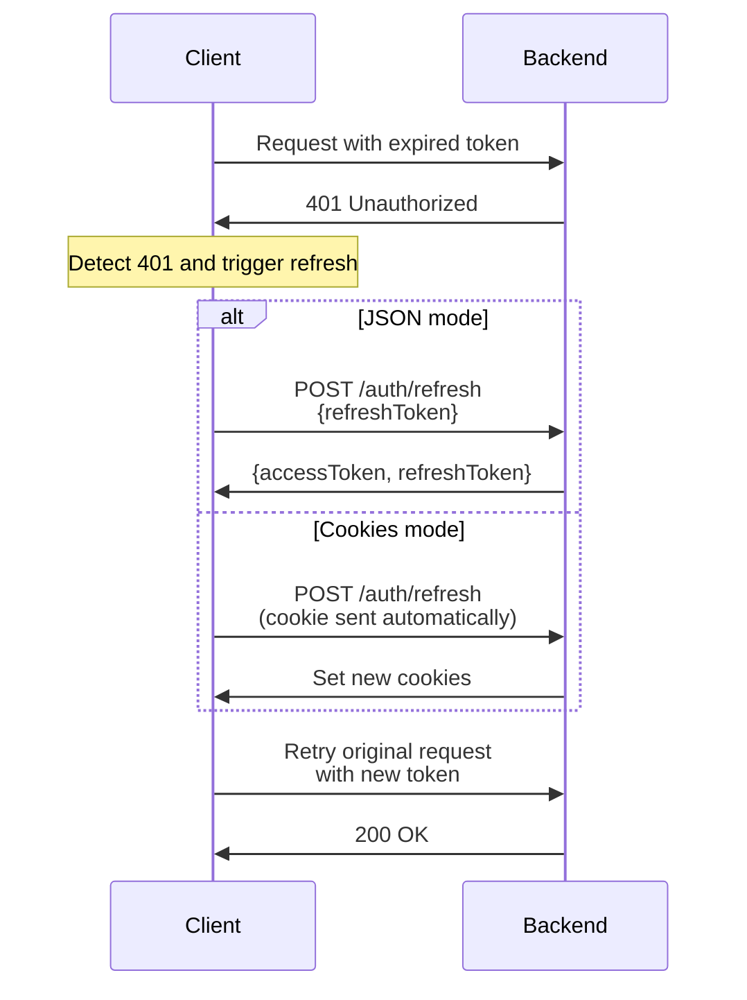
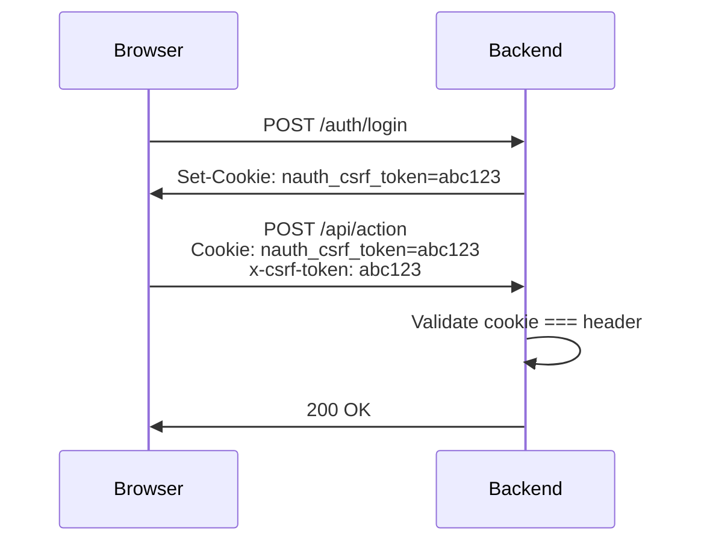

import Tabs from '@theme/Tabs';
import TabItem from '@theme/TabItem';

# Token Management

nauth-toolkit manages JWT tokens throughout the authentication lifecycle --- from initial login to token refresh to protected API calls. This page covers delivery modes, validation, refresh, CSRF protection, and JWT configuration.

## Token Delivery Modes

Your backend configuration determines how tokens travel between backend and frontend. Choose one mode per client type:

| Mode | Best For | Tokens In | Frontend Sends | CSRF Required |
|------|----------|-----------|----------------|---------------|
| `json` | Mobile apps, SPAs | Response body | `Authorization: Bearer` header | No |
| `cookies` | Web apps (most secure) | HTTP-only cookies | Automatic (cookies) | Yes |
| `hybrid` | Web + Mobile from same backend | Varies by route | Depends on endpoint | Yes (for cookie routes) |

:::tip Quick Recommendation
- **Web app only?** Use `cookies` (most secure for browsers)
- **Mobile app only?** Use `json` (standard Bearer tokens)
- **Both web and mobile?** Use `hybrid` (separate routes per client type)
:::

### JSON Mode (Bearer Tokens)

Tokens are returned in the response body. The frontend stores them and sends them in the `Authorization` header.



**Configuration:**

```typescript title="config/auth.config.ts"
{
  tokenDelivery: {
    method: 'json',
  },
}
```

**Response:**

```json
{
  "accessToken": "eyJhbGciOiJIUzI1NiIsInR5cCI6IkpXVCJ9...",
  "refreshToken": "eyJhbGciOiJIUzI1NiIsInR5cCI6IkpXVCJ9...",
  "accessTokenExpiresAt": 1735000000,
  "refreshTokenExpiresAt": 1735604800,
  "user": { "sub": "...", "email": "..." }
}
```

:::warning Security
For web apps, avoid storing tokens in `localStorage` --- they're vulnerable to XSS attacks. Use `cookies` mode instead, or store tokens in memory only.
:::

### Cookies Mode (HTTP-Only Cookies)

The most secure mode for web browsers. Tokens are set as HTTP-only cookies that JavaScript cannot access.



**Configuration:**

```typescript title="config/auth.config.ts"
{
  tokenDelivery: {
    method: 'cookies',
    cookieOptions: {
      secure: true,
      sameSite: 'strict',
      domain: 'yourdomain.com',
    },
  },
  security: {
    csrf: {
      cookieName: 'nauth_csrf_token',
      headerName: 'x-csrf-token',
    },
  },
}
```

**Response:**

```http
HTTP/1.1 200 OK
Set-Cookie: nauth_access_token=eyJ...; HttpOnly; Secure; SameSite=Strict; Path=/
Set-Cookie: nauth_refresh_token=eyJ...; HttpOnly; Secure; SameSite=Strict; Path=/
Set-Cookie: nauth_csrf_token=abc123; Secure; SameSite=Strict; Path=/

{
  "user": { "sub": "...", "email": "..." }
}
```

:::info
The response body does **not** contain tokens --- they're in the `Set-Cookie` headers. The frontend never sees the actual token values.
:::

### Hybrid Mode (Flexible Routing)

Hybrid mode lets one backend serve both web (cookies) and mobile (JSON) clients using separate routes.



**Configuration:**

```typescript title="config/auth.config.ts"
{
  tokenDelivery: {
    method: 'hybrid',
    cookieOptions: {
      secure: true,
      sameSite: 'strict',
    },
  },
  security: {
    csrf: {
      excludedPaths: ['/auth/*/mobile'],
    },
  },
}
```

:::tip Route Naming Convention
Use a clear pattern like `/auth/*` for cookie routes and `/auth/*/mobile` for JSON routes. This makes it obvious which client should call which endpoint.
:::

## Setting Up Per-Route Delivery

When using `hybrid` mode, each route must specify its delivery mode.

<Tabs groupId="platform">
<TabItem value="nestjs" label="NestJS">

```typescript title="src/auth/auth.controller.ts"
import { Controller, Post, Body } from '@nestjs/common';
import { Public, TokenDelivery } from '@nauth-toolkit/nestjs';
import { AuthService, LoginDTO, AuthResponseDTO } from '@nauth-toolkit/core';

@Controller('auth')
export class AuthController {
  constructor(private readonly authService: AuthService) {}

  @Public()
  @Post('login')
  @TokenDelivery('cookies')
  async loginWeb(@Body() dto: LoginDTO): Promise<AuthResponseDTO> {
    return await this.authService.login(dto);
  }

  @Public()
  @Post('login/mobile')
  @TokenDelivery('json')
  async loginMobile(@Body() dto: LoginDTO): Promise<AuthResponseDTO> {
    return await this.authService.login(dto);
  }
}
```

</TabItem>
<TabItem value="express" label="Express">

```typescript title="src/routes/auth.ts"
router.post(
  '/login',
  nauth.helpers.public(),
  nauth.helpers.tokenDelivery('cookies'),
  async (req, res, next) => {
    try {
      const dto = Object.assign(new LoginDTO(), req.body);
      const result = await nauth.authService.login(dto);
      res.json(result);
    } catch (error) {
      next(error);
    }
  },
);

router.post(
  '/login/mobile',
  nauth.helpers.public(),
  nauth.helpers.tokenDelivery('json'),
  async (req, res, next) => {
    try {
      const dto = Object.assign(new LoginDTO(), req.body);
      const result = await nauth.authService.login(dto);
      res.json(result);
    } catch (error) {
      next(error);
    }
  },
);
```

</TabItem>
<TabItem value="fastify" label="Fastify">

```typescript title="src/routes/auth.ts"
fastify.post(
  '/login',
  {
    preHandler: [
      nauth.helpers.public() as any,
      nauth.helpers.tokenDelivery('cookies') as any,
    ],
  },
  nauth.adapter.wrapRouteHandler(async (req) => {
    const dto = Object.assign(new LoginDTO(), req.body);
    return nauth.authService.login(dto);
  }),
);

fastify.post(
  '/login/mobile',
  {
    preHandler: [
      nauth.helpers.public() as any,
      nauth.helpers.tokenDelivery('json') as any,
    ],
  },
  nauth.adapter.wrapRouteHandler(async (req) => {
    const dto = Object.assign(new LoginDTO(), req.body);
    return nauth.authService.login(dto);
  }),
);
```

</TabItem>
</Tabs>

## Token Validation

When a client makes a request to a protected endpoint, nauth-toolkit automatically validates the access token.



**What happens automatically:**

1. Token extracted from the correct source (cookie or `Authorization` header)
2. JWT signature validated
3. Token expiration checked
4. Session loaded from storage
5. User object attached to request context

**Access the authenticated user:**

<Tabs groupId="platform">
<TabItem value="nestjs" label="NestJS">

```typescript
import { Controller, Get } from '@nestjs/common';
import { CurrentUser } from '@nauth-toolkit/nestjs';
import { IUser } from '@nauth-toolkit/core';

@Controller('profile')
export class ProfileController {
  @Get()
  getProfile(@CurrentUser() user: IUser) {
    return { user };
  }
}
```

</TabItem>
<TabItem value="express" label="Express">

```typescript
router.get('/profile', nauth.helpers.requireAuth(), (req, res) => {
  const user = nauth.helpers.getCurrentUser();
  res.json({ user });
});
```

</TabItem>
<TabItem value="fastify" label="Fastify">

```typescript
fastify.get(
  '/profile',
  { preHandler: nauth.helpers.requireAuth() as any },
  nauth.adapter.wrapRouteHandler(async () => {
    const user = nauth.helpers.getCurrentUser();
    return { user };
  }),
);
```

</TabItem>
</Tabs>

:::info
Routes are **not** protected by default. Use `requireAuth()` (Express/Fastify) or apply guards (NestJS) to enforce authentication.
:::

## Token Refresh

Access tokens have short lifetimes (typically 15 minutes). When they expire, use the refresh token to get new ones without re-login.



<details>
<summary>Refresh endpoint implementation (all frameworks and modes)</summary>

<Tabs groupId="platform">
<TabItem value="nestjs" label="NestJS">

**JSON mode:**

```typescript
@Public()
@Post('refresh')
async refresh(@Body() dto: RefreshTokenDTO): Promise<TokenResponse> {
  return await this.authService.refreshToken(dto);
}
```

**Cookies mode:**

```typescript
@Public()
@Post('refresh')
async refresh(@Req() req: any): Promise<TokenResponse> {
  const token = req?.cookies?.['nauth_refresh_token'];
  if (!token) {
    throw new UnauthorizedException('Refresh token missing');
  }

  const dto = new RefreshTokenDTO();
  dto.refreshToken = token;
  return await this.authService.refreshToken(dto);
}
```

**Hybrid mode:**

```typescript
@Public()
@Post('refresh')
@TokenDelivery('cookies')
async refreshWeb(@Req() req: any): Promise<TokenResponse> {
  const token = req?.cookies?.['nauth_refresh_token'];
  if (!token) {
    throw new UnauthorizedException('Refresh token missing');
  }
  const dto = new RefreshTokenDTO();
  dto.refreshToken = token;
  return await this.authService.refreshToken(dto);
}

@Public()
@Post('refresh/mobile')
@TokenDelivery('json')
async refreshMobile(@Body() dto: RefreshTokenDTO): Promise<TokenResponse> {
  return await this.authService.refreshToken(dto);
}
```

</TabItem>
<TabItem value="express" label="Express">

**JSON mode:**

```typescript
router.post('/refresh', nauth.helpers.public(), async (req, res, next) => {
  try {
    const dto = Object.assign(new RefreshTokenDTO(), req.body);
    const result = await nauth.authService.refreshToken(dto);
    res.json(result);
  } catch (error) {
    next(error);
  }
});
```

**Cookies mode:**

```typescript
router.post('/refresh', nauth.helpers.public(), async (req, res, next) => {
  try {
    const token = req.cookies?.['nauth_refresh_token'];
    if (!token) {
      return res.status(401).json({ error: 'Refresh token missing' });
    }
    const dto = new RefreshTokenDTO();
    dto.refreshToken = token;
    const result = await nauth.authService.refreshToken(dto);
    res.json(result);
  } catch (error) {
    next(error);
  }
});
```

</TabItem>
<TabItem value="fastify" label="Fastify">

**JSON mode:**

```typescript
fastify.post(
  '/refresh',
  { preHandler: nauth.helpers.public() as any },
  nauth.adapter.wrapRouteHandler(async (req) => {
    const dto = Object.assign(new RefreshTokenDTO(), req.body);
    return nauth.authService.refreshToken(dto);
  }),
);
```

**Cookies mode:**

```typescript
fastify.post(
  '/refresh',
  { preHandler: nauth.helpers.public() as any },
  nauth.adapter.wrapRouteHandler(async (req, reply) => {
    const token = req.cookies?.['nauth_refresh_token'];
    if (!token) {
      reply.code(401);
      throw new Error('Refresh token missing');
    }
    const dto = new RefreshTokenDTO();
    dto.refreshToken = token;
    return nauth.authService.refreshToken(dto);
  }),
);
```

</TabItem>
</Tabs>

</details>

:::tip Frontend SDK
If you're using `@nauth-toolkit/client`, token refresh is handled automatically. The SDK intercepts 401 responses, calls the refresh endpoint, and retries the original request.
:::

## Token Rotation

nauth-toolkit always issues a new refresh token on every use — the old token is immediately invalidated. This limits the damage if a refresh token is intercepted.

**Enable reuse detection** to catch stolen tokens:

```typescript title="config/auth.config.ts"
{
  jwt: {
    refreshToken: {
      secret: process.env.JWT_REFRESH_SECRET,
      expiresIn: '7d',
      reuseDetection: true,  // Revoke all sessions when reuse is detected
    },
  },
}
```

When `reuseDetection: true` is set and a previously-used refresh token is presented, nauth-toolkit:

1. Revokes **all active sessions** for that user (prevents the attacker from using other tokens)
2. Returns `AUTH_TOKEN_REUSE_DETECTED` — the user must log in again

:::tip When to Enable
Enable `reuseDetection` for security-sensitive applications. Without it, token theft may go undetected until the token expires naturally.
:::

## CSRF Protection

When using `cookies` or `hybrid` mode, CSRF protection is **mandatory**. nauth-toolkit uses the **double-submit cookie pattern**:

1. Server sets a CSRF token as a **readable** cookie (not httpOnly)
2. Frontend reads the cookie and sends the value in a custom header
3. Server validates that the cookie and header match



**Configuration:**

```typescript title="config/auth.config.ts"
{
  security: {
    csrf: {
      cookieName: 'nauth_csrf_token',
      headerName: 'x-csrf-token',
      excludedPaths: ['/webhooks/*'],
    },
  },
}
```

**Frontend implementation:**

```typescript
function getCsrfToken(): string {
  const cookies = document.cookie.split(';');
  const csrfCookie = cookies.find((c) => c.trim().startsWith('nauth_csrf_token='));
  return csrfCookie ? csrfCookie.split('=')[1] : '';
}

fetch('/api/protected', {
  method: 'POST',
  credentials: 'include',
  headers: {
    'Content-Type': 'application/json',
    'x-csrf-token': getCsrfToken(),
  },
  body: JSON.stringify({ ... }),
});
```

:::danger Never Disable CSRF
CSRF protection is **required** for cookie-based authentication. Without it, malicious sites can perform actions on behalf of your users by exploiting automatic cookie sending.
:::

## Guard Enforcement

nauth-toolkit enforces your chosen delivery method to prevent security bypasses:

| Mode | Bearer Token | Cookie Token |
|------|-------------|--------------|
| `json` | Accepted | Rejected (`COOKIES_NOT_ALLOWED`) |
| `cookies` | Rejected (`BEARER_NOT_ALLOWED`) | Accepted |
| `hybrid` | Accepted | Accepted (checks cookies first) |

If you configure `cookies` mode for security but a client sends a Bearer token from `localStorage`, the security benefit is lost. Enforcement ensures all clients use the intended method.

## JWT Algorithm

| Algorithm | Type | Key Requirement |
|-----------|------|-----------------|
| HS256 | Symmetric (HMAC) | Shared secret |
| HS384 | Symmetric (HMAC) | Shared secret |
| HS512 | Symmetric (HMAC) | Shared secret |
| RS256 | Asymmetric (RSA) | Public/private key pair |
| RS384 | Asymmetric (RSA) | Public/private key pair |
| RS512 | Asymmetric (RSA) | Public/private key pair |

<Tabs>
<TabItem value="symmetric" label="Symmetric (HS256)" default>

```typescript title="config/auth.config.ts"
{
  jwt: {
    algorithm: 'HS256',
    accessToken: {
      secret: process.env.JWT_SECRET,
      expiresIn: '15m',
    },
    refreshToken: {
      secret: process.env.JWT_REFRESH_SECRET,
      expiresIn: '7d',
    },
  },
}
```

</TabItem>
<TabItem value="asymmetric" label="Asymmetric (RS256)">

```typescript title="config/auth.config.ts"
{
  jwt: {
    algorithm: 'RS256',
    accessToken: {
      privateKey: process.env.JWT_PRIVATE_KEY,
      publicKey: process.env.JWT_PUBLIC_KEY,
      expiresIn: '15m',
    },
    refreshToken: {
      privateKey: process.env.JWT_REFRESH_PRIVATE_KEY,
      publicKey: process.env.JWT_REFRESH_PUBLIC_KEY,
      expiresIn: '7d',
    },
  },
}
```

</TabItem>
</Tabs>

:::danger Never Change Algorithm After Launch
Changing `jwt.algorithm` after users have active sessions will **break all existing tokens**. Plan your algorithm choice before going to production.
:::

## Cookie Configuration

Fine-tune cookie behavior for your deployment:

```typescript title="config/auth.config.ts"
{
  tokenDelivery: {
    method: 'cookies',
    cookieNamePrefix: 'nauth_',
    cookieOptions: {
      secure: true,
      sameSite: 'strict',
      domain: 'example.com',
      path: '/',
    },
  },
}
```

| Option | Type | Default | Description |
|---|---|---|---|
| `cookieNamePrefix` | `string` | `nauth_` | Prefix for all cookie names |
| `httpOnly` | — | Always `true` | Hardcoded — not configurable |
| `secure` | `boolean` | `true` | HTTPS only |
| `sameSite` | `string` | `strict` | `strict`, `lax`, or `none` |
| `domain` | `string` | --- | Share across subdomains |
| `path` | `string` | `/` | Cookie path |

**Generated cookie names** (with default prefix `nauth_`):

| Cookie | Purpose | HTTP-Only | Accessible to JS |
|--------|---------|-----------|------------------|
| `nauth_access_token` | Access token | Yes | No |
| `nauth_refresh_token` | Refresh token | Yes | No |
| `nauth_csrf_token` | CSRF token | No | Yes (required) |
| `nauth_device_id` | Trusted device token | Yes | No |

:::note Localhost Development
For local development, set `secure: false` because localhost uses HTTP:

```typescript
cookieOptions: {
  secure: process.env.NODE_ENV === 'production',
}
```

:::

## Remember Device

The "Remember Device" feature works with all delivery modes:

| Mode | Device Token Delivery | Frontend Action |
|------|----------------------|-----------------|
| `cookies` | Set as `nauth_device_id` httpOnly cookie | Automatic --- no action needed |
| `json` | Returned as `deviceToken` in response body | Store securely, send in `x-device-token` header |
| `hybrid` | Depends on route's delivery mode | Web: automatic. Mobile: manual storage |

See [MFA](/docs/guides/mfa/how-mfa-works#configuration) for trusted device configuration.

## Troubleshooting

<details>
<summary>"Token invalid" or "Token expired" errors</summary>

1. **Clock skew** --- Server and client clocks out of sync. Use NTP to synchronize server time
2. **Algorithm mismatch** --- Changed `jwt.algorithm` after tokens were issued. Clear all sessions or wait for natural expiration
3. **Wrong secret** --- Using different secrets between environments. Verify environment variables
</details>

<details>
<summary>CSRF token errors</summary>

1. **Missing header** --- Frontend not sending `x-csrf-token` header. Read cookie and include in request headers
2. **CORS issues** --- Credentials not being sent cross-origin. Ensure `credentials: 'include'` and proper CORS config
3. **Cookie domain mismatch** --- CSRF cookie not accessible. Check `tokenDelivery.cookieOptions.domain`
</details>

<details>
<summary>Refresh token not working</summary>

1. **Mode mismatch** --- Using JSON refresh endpoint with cookies mode. Implement correct endpoint for your mode
2. **Cookie not sent** --- Browser not sending refresh cookie. Ensure `credentials: 'include'` in refresh request
3. **Token already used** --- Refresh token rotation means each token is single-use. Always use the new token from the refresh response
</details>

## What's Next

- **[Configuration](/docs/concepts/configuration#token-delivery)** --- Full token delivery configuration reference
- **[Challenge System](/docs/concepts/challenge-system)** --- Understanding authentication flows
- **[Error Handling](/docs/concepts/error-handling)** --- Handling auth errors gracefully
- **[Basic Auth Flows](/docs/guides/basic-auth)** --- Implementation guide for login, refresh, and logout
