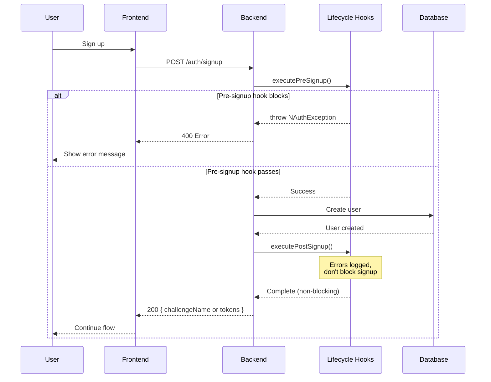

import Tabs from '@theme/Tabs';
import TabItem from '@theme/TabItem';

# Lifecycle Hooks

Inject custom logic at specific points in the authentication flow. Lifecycle hooks enable validation, notifications, integrations, and business logic without modifying core authentication code.

This guide assumes you already completed the [Quick Start](/docs/quick-start) and have `AuthModule.forRoot(authConfig)` working.

## What You Can Do with Hooks

- **Block signups** based on business rules (domain whitelisting, invite codes, rate limits)
- **Send notifications** (password changed alerts, security notifications, welcome emails)
- **Integrate external systems** (CRM sync, analytics tracking, billing setup, SIEM logging)
- **Audit events** (custom logging, compliance tracking, security monitoring)
- **Provision resources** (create workspace, assign default permissions)
- **Custom security workflows** (adaptive MFA alerts, suspicious activity notifications)

## How Hooks Work



## Available Hooks

### User Lifecycle Hooks

| Hook                                                                             | When                            | Can Block? | Use Cases                                                      |
| -------------------------------------------------------------------------------- | ------------------------------- | ---------- | -------------------------------------------------------------- |
| [**preSignup**](/docs/api/core/hooks/pre-signup-hook-provider)                  | Before user creation            | Yes        | Validation, domain whitelisting, invite codes                  |
| [**postSignup**](/docs/api/core/hooks/post-signup-hook-provider)                | After user creation             | No         | Welcome emails, analytics, CRM sync, resource provisioning     |
| [**userProfileUpdated**](/docs/api/core/hooks/user-profile-updated-hook)        | After profile attribute changes | No         | CRM sync, analytics tracking, audit logging                    |

### Security & Authentication Hooks

| Hook                                                                             | When                           | Can Block? | Use Cases                                                      |
| -------------------------------------------------------------------------------- | ------------------------------ | ---------- | -------------------------------------------------------------- |
| [**passwordChanged**](/docs/api/core/hooks/password-changed-hook)               | After password change          | No         | Security alerts, force logout notifications                    |
| [**mfaFirstEnabled**](/docs/api/core/hooks/mfa-first-enabled-hook)              | After first MFA device setup   | No         | Congratulations email, security confirmation                   |
| [**mfaDeviceRemoved**](/docs/api/core/hooks/mfa-device-removed-hook)            | After MFA device deletion      | No         | Security alerts, backup device reminders                       |
| [**adaptiveMfaRiskDetected**](/docs/api/core/hooks/adaptive-mfa-risk-detected-hook) | When high-risk signin detected | No    | Risk alert emails, admin notifications, SIEM logging           |

### Account Management Hooks

| Hook                                                                             | When                          | Can Block? | Use Cases                                                      |
| -------------------------------------------------------------------------------- | ----------------------------- | ---------- | -------------------------------------------------------------- |
| [**accountStatusChanged**](/docs/api/core/hooks/account-status-changed-hook)    | After account enable/disable  | No         | Account disabled notifications, re-enablement confirmations    |
| [**emailChanged**](/docs/api/core/hooks/email-changed-hook)                     | After email address change    | No         | Dual notification (old + new email), security alerts           |
| [**accountLocked**](/docs/api/core/hooks/account-locked-hook)                   | After account lockout         | No         | Lockout notifications, unlock instructions                     |
| [**sessionsRevoked**](/docs/api/core/hooks/sessions-revoked-hook)               | After sessions revoked        | No         | Security alerts, forced logout notifications                   |

## Hook Behavior

### Blocking vs Non-Blocking

- **Blocking Hooks** (`preSignup`): Can throw exceptions to prevent the operation
- **Non-Blocking Hooks** (all others): Errors are logged but don't affect the operation

### Execution Order

Hooks execute in **priority order** (lower values first). Multiple hooks with the same priority execute in registration order:

```typescript
// NestJS with decorators
@PasswordChangedHook({ priority: 1 }) // Executes first
export class EmailNotificationHook implements IPasswordChangedHook {}

@PasswordChangedHook({ priority: 2 }) // Executes second
export class AnalyticsHook implements IPasswordChangedHook {}

@PasswordChangedHook() // Default priority 100, executes last
export class CrmSyncHook implements IPasswordChangedHook {}

// Express/Fastify manual registration
hookRegistry.registerPasswordChanged(new EmailNotificationHook());
hookRegistry.registerPasswordChanged(new AnalyticsHook());
hookRegistry.registerPasswordChanged(new CrmSyncHook());
// Registration order determines execution order
```

### Error Handling

**Non-blocking hooks** catch and log errors automatically:

```typescript
// Hook throws error → Error logged → Next hook still executes
try {
  await hook.execute(metadata);
} catch (error) {
  logger.error('Hook failed:', error);
  // Continue with next hook
}
```

## Quick Start

### Step 1: Create Your Hook

<Tabs groupId="platform">
<TabItem value="nestjs" label="NestJS" default>

```typescript title="src/auth/hooks/password-changed-email.hook.ts"
import { Injectable } from '@nestjs/common';
import {
  PasswordChangedHook,
  IPasswordChangedHook,
  PasswordChangedMetadata,
} from '@nauth-toolkit/nestjs';

@Injectable()
@PasswordChangedHook({ priority: 1 })
export class PasswordChangedEmailHook implements IPasswordChangedHook {
  constructor(private readonly emailService: EmailService) {}

  async execute(metadata: PasswordChangedMetadata): Promise<void> {
    await this.emailService.sendPasswordChangedAlert({
      to: metadata.user.email,
      changedBy: metadata.changedBy,
      timestamp: new Date(),
      sessionsRevoked: metadata.sessionsRevoked,
    });
  }
}
```

</TabItem>
<TabItem value="express" label="Express">

```typescript title="src/hooks/password-changed-email.hook.ts"
import { IPasswordChangedHook } from '@nauth-toolkit/core';

export class PasswordChangedEmailHook implements IPasswordChangedHook {
  constructor(private emailService) {}

  async execute(metadata) {
    await this.emailService.sendPasswordChangedAlert({
      to: metadata.user.email,
      changedBy: metadata.changedBy,
      timestamp: new Date(),
      sessionsRevoked: metadata.sessionsRevoked,
    });
  }
}
```

</TabItem>
<TabItem value="fastify" label="Fastify">

```typescript title="src/hooks/password-changed-email.hook.ts"
import { IPasswordChangedHook } from '@nauth-toolkit/core';

export class PasswordChangedEmailHook implements IPasswordChangedHook {
  constructor(private emailService) {}

  async execute(metadata) {
    await this.emailService.sendPasswordChangedAlert({
      to: metadata.user.email,
      changedBy: metadata.changedBy,
      timestamp: new Date(),
      sessionsRevoked: metadata.sessionsRevoked,
    });
  }
}
```

</TabItem>
</Tabs>

### Step 2: Register Your Hook

<Tabs groupId="platform">
<TabItem value="nestjs" label="NestJS" default>

```typescript title="src/auth/auth.module.ts"
import { Module } from '@nestjs/common';
import { AuthModule, NAuthHooksModule } from '@nauth-toolkit/nestjs';
import { authConfig } from './auth.config';
import { PasswordChangedEmailHook } from './hooks/password-changed-email.hook';

@Module({
  imports: [
    AuthModule.forRoot(authConfig),
    NAuthHooksModule.forFeature([PasswordChangedEmailHook]),
  ],
})
export class CustomAuthModule {}
```

**That's it!** The hook is automatically discovered and registered.

</TabItem>
<TabItem value="express" label="Express">

```typescript title="src/index.ts"
import { NAuth } from '@nauth-toolkit/core';
import { PasswordChangedEmailHook } from './hooks/password-changed-email.hook';

const nauth = await NAuth.create(authConfig, dataSource);

// Register hook
nauth.hookRegistry.registerPasswordChanged(
  new PasswordChangedEmailHook(emailService)
);

app.use('/auth', nauth.routes);
```

</TabItem>
<TabItem value="fastify" label="Fastify">

```typescript title="src/index.ts"
import { NAuth } from '@nauth-toolkit/core';
import { PasswordChangedEmailHook } from './hooks/password-changed-email.hook';

const nauth = await NAuth.create(authConfig, dataSource);

// Register hook
nauth.hookRegistry.registerPasswordChanged(
  new PasswordChangedEmailHook(emailService)
);

fastify.register(nauth.routes, { prefix: '/auth' });
```

</TabItem>
</Tabs>

## Hook Details

Each hook has its own detailed guide with examples:

### User Lifecycle
- [Pre-Signup Hook](/docs/api/core/hooks/pre-signup-hook-provider) - Validate before user creation
- [Post-Signup Hook](/docs/api/core/hooks/post-signup-hook-provider) - Actions after user creation
- [User Profile Updated Hook](/docs/api/core/hooks/user-profile-updated-hook) - Track profile changes

### Security & Authentication
- [Password Changed Hook](/docs/api/core/hooks/password-changed-hook) - After password updates
- [MFA First Enabled Hook](/docs/api/core/hooks/mfa-first-enabled-hook) - After first MFA setup
- [MFA Device Removed Hook](/docs/api/core/hooks/mfa-device-removed-hook) - After MFA device deletion
- [Adaptive MFA Risk Detected Hook](/docs/api/core/hooks/adaptive-mfa-risk-detected-hook) - High-risk signin detection

### Account Management
- [Account Status Changed Hook](/docs/api/core/hooks/account-status-changed-hook) - Enable/disable events
- [Email Changed Hook](/docs/api/core/hooks/email-changed-hook) - Email update notifications
- [Account Locked Hook](/docs/api/core/hooks/account-locked-hook) - Lockout notifications
- [Sessions Revoked Hook](/docs/api/core/hooks/sessions-revoked-hook) - Bulk session termination

## Best Practices

### Keep Hooks Focused

Each hook should have a single responsibility:

```typescript
// Good - Single responsibility
@PasswordChangedHook()
export class PasswordChangedEmailHook {}

@PasswordChangedHook()
export class PasswordChangedAnalyticsHook {}

// Bad - Multiple responsibilities
@PasswordChangedHook()
export class PasswordChangedHook {
  // Sends email
  // Logs to analytics
  // Syncs to CRM
  // Too many responsibilities!
}
```

### Handle Errors Gracefully

Non-blocking hooks should handle errors explicitly:

```typescript
async execute(metadata) {
  try {
    await this.emailService.send(metadata.user.email);
  } catch (error) {
    this.logger.error('Email failed:', error);
    // Optional: Queue for retry
    await this.queueService.add('retry-email', { userId: metadata.user.id });
  }
}
```

### Use Dependency Injection

Leverage framework DI for testability:

```typescript
@Injectable()
@PasswordChangedHook({ priority: 1 })
export class PasswordChangedEmailHook implements IPasswordChangedHook {
  constructor(
    private readonly emailService: EmailService,
    private readonly logger: Logger,
  ) {}
}
```

### Test Your Hooks

Hooks are regular classes and can be unit tested:

```typescript
describe('PasswordChangedEmailHook', () => {
  let hook: PasswordChangedEmailHook;
  let mockEmailService: jest.Mocked<EmailService>;

  beforeEach(() => {
    mockEmailService = { send: jest.fn() } as any;
    hook = new PasswordChangedEmailHook(mockEmailService);
  });

  it('should send email on password change', async () => {
    const metadata = {
      user: { email: 'user@example.com' },
      changedBy: 'user',
    };

    await hook.execute(metadata);

    expect(mockEmailService.send).toHaveBeenCalledWith(
      expect.objectContaining({ to: 'user@example.com' })
    );
  });
});
```

## API Reference

Complete reference for all hook-related classes and interfaces:

### Interfaces

| Interface                        | Description                            | Documentation                                                                            |
| -------------------------------- | -------------------------------------- | ---------------------------------------------------------------------------------------- |
| `IAccountLockedHook`             | Account locked hook interface          | [IAccountLockedHook](/docs/api/core/hooks/account-locked-hook)                           |
| `IAccountStatusChangedHook`      | Account status changed hook interface  | [IAccountStatusChangedHook](/docs/api/core/hooks/account-status-changed-hook)            |
| `IAdaptiveMFARiskDetectedHook`   | Adaptive MFA risk detected hook        | [IAdaptiveMFARiskDetectedHook](/docs/api/core/hooks/adaptive-mfa-risk-detected-hook)     |
| `IEmailChangedHook`              | Email changed hook interface           | [IEmailChangedHook](/docs/api/core/hooks/email-changed-hook)                             |
| `IMFADeviceRemovedHook`          | MFA device removed hook interface      | [IMFADeviceRemovedHook](/docs/api/core/hooks/mfa-device-removed-hook)                    |
| `IMFAFirstEnabledHook`           | MFA first enabled hook interface       | [IMFAFirstEnabledHook](/docs/api/core/hooks/mfa-first-enabled-hook)                      |
| `IPasswordChangedHook`           | Password changed hook interface        | [IPasswordChangedHook](/docs/api/core/hooks/password-changed-hook)                       |
| `IPostSignupHookProvider`        | Post-signup hook interface             | [IPostSignupHookProvider](/docs/api/core/hooks/post-signup-hook-provider)                |
| `IPreSignupHookProvider`         | Pre-signup hook interface              | [IPreSignupHookProvider](/docs/api/core/hooks/pre-signup-hook-provider)                  |
| `ISessionsRevokedHook`           | Sessions revoked hook interface        | [ISessionsRevokedHook](/docs/api/core/hooks/sessions-revoked-hook)                       |
| `IUserProfileUpdatedHook`        | User profile updated hook interface    | [IUserProfileUpdatedHook](/docs/api/core/hooks/user-profile-updated-hook)                |

### Services

| Service               | Description               | Documentation                                                        |
| --------------------- | ------------------------- | -------------------------------------------------------------------- |
| `HookRegistryService` | Hook registration service | [HookRegistryService](/docs/api/core/services/hook-registry-service) |

### NestJS Decorators

| Decorator                        | Description                            | Documentation                                                                                   |
| -------------------------------- | -------------------------------------- | ----------------------------------------------------------------------------------------------- |
| `@AccountLockedHook()`           | Account locked hook decorator          | [@AccountLockedHook()](/docs/api/nestjs/decorators/account-locked-hook)                         |
| `@AccountStatusChangedHook()`    | Account status changed hook decorator  | [@AccountStatusChangedHook()](/docs/api/nestjs/decorators/account-status-changed-hook)          |
| `@AdaptiveMFARiskDetectedHook()` | Adaptive MFA risk detected hook        | [@AdaptiveMFARiskDetectedHook()](/docs/api/nestjs/decorators/adaptive-mfa-risk-detected-hook)   |
| `@EmailChangedHook()`            | Email changed hook decorator           | [@EmailChangedHook()](/docs/api/nestjs/decorators/email-changed-hook)                           |
| `@MFADeviceRemovedHook()`        | MFA device removed hook decorator      | [@MFADeviceRemovedHook()](/docs/api/nestjs/decorators/mfa-device-removed-hook)                  |
| `@MFAFirstEnabledHook()`         | MFA first enabled hook decorator       | [@MFAFirstEnabledHook()](/docs/api/nestjs/decorators/mfa-first-enabled-hook)                    |
| `@PasswordChangedHook()`         | Password changed hook decorator        | [@PasswordChangedHook()](/docs/api/nestjs/decorators/password-changed-hook)                     |
| `@PostSignupHook()`              | Post-signup hook decorator             | [@PostSignupHook()](/docs/api/nestjs/decorators/post-signup-hook)                               |
| `@PreSignupHook()`               | Pre-signup hook decorator              | [@PreSignupHook()](/docs/api/nestjs/decorators/pre-signup-hook)                                 |
| `@SessionsRevokedHook()`         | Sessions revoked hook decorator        | [@SessionsRevokedHook()](/docs/api/nestjs/decorators/sessions-revoked-hook)                     |
| `@UserProfileUpdatedHook()`      | User profile updated hook decorator    | [@UserProfileUpdatedHook()](/docs/api/nestjs/decorators/user-profile-updated-hook)              |
| `NAuthHooksModule`               | Hook registration module               | [NAuthHooksModule](/docs/api/nestjs/decorators/nauth-hooks-module)                              |

## Related

- [Challenge System](/docs/concepts/challenge-system) - Understanding authentication flows
- [Error Handling](/docs/concepts/error-handling) - Exception handling patterns
- [Authentication Routes](/docs/features/routes) - Complete route implementation
- [Email Templates](/docs/features/email-templates) - Built-in email system
