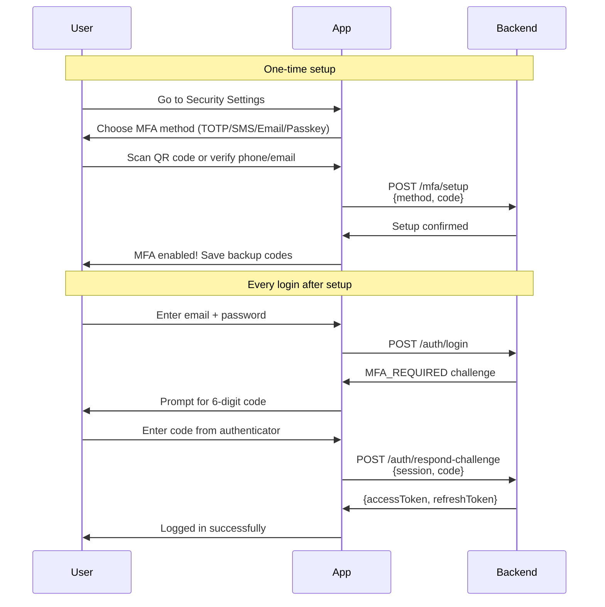
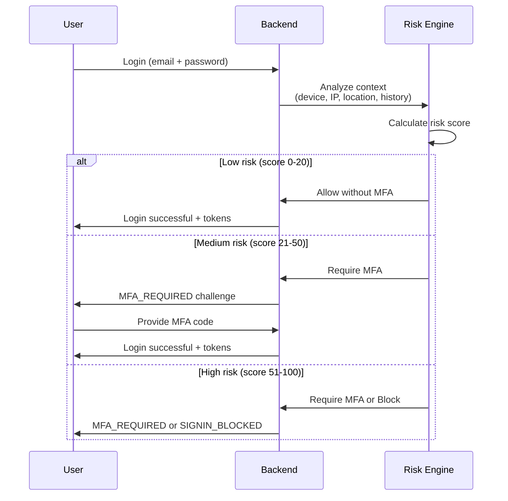

import Tabs from '@theme/Tabs';
import TabItem from '@theme/TabItem';

# Multi-Factor Authentication (MFA)

Add a second layer of security beyond passwords. After users authenticate with their credentials, they verify their identity using a second factor—a time-based code, SMS verification, email code, or biometric authentication.

## Supported methods

| Method | User Experience | Security Level | Best For |
|--------|----------------|----------------|----------|
| **TOTP** | Authenticator app generates 6-digit codes | High | Most users (offline, no SMS cost) |
| **SMS** | Text message with verification code | Medium | Users without smartphones apps |
| **Email** | Email with verification code | Medium | Backup option, onboarding |
| **Passkey** | Biometric (Face ID, Touch ID, YubiKey) | Very High | Modern devices, passwordless future |
| **Backup Codes** | One-time recovery codes | N/A | Account recovery only |

:::info Email MFA Now Available
Email-based MFA codes are now supported alongside TOTP, SMS, and Passkey methods.
:::

:::warning Backup Codes - Experimental
Backup codes are currently **experimental**. Do not rely on them in production until a future stable release. The API may change.
:::

## Why use MFA?

**Security benefits:**

- Protects against password theft and credential stuffing
- Required for compliance (PCI-DSS, SOC 2, HIPAA, GDPR)
- Prevents account takeover even with compromised passwords
- Detects and blocks unauthorized access attempts

**User benefits:**

- Peace of mind for sensitive data access
- Control over trusted devices
- Recovery options if device is lost

## How MFA works

### User experience flow



### Setup flow (one-time per method)

1. User navigates to security settings
2. User selects "Enable Authenticator App" (or SMS/Email/Passkey)
3. For TOTP: scan QR code with Google Authenticator (or similar)
4. For SMS/Email: verify phone number or email address
5. For Passkey: authenticate with Face ID/Touch ID
6. User enters test code to confirm setup
7. System displays backup codes (save these!)
8. MFA is now active for that user

### Login flow (with MFA enabled)

1. User enters credentials
2. Backend returns challenge: `{ challengeName: 'MFA_REQUIRED', session: '...', availableMethods: ['totp', 'sms'] }`
3. Frontend prompts for code from preferred method
4. User enters 6-digit code (or uses biometric for passkey)
5. Frontend sends: `{ session, challengeType: 'MFA_REQUIRED', code: '123456' }`
6. Backend validates and returns JWT tokens
7. User is logged in

## Configuration

Set MFA options in your backend configuration:

```typescript
import { MFAMethod } from '@nauth-toolkit/core';

const config = {
  mfa: {
    enabled: true,
    issuer: 'YourAppName', // Shown in authenticator apps
    enforcement: 'OPTIONAL', // 'OPTIONAL' | 'REQUIRED' | 'ADAPTIVE'

    // Which methods users can choose
    allowedMethods: [
      MFAMethod.TOTP,
      MFAMethod.SMS,
      MFAMethod.EMAIL,
      MFAMethod.PASSKEY,
    ],

    // Grace period before enforcement (for 'REQUIRED' mode)
    gracePeriod: 7, // days

    // Skip MFA for social login (Google, Apple, etc.)
    requireForSocialLogin: false,

    // Device trust settings
    rememberDevices: 'user_opt_in', // 'always' | 'user_opt_in' | 'never'
    rememberDeviceDays: 30,
    bypassMFAForTrustedDevices: true,

    // TOTP settings
    totp: {
      window: 1, // Allow ±1 time step for clock skew
      stepSeconds: 30,
      digits: 6,
      algorithm: 'sha1', // 'sha1' | 'sha256' | 'sha512'
    },

    // SMS settings
    sms: {
      codeLength: 6,
      expiresIn: 300, // 5 minutes
    },

    // Email settings
    email: {
      codeLength: 6,
      expiresIn: 600, // 10 minutes
    },

    // Passkey (WebAuthn) settings
    passkey: {
      rpName: 'YourAppName',
      rpId: 'yourdomain.com',
      origin: ['https://yourdomain.com'],
      timeout: 60000,
      userVerification: 'preferred', // 'required' | 'preferred' | 'discouraged'
      authenticatorAttachment: 'platform', // 'platform' | 'cross-platform'
    },

    // Backup codes (EXPERIMENTAL - do not use in production)
    backup: {
      enabled: false, // Keep false until stable release
      codeCount: 10,
      codeLength: 8,
    },

    // Adaptive MFA (risk-based)
    adaptive: {
      // See Adaptive MFA section below
    },
  },
};
```

## Enforcement modes

Choose when MFA is required:

<Tabs>
<TabItem value="optional" label="Optional (Default)" default>

Users can enable MFA if they want, but it's never required.

```typescript
{
  mfa: {
    enforcement: 'OPTIONAL',
  }
}
```

**Best for:** Consumer apps, low-security use cases

**Behavior:**
- New users: MFA setup is completely optional
- Existing users: Can enable MFA in security settings
- Login: MFA only checked if user has enrolled

</TabItem>
<TabItem value="required" label="Required">

All users must set up MFA. Enforced after a grace period.

```typescript
{
  mfa: {
    enforcement: 'REQUIRED',
    gracePeriod: 7, // Users have 7 days to set up
  }
}
```

**Best for:** Enterprise apps, high-security use cases

**Behavior:**
- New users: Must set up MFA after signup (after email/phone verification)
- Grace period: Users can login without MFA for N days
- After grace period: Login blocked until MFA is set up
- Trusted devices: Can bypass MFA if `bypassMFAForTrustedDevices: true`

</TabItem>
<TabItem value="adaptive" label="Adaptive (Risk-Based)">

MFA is required only when login appears risky (new device, new location, impossible travel, etc.).

```typescript
{
  mfa: {
    enforcement: 'ADAPTIVE',
    adaptive: {
      triggers: ['new_device', 'new_country', 'impossible_travel'],
      // See Adaptive MFA section for full configuration
    },
  }
}
```

**Best for:** Modern enterprise apps, optimal security/UX balance

**Behavior:**
- Low-risk logins: No MFA required (e.g., same device, same location)
- Medium-risk logins: MFA required (e.g., new device)
- High-risk logins: MFA required or sign-in blocked

:::tip Recommended
Adaptive MFA provides enterprise-grade security without annoying users on every login.
:::

</TabItem>
</Tabs>

## Method-specific guides

### TOTP (Authenticator apps)

The most popular MFA method. Works offline and is supported by all major authenticator apps.

**Supported apps:**
- Google Authenticator
- Microsoft Authenticator
- Authy
- 1Password
- Duo Mobile

**Setup API flow:**

```typescript
// Step 1: Initiate TOTP setup
const setupData = await mfaService.setup({
  sub: user.sub,
  methodName: MFAMethod.TOTP,
});

// Returns:
// {
//   secret: 'JBSWY3DPEHPK3PXP',
//   qrCode: 'data:image/png;base64,...',
//   manualEntryKey: 'JBSW Y3DP EHPK 3PXP',
//   issuer: 'YourApp',
//   accountName: 'user@example.com'
// }

// Step 2: Display QR code to user

// Step 3: User scans and enters test code
const verified = await mfaService.verifySetup({
  sub: user.sub,
  methodName: MFAMethod.TOTP,
  code: '123456',
});

// Step 4: Generate backup codes
const backupCodes = await mfaService.generateBackupCodes(user);
// Display these to user ONCE - they cannot be retrieved later
```

**Technical details:**

- Algorithm: HMAC-SHA1 (standard), SHA256/SHA512 (configurable)
- Time step: 30 seconds
- Code length: 6 digits
- Window: ±1 step (tolerates 30s clock skew)

**QR code format:**

```
otpauth://totp/YourApp:user@example.com?secret=JBSWY3DPEHPK3PXP&issuer=YourApp&algorithm=SHA1&digits=6&period=30
```

### SMS verification

Send verification codes via text message.

**Prerequisites:**
- Configure SMS provider (AWS SNS, Twilio, or custom)
- User must have verified phone number

**Configuration:**

```typescript
import { AWSSMSProvider } from '@nauth-toolkit/sms-aws-sns';

const config = {
  sms: {
    provider: new AWSSMSProvider({
      region: 'us-east-1',
      accessKeyId: process.env.AWS_ACCESS_KEY_ID,
      secretAccessKey: process.env.AWS_SECRET_ACCESS_KEY,
    }),
  },
  mfa: {
    sms: {
      codeLength: 6,
      expiresIn: 300, // 5 minutes
    },
  },
};
```

**Setup API flow:**

```typescript
// Step 1: Setup SMS MFA (requires verified phone)
const setupData = await mfaService.setup({
  sub: user.sub,
  methodName: MFAMethod.SMS,
});
// SMS code is sent automatically to user's phone

// Step 2: User enters code from SMS
const verified = await mfaService.verifySetup({
  sub: user.sub,
  methodName: MFAMethod.SMS,
  code: '123456',
});
```

:::warning SMS Security
SMS is vulnerable to SIM swapping attacks. Use SMS as a backup option, not the primary MFA method. TOTP and Passkey are more secure.
:::

### Email verification

Send verification codes via email.

**Prerequisites:**
- Configure email provider (Nodemailer, AWS SES, or custom)
- User must have verified email address

**Configuration:**

```typescript
import { NodemailerEmailProvider } from '@nauth-toolkit/email-nodemailer';

const config = {
  email: {
    provider: new NodemailerEmailProvider({
      host: 'smtp.gmail.com',
      port: 587,
      secure: false,
      auth: {
        user: process.env.EMAIL_USER,
        pass: process.env.EMAIL_PASSWORD,
      },
      from: 'noreply@yourapp.com',
    }),
  },
  mfa: {
    email: {
      codeLength: 6,
      expiresIn: 600, // 10 minutes
    },
  },
};
```

**Setup API flow:**

```typescript
// Step 1: Setup Email MFA
const setupData = await mfaService.setup({
  sub: user.sub,
  methodName: MFAMethod.EMAIL,
});
// Email with code is sent automatically

// Step 2: User enters code from email
const verified = await mfaService.verifySetup({
  sub: user.sub,
  methodName: MFAMethod.EMAIL,
  code: '123456',
});
```

**Email template customization:**

See [Email Templates](/docs/features/email-templates) for customizing the MFA code email.

### Passkey (WebAuthn)

Modern biometric authentication using Face ID, Touch ID, Windows Hello, or hardware security keys.

**Configuration:**

```typescript
{
  mfa: {
    passkey: {
      rpName: 'My Application',        // Name shown in browser prompt
      rpId: 'yourdomain.com',          // Domain (must match origin)
      origin: ['https://yourdomain.com'], // Allowed origins
      timeout: 60000,                  // 60 seconds
      userVerification: 'preferred',   // 'required' | 'preferred' | 'discouraged'
      authenticatorAttachment: 'platform', // 'platform' (built-in) | 'cross-platform' (external)
    },
  }
}
```

**Setup API flow:**

```typescript
// Step 1: Get WebAuthn registration options
const setupData = await mfaService.setup({
  sub: user.sub,
  methodName: MFAMethod.PASSKEY,
});

// Returns WebAuthn PublicKeyCredentialCreationOptions

// Step 2: Frontend calls navigator.credentials.create()
const credential = await navigator.credentials.create({
  publicKey: setupData,
});

// Step 3: Verify registration
const verified = await mfaService.verifySetup({
  sub: user.sub,
  methodName: MFAMethod.PASSKEY,
  code: credential, // Full credential object
});
```

**Cross-device authentication:**

Users can authenticate on desktop using a passkey stored on their phone via QR codes. This is handled automatically by the browser (FIDO2/WebAuthn standard).

**Advantages:**

- Phishing-resistant (cryptographically bound to domain)
- No shared secrets (public key cryptography)
- Works offline
- Platform-integrated (biometric prompt)

## Adaptive MFA (Risk-based authentication)

Automatically require MFA for risky logins while allowing trusted scenarios to skip it. Uses enterprise-grade risk scoring with configurable triggers and actions.

### How it works



### Risk factors and scoring

Each risk factor contributes points to the overall risk score (0-100):

| Risk Factor | Default Points | Description |
|-------------|----------------|-------------|
| `new_device` | 25 | First login from unknown device fingerprint |
| `new_ip` | 15 | Login from new IP address (only if country unchanged) |
| `new_country` | 25 | Login from different country than usual |
| `impossible_travel` | 40 | Physically impossible travel (e.g., Tokyo to NYC in 1 hour) |
| `suspicious_activity` | 30 | Recent failed logins or security events |
| `recent_password_reset` | 40 | Password changed after last successful login |
| `incomplete_location_data` | 20 | Missing city/coordinates (reduces confidence) |

:::info Smart Deduplication
The system automatically excludes `new_ip` when `new_country` or `impossible_travel` is detected to prevent double-counting (IP is the source of location data).
:::

### Configuration

<Tabs>
<TabItem value="basic" label="Basic (Recommended)" default>

Use default weights and thresholds:

```typescript
{
  mfa: {
    enforcement: 'ADAPTIVE',
    adaptive: {
      triggers: [
        'new_device',
        'new_country',
        'impossible_travel',
        'recent_password_reset',
      ],
    },
  }
}
```

**Default behavior:**
- 0-20 points: Allow without MFA
- 21-50 points: Require MFA
- 51-100 points: Require MFA

</TabItem>
<TabItem value="custom" label="Custom Weights">

Adjust risk scoring to your security needs:

```typescript
{
  mfa: {
    enforcement: 'ADAPTIVE',
    adaptive: {
      triggers: [
        'new_device',
        'new_ip',
        'new_country',
        'impossible_travel',
        'suspicious_activity',
        'recent_password_reset',
      ],

      // Custom risk weights
      riskWeights: {
        new_device: 30,           // Increase from 25
        impossible_travel: 100,   // Automatic block on impossible travel
        new_country: 20,          // Decrease from 25
      },

      // Custom risk level thresholds
      riskLevels: {
        low: {
          maxScore: 20,
          action: 'allow',
          notifyUser: false,
        },
        medium: {
          maxScore: 50,
          action: 'require_mfa',
          notifyUser: true, // Send email notification
        },
        high: {
          maxScore: 100,
          action: 'block_signin', // Block instead of just requiring MFA
          notifyUser: true,
        },
      },

      // Impossible travel settings
      maxTravelSpeed: 900, // km/h (commercial airliner)
      countryChangeThreshold: 2, // min hours between country changes
      suspiciousActivityWindow: 1, // hours to check for failed logins
    },
  }
}
```

</TabItem>
<TabItem value="high-security" label="High Security">

Block high-risk logins and notify security team:

```typescript
{
  mfa: {
    enforcement: 'ADAPTIVE',
    adaptive: {
      triggers: [
        'new_device',
        'new_ip',
        'new_country',
        'impossible_travel',
        'suspicious_activity',
        'recent_password_reset',
      ],

      riskLevels: {
        low: { maxScore: 15, action: 'allow', notifyUser: false },
        medium: { maxScore: 40, action: 'require_mfa', notifyUser: true },
        high: { maxScore: 100, action: 'block_signin', notifyUser: true },
      },

      // Block configuration
      blockedSignIn: {
        blockDuration: 60, // minutes
        message: 'Sign-in blocked due to suspicious activity. Please contact support.',
        errorCode: 'SIGNIN_BLOCKED_HIGH_RISK',
      },
    },
  },

  // Hook into block events
  hooks: {
    onSignInBlocked: async (payload) => {
      await notifySecurityTeam({
        user: payload.user,
        riskScore: payload.riskScore,
        factors: payload.detectedFactors,
        timestamp: new Date(),
      });
    },
  },
}
```

</TabItem>
</Tabs>

### Risk level actions

| Action | Behavior | When to Use |
|--------|----------|-------------|
| `allow` | Proceed without MFA | Low-risk scenarios (trusted device + location) |
| `require_mfa` | Request MFA challenge | Medium/high risk scenarios |
| `block_signin` | Reject login attempt | Very high risk (likely compromise) |

### Geolocation requirement

Adaptive MFA with `impossible_travel` or `new_country` triggers requires geolocation data:

```typescript
{
  geoLocation: {
    maxMind: {
      licenseKey: process.env.MAXMIND_LICENSE_KEY,
      accountId: parseInt(process.env.MAXMIND_ACCOUNT_ID || '0'),
      // Database files downloaded automatically on startup
    },
  }
}
```

See [Geolocation](/docs/features/geolocation) for setup details.

### Example scenarios

1. **Trusted device, same location** → Risk: 0 → Allow
2. **New phone, same city** → Risk: 25 (new_device) → Require MFA
3. **Same device, new country** → Risk: 25 (new_country) → Require MFA
4. **New device + new country** → Risk: 50 → Require MFA
5. **Tokyo → NYC in 1 hour** → Risk: 40+ (impossible_travel) → Require MFA or Block

### Monitoring and webhooks

React to adaptive MFA decisions:

```typescript
{
  hooks: {
    onAdaptiveMFATriggered: async (payload) => {
      const { user, riskScore, riskLevel, detectedFactors } = payload;

      // Log to security monitoring
      logger.warn('Adaptive MFA triggered', {
        userId: user.sub,
        score: riskScore,
        level: riskLevel,
        factors: detectedFactors,
      });

      // Send notification for high-risk logins
      if (riskLevel === 'high') {
        await sendSecurityAlert(user.email, {
          message: 'Unusual login detected from new location',
          factors: detectedFactors,
          time: new Date(),
        });
      }
    },

    onSignInBlocked: async (payload) => {
      // Critical: sign-in was blocked
      await notifySecurityTeam(payload);
    },
  }
}
```

## Remember device (Trusted devices)

Allow users to mark devices as trusted so MFA can be skipped on subsequent logins from those devices.

### Configuration

```typescript
{
  mfa: {
    // How devices become trusted
    rememberDevices: 'user_opt_in', // 'always' | 'user_opt_in' | 'never'

    // How long trusted devices remain valid
    rememberDeviceDays: 30,

    // Whether trusted devices can skip MFA (ignored for ADAPTIVE)
    bypassMFAForTrustedDevices: true,
  }
}
```

### Behavior by enforcement mode

<Tabs>
<TabItem value="optional-remember" label="Optional">

- MFA setup: Completely optional
- After MFA enabled: Required on every login **unless** device is trusted and `bypassMFAForTrustedDevices: true`

</TabItem>
<TabItem value="required-remember" label="Required">

- MFA setup: Required for all users
- Login: MFA required on every login **unless** device is trusted and `bypassMFAForTrustedDevices: true`
- Trusted devices: Significantly improve UX for known devices

</TabItem>
<TabItem value="adaptive-remember" label="Adaptive">

- Trusted devices feed into risk engine
- `bypassMFAForTrustedDevices` **does not** short-circuit adaptive decisions
- Reduces `new_device` risk factor
- MFA may still be required on trusted devices if other risk factors are present

:::info
In ADAPTIVE mode, trusted devices reduce risk scores but don't guarantee MFA bypass. The system still evaluates location, travel patterns, and suspicious activity.
:::

</TabItem>
</Tabs>

### API for trusting devices

```typescript
// Trust current device after successful MFA
const result = await authService.trustDevice({
  sub: user.sub,
  expiresInDays: 30, // Optional override
});

// Returns: { deviceToken: '...', expiresAt: 1735000000 }
// Frontend stores this token (cookie or secure storage)

// Check if current device is trusted
const trusted = await authService.isTrustedDevice();
// Returns: { trusted: true }
```

### Security details

- Device tokens: Cryptographically strong UUIDs
- Web: Stored as HTTP-only cookies (`nauth_device_id`)
- Mobile: Returned in response, app stores in secure storage
- Automatic expiration after configured period
- User can revoke from security settings

## Managing MFA devices

Users should be able to view and manage their enrolled MFA methods.

### API methods

```typescript
// List all enrolled MFA devices
const devices = await mfaService.getUserMfaDevices(user.sub);

// Returns array:
// [
//   {
//     id: 1,
//     methodName: 'totp',
//     deviceName: 'Google Authenticator',
//     isPreferred: true,
//     verified: true,
//     lastUsedAt: '2024-01-15T10:30:00Z',
//     createdAt: '2024-01-01T09:00:00Z',
//   },
//   {
//     id: 2,
//     methodName: 'sms',
//     deviceName: '+1***-***-5678',
//     isPreferred: false,
//     verified: true,
//     lastUsedAt: '2024-01-10T14:20:00Z',
//     createdAt: '2024-01-05T11:00:00Z',
//   }
// ]

// Remove a device
await mfaService.removeMfaDevice(user.sub, deviceId);

// Set primary/preferred device (used first during login)
await mfaService.setPreferredMethod({
  sub: user.sub,
  deviceId: deviceId,
});

// Regenerate backup codes (invalidates old codes)
const newBackupCodes = await mfaService.regenerateBackupCodes(user);
// Display these to user - cannot be retrieved later
```

### UI recommendations

Show users:

- Device name (e.g., "iPhone 14", "Google Authenticator", "+1***5678")
- Type icon (authenticator, phone, email, key)
- Primary indicator (star or badge)
- Last used date
- Created date
- Remove button (with confirmation)

## Profile changes and MFA impact

When users update their email or phone number, associated MFA devices are **automatically deleted permanently** for security.

| Profile Change | MFA Impact | User Action Required |
|----------------|------------|---------------------|
| Email updated | All Email MFA devices deleted | Re-setup Email MFA with new address |
| Phone updated | All SMS MFA devices deleted | Re-setup SMS MFA with new number |

:::danger Automatic Deletion
MFA devices are **permanently deleted** (not deactivated) because they cannot be reactivated with old contact information. If the deleted device(s) were the only MFA method(s) configured, **MFA is automatically disabled** for the user's account.
:::

### Implementation guidance

```typescript
// When user updates profile
const updatedUser = await authService.updateUserAttributes({
  sub: user.sub,
  email: 'newemail@example.com',
});

// Check if MFA was affected
if (updatedUser.email !== oldEmail && userHadEmailMfa) {
  // Notify user about MFA device removal
  await sendNotification(user, {
    type: 'warning',
    title: 'Email MFA Removed',
    message: 'Your Email MFA device has been permanently removed due to email change. Please set up Email MFA again in your security settings.',
  });

  // Optional: Send email to both old and new addresses
  await sendSecurityEmail(oldEmail, 'Email MFA removed after email change');
  await sendSecurityEmail(newEmail, 'Welcome! Set up MFA on your new email');
}
```

### Best practices

1. **Notify immediately** when MFA devices are removed
2. **Guide to security settings** to re-setup MFA
3. **Send notifications** to both old and new contact methods
4. **Prompt for MFA setup** at next login if MFA is required
5. **Consider grace periods** for re-enrollment before enforcing

### Audit trail

All MFA device deletions are logged with event type `MFA_DEVICE_REMOVED`:

```typescript
{
  eventType: 'MFA_DEVICE_REMOVED',
  userId: 'user-sub',
  reason: 'email_changed',
  metadata: {
    oldEmail: 'old@example.com',
    newEmail: 'new@example.com',
    devicesDeleted: 1,
    mfaDisabled: false,
  },
  timestamp: '2024-01-15T10:30:00Z',
}
```

## Error handling

| Error Code | Reason | User Action |
|------------|--------|-------------|
| `MFA_REQUIRED` | Login requires MFA but no challenge verified | Prompt for MFA code |
| `MFA_INVALID_CODE` | Code is incorrect | Try again or use backup code |
| `MFA_EXPIRED_CODE` | Code expired (SMS/Email typically 5-10 min) | Request new code |
| `MFA_NO_DEVICES` | User has MFA enabled but no devices enrolled | Contact support for recovery |
| `MFA_CHALLENGE_EXPIRED` | MFA challenge timed out (typically 5 min) | Re-login from start |
| `MFA_SETUP_INVALID` | TOTP setup verification failed | Check time sync on device |
| `MFA_METHOD_NOT_ALLOWED` | Requested method is not enabled | Use different method |
| `MFA_ALREADY_SETUP` | User already has this method enrolled | Remove old device first |
| `SIGNIN_BLOCKED_HIGH_RISK` | Adaptive MFA blocked login | Wait or contact support |

### Example error handling

<Tabs groupId="platform">
<TabItem value="nestjs" label="NestJS">

```typescript
try {
  const result = await this.authService.login(dto);
  return result;
} catch (error) {
  if (error instanceof NAuthException) {
    switch (error.code) {
      case AuthErrorCode.MFA_REQUIRED:
        // Frontend should prompt for MFA code
        return {
          challengeName: 'MFA_REQUIRED',
          session: error.details?.session,
          availableMethods: error.details?.availableMethods,
        };

      case AuthErrorCode.MFA_INVALID_CODE:
        throw new UnauthorizedException('Invalid MFA code. Please try again.');

      case AuthErrorCode.SIGNIN_BLOCKED_HIGH_RISK:
        throw new ForbiddenException(
          'Sign-in blocked due to suspicious activity. Please contact support.'
        );

      default:
        throw error;
    }
  }
  throw error;
}
```

</TabItem>
<TabItem value="express" label="Express">

```typescript
router.post('/login', async (req, res, next) => {
  try {
    const result = await nauth.authService.login(req.body);
    res.json(result);
  } catch (error) {
    if (error instanceof NAuthException) {
      switch (error.code) {
        case AuthErrorCode.MFA_REQUIRED:
          return res.status(200).json({
            challengeName: 'MFA_REQUIRED',
            session: error.details?.session,
            availableMethods: error.details?.availableMethods,
          });

        case AuthErrorCode.MFA_INVALID_CODE:
          return res.status(401).json({ error: 'Invalid MFA code' });

        case AuthErrorCode.SIGNIN_BLOCKED_HIGH_RISK:
          return res.status(403).json({
            error: 'Sign-in blocked. Contact support.',
          });
      }
    }
    next(error);
  }
});
```

</TabItem>
<TabItem value="fastify" label="Fastify">

```typescript
fastify.post('/login', async (request, reply) => {
  try {
    const result = await nauth.authService.login(request.body);
    return result;
  } catch (error) {
    if (error instanceof NAuthException) {
      switch (error.code) {
        case AuthErrorCode.MFA_REQUIRED:
          return {
            challengeName: 'MFA_REQUIRED',
            session: error.details?.session,
            availableMethods: error.details?.availableMethods,
          };

        case AuthErrorCode.MFA_INVALID_CODE:
          reply.code(401);
          return { error: 'Invalid MFA code' };

        case AuthErrorCode.SIGNIN_BLOCKED_HIGH_RISK:
          reply.code(403);
          return { error: 'Sign-in blocked. Contact support.' };
      }
    }
    throw error;
  }
});
```

</TabItem>
</Tabs>

## Troubleshooting

### TOTP codes not working

**Symptom:** User enters correct code but verification fails.

**Common causes:**

1. **Clock skew:** Device time is out of sync
   - Solution: Ensure device uses automatic time sync
   - Solution: Increase `window` setting (default ±1 step = ±30s)

2. **Wrong secret:** QR code scanned twice or old secret
   - Solution: Remove old entry in authenticator app and re-scan

3. **Time zone issues:** Server and client in different time zones
   - Solution: Use UTC on server; TOTP is time-based, not timezone-based

### SMS codes not received

**Symptom:** User doesn't receive SMS code.

**Common causes:**

1. **Phone number format:** Invalid E.164 format
   - Solution: Ensure phone starts with country code (e.g., +1234567890)

2. **SMS provider issue:** Rate limits, quota, or credentials
   - Solution: Check provider dashboard and error logs

3. **Carrier blocking:** Some carriers block automated SMS
   - Solution: Use verified sender ID or short code

### Adaptive MFA not triggering

**Symptom:** Expected MFA challenge not appearing for risky logins.

**Common causes:**

1. **Triggers not configured:** Default triggers may not include needed factors
   - Solution: Explicitly set `triggers` array in config

2. **Geolocation not configured:** `new_country` and `impossible_travel` require GeoIP
   - Solution: Configure MaxMind GeoIP2 database

3. **Risk score below threshold:** Combined factors don't reach 21+ points
   - Solution: Review and adjust `riskWeights` for your security needs

4. **Trusted device:** Device is trusted and bypasses adaptive logic
   - Solution: Expected behavior; user can untrust device in settings

## Related documentation

- [Configuration Guide](/docs/concepts/configuration) - Full MFA configuration reference
- [Challenge System](/docs/concepts/challenge-system) - Understanding authentication challenges
- [Authentication Routes](/docs/features/routes) - Complete API endpoint examples
- [Email Templates](/docs/features/email-templates) - Customize MFA email codes
- [Geolocation](/docs/features/geolocation) - Setup for adaptive MFA
- [Error Handling](/docs/concepts/error-handling) - Handle MFA errors gracefully
