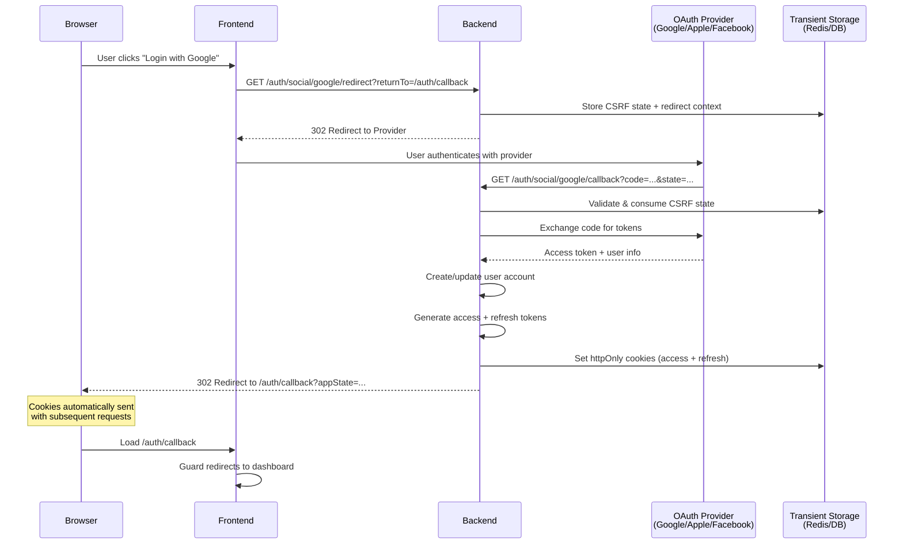
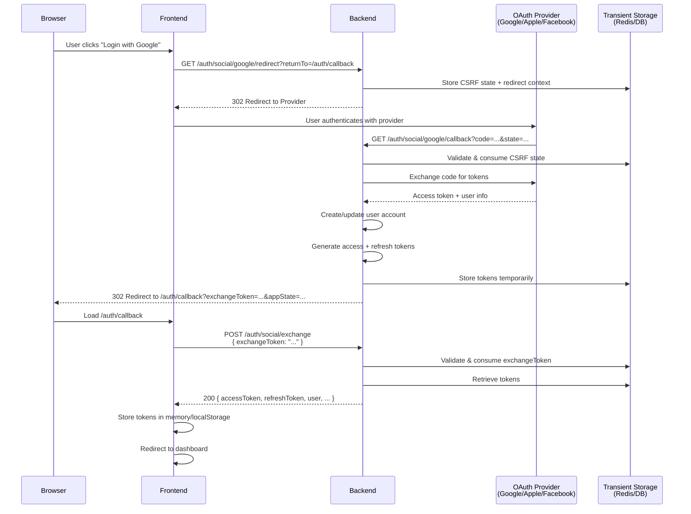
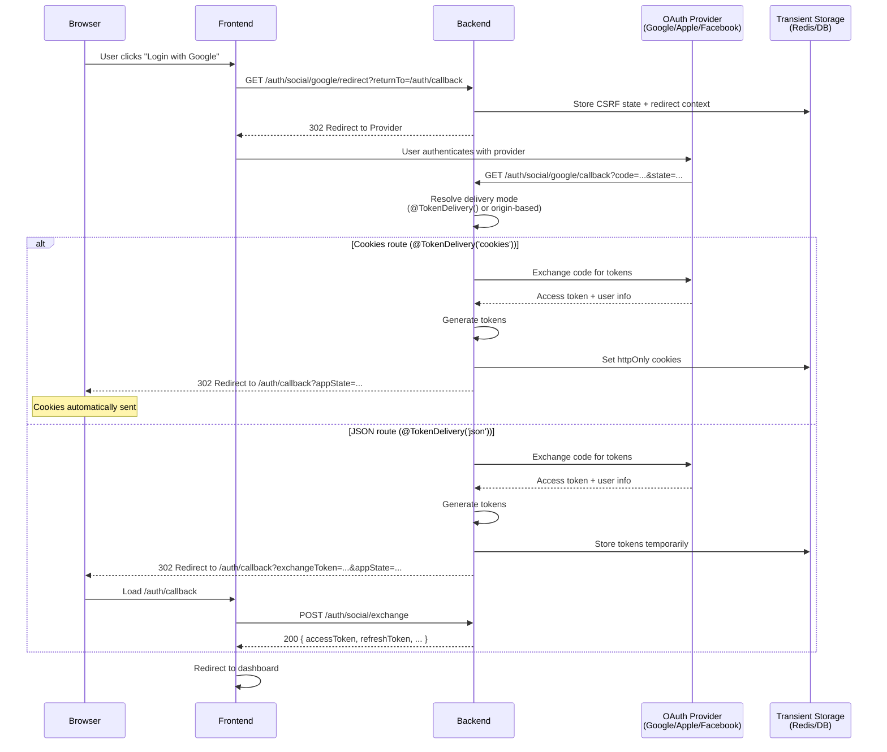

import Tabs from '@theme/Tabs';
import TabItem from '@theme/TabItem';

# Social Login

This guide assumes you already completed the [Quick Start](/docs/quick-start) and have `AuthModule.forRoot(authConfig)` working.

You’ll implement **redirect-first OAuth**:

1. Browser hits your backend “start” route
2. Backend redirects to Google/Apple/Facebook
3. Provider redirects back to your backend callback
4. Backend finishes auth and redirects back to your frontend

## Before you start (what you need)

- **OAuth credentials** for your provider(s)
- A working backend with nauth configured and operational
- Decide how you want to deliver tokens: `cookies`, `json`, or `hybrid` (see [Token Delivery Modes](/docs/features/token-delivery))

## Step 1: Install social provider packages

Pick the providers you need (Google / Apple / Facebook).


```bash npm2yarn
npm install @nauth-toolkit/social-google @nauth-toolkit/social-apple @nauth-toolkit/social-facebook
```


## Step 2: Configure social login (backend)

At minimum you must set:

- `social.redirect.frontendBaseUrl`: the frontend base URL used to build your final redirect
- `social.<provider>.callbackUrl`: the exact URL your provider will redirect back to

```typescript title="config/auth.config.ts"
export const authConfig = {
  // Choose token delivery for your app:
  // - 'cookies' for web apps
  // - 'json' for mobile/native
  // - 'hybrid' for web + mobile (see Token Delivery Modes guide)
  tokenDelivery: { method: 'cookies',
      // ...configuration for cookies
   },

  social: {
    redirect: {
      frontendBaseUrl: 'https://app.mycompany.com',

      // Prevent open redirects:
      // - Recommended: keep this false and only allow relative returnTo paths
      allowAbsoluteReturnTo: false,
      allowedReturnToOrigins: ['https://app.mycompany.com'],
    },

    google: {
      enabled: true,
      clientId: process.env.GOOGLE_CLIENT_ID,
      clientSecret: process.env.GOOGLE_CLIENT_SECRET,
      callbackUrl: 'https://api.mycompany.com/auth/social/google/callback',
      scopes: ['openid', 'email', 'profile'],
    },
    apple: {
      enabled: true,
      clientId: process.env.APPLE_CLIENT_ID,
      // Apple requires a JWT client secret for web OAuth, which is automatically generated
      // and refreshed by the toolkit from your Apple Developer credentials below.
      teamId: process.env.APPLE_TEAM_ID,
      keyId: process.env.APPLE_KEY_ID,
      privateKeyPem: process.env.APPLE_PRIVATE_KEY_PEM,
      callbackUrl: 'https://api.mycompany.com/auth/social/apple/callback',
      scopes: ['name', 'email'],
    },
  },
} as const;
```

## Step 3: Implement the social routes (consumer-owned)

Your backend owns four routes:

| Endpoint | Purpose |
| --- | --- |
| `GET /auth/social/:provider/redirect` | Start flow (backend → provider) |
| `GET /auth/social/:provider/callback` | Provider callback (Google/Facebook) |
| `POST /auth/social/:provider/callback` | Provider callback (Apple `form_post`) |
| `POST /auth/social/exchange` | Exchange `exchangeToken` → `AuthResponse` |

You delegate the logic to [`SocialRedirectHandler`](/docs/api/core/services/social-auth-service) (framework-neutral handler exported from `@nauth-toolkit/core` and re-exported by `@nauth-toolkit/nestjs`).

<Tabs groupId="platform">
<TabItem value="nestjs" label="NestJS" default>

- Uses `@Redirect()` so the response pipeline runs
- Lets `CookieTokenInterceptor` set cookies automatically when using cookie delivery
- Avoids the consumer manually building cookie responses
- Allows frontend to send appState which is returned when the flow ends. This helps store state such as invite code or referral codes

```typescript title="src/auth/social-redirect.controller.ts"
import { Body, Controller, Get, Param, Post, Query, Redirect, Req } from '@nestjs/common';
import { AuthResponseDTO, Public, SocialRedirectHandler, TokenDelivery } from '@nauth-toolkit/nestjs';
import {
  SocialCallbackFormDTO,
  SocialCallbackQueryDTO,
  SocialExchangeDTO,
  StartSocialRedirectQueryDTO,
} from './dto/social-redirect.dto';

@Controller('auth/social')
export class SocialRedirectController {
  constructor(private readonly socialRedirect: SocialRedirectHandler) {}

  @Public()
  @Redirect()
  @Get(':provider/redirect')
  async start(
    @Param('provider') provider: string,
    @Query() query: StartSocialRedirectQueryDTO,
    @Req() req: unknown,
  ): Promise<{ url: string }> {
    const out = await this.socialRedirect.start({
      provider,
      returnTo: query.returnTo,
      appState: query.appState,
      action: query.action,
      req,
    });
    return { url: out.redirectUrl };
  }

  // Provider callback (Google/Facebook)
  @Public()
  @Redirect()
  // Optional (recommended for explicit web/mobile routes in hybrid mode):
  // @TokenDelivery('cookies')
  @Get(':provider/callback')
  async callbackGet(
    @Param('provider') provider: string,
    @Query() query: SocialCallbackQueryDTO,
    @Req() req: unknown,
  ): Promise<{ url: string } & Partial<AuthResponseDTO>> {
    const out = await this.socialRedirect.callback({
      provider,
      code: query.code,
      state: query.state,
      error: query.error,
      errorDescription: query.error_description,
      req,
    });

    // In cookies mode, `authResponse` is returned only on token-success.
    // NestJS interceptor sets cookies; tokens are stripped from response body.
    const authResponse = (out as unknown as { authResponse?: AuthResponseDTO }).authResponse;
    return { url: out.redirectUrl, ...(authResponse ?? {}) };
  }

  // Provider callback (Apple form_post)
  @Public()
  @Redirect()
  // Optional (recommended for explicit web/mobile routes in hybrid mode):
  // @TokenDelivery('cookies')
  @Post(':provider/callback')
  async callbackPost(
    @Param('provider') provider: string,
    @Body() body: SocialCallbackFormDTO,
    @Req() req: unknown,
  ): Promise<{ url: string } & Partial<AuthResponseDTO>> {
    const out = await this.socialRedirect.callback({
      provider,
      code: body.code,
      state: body.state,
      error: body.error,
      errorDescription: body.error_description,
      req,
    });

    const authResponse = (out as unknown as { authResponse?: AuthResponseDTO }).authResponse;
    return { url: out.redirectUrl, ...(authResponse ?? {}) };
  }

  @Public()
  @Post('exchange')
  async exchange(@Body() dto: SocialExchangeDTO): Promise<AuthResponseDTO> {
    return await this.socialRedirect.exchange(dto.exchangeToken);
  }
}
```

:::tip Apple `form_post` note
If you run **NestJS on Fastify**, ensure your Fastify setup can parse `application/x-www-form-urlencoded` bodies (Apple callback uses form data). With Express this is typically handled by default.
:::

</TabItem>
<TabItem value="express" label="Express">

Coming soon.

</TabItem>
<TabItem value="fastify" label="Fastify">

Coming soon.

</TabItem>
</Tabs>

## Step 4: Frontend integration (web)

### Start the flow

Use the frontend SDK to navigate to your backend redirect start endpoint:

- [`NAuthClient.loginWithSocial()`](/docs/frontend-sdk/api/nauth-client#loginwithsocial)

```typescript
await client.loginWithSocial('google', { returnTo: '/auth/callback' });
```

### Handle the callback

On the frontend, the backend will redirect you back to `returnTo` with:

- `exchangeToken` when your deployment uses JSON delivery (or when a challenge must be returned)
- `appState` if you supplied it (optional, non-secret)

If you’re using Angular, the simplest approach is the guard-only callback route:

- [`socialRedirectCallbackGuard`](/docs/frontend-sdk/angular/oauth-callback-guard)

## What happens in each delivery mode

| Mode | Browser receives tokens directly? | How the frontend "finishes" |
| --- | --- | --- |
| `cookies` | No (httpOnly cookies set on backend callback) | Redirect to your app; no extra call unless a challenge occurs |
| `json` | No | Frontend calls `/auth/social/exchange` with `exchangeToken` to receive `AuthResponse` |
| `hybrid` | Depends on route/origin policy | Use explicit routes + `@TokenDelivery()` for deterministic behavior |

::::note Session auth method
When authentication completes successfully, the response payload includes `authMethod` (for JSON/hybrid exchange flows) and the frontend SDK stores it on the cached user as `sessionAuthMethod`. Values are `password` or the social provider name (e.g. `google`, `apple`, `facebook`).
::::

### How does it all work

<Tabs groupId="delivery-mode">
<TabItem value="cookies" label="Cookies Mode" default>

In cookies mode, tokens are set as httpOnly cookies during the callback redirect. The frontend receives no tokens in the response body.



</TabItem>
<TabItem value="json" label="JSON Mode">

In JSON mode, the backend returns an `exchangeToken` in the redirect URL. The frontend must call `/auth/social/exchange` to receive tokens in the response body.



</TabItem>
<TabItem value="hybrid" label="Hybrid Mode">

In hybrid mode, delivery depends on route-level `@TokenDelivery()` (NestJS) or `nauth.helpers.tokenDelivery('cookies')` (other platforms) or origin detection. Use explicit routes for deterministic behavior.




</TabItem>
</Tabs>

### Challenges (MFA / verification) still apply

Social login can return a challenge (example: `MFA_REQUIRED`) and you have turned on MFA for social logins (disabled by default).

- When that happens, the backend redirects back with **`exchangeToken`** so the frontend can fetch the challenge payload via `POST /auth/social/exchange` (even if your normal mode is cookies).

## Notes

- **`appState` is not secret**: treat it like URL data; it will appear in browser history and logs.
- **Open redirect protection**: keep `allowAbsoluteReturnTo: false` unless you truly need absolute return URLs.
- **Cluster-safe**: OAuth `state` is stored via transient `StorageAdapter` (Redis/DB), so the flow works across multiple containers or instances.

## API Reference

Complete reference for all social login classes, DTOs, and services:

### Handlers

| Class | Description | Documentation |
| --- | --- | --- |
| `SocialRedirectHandler` | Framework-neutral handler for redirect-first social login | [SocialAuthService](/docs/api/core/services/social-auth-service) (see redirect-first flows) |

### Services

| Service | Description | Documentation |
| --- | --- | --- |
| `SocialAuthService` | Social account linking, password management for social users | [SocialAuthService](/docs/api/core/services/social-auth-service) |

### DTOs

| DTO | Description | Documentation |
| --- | --- | --- |
| `CanSetPasswordDTO` | Check if social user can set password | [CanSetPasswordDTO](/docs/api/core/dto/can-set-password-dto) |
| `CanSetPasswordResponseDTO` | Can set password response | [CanSetPasswordResponseDTO](/docs/api/core/dto/can-set-password-response-dto) |
| `GetLinkedAccountsDTO` | Get user's linked social accounts | [GetLinkedAccountsDTO](/docs/api/core/dto/get-linked-accounts-dto) |
| `GetLinkedAccountsResponseDTO` | Linked accounts response | [GetLinkedAccountsResponseDTO](/docs/api/core/dto/get-linked-accounts-response-dto) |
| `LinkSocialAccountDTO` | Link social account to existing user | [LinkSocialAccountDTO](/docs/api/core/dto/link-social-account-dto) |
| `LinkSocialAccountResponseDTO` | Link account response | [LinkSocialAccountResponseDTO](/docs/api/core/dto/link-social-account-response-dto) |
| `SetPasswordForSocialUserDTO` | Set password for social-only user | [SetPasswordForSocialUserDTO](/docs/api/core/dto/set-password-for-social-user-dto) |
| `SetPasswordForSocialUserResponseDTO` | Set password response | [SetPasswordForSocialUserResponseDTO](/docs/api/core/dto/set-password-for-social-user-response-dto) |
| `SocialExchangeDTO` | Exchange token request (redirect-first flow) | [SocialExchangeDTO](/docs/api/core/dto/social-exchange-dto) |
| `UnlinkSocialAccountDTO` | Unlink social account | [UnlinkSocialAccountDTO](/docs/api/core/dto/unlink-social-account-dto) |
| `UnlinkSocialAccountResponseDTO` | Unlink account response | [UnlinkSocialAccountResponseDTO](/docs/api/core/dto/unlink-social-account-response-dto) |

### Provider Modules

| Provider | Description | Documentation |
| --- | --- | --- |
| Apple | Apple Sign In provider | [Apple Provider](/docs/api/social/apple) |
| Facebook | Facebook OAuth provider | [Facebook Provider](/docs/api/social/facebook) |
| Google | Google OAuth provider | [Google Provider](/docs/api/social/google) |

### Legacy DTOs (for non-redirect flows)

| DTO | Description | Documentation |
| --- | --- | --- |
| `GetSocialAuthUrlDTO` | Get OAuth authorization URL (legacy) | [GetSocialAuthUrlDTO](/docs/api/core/dto/get-social-auth-url-dto) |
| `HandleSocialCallbackDTO` | Handle OAuth callback (legacy) | [HandleSocialCallbackDTO](/docs/api/core/dto/handle-social-callback-dto) |

:::tip Complete DTO Reference
See [Social Authentication DTOs](/docs/api/core/dto/overview#social-authentication-dtos) for the complete list with descriptions.
:::

## Related

- [Authentication Routes](/docs/features/routes)
- [Token Delivery Modes](/docs/features/token-delivery)
- [Frontend social auth guide](/docs/frontend-sdk/guides/social-auth)
- [Social provider APIs](/docs/api/social/overview)


