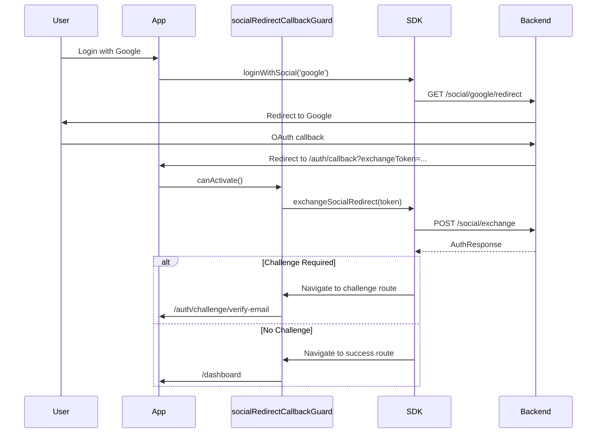

# Social Redirect Callback Guard

**Package:** `@nauth-toolkit/client-angular`
**Type:** Route Guard

Drop-in route guard for the redirect-first social flow. Handles OAuth callbacks and automatically navigates based on configuration.

```typescript
import { socialRedirectCallbackGuard } from '@nauth-toolkit/client-angular';
```

## Overview

The `socialRedirectCallbackGuard` handles:

- Detecting `exchangeToken` or `error` parameters in callback URL
- Exchanging the token via `POST /auth/social/exchange`
- **Automatic navigation** to success, challenge, or error routes based on `redirects` config
- Challenge routing using the same configuration as regular login/signup

## Basic Usage

```typescript
// app.routes.ts
import { socialRedirectCallbackGuard } from '@nauth-toolkit/client-angular';

export const routes: Routes = [
  {
    path: 'auth/callback',
    canActivate: [socialRedirectCallbackGuard],
    children: [], // Guard-only route
  },
  {
    path: 'dashboard',
    component: DashboardComponent,
  },
  // Challenge routes (if using separate routes pattern)
  {
    path: 'auth/challenge',
    children: [
      { path: 'verify-email', component: VerifyEmailComponent },
      { path: 'mfa-required', component: MfaComponent },
    ],
  },
];
```

## Configuration

The guard uses `NAUTH_CLIENT_CONFIG` for all navigation. Configure once, works everywhere:

```typescript
// app.config.ts
import { NAUTH_CLIENT_CONFIG } from '@nauth-toolkit/client-angular';
import { AuthChallenge } from '@nauth-toolkit/client';

export const appConfig = {
  providers: [
    {
      provide: NAUTH_CLIENT_CONFIG,
      useValue: {
        baseUrl: 'https://api.example.com/auth',
        tokenDelivery: 'cookies',
        redirects: {
          loginSuccess: '/dashboard',
          signupSuccess: '/onboarding',
          sessionExpired: '/login',
          oauthError: '/login?error=oauth',
          challengeBase: '/auth/challenge',

          // Optional: Custom challenge routes
          challengeRoutes: {
            [AuthChallenge.VERIFY_EMAIL]: '/verify',
            [AuthChallenge.MFA_REQUIRED]: '/2fa',
          },

          // Optional: Single route mode
          // useSingleChallengeRoute: true,
        },
      },
    },
  ],
};
```

## Navigation Patterns

### Pattern 1: Separate Routes (Default)

```typescript
redirects: {
  loginSuccess: '/dashboard',
  challengeBase: '/auth/challenge',
}

// Guard navigates to:
// - /auth/challenge/verify-email
// - /auth/challenge/mfa-required
// - /dashboard (no challenge, login/social)
```

### Pattern 2: Single Route with Query Param

```typescript
redirects: {
  loginSuccess: '/dashboard',
  challengeBase: '/auth/challenge',
  useSingleChallengeRoute: true,
}

// Guard navigates to:
// - /auth/challenge?challenge=VERIFY_EMAIL
// - /auth/challenge?challenge=MFA_REQUIRED
// - /dashboard (no challenge, login/social)
```

### Pattern 3: Custom Routes

```typescript
redirects: {
  loginSuccess: '/home',
  challengeRoutes: {
    [AuthChallenge.VERIFY_EMAIL]: '/verify-email',
    [AuthChallenge.MFA_REQUIRED]: '/two-factor',
  },
}

// Guard navigates to custom routes
```

### Pattern 4: Dialog-Based

```typescript
onAuthResponse: (response, context) => {
  if (context.source === 'social' && response.challengeName) {
    // Show challenge in dialog
    dialog.open(ChallengeDialogComponent, { data: response });
  } else if (response.user) {
    router.navigate(['/dashboard']);
  }
}

// Guard triggers onAuthResponse instead of navigation
```

## Flow Diagram



## Initiating Social Login

```typescript
// login.component.ts
@Component({
  selector: 'app-login',
  template: `
    <button (click)="onGoogleLogin()">Login with Google</button>
    <button (click)="onAppleLogin()">Login with Apple</button>
  `,
})
export class LoginComponent {
  constructor(private auth: AuthService) {}

  async onGoogleLogin() {
    await this.auth.loginWithSocial('google', {
      returnTo: '/auth/callback',
    });
    // SDK redirects to Google
    // Google redirects back to /auth/callback
    // Guard handles the rest
  }

  async onAppleLogin() {
    await this.auth.loginWithSocial('apple', {
      returnTo: '/auth/callback',
    });
  }
}
```

## Error Handling

The guard automatically handles OAuth errors:

| Parameter          | Guard Action                                    |
| ------------------ | ----------------------------------------------- |
| `?error=...`       | Navigate to `redirects.oauthError` (default: `/login`) |
| `?exchangeToken=...` | Exchange token and navigate based on result   |
| No parameters      | Navigate to `redirects.loginSuccess` (hydrate mode) |

## Event Integration

Listen to OAuth events in your app component:

```typescript
@Component({
  selector: 'app-root',
  template: `...`,
})
export class AppComponent implements OnInit {
  constructor(private auth: AuthService) {}

  ngOnInit(): void {
    // OAuth completed successfully
    this.auth.authEvents$
      .pipe(filter((e) => e.type === 'oauth:completed'))
      .subscribe((event) => {
        const response = event.data as AuthResponse;
        this.toastr.success(`Welcome, ${response.user?.firstName}!`);
      });

    // OAuth error
    this.auth.authError$
      .pipe(filter((e) => e.data.code === 'OAUTH_ERROR'))
      .subscribe((event) => {
        this.toastr.error('Social login failed. Please try again.');
      });

    // Challenge detected
    this.auth.authEvents$
      .pipe(filter((e) => e.type === 'auth:challenge'))
      .subscribe((event) => {
        console.log('Challenge required:', event.data.challengeName);
      });
  }
}
```

## Configuration Options

| Property                   | Type      | Default              | Description                                    |
| -------------------------- | --------- | -------------------- | ---------------------------------------------- |
| `redirects.loginSuccess`   | `string \| null`  | `'/'`         | Success route for login/social (no challenge). Set `null` to disable auto-navigation. |
| `redirects.signupSuccess`  | `string \| null`  | `undefined`   | Success route for signup (no challenge). Set `null` to disable auto-navigation. |
| `redirects.oauthError`     | `string \| null`  | `'/login'`    | OAuth error route. Set `null` to disable auto-navigation. |
| `redirects.challengeBase`  | `string`  | `'/auth/challenge'`  | Challenge base path                            |
| `redirects.challengeRoutes` | `object`  | `undefined`          | Custom routes per challenge type               |
| `redirects.useSingleChallengeRoute` | `boolean` | `false`      | Use query param mode                           |
| `onAuthResponse`           | `function` | `undefined`          | Custom handler (disables auto-navigation)      |

## Key Points

1. **Always needed**: Even with dialog-based navigation, you need this guard on `/auth/callback`
2. **Automatic navigation**: Guard uses same `redirects` config as login/signup
3. **No manual code**: Just configure `redirects`, guard handles everything
4. **Challenge support**: Full support for email verification, MFA, and all challenge types
5. **Error handling**: Automatic redirect to `oauthError` route on OAuth failures

## Related

- [Challenge Handling Guide](/docs/frontend-sdk/guides/challenge-handling) - Complete challenge flow
- [Social Authentication Guide](/docs/frontend-sdk/guides/social-auth) - Social auth setup
- [`NAuthClient.loginWithSocial()`](../api/nauth-client#loginwithsocial) - Initiate OAuth
- [`NAuthClientConfig`](../api/nauth-client-config) - Configuration reference
- [AuthService](./auth-service) - Angular service with observables
