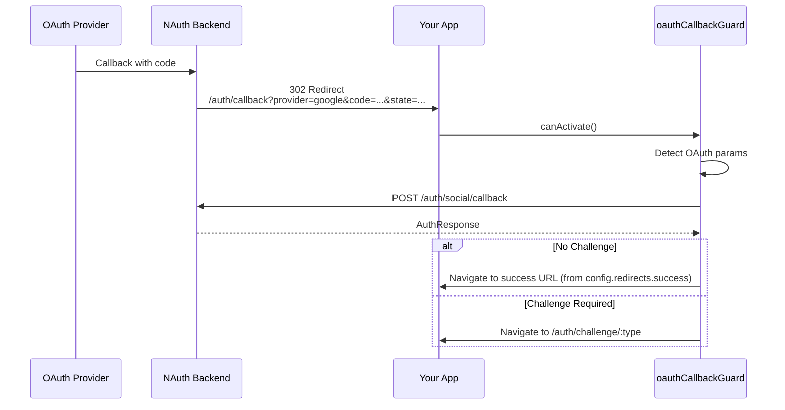

# OAuth Callback Guard

**Package:** `@nauth-toolkit/client/angular`
**Type:** Route Guard

Drop-in route guard that automatically processes OAuth callbacks and redirects appropriately.

```typescript
import { oauthCallbackGuard } from '@nauth-toolkit/client/angular';
```

## Overview

The `oauthCallbackGuard` eliminates the need to write custom OAuth callback components. Simply add it to your callback route and it handles:

- Auto-detecting OAuth callback parameters
- Validating state tokens
- Completing authentication via backend
- Redirecting to success/challenge/error pages
- Event emission for custom logic

## Basic Usage

```typescript
// app.routes.ts
import { Routes } from '@angular/router';
import { oauthCallbackGuard } from '@nauth-toolkit/client/angular';

export const routes: Routes = [
  {
    path: 'auth/callback',
    canActivate: [oauthCallbackGuard],
    children: [], // Empty - guard handles everything
  },
  {
    path: 'home',
    component: HomeComponent,
  },
  {
    path: 'auth/challenge/:type',
    component: ChallengeComponent,
  },
];
```

## Default Behavior

| Scenario                  | Redirect                          |
| ------------------------- | --------------------------------- |
| Authentication successful | `/` (root)                        |
| Challenge required        | `/auth/challenge/:challengeName`  |
| OAuth error               | `/login`                          |
| Not an OAuth callback     | Allow navigation (returns `true`) |

## Custom Configuration

Configure redirect URLs using the unified `NAUTH_CLIENT_CONFIG`:

```typescript
// app.config.ts
import { ApplicationConfig } from '@angular/core';
import { NAUTH_CLIENT_CONFIG, type NAuthClientConfig } from '@nauth-toolkit/client/angular';

export const appConfig: ApplicationConfig = {
  providers: [
    {
      provide: NAUTH_CLIENT_CONFIG,
      useValue: {
        baseUrl: 'https://api.example.com/auth',
        tokenDelivery: 'cookies',
        redirects: {
          success: '/home', // Common redirect for all successful auth
          challengeBase: '/auth/verify',
          oauthError: '/login?error=oauth',
      },
      } satisfies NAuthClientConfig,
    },
  ],
};
```

## Configuration Options

The guard uses `NAUTH_CLIENT_CONFIG.redirects` for routing:

| Property        | Type     | Default           | Description                                             |
| --------------- | -------- | ----------------- | ------------------------------------------------------- |
| `success`       | `string` | `'/'`             | Redirect URL on successful authentication (login, signup, or OAuth) |
| `challengeBase` | `string` | `'/auth/challenge'` | Base URL for challenge routes (challenge type appended) |
| `oauthError`    | `string` | `'/login'`        | Redirect URL on OAuth error                             |

## How It Works



## Event Integration

The guard works seamlessly with the [AuthService observables](./auth-service#observables):

```typescript
@Component({
  selector: 'app-root',
  template: `...`,
})
export class AppComponent implements OnInit {
  constructor(private auth: AuthService) {}

  ngOnInit(): void {
    // Listen to OAuth completion
    this.auth.authEvents$.pipe(filter((e) => e.type === 'oauth:completed')).subscribe((event) => {
      const response = event.data as AuthResponse;
      this.toastr.success(`Welcome, ${response.user?.firstName}!`);
    });

    // Listen to OAuth errors
    this.auth.authError$.subscribe((event) => {
      this.toastr.error(event.data.message);
    });
  }
}
```

## Related

- [Social Authentication Guide](/docs/frontend-sdk/guides/social-auth) - Complete social auth guide
- [`NAuthClient.loginWithSocial()`](../api/nauth-client#loginwithsocial) - Initiate OAuth flow
- [`NAuthClient.handleOAuthCallback()`](../api/nauth-client#handleoauthcallback) - Manual callback handling
- [`NAuthClientConfig`](../api/nauth-client-config#redirect-urls) - Configuration with redirect URLs
