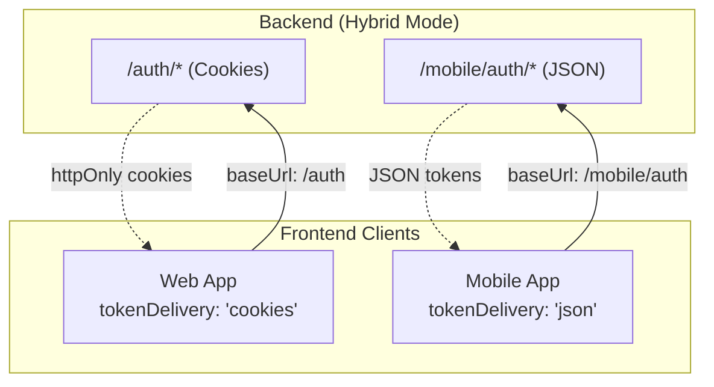
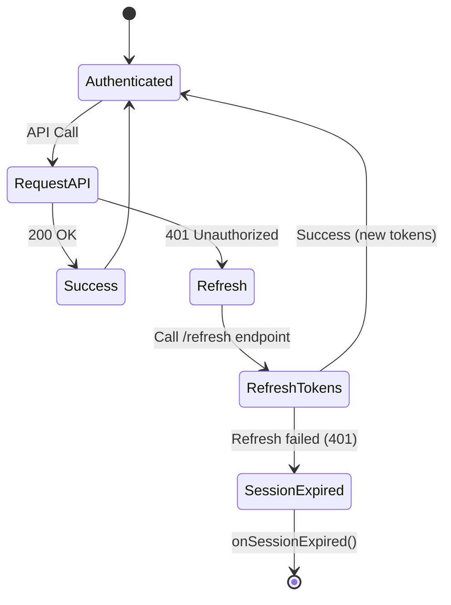
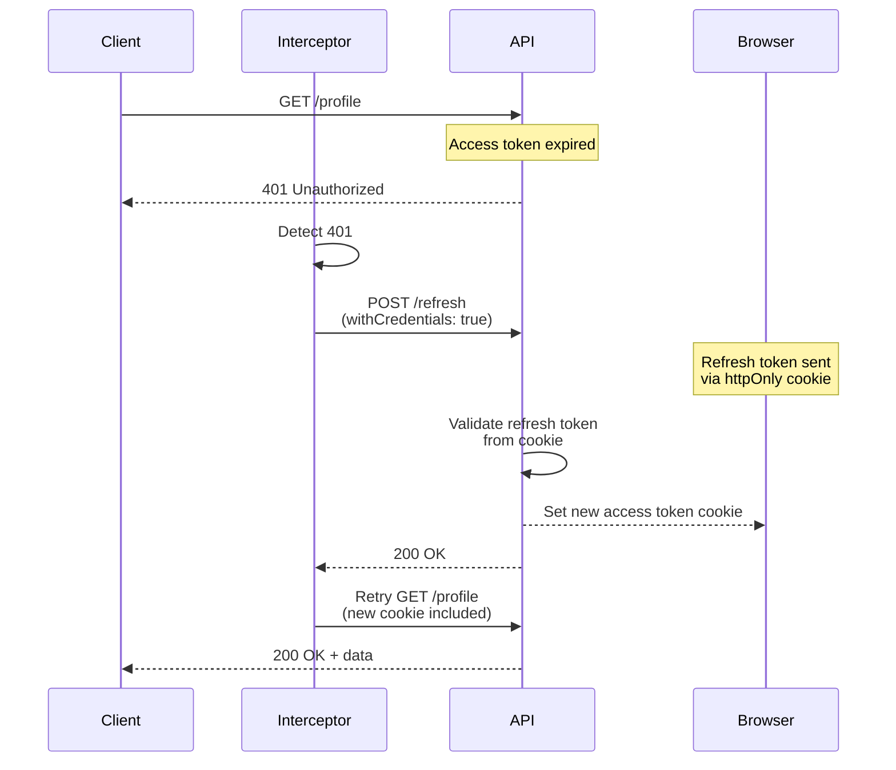
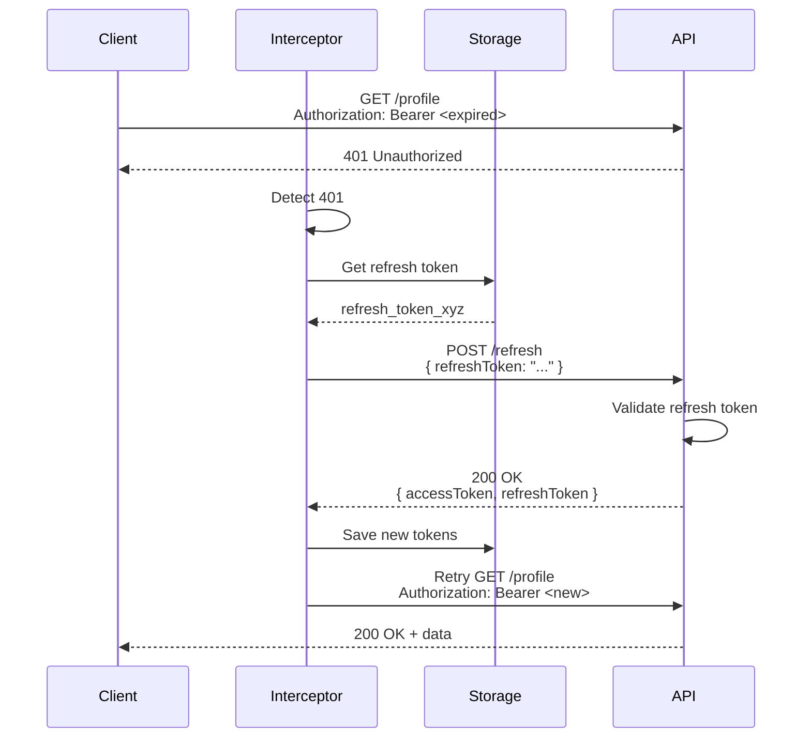
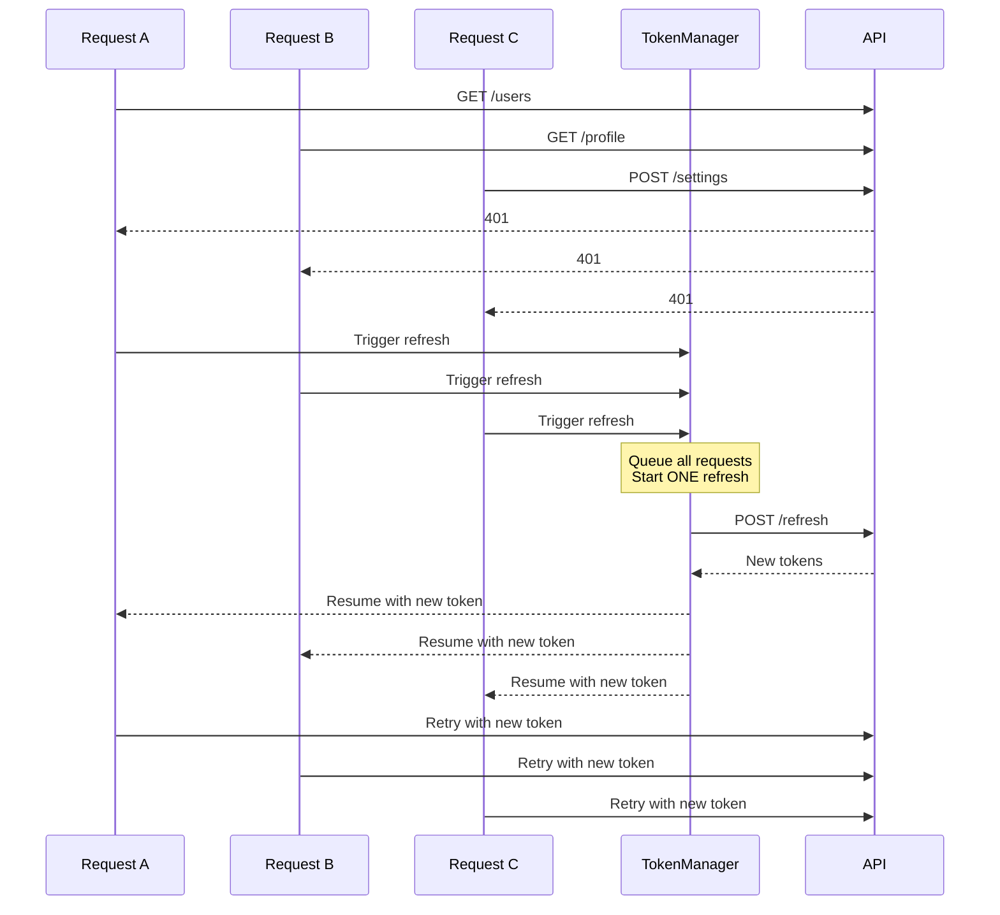
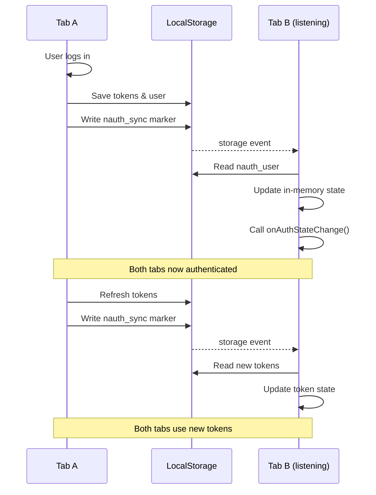
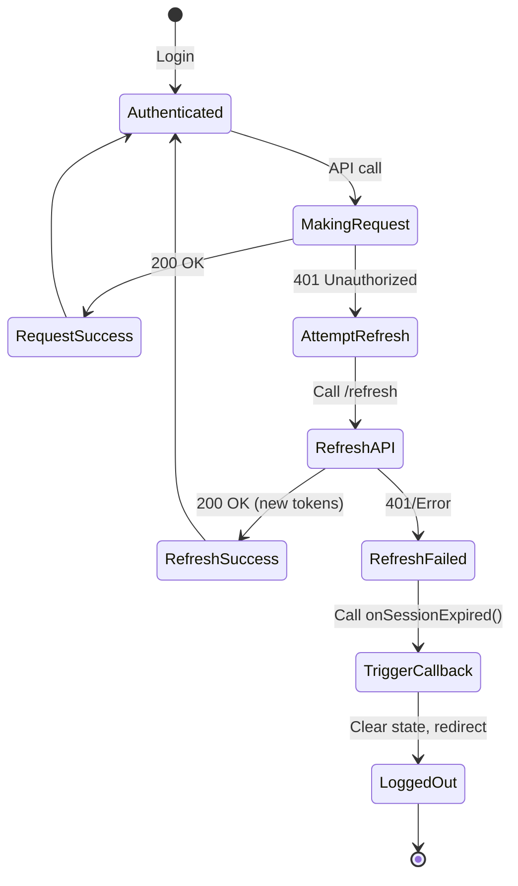

# Token Management

How `@nauth-toolkit/client` handles token storage, refresh, and synchronization across browser tabs.

## Token Delivery Modes

| Mode      | Token Storage     | Auth Headers                    | Use Case    |
| --------- | ----------------- | ------------------------------- | ----------- |
| `cookies` | HTTP-only cookies | None (cookies auto-sent)        | Web apps    |
| `json`    | Client storage    | `Authorization: Bearer <token>` | Mobile apps |

### Backend Hybrid Deployment

When your backend serves both web and mobile apps, it can implement a **hybrid architecture** with separate endpoint sets:



**How It Works:**

| Client Type | Frontend Config            | Backend Endpoint | Token Method                 |
| ----------- | -------------------------- | ---------------- | ---------------------------- |
| Web         | `tokenDelivery: 'cookies'` | `/auth/*`        | httpOnly cookies with CSRF   |
| Mobile      | `tokenDelivery: 'json'`    | `/mobile/auth/*` | JSON tokens in response body |

**Web App Configuration:**

```typescript
const client = new NAuthClient({
  baseUrl: 'https://api.example.com/auth',
  tokenDelivery: 'cookies',
  csrf: {
    cookieName: 'nauth_csrf_token',
    headerName: 'x-csrf-token',
  },
  onSessionExpired: () => {},
});
```

**Mobile App Configuration:**

```typescript
const client = new NAuthClient({
  baseUrl: 'https://api.example.com/mobile/auth',
  tokenDelivery: 'json',
  storage: new CapacitorStorage(), // Secure storage
  onSessionExpired: () => {},
});
```

:::tip Best of Both Worlds
Hybrid deployment lets you optimize security for each platform: httpOnly cookies for web (XSS protection), JSON tokens for mobile (full control).
:::

See [Backend Token Delivery Modes](/docs/concepts/token-management#token-delivery-modes) for implementation details.

## Token Storage (JSON Mode)

For `json` mode, the SDK stores tokens using the provided storage adapter:

| Key                              | Description                           |
| -------------------------------- | ------------------------------------- |
| `nauth_access_token`             | JWT access token                      |
| `nauth_refresh_token`            | JWT refresh token                     |
| `nauth_access_token_expires_at`  | Access token expiry (ms since epoch)  |
| `nauth_refresh_token_expires_at` | Refresh token expiry (ms since epoch) |
| `nauth_user`                     | Current user JSON                     |
| `nauth_challenge_session`        | Pending challenge session             |
| `nauth_device_token`             | Device trust token                    |

## Token Refresh Strategy

The SDK uses **reactive (401-based) refresh** for both modes:



### Why Reactive Refresh?

1. **Simpler** - No need to calculate expiry times or schedule timers
2. **Clock-drift resistant** - Works regardless of client/server time differences
3. **Race condition free** - Single refresh handles all pending requests
4. **Backend-driven** - Server decides when tokens are expired

## Token Refresh Flow

### Cookies Mode (Web)



In cookies mode:

- Refresh token sent automatically via httpOnly cookie
- Backend validates and sets new cookie
- No token handling needed in frontend code

### JSON Mode (Mobile)



In JSON mode:

- Refresh token read from storage
- Sent in request body
- New tokens returned in response body
- Frontend stores new tokens

## Concurrent Request Handling

Multiple 401s trigger a **single refresh** to avoid race conditions:



## Cross-Tab Synchronization (JSON Mode)

For `json` mode, the SDK synchronizes authentication state across browser tabs:



### How It Works

1. Tab A performs auth operation (login, logout, refresh)
2. Tokens saved to localStorage
3. `nauth_sync` marker written to trigger storage event
4. Tab B receives `storage` event
5. Tab B reads updated state from localStorage
6. Tab B updates in-memory state

:::tip Automatic
No configuration needed - cross-tab sync works automatically in JSON mode.
:::

## Manual Token Operations

### Get Current Access Token

```typescript
const token = await client.getAccessToken();
// Returns null if not authenticated or in cookies mode
```

### Check Authentication

```typescript
// Async (checks token validity)
const isAuth = await client.isAuthenticated();

// Sync (checks cached state - use for guards/templates)
const isAuthSync = client.isAuthenticatedSync();
```

### Force Token Refresh

```typescript
try {
  const tokens = await client.refreshTokens();
  console.log('New token expires at:', new Date(tokens.accessTokenExpiresAt));
} catch (error) {
  // Refresh failed - session expired
  redirectToLogin();
}
```

### Get Current User

```typescript
// From cache (sync)
const user = client.getCurrentUser();

// Fresh from server (async)
const freshUser = await client.getProfile();
```

## Cookie Mode Details

In `cookies` mode:

- Tokens stored in HTTP-only cookies (not accessible to JavaScript)
- Automatic CSRF protection required
- `withCredentials: true` on all requests
- Refresh handled by backend via cookie

### CSRF Handling

```typescript
const client = new NAuthClient({
  baseUrl: 'https://api.example.com/auth',
  tokenDelivery: 'cookies',
  csrf: {
    cookieName: 'nauth_csrf_token', // Must match backend
    headerName: 'x-csrf-token', // Must match backend
  },
  onSessionExpired: () => {},
});
```

The interceptor automatically:

1. Reads CSRF token from cookie
2. Attaches to mutating requests (`POST`, `PUT`, `PATCH`, `DELETE`)

## Session Expiration Flow



### Handling Session Expiration

```typescript
const client = new NAuthClient({
  baseUrl: 'https://api.example.com/auth',
  tokenDelivery: 'cookies',
  onSessionExpired: () => {
    // 1. Clear app state
    store.dispatch(clearUserState());

    // 2. Show notification
    toast.error('Session expired. Please login again.');

    // 3. Redirect to login
    window.location.replace('/login');
  },
});
```

## Token Refresh Events

Listen for successful refresh events:

```typescript
const client = new NAuthClient({
  baseUrl: 'https://api.example.com/auth',
  tokenDelivery: 'json',
  onTokenRefresh: () => {
    console.log('Tokens refreshed at', new Date());

    // Update analytics or monitoring
    trackEvent('token_refresh');
  },
  onSessionExpired: () => {},
});
```

## SSR (Server-Side Rendering) Support

The Angular interceptor is SSR-safe:

```typescript
// Automatically detects SSR environment
export const authInterceptor: HttpInterceptorFn = (req, next) => {
  const platformId = inject(PLATFORM_ID);
  const isBrowser = isPlatformBrowser(platformId);

  // Skip all auth logic on server
  if (!isBrowser) {
    return next(req);
  }

  // ... browser-only token handling
};
```

In SSR mode:

- No token reading/writing
- No localStorage access
- No cookie reading
- Requests pass through unchanged

## Debugging Token Issues

Enable debug mode to log token operations:

```typescript
const client = new NAuthClient({
  baseUrl: 'https://api.example.com/auth',
  tokenDelivery: 'json',
  debug: true,
  onSessionExpired: () => {},
});
```

Console output:

```
[NAuth] Login successful
[NAuth] Tokens stored: exp 2024-12-31T23:59:59Z
[NAuth] Request failed with 401
[NAuth] Refreshing tokens...
[NAuth] Tokens refreshed
[NAuth] Retrying original request
```

## Security Considerations

### JSON Mode (Mobile)

**Pros:**

- Works on mobile devices
- Full token control
- No cookie restrictions

**Cons:**

- Tokens accessible to JavaScript (XSS risk)
- Must use secure storage on mobile (Capacitor Preferences, React Native SecureStore)

### Cookie Mode (Web)

**Pros:**

- Tokens in HTTP-only cookies (safe from XSS)
- Browser handles storage securely
- Automatic sending with requests

**Cons:**

- CSRF protection required
- Limited mobile support
- CORS configuration needed

### Comparison

| Aspect          | Cookies Mode                                                                         | JSON Mode                                                                               |
| --------------- | ------------------------------------------------------------------------------------ | --------------------------------------------------------------------------------------- |
| XSS Protection  | <i className="fa-duotone fa-light fa-check"></i> httpOnly prevents JS access         | <i className="fa-duotone fa-light fa-exclamation-triangle"></i> Tokens accessible to JS |
| CSRF Protection | <i className="fa-duotone fa-light fa-exclamation-triangle"></i> Requires CSRF tokens | <i className="fa-duotone fa-light fa-check"></i> Not vulnerable                         |
| Mobile Native   | <i className="fa-duotone fa-light fa-times"></i> Limited support                     | <i className="fa-duotone fa-light fa-check"></i> Full control                           |
| SSR Compatible  | <i className="fa-duotone fa-light fa-exclamation-triangle"></i> No cookies on server | <i className="fa-duotone fa-light fa-check"></i> Works with storage                     |
| Cross-Tab Sync  | <i className="fa-duotone fa-light fa-times"></i> Not needed (cookies shared)         | <i className="fa-duotone fa-light fa-check"></i> Built-in via localStorage              |

### Best Practices

1. **Web apps**: Use `cookies` mode with CSRF protection
2. **Mobile apps**: Use `json` mode with secure storage adapter:
   - Capacitor: `@capacitor/preferences`
   - React Native: `@react-native-async-storage/async-storage` or `react-native-keychain`
3. Always configure appropriate security:
   - Cookie mode: `httpOnly: true`, `secure: true`, `sameSite: 'strict'`
   - JSON mode: Secure storage, avoid `localStorage` for sensitive apps
4. Monitor for token expiration and handle gracefully
5. Test cross-tab scenarios in JSON mode
6. Verify SSR safety in universal apps

## Related Documentation

- [Configuration](./configuration) - SDK configuration options
- [Getting Started](../guides/getting-started) - Setup guide
- [NAuthClient API](../api/nauth-client) - Complete client reference
- [Angular Interceptor](../angular/interceptor) - HTTP interceptor details
