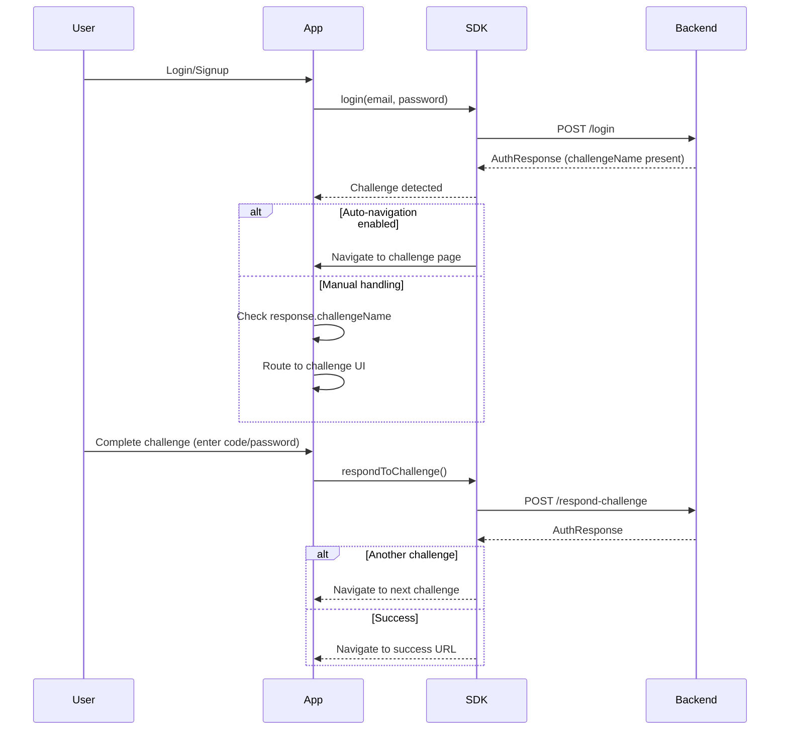
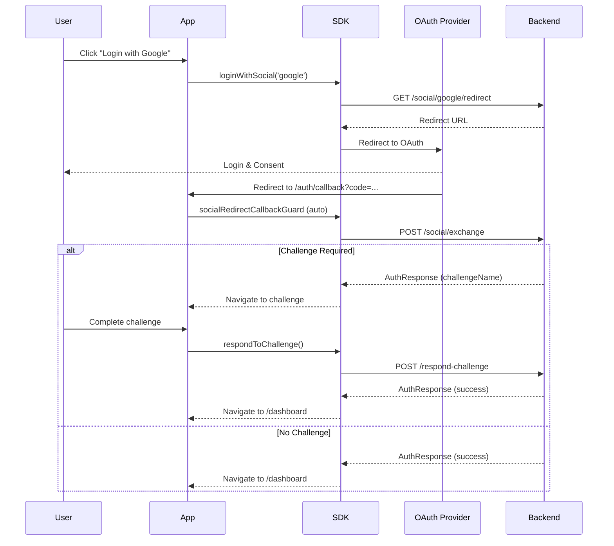

import Tabs from '@theme/Tabs';
import TabItem from '@theme/TabItem';

# Challenge Handling

Authentication challenges are multi-step flows that require additional user verification beyond username/password.

## Challenge Flow



## Challenge Types

The SDK supports five challenge types defined in the [`AuthChallenge`](../api/types/auth-challenge) enum. Each challenge requires specific user actions and provides different parameters.

| Challenge               | When Returned            | User Action                    | Key Parameters                                                       |
| ----------------------- | ------------------------ | ------------------------------ | -------------------------------------------------------------------- |
| `VERIFY_EMAIL`          | Email not verified       | Enter email code               | `codeDeliveryDestination`, `instructions`                            |
| `VERIFY_PHONE`          | Phone not verified       | Enter/provide phone, then code | `codeDeliveryDestination`, `requiresPhoneCollection`, `instructions` |
| `MFA_REQUIRED`          | MFA enabled              | Enter MFA code or use passkey  | `preferredMethod`, `availableMethods`, `maskedPhone`, `maskedEmail`  |
| `MFA_SETUP_REQUIRED`    | MFA setup enforced       | Configure MFA device           | `allowedMethods`, `instructions`                                     |
| `FORCE_CHANGE_PASSWORD` | Password change required | Set new password               | `instructions`                                                       |

### MFA Methods

The SDK supports five MFA methods defined in the [`MFAMethod`](../api/types/mfa-method) type. Each method requires different user input and verification steps.

| Method      | Description              | Input Required                              |
| ----------- | ------------------------ | ------------------------------------------- |
| `'sms'`     | SMS code                 | 6-digit code from SMS                       |
| `'email'`   | Email code               | 6-digit code from email                     |
| `'totp'`    | Authenticator app (TOTP) | 6-digit code from app (Google, Authy, etc.) |
| `'passkey'` | WebAuthn/FIDO2 passkey   | Biometric or hardware key                   |
| `'backup'`  | Backup recovery codes    | Single-use backup code                      |

## Automatic Navigation

The SDK can automatically handles navigation after `login()`, `signup()`, `respondToChallenge()`, and social OAuth flows using default routes. However, these can be configured or omitted altogether for custom behaviour.

### Pattern 1: Separate Route for each challenge type (Default)

Each challenge gets its own route appended after your `challengeBase` setting.

```typescript
{
  baseUrl: 'https://api.example.com/auth', // backend url (not to be confused with redirects on frontend)
  tokenDelivery: 'cookies',
  redirects: {
    challengeBase: '/auth/challenge',  // Base path
    success: '/dashboard',
    sessionExpired: '/login',
    oauthError: '/login',
  },
}
```

**Routes:**

- `/auth/challenge/verify-email`
- `/auth/challenge/verify-phone`
- `/auth/challenge/mfa-required` (default for SMS, email, TOTP)
- `/auth/challenge/mfa-required/passkey` (when passkey is preferred method)
- `/auth/challenge/mfa-selector` (when multiple methods available)
- `/auth/challenge/mfa-setup-required`
- `/auth/challenge/force-change-password`

### Pattern 2: Single Route with Query Param

All challenges go to one route:

```typescript
{
  redirects: {
    challengeBase: '/auth/challenge',
    useSingleChallengeRoute: true,  // Enable query param mode
  },
}
```

**Routes:**

- `/auth/challenge?challenge=VERIFY_EMAIL`
- `/auth/challenge?challenge=MFA_REQUIRED`

**Implementation:**

<Tabs groupId="framework">
<TabItem value="angular" label="Angular">

```typescript
@Component({
  selector: 'app-challenge',
  template: `
    @switch (challengeType) {
      @case ('VERIFY_EMAIL') {
        <app-verify-email />
      }
      @case ('VERIFY_PHONE') {
        <app-verify-phone />
      }
      @case ('MFA_REQUIRED') {
        <app-mfa />
      }
      @case ('MFA_SETUP_REQUIRED') {
        <app-mfa-setup />
      }
      @case ('FORCE_CHANGE_PASSWORD') {
        <app-change-password />
      }
    }
  `,
})
export class ChallengeComponent implements OnInit {
  challengeType: string | null = null;

  constructor(private route: ActivatedRoute) {}

  ngOnInit(): void {
    this.route.queryParams.subscribe((params) => {
      this.challengeType = params['challenge'];
    });
  }
}
```

</TabItem>
<TabItem value="react" label="React">

```typescript
function ChallengePage() {
  const [searchParams] = useSearchParams();
  const challengeType = searchParams.get('challenge');

  switch (challengeType) {
    case 'VERIFY_EMAIL':
      return <VerifyEmail />;
    case 'MFA_REQUIRED':
      return <MFA />;
    case 'MFA_SETUP_REQUIRED':
      return <MFASetup />;
    default:
      return <div>Unknown challenge</div>;
  }
}
```

</TabItem>
</Tabs>

### Pattern 3: Custom Routes

Override specific challenge routes using `challengeRoutes`:

```typescript
import { AuthChallenge } from '@nauth-toolkit/client';

{
  redirects: {
    challengeRoutes: {
      [AuthChallenge.MFA_REQUIRED]: '/auth/two-factor',
      [AuthChallenge.VERIFY_EMAIL]: '/verify',
    },
  },
}
```

**Route Building Priority:**

The SDK builds challenge URLs in this order:

1. **Custom `challengeRoutes`** - Highest priority, overrides everything
2. **`useSingleChallengeRoute`** - Query param mode (`/auth/challenge?challenge=VERIFY_EMAIL`)
3. **`mfaRoutes`** - MFA-specific routes (only for `MFA_REQUIRED` challenge)
4. **Default separate routes** - Kebab-case routes based on challenge type

### Pattern 3.5: MFA-Specific Routes

For fine-grained control over MFA navigation, use `mfaRoutes`:

```typescript
{
  redirects: {
    challengeBase: '/auth/challenge',
    mfaRoutes: {
      passkey: '/auth/passkey',        // When passkey is preferred method
      selector: '/auth/choose-method',  // When multiple methods available
      default: '/auth/verify-code',     // For SMS, email, TOTP
    },
  },
}
```

**When each route is used:**

- `passkey`: When `preferredMethod` is `'passkey'`
- `selector`: When multiple `availableMethods` exist and no `preferredMethod` is set
- `default`: For other MFA methods (SMS, email, TOTP)

**Note:** `mfaRoutes` only applies to `MFA_REQUIRED` challenges. It's evaluated after `challengeRoutes` but before default route construction.

**See [NAuthClientConfig Redirects](../api/nauth-client-config#redirect-urls) for complete configuration reference.**

### Pattern 4: Dialog-Based (No Navigation)

Handle challenges with dialogs instead of pages:

<Tabs groupId="framework">
<TabItem value="vanilla" label="Vanilla JS/TS">

```typescript
import { NAuthClient, AuthResponse } from '@nauth-toolkit/client';

const client = new NAuthClient({
  baseUrl: 'https://api.example.com/auth',
  tokenDelivery: 'cookies',
  onAuthResponse: (response: AuthResponse) => {
    if (response.challengeName) {
      openChallengeDialog(response);
    } else if (response.user) {
      window.location.href = '/dashboard';
    }
  },
});

function openChallengeDialog(challenge: AuthResponse) {
  const dialog = document.getElementById('challenge-dialog')!;
  const challengeType = challenge.challengeName;
  const params = challenge.challengeParameters || {};

  if (challengeType === 'VERIFY_EMAIL') {
    const destination = params.codeDeliveryDestination as string;
    dialog.innerHTML = `
      <h2>Verify Your Email</h2>
      <p>Code sent to ${destination}</p>
      <form id="verify-email-form">
        <input id="challenge-code" type="text" placeholder="000000" required />
        <button type="submit">Verify</button>
      </form>
    `;
    const form = dialog.querySelector('#verify-email-form') as HTMLFormElement;
    form.onsubmit = (e) => handleVerifyEmail(e, challenge.session!);
  } else if (challengeType === 'MFA_REQUIRED') {
    const method = (params.preferredMethod as string) || 'totp';
    const maskedKey = method === 'sms' ? 'maskedPhone' : 'maskedEmail';
    const destination = params[maskedKey] as string;

    dialog.innerHTML = `
      <h2>Two-Factor Authentication</h2>
      <p>Code sent to ${destination}</p>
      <form id="verify-mfa-form">
        <input id="mfa-code" type="text" placeholder="000000" required />
        <button type="submit">Verify</button>
      </form>
    `;
    const form = dialog.querySelector('#verify-mfa-form') as HTMLFormElement;
    form.onsubmit = (e) => handleVerifyMFA(e, challenge.session!, method);
  }

  dialog.style.display = 'block';
}

async function handleVerifyEmail(event: Event, session: string) {
  event.preventDefault();
  const code = (document.getElementById('challenge-code') as HTMLInputElement).value;

  await client.respondToChallenge({
    session,
    type: 'VERIFY_EMAIL',
    code,
  });
  // SDK will call onAuthResponse again with result
}

async function handleVerifyMFA(event: Event, session: string, method: string) {
  event.preventDefault();
  const code = (document.getElementById('mfa-code') as HTMLInputElement).value;

  await client.respondToChallenge({
    session,
    type: 'MFA_REQUIRED',
    method,
    code,
  });
  // SDK will call onAuthResponse again with result
}
```

</TabItem>
<TabItem value="angular" label="Angular">

```typescript
{
  onAuthResponse: (response, context) => {
    if (response.challengeName) {
      dialog.open(ChallengeDialogComponent, {
        data: { challenge: response },
      });
    } else if (response.user) {
      router.navigate(['/dashboard']);
    }
  },
}
```

</TabItem>
</Tabs>

## Social OAuth with Challenges



### Social OAuth Configuration

Social OAuth flows use the **same challenge configuration** as regular login/signup. The `redirects` configuration you set up in [Automatic Navigation](#automatic-navigation) applies to all authentication flows (login, signup, and social OAuth).

**Key difference**: Social OAuth requires a callback route handler to exchange the OAuth token. After token exchange, challenge handling works identically to regular flows.

<Tabs groupId="framework">
<TabItem value="angular" label="Angular">

Use the [`socialRedirectCallbackGuard`](../angular/oauth-callback-guard) to automatically handle the OAuth callback:

```typescript
// app.routes.ts
import { socialRedirectCallbackGuard } from '@nauth-toolkit/client-angular';

export const routes: Routes = [
  {
    path: 'auth/callback',
    canActivate: [socialRedirectCallbackGuard],
    children: [], // Guard handles token exchange and navigation
  },
  // ... your challenge routes (same as regular login)
  {
    path: 'auth/challenge',
    children: [
      { path: 'verify-email', component: VerifyEmailComponent },
      { path: 'mfa-required', component: MfaComponent },
    ],
  },
];

// login.component.ts
async onGoogleLogin() {
  await this.auth.loginWithSocial('google', {
    returnTo: '/auth/callback',
  });
  // Guard automatically:
  // 1. Exchanges OAuth token
  // 2. Navigates to challenge (if needed) or success URL
}
```

The guard uses your existing `redirects` configuration from `NAUTH_CLIENT_CONFIG`. All navigation patterns (separate routes, single route, custom routes, dialog-based) work the same as regular login.

</TabItem>
<TabItem value="vanilla" label="Vanilla JS/TS">

Manually handle the OAuth callback by calling `exchangeSocialRedirect()`:

```typescript
// In /auth/callback page
const params = new URLSearchParams(window.location.search);
const exchangeToken = params.get('exchangeToken');
const error = params.get('error');

if (error) {
  window.location.href = '/login?error=oauth';
} else if (exchangeToken) {
  const response = await client.exchangeSocialRedirect(exchangeToken);
  // SDK automatically navigates based on your redirects config:
  // - Challenge routes (if response.challengeName is present)
  // - Success URL (if response.user is present)
  // No manual navigation needed
}
```

**Note:** `exchangeSocialRedirect()` returns `Promise<AuthResponse>`. The SDK handles navigation automatically after the exchange completes.

The same `redirects` configuration from your `NAuthClient` setup applies. See [Automatic Navigation](#automatic-navigation) for all available patterns.

</TabItem>
</Tabs>

### Important Notes

1. **Callback route required**: Always create an `/auth/callback` route. In Angular, use `socialRedirectCallbackGuard`. In vanilla JS/TS, manually call `exchangeSocialRedirect()`.
2. **Same configuration**: The `redirects` config you set for regular login/signup applies to social OAuth challenges.
3. **No duplicate setup**: You don't need separate challenge routes or configuration for social OAuth - it uses the same setup as regular authentication flows.

## Implementing Challenges

### Email Verification

<Tabs groupId="framework">
<TabItem value="angular" label="Angular">

```typescript
@Component({
  selector: 'app-verify-email',
  template: `
    <h2>Verify Your Email</h2>
    <p>Code sent to {{ maskedEmail }}</p>

    <form (ngSubmit)="verify()">
      <input [(ngModel)]="code" placeholder="000000" />
      <button [disabled]="loading">Verify</button>
    </form>

    <button (click)="resend()">Resend Code</button>
  `,
})
export class VerifyEmailComponent implements OnInit {
  code = '';
  loading = false;
  maskedEmail = '';
  private session = '';

  constructor(private auth: AuthService) {}

  ngOnInit(): void {
    const challenge = this.auth.getCurrentChallenge();
    this.session = challenge?.session || '';
    this.maskedEmail = challenge?.challengeParameters?.codeDeliveryDestination || '';
  }

  async verify(): Promise<void> {
    this.loading = true;
    try {
      await this.auth.respondToChallenge({
        session: this.session,
        type: 'VERIFY_EMAIL',
        code: this.code,
      });
      // SDK navigates automatically
    } finally {
      this.loading = false;
    }
  }

  async resend(): Promise<void> {
    await this.auth.resendCode(this.session);
  }
}
```

</TabItem>
<TabItem value="react" label="React">

```typescript
function VerifyEmail() {
  const { client, challenge } = useAuth();
  const [code, setCode] = useState('');
  const [loading, setLoading] = useState(false);

  async function handleVerify(e: FormEvent) {
    e.preventDefault();
    setLoading(true);

    await client.respondToChallenge({
      session: challenge?.session!,
      type: 'VERIFY_EMAIL',
      code,
    });
    // SDK navigates automatically
  }

  return (
    <form onSubmit={handleVerify}>
      <h2>Verify Your Email</h2>
      <p>Code sent to {challenge?.challengeParameters?.codeDeliveryDestination}</p>
      <input value={code} onChange={(e) => setCode(e.target.value)} />
      <button disabled={loading}>Verify</button>
    </form>
  );
}
```

</TabItem>
</Tabs>

### MFA Verification

<Tabs groupId="framework">
<TabItem value="angular" label="Angular">

```typescript
@Component({
  selector: 'app-mfa',
  template: `
    <h2>Two-Factor Authentication</h2>

    @if (availableMethods.length > 1) {
      <div>
        @for (method of availableMethods; track method) {
          <button (click)="selectMethod(method)">{{ method }}</button>
        }
      </div>
    }

    @if (selectedMethod !== 'passkey') {
      <form (ngSubmit)="verify()">
        <input [(ngModel)]="code" placeholder="Enter code" />
        <button [disabled]="loading">Verify</button>
      </form>
    } @else {
      <button (click)="verifyPasskey()">Use Passkey</button>
    }
  `,
})
export class MfaComponent implements OnInit {
  availableMethods: string[] = [];
  selectedMethod = '';
  code = '';
  loading = false;
  private session = '';

  constructor(private auth: AuthService) {}

  ngOnInit(): void {
    const challenge = this.auth.getCurrentChallenge();
    this.session = challenge?.session!;
    this.availableMethods = challenge?.challengeParameters?.availableMethods || [];
    this.selectedMethod = challenge?.challengeParameters?.preferredMethod || this.availableMethods[0];
  }

  async verify(): Promise<void> {
    this.loading = true;
    try {
      await this.auth.respondToChallenge({
        session: this.session,
        type: 'MFA_REQUIRED',
        method: this.selectedMethod,
        code: this.code,
      });
      // SDK navigates automatically
    } finally {
      this.loading = false;
    }
  }

  async verifyPasskey(): Promise<void> {
    const response = await this.auth.getChallengeData(this.session, 'passkey');
    const options = response.challengeData as PublicKeyCredentialRequestOptions;
    const credential = await navigator.credentials.get({ publicKey: options });

    await this.auth.respondToChallenge({
      session: this.session,
      type: 'MFA_REQUIRED',
      method: 'passkey',
      credential: credential as unknown as Record<string, unknown>,
    });
    // SDK navigates automatically
  }
}
```

</TabItem>
<TabItem value="react" label="React">

```typescript
function MFA() {
  const { client, challenge } = useAuth();
  const [code, setCode] = useState('');
  const [method, setMethod] = useState(challenge?.challengeParameters?.preferredMethod || 'totp');

  async function handleVerify(e: FormEvent) {
    e.preventDefault();

    await client.respondToChallenge({
      session: challenge?.session!,
      type: 'MFA_REQUIRED',
      method,
      code,
    });
    // SDK navigates automatically
  }

  async function handlePasskey() {
    const response = await client.getChallengeData(challenge?.session!, 'passkey');
    const options = response.challengeData as PublicKeyCredentialRequestOptions;
    const credential = await navigator.credentials.get({ publicKey: options });

    await client.respondToChallenge({
      session: challenge?.session!,
      type: 'MFA_REQUIRED',
      method: 'passkey',
      credential: credential as unknown as Record<string, unknown>,
    });
  }

  if (method === 'passkey') {
    return <button onClick={handlePasskey}>Use Passkey</button>;
  }

  return (
    <form onSubmit={handleVerify}>
      <h2>Two-Factor Authentication</h2>
      <input value={code} onChange={(e) => setCode(e.target.value)} />
      <button>Verify</button>
    </form>
  );
}
```

</TabItem>
</Tabs>

### Phone Verification

Phone challenges may require phone collection first:

```typescript
import { NAuthClient, requiresPhoneCollection, AuthChallenge } from '@nauth-toolkit/client';

const client = new NAuthClient({
  baseUrl: 'https://api.example.com/auth',
  tokenDelivery: 'cookies',
});

// Login returns AuthResponse - SDK automatically navigates unless onAuthResponse is provided
const challenge = await client.login(email, password);

if (challenge.challengeName === AuthChallenge.VERIFY_PHONE) {
  if (requiresPhoneCollection(challenge)) {
    // Step 1: Collect phone (returns new AuthResponse with updated session)
    const phoneResponse = await client.respondToChallenge({
      session: challenge.session!,
      type: AuthChallenge.VERIFY_PHONE,
      phone: '+14155551234', // E.164 format
    });

    // Step 2: Verify code using session from phone collection response
    await client.respondToChallenge({
      session: phoneResponse.session!,
      type: AuthChallenge.VERIFY_PHONE,
      code: '123456',
    });
  } else {
    // Phone already collected, just verify code
    await client.respondToChallenge({
      session: challenge.session!,
      type: AuthChallenge.VERIFY_PHONE,
      code: '123456',
    });
  }
}
```

### MFA Setup

```typescript
import { NAuthClient, AuthChallenge } from '@nauth-toolkit/client';

const client = new NAuthClient({
  baseUrl: 'https://api.example.com/auth',
  tokenDelivery: 'cookies',
});

// 1. Get setup data
const response = await client.getSetupData(session, 'totp');
// Returns: { setupData: { secret, qrCode, manualEntryKey, issuer, accountName, ... } }

// 2. User scans QR code and enters code from authenticator app

// 3. Complete setup
await client.respondToChallenge({
  session,
  type: AuthChallenge.MFA_SETUP_REQUIRED,
  method: 'totp',
  setupData: {
    secret: response.setupData.secret as string, // From step 1
    code: '123456', // From user's authenticator
  },
});
```

### Force Password Change

```typescript
import { NAuthClient, AuthChallenge } from '@nauth-toolkit/client';

const client = new NAuthClient({
  baseUrl: 'https://api.example.com/auth',
  tokenDelivery: 'cookies',
});

await client.respondToChallenge({
  session: challenge.session!,
  type: AuthChallenge.FORCE_CHANGE_PASSWORD,
  newPassword: 'NewSecurePassword123!',
});
```

## Challenge State

The SDK automatically persists challenge sessions to storage (survives page refresh):

<Tabs groupId="framework">
<TabItem value="angular" label="Angular">

```typescript
// Get current challenge (from reactive state or storage)
const challenge = this.auth.getCurrentChallenge();
// Returns: AuthResponse | null

if (challenge?.challengeName) {
  // Resume challenge flow
  // Option 1: Use challenge router to navigate
  const router = this.auth.getChallengeRouter();
  await router.navigateToChallenge(challenge);

  // Option 2: Manual navigation
  const url = router.getChallengeUrl(challenge);
  window.location.href = url;
}

// Clear when done (after successful challenge completion)
await this.auth.clearChallenge();
```

**Note:** In Angular, you can also subscribe to `challenge$` observable for reactive updates:

```typescript
this.auth.challenge$.subscribe((challenge) => {
  if (challenge?.challengeName) {
    // Handle challenge
  }
});
```

</TabItem>
<TabItem value="vanilla" label="Vanilla JS/TS">

```typescript
// Get stored challenge (survives page refresh)
const storedChallenge = await client.getStoredChallenge();
// Returns: AuthResponse | null

if (storedChallenge?.challengeName) {
  // Resume challenge flow
  // Option 1: Use challenge router to navigate
  const router = client.getChallengeRouter();
  await router.navigateToChallenge(storedChallenge);

  // Option 2: Manual navigation
  const url = router.getChallengeUrl(storedChallenge);
  window.location.href = url;
}

// Clear when done (after successful challenge completion)
await client.clearStoredChallenge();
```

</TabItem>
</Tabs>

**Note:** Challenge sessions are automatically stored when a challenge is received and cleared when authentication succeeds.

## Helper Utilities

The SDK provides type-safe helper functions to reduce boilerplate when working with challenges:

```typescript
import {
  getMaskedDestination,
  getMFAMethod,
  requiresPhoneCollection,
  getChallengeInstructions,
  isOTPChallenge,
} from '@nauth-toolkit/client';
```

### getMaskedDestination()

Get masked email/phone from any challenge:

```typescript
const challenge = await client.login(email, password);
const destination = getMaskedDestination(challenge);

// Returns:
// VERIFY_EMAIL: "u***r@example.com"
// VERIFY_PHONE: "***-***-1234"
// MFA_REQUIRED (SMS): "***-***-9393"
// MFA_REQUIRED (Email): "m***2@example.com"

// Usage in UI
console.log(`Code sent to ${destination}`);
```

### getMFAMethod()

Get the preferred MFA method:

```typescript
const method = getMFAMethod(challenge);
// Returns: 'sms' | 'email' | 'totp' | 'backup' | 'passkey' | undefined

if (method === 'passkey') {
  // Show passkey UI
  const options = await client.getChallengeData(challenge.session!, 'passkey');
  const credential = await navigator.credentials.get({ publicKey: options });
} else {
  // Show code input
}
```

### requiresPhoneCollection()

Check if user needs to provide phone number:

```typescript
if (requiresPhoneCollection(challenge)) {
  // Step 1: Collect phone
  await client.respondToChallenge({
    session: challenge.session!,
    type: 'VERIFY_PHONE',
    phone: '+14155551234',
  });
} else {
  // Step 2: Verify code
  await client.respondToChallenge({
    session: challenge.session!,
    type: 'VERIFY_PHONE',
    code: '123456',
  });
}
```

### getChallengeInstructions()

Get user-friendly instructions:

```typescript
const instructions = getChallengeInstructions(challenge);
// Returns string from backend or undefined

if (instructions) {
  console.log(instructions);
  // e.g., "Please verify your email to continue"
}
```

### isOTPChallenge()

Check if challenge requires code input:

```typescript
if (isOTPChallenge(challenge)) {
  // Show 6-digit code input
  // true for: VERIFY_EMAIL, VERIFY_PHONE, MFA_REQUIRED
} else {
  // Other input (password, passkey, etc.)
}
```

**See [Challenge Helpers API](../api/utilities/challenge-helpers) for complete reference.**

## Error Handling

| Code                  | Description               | Action                  |
| --------------------- | ------------------------- | ----------------------- |
| `VERIFY_CODE_INVALID` | Wrong verification code   | Show error, allow retry |
| `VERIFY_CODE_EXPIRED` | Code expired              | Resend code             |
| `CHALLENGE_EXPIRED`   | Challenge session expired | Restart login           |
| `RATE_LIMIT_SMS`      | Too many SMS sent         | Show retry timer        |

```typescript
import { NAuthErrorCode } from '@nauth-toolkit/client';

try {
  await client.respondToChallenge({...});
} catch (error) {
  switch (error.code) {
    case NAuthErrorCode.VERIFY_CODE_INVALID:
      showError('Invalid code. Please try again.');
      break;
    case NAuthErrorCode.VERIFY_CODE_EXPIRED:
      await client.resendCode(session);
      showMessage('Code expired. New code sent.');
      break;
    case NAuthErrorCode.CHALLENGE_EXPIRED:
      showError('Session expired. Please login again.');
      navigateTo('/login');
      break;
    case NAuthErrorCode.RATE_LIMIT_SMS:
      showError(`Too many attempts. Retry in ${error.details?.retryAfter}s`);
      break;
  }
}
```

## Configuration Reference

| Option                              | Description                                | Default                   | Example                                                      |
| ----------------------------------- | ------------------------------------------ | ------------------------- | ------------------------------------------------------------ |
| `redirects.success`                 | URL after successful authentication        | `'/'`                     | `'/dashboard'`                                               |
| `redirects.sessionExpired`          | URL when session expires                   | `'/login'`                | `'/login?expired=true'`                                      |
| `redirects.oauthError`              | URL when OAuth authentication fails        | `'/login'`                | `'/login?error=oauth'`                                       |
| `redirects.challengeBase`           | Base path for challenges                   | `'/auth/challenge'`       | `'/auth/challenge'`                                          |
| `redirects.useSingleChallengeRoute` | Use query param instead of separate routes | `false`                   | `true`                                                       |
| `redirects.challengeRoutes`         | Custom route for each challenge            | `undefined`               | `{ [AuthChallenge.MFA_REQUIRED]: '/mfa' }`                   |
| `redirects.mfaRoutes`               | MFA-specific overrides (MFA_REQUIRED only) | `undefined`               | `{ passkey: '/auth/passkey', default: '/auth/verify-code' }` |
| `onAuthResponse`                    | Custom handler (disables auto-navigation)  | `undefined`               | `(response, context) => dialog.open(...)`                    |
| `navigationHandler`                 | Custom router integration                  | `window.location.replace` | `(url) => router.navigateByUrl(url)`                         |

## Related Documentation

- [NAuthClient API](../api/nauth-client) - Full API reference
  - [`respondToChallenge()`](../api/nauth-client#respondtochallenge) - Complete challenge
  - [`getSetupData()`](../api/nauth-client#getsetupdata) - Get MFA setup data
  - [`getChallengeData()`](../api/nauth-client#getchallengedata) - Get challenge data
  - [`resendCode()`](../api/nauth-client#resendcode) - Resend verification code
- [NAuthClientConfig](../api/nauth-client-config) - Configuration options
- [Challenge Helpers](../api/utilities/challenge-helpers) - Helper utilities
- [AuthChallenge](../api/types/auth-challenge) - Challenge type enum
- [AuthResponse](../api/types/auth-response) - Authentication response structure
- [MFAMethod](../api/types/mfa-method) - MFA method types
- [Angular AuthService](../angular/auth-service) - Angular-specific handling
