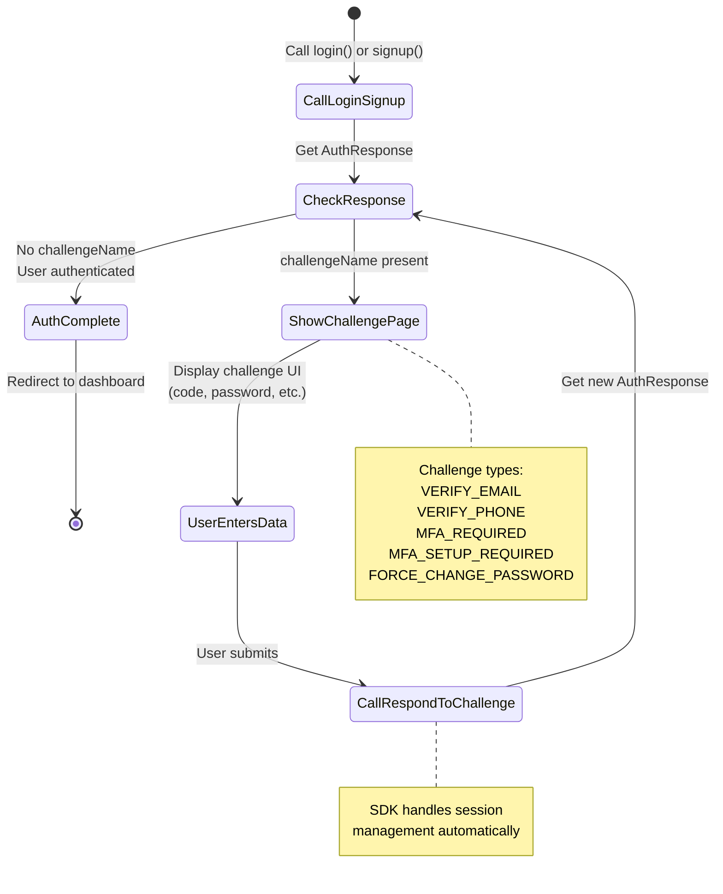

import Tabs from '@theme/Tabs';
import TabItem from '@theme/TabItem';

# Challenge Handling

When login or signup returns a challenge, the user must complete additional verification before authentication succeeds.

## What Are Challenges?

Challenges are multi-step authentication flows that require user interaction beyond username/password. The backend returns a challenge when:

- Email or phone verification is required
- Multi-factor authentication (MFA) is enabled or required
- Password change is forced (e.g., after admin reset)
- Additional security checks are needed

The SDK manages challenge sessions automatically, persisting them to storage so users can refresh pages without losing progress. Each challenge has a unique session token that must be included in challenge responses.

## Challenge Types

| Challenge               | When Returned            | User Action                    |
| ----------------------- | ------------------------ | ------------------------------ |
| `VERIFY_EMAIL`          | Email not verified       | Enter email code               |
| `VERIFY_PHONE`          | Phone not verified       | Enter/provide phone, then code |
| `MFA_REQUIRED`          | MFA enabled              | Enter MFA code                 |
| `MFA_SETUP_REQUIRED`    | MFA setup enforced       | Set up MFA device              |
| `FORCE_CHANGE_PASSWORD` | Password change required | Set new password               |

## Challenge Response Structure

The challenge response is an [`AuthResponse`](../api/types/auth-response) with challenge-specific fields:

```typescript
interface AuthResponse {
  // Present when challenge active
  challengeName?: AuthChallenge; // See [AuthChallenge](../api/types/auth-challenge)
  session?: string; // Challenge session token
  challengeParameters?: {
    // VERIFY_EMAIL / VERIFY_PHONE
    codeDeliveryDestination?: string; // Masked email or phone (e.g., "u***r@example.com" or "***-***-1234")

    // VERIFY_PHONE (when phone collection required)
    requiresPhoneCollection?: string; // "true" if phone number must be collected first

    // MFA_REQUIRED
    preferredMethod?: string; // Preferred MFA method: "sms", "email", "totp", "backup", "passkey"
    maskedPhone?: string; // Masked phone for SMS MFA (e.g., "***-***-9393")
    maskedEmail?: string; // Masked email for Email MFA (e.g., "m***2@example.com")
    availableMethods?: string[]; // Available MFA methods

    // MFA_SETUP_REQUIRED
    allowedMethods?: string[]; // MFA methods available for setup

    // Common
    instructions?: string; // User-friendly instructions
    [key: string]: unknown;
  };

  // Present when auth complete
  user?: AuthUserSummary; // See [AuthUserSummary](../api/types/auth-user-summary)
  accessToken?: string;
  // ...
}
```

See [`AuthResponse`](../api/types/auth-response) for complete structure.

### Using Challenge Helper Utilities

The SDK provides helper utilities to simplify working with challenge parameters:

```typescript
import {
  getMaskedDestination,
  getMFAMethod,
  requiresPhoneCollection,
  getChallengeInstructions,
  isOTPChallenge,
} from '@nauth-toolkit/client';

const challenge = await client.login(email, password);

// Get masked destination (works for all challenge types)
const destination = getMaskedDestination(challenge);
// For VERIFY_EMAIL: "u***r@example.com"
// For VERIFY_PHONE: "***-***-1234"
// For MFA_REQUIRED (SMS): "***-***-9393" (uses preferredMethod)
// For MFA_REQUIRED (Email): "m***2@example.com" (uses preferredMethod)

// Check if phone collection is needed
if (requiresPhoneCollection(challenge)) {
  // Show phone input form
}

// Get MFA method for MFA_REQUIRED challenges
const mfaMethod = getMFAMethod(challenge);
// Returns: 'sms' | 'email' | 'totp' | 'backup' | 'passkey' | undefined

// Check if challenge requires OTP code
if (isOTPChallenge(challenge)) {
  // Show OTP input component
}

// Get challenge instructions
const instructions = getChallengeInstructions(challenge);
```

See [Challenge Helpers](../api/utilities/challenge-helpers) for complete documentation.

## Challenge Flow

When login or signup returns a challenge, follow this flow:



### What You Need to Do

1. **Check for challenge** - After `login()` or `signup()`, check if `response.challengeName` exists
2. **Navigate to challenge page** - Route to the appropriate page based on `challengeName`
3. **Display challenge UI** - Show form for code input, password change, etc.
4. **Call `respondToChallenge()`** - Submit user's response with the session token
5. **Check response again** - The response may contain another challenge or complete authentication
6. **Repeat if needed** - Continue until no more challenges

The SDK automatically stores challenge sessions, so users can refresh pages without losing progress.

## Handling Email Verification

<Tabs groupId="framework">
<TabItem value="vanilla" label="Vanilla JS/TS">

```typescript
// Store challenge session from login/signup response
let challengeSession: AuthResponse;

async function verifyEmail(code: string): Promise<void> {
  const response = await authClient.respondToChallenge({
    session: challengeSession.session!,
    type: 'VERIFY_EMAIL',
    code,
  } as ChallengeResponse);

  if (response.challengeName) {
    // Another challenge (e.g., phone verification)
    handleNextChallenge(response);
  } else {
    // Verification complete
    // Use your router/navigation here
  }
}

async function resendEmailCode(): Promise<void> {
  const result = await authClient.resendCode(challengeSession.session!);
  // Use your application logger/telemetry here
}
```

</TabItem>
<TabItem value="angular" label="Angular">

```typescript
@Component({
  selector: 'app-verify-email',
  template: `
    <h2>Verify Your Email</h2>
    <p>Enter the code sent to {{ maskedEmail }}</p>

    <form (ngSubmit)="verify()">
      <input [(ngModel)]="code" name="code" placeholder="000000" />
      <button type="submit" [disabled]="loading">Verify</button>
    </form>

    <button (click)="resend()" [disabled]="resending">Resend Code</button>
  `,
})
export class VerifyEmailComponent implements OnInit {
  code = '';
  loading = false;
  resending = false;
  maskedEmail = '';

  private session = '';

  constructor(
    private auth: AuthService,
    private router: Router,
  ) {}

  ngOnInit(): void {
    // Get challenge from service
    const challenge = this.auth.getCurrentChallenge();
    if (!challenge?.session || challenge.challengeName !== 'VERIFY_EMAIL') {
      this.router.navigate(['/login']);
      return;
    }

    this.session = challenge.session;
    this.maskedEmail = (challenge.challengeParameters?.['email'] as string) ?? '';
  }

  verify(): void {
    this.loading = true;

    this.auth
      .respondToChallenge({
        session: this.session,
        type: 'VERIFY_EMAIL',
        code: this.code,
      })
      .subscribe({
        next: (response) => {
          this.loading = false;
          if (response.challengeName) {
            // Next challenge
            this.router.navigate(['/challenge', response.challengeName.toLowerCase()]);
          } else {
            this.router.navigate(['/dashboard']);
          }
        },
        error: (err) => {
          this.loading = false;
          alert(err.message);
        },
      });
  }

  resend(): void {
    this.resending = true;
    this.auth.resendCode(this.session).subscribe({
      next: (result) => {
        this.resending = false;
        alert(`Code sent to ${result.destination}`);
      },
      error: () => (this.resending = false),
    });
  }
}
```

</TabItem>
<TabItem value="react" label="React">

```typescript
function VerifyEmailPage() {
  const { client } = useAuth();
  const navigate = useNavigate();
  const [code, setCode] = useState('');
  const [loading, setLoading] = useState(false);

  // Get challenge from storage/context
  const challenge = JSON.parse(sessionStorage.getItem('challenge') ?? '{}');

  async function handleVerify(e: FormEvent) {
    e.preventDefault();
    setLoading(true);

    try {
      const response = await client.respondToChallenge({
        session: challenge.session,
        type: 'VERIFY_EMAIL',
        code,
      });

      if (response.challengeName) {
        sessionStorage.setItem('challenge', JSON.stringify(response));
        navigate(`/challenge/${response.challengeName.toLowerCase()}`);
      } else {
        sessionStorage.removeItem('challenge');
        navigate('/dashboard');
      }
    } catch (err) {
      alert(err.message);
    } finally {
      setLoading(false);
    }
  }

  return (
    <div>
      <h2>Verify Your Email</h2>
      <p>Enter the code sent to {challenge.challengeParameters?.email}</p>
      <form onSubmit={handleVerify}>
        <input
          value={code}
          onChange={(e) => setCode(e.target.value)}
          placeholder="000000"
        />
        <button disabled={loading}>Verify</button>
      </form>
    </div>
  );
}
```

</TabItem>
</Tabs>

## Handling Phone Verification

Phone verification may have two steps:

1. Collect phone number (if not provided during signup)
2. Verify code sent to phone

Use the `requiresPhoneCollection()` helper to check if phone collection is needed:

```typescript
import { requiresPhoneCollection, getMaskedDestination } from '@nauth-toolkit/client';

const challenge = await client.login(email, password);

if (challenge.challengeName === 'VERIFY_PHONE') {
  if (requiresPhoneCollection(challenge)) {
    // Step 1: Provide phone number
    const response = await client.respondToChallenge({
      session: challenge.session!,
      type: 'VERIFY_PHONE',
      phone: '+14155551234', // E.164 format
    });

    // Response includes new session for code verification
    challenge = response;
  }

  // Step 2: Verify code (phone now exists)
  const destination = getMaskedDestination(challenge);
  // Shows masked phone: "***-***-1234"

  const result = await client.respondToChallenge({
    session: challenge.session!,
    type: 'VERIFY_PHONE',
    code: '123456',
  });
}
```

## Handling MFA Required

For `MFA_REQUIRED` challenges, the backend provides `preferredMethod` and separate `maskedPhone`/`maskedEmail` fields. Use the helper utilities to get the correct masked destination:

<Tabs groupId="framework">
<TabItem value="vanilla" label="Vanilla JS/TS">

```typescript
import { getMFAMethod, getMaskedDestination } from '@nauth-toolkit/client';

async function verifyMfa(code: string): Promise<void> {
  // Get preferred method from challenge
  const method = getMFAMethod(challengeSession);
  // Returns: 'sms' | 'email' | 'totp' | 'backup' | 'passkey' | undefined

  // Get masked destination (automatically uses preferredMethod)
  const destination = getMaskedDestination(challengeSession);
  // For SMS: "***-***-9393"
  // For Email: "m***2@example.com"

  const response = await authClient.respondToChallenge({
    session: challengeSession.session!,
    type: 'MFA_REQUIRED',
    method: method!, // Use preferred method
    code,
  });

  if (!response.challengeName) {
    // Use your router/navigation here
  }
}

// For passkey MFA
async function verifyPasskey(): Promise<void> {
  // Get passkey options
  const options = await authClient.getChallengeData(challengeSession.session!, 'passkey');

  // Use WebAuthn API
  const credential = await navigator.credentials.get({
    publicKey: options as PublicKeyCredentialRequestOptions,
  });

  // Submit credential
  const response = await authClient.respondToChallenge({
    session: challengeSession.session!,
    type: 'MFA_REQUIRED',
    method: 'passkey',
    credential: credential,
  });
}
```

</TabItem>
<TabItem value="angular" label="Angular">

```typescript
@Component({
  selector: 'app-mfa',
  template: `
    <h2>Two-Factor Authentication</h2>

    @if (availableMethods.length > 1) {
      <div class="method-selector">
        @for (method of availableMethods; track method) {
          <button [class.active]="selectedMethod === method" (click)="selectMethod(method)">
            {{ method | uppercase }}
          </button>
        }
      </div>
    }

    @if (selectedMethod !== 'passkey') {
      <form (ngSubmit)="verify()">
        <input [(ngModel)]="code" name="code" placeholder="Enter code" />
        <button type="submit" [disabled]="loading">Verify</button>
      </form>
    } @else {
      <button (click)="verifyPasskey()">Authenticate with Passkey</button>
    }
  `,
})
export class MfaComponent implements OnInit {
  availableMethods: string[] = [];
  selectedMethod = '';
  code = '';
  loading = false;
  private session = '';

  constructor(
    private auth: AuthService,
    private router: Router,
  ) {}

  ngOnInit(): void {
    const challenge = this.auth.getCurrentChallenge();
    if (challenge?.challengeName !== 'MFA_REQUIRED') {
      this.router.navigate(['/login']);
      return;
    }

    this.session = challenge.session!;
    this.availableMethods = (challenge.challengeParameters?.['availableMethods'] as string[]) ?? [];
    this.selectedMethod = this.availableMethods[0] ?? 'totp';
  }

  selectMethod(method: string): void {
    this.selectedMethod = method;
  }

  verify(): void {
    this.loading = true;
    this.auth
      .respondToChallenge({
        session: this.session,
        type: 'MFA_REQUIRED',
        method: this.selectedMethod,
        code: this.code,
      })
      .subscribe({
        next: (res) => {
          this.loading = false;
          this.router.navigate(['/dashboard']);
        },
        error: (err) => {
          this.loading = false;
          alert(err.message);
        },
      });
  }
}
```

</TabItem>
</Tabs>

## Handling MFA Setup Required

When MFA setup is enforced:

```typescript
// 1. Get available setup methods
const setupMethods = challengeSession.challengeParameters?.availableMethods;

// 2. Get setup data for chosen method
const setupData = await authClient.getSetupData(
  challengeSession.session!,
  'totp', // or 'sms', 'email', 'passkey'
);

// For TOTP: setupData contains { secret, qrCode, manualEntryKey, issuer, accountName }
// IMPORTANT: When responding to TOTP setup challenge, you must include
// both the secret (from getSetupData) and the code (from user) in setupData
// For SMS/Email: may auto-complete if already verified

// 3. Complete setup
// For TOTP: Must include both secret (from getSetupData) and code (from user)
const response = await authClient.respondToChallenge({
  session: challengeSession.session!,
  type: 'MFA_SETUP_REQUIRED',
  method: 'totp',
  setupData: {
    secret: setupData.setupData.secret, // Required: from getSetupData
    code: '123456', // Required: from user's authenticator app
  },
});
```

### Auto-Completion

SMS/Email MFA may auto-complete if phone/email was verified during signup:

```typescript
const setupData = await authClient.getSetupData(session, 'sms');

if (setupData.autoCompleted) {
  // MFA setup already done, proceed with respondToChallenge
  await authClient.respondToChallenge({
    session: session,
    type: 'MFA_SETUP_REQUIRED',
    method: 'sms',
    setupData: { deviceId: setupData.deviceId },
  });
}
```

## Handling Force Password Change

```typescript
const response = await authClient.respondToChallenge({
  session: challengeSession.session!,
  type: 'FORCE_CHANGE_PASSWORD',
  newPassword: 'NewSecurePassword123!',
});
```

## Challenge State Management

### Persisting Challenge Sessions

The SDK automatically persists challenge sessions to storage, allowing users to refresh the page without losing progress:

```typescript
// Get stored challenge on page load
const storedChallenge = await authClient.getStoredChallenge();

if (storedChallenge?.challengeName) {
  // Resume challenge flow
  navigateToChallenge(storedChallenge);
}

// Clear when done or cancelled
await authClient.clearStoredChallenge();
```

### Angular Challenge Observable

```typescript
@Component({
  /* ... */
})
export class AppComponent implements OnInit {
  constructor(
    private auth: AuthService,
    private router: Router,
  ) {}

  ngOnInit(): void {
    // React to challenge changes
    this.auth.challenge$.pipe(filter((c) => c !== null)).subscribe((challenge) => {
      this.navigateToChallenge(challenge!);
    });
  }

  private navigateToChallenge(challenge: AuthResponse): void {
    const routes: Record<string, string> = {
      VERIFY_EMAIL: '/verify-email',
      VERIFY_PHONE: '/verify-phone',
      MFA_REQUIRED: '/mfa',
      MFA_SETUP_REQUIRED: '/mfa-setup',
      FORCE_CHANGE_PASSWORD: '/change-password',
    };

    const route = routes[challenge.challengeName!];
    if (route) {
      this.router.navigate([route]);
    }
  }
}
```

## Error Handling

Client errors use `NAuthErrorCode` values that mirror the backend `AuthErrorCode`.

See:

- [`NAuthErrorCode`](../api/types/nauth-error-code)
- [Error Handling (Backend)](/docs/concepts/error-handling)

Common challenge errors:

| Code              | Description               | Action                  |
| ----------------- | ------------------------- | ----------------------- |
| `VERIFY_CODE_INVALID`    | Wrong verification code   | Show error, allow retry |
| `VERIFY_CODE_EXPIRED`    | Code expired              | Resend code             |
| `CHALLENGE_EXPIRED`      | Challenge session expired | Restart login           |
| `RATE_LIMIT_SMS`  | Too many SMS sent         | Show retry timer        |

```typescript
import { NAuthErrorCode } from '@nauth-toolkit/client';

try {
  await client.respondToChallenge({
    /* ... */
  });
} catch (error) {
  switch (error.code) {
    case NAuthErrorCode.VERIFY_CODE_INVALID:
      showError('Invalid code. Please try again.');
      break;
    case NAuthErrorCode.VERIFY_CODE_EXPIRED:
      await client.resendCode(session);
      showMessage('Code expired. New code sent.');
      break;
    case NAuthErrorCode.CHALLENGE_EXPIRED:
      showError('Session expired. Please login again.');
      navigateTo('/login');
      break;
    case NAuthErrorCode.RATE_LIMIT_SMS:
      showError(`Too many attempts. Retry in ${error.details?.retryAfter}s`);
      break;
  }
}
```

## Related Documentation

- [NAuthClient API](../api/nauth-client) - Full API reference
  - [`respondToChallenge()`](../api/nauth-client#respondtochallenge) - Complete challenge
  - [`getSetupData()`](../api/nauth-client#getsetupdata) - Get MFA setup data
  - [`getChallengeData()`](../api/nauth-client#getchallengedata) - Get challenge data
  - [`resendCode()`](../api/nauth-client#resendcode) - Resend verification code
- [Challenge Helpers](../api/utilities/challenge-helpers) - Helper utilities for working with challenges
- [ChallengeResponse](../api/types/challenge-response) - Challenge response union type
- [AuthResponse](../api/types/auth-response) - Authentication response with challenge data
- [AuthChallenge](../api/types/auth-challenge) - Challenge type enum
- [MFA Setup Guide](./mfa-setup) - MFA configuration guide
- [GetSetupDataResponse](../api/types/get-setup-data-response) - MFA setup data structure
- [GetChallengeDataResponse](../api/types/get-challenge-data-response) - Challenge data structure
- [Angular AuthService](../angular/auth-service) - Observable-based challenge handling
