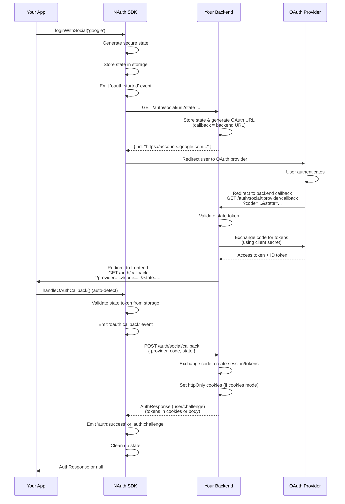

import Tabs from '@theme/Tabs';
import TabItem from '@theme/TabItem';

# Social Authentication

Implement OAuth social login with Google, Apple, and Facebook using the SDK's event-driven architecture and drop-in components.

## Architecture Overview

The SDK provides a **zero-boilerplate** social authentication solution with **secure OAuth2 flow**:

### Security Model

The NAuth backend acts as a **secure OAuth proxy**:

1. **Client Secret Protection**: OAuth client secrets never touch the frontend
2. **Origin Validation**: OAuth providers redirect to backend first (validates callback origin)
3. **Secure Token Exchange**: Backend exchanges authorization codes for tokens using client secrets
4. **CSRF Protection**: State tokens validated on both backend and frontend

### Flow Diagram

The OAuth flow involves **3 parties**: Your App (Frontend), NAuth Backend, and OAuth Provider (Google/Apple/Facebook).

- **Backend Callback**: OAuth provider redirects to NAuth backend (validates it's legitimate)
- **Frontend Redirect**: Backend passes validated params to your frontend
- **Secure Exchange**: Frontend sends params back, backend completes token exchange

### Key Features

1. **Automatic State Management**: SDK generates and validates OAuth state tokens internally
2. **Event-Driven**: Subscribe to auth events (`auth:success`, `oauth:error`, etc.) for custom logic
3. **Drop-In Components**: Pre-built guards/hooks that auto-detect and process OAuth callbacks
4. **Framework Agnostic**: Works with vanilla JS, Angular, React, and other frameworks
5. **SSR Safe**: All methods handle server-side rendering environments



## Supported Providers

| Provider | Web OAuth                                        | Native Token                                     |
| -------- | ------------------------------------------------ | ------------------------------------------------ |
| Google   | <i className="fa-duotone fa-light fa-check"></i> | <i className="fa-duotone fa-light fa-check"></i> |
| Apple    | <i className="fa-duotone fa-light fa-check"></i> | <i className="fa-duotone fa-light fa-check"></i> |
| Facebook | <i className="fa-duotone fa-light fa-check"></i> | <i className="fa-duotone fa-light fa-check"></i> |

## Quick Start

### Step 1: Initiate Social Login

Call `loginWithSocial()` to start the OAuth flow. The SDK handles state generation, storage, and redirect automatically.

<Tabs groupId="framework">
<TabItem value="vanilla" label="Vanilla JS/TS">

```typescript
import { NAuthClient } from '@nauth-toolkit/client';

const client = new NAuthClient({
  baseUrl: 'https://api.example.com/auth',
  tokenDelivery: 'cookies',
});

// Button click handler
document.getElementById('google-login').addEventListener('click', () => {
  client.loginWithSocial('google');
  // SDK automatically redirects to Google OAuth
});
```

</TabItem>
<TabItem value="angular" label="Angular">

```typescript
import { Component } from '@angular/core';
import { AuthService } from '@nauth-toolkit/client/angular';

@Component({
  selector: 'app-login',
  template: ` <button (click)="loginWithGoogle()">Continue with Google</button> `,
})
export class LoginComponent {
  constructor(private auth: AuthService) {}

  loginWithGoogle(): void {
    this.auth.loginWithSocial('google');
    // Automatically redirects
  }
}
```

</TabItem>
<TabItem value="react" label="React">

```typescript
import { useAuth } from './auth/AuthProvider';

function LoginPage() {
  const { client } = useAuth();

  const handleGoogleLogin = () => {
    client.loginWithSocial('google');
    // Automatically redirects
  };

  return (
    <button onClick={handleGoogleLogin}>
      Continue with Google
    </button>
  );
}
```

</TabItem>
</Tabs>

### Step 2: Handle OAuth Callback

The SDK provides **drop-in solutions** that auto-detect and process OAuth callbacks. No custom components needed.

<Tabs groupId="framework">
<TabItem value="vanilla" label="Vanilla JS/TS">

**Option A: Auto-detect on app initialization**

```typescript
// app.ts or main.ts
import { NAuthClient } from '@nauth-toolkit/client';

const client = new NAuthClient({
  baseUrl: 'https://api.example.com/auth',
  tokenDelivery: 'cookies',
});

// Auto-detect and handle OAuth callback on every page load
// Returns null if not a callback URL
async function init() {
  const response = await client.handleOAuthCallback();

  if (response) {
    // Was an OAuth callback
    if (response.challengeName) {
      window.location.href = `/challenge/${response.challengeName}`;
    } else {
      window.location.href = '/'; // Navigate to your app's home route
    }
  }
}

init();
```

**Option B: Dedicated callback page**

```typescript
// auth/callback.ts
import { authClient } from '../client';

async function handleCallback() {
  try {
    const response = await authClient.handleOAuthCallback();

    if (!response) {
      // Not a callback, redirect to login
      window.location.href = '/login';
      return;
    }

    if (response.challengeName) {
      window.location.href = `/challenge/${response.challengeName}`;
    } else {
      window.location.href = '/'; // Navigate to your app's home route
    }
  } catch (error) {
    console.error('OAuth failed:', error);
    window.location.href = '/login?error=oauth_failed';
  }
}

handleCallback();
```

</TabItem>
<TabItem value="angular" label="Angular">

**Use the built-in `oauthCallbackGuard`** - no component needed:

```typescript
// app.routes.ts
import { Routes } from '@angular/router';
import { oauthCallbackGuard } from '@nauth-toolkit/client/angular';

export const routes: Routes = [
  {
    path: 'auth/callback',
    canActivate: [oauthCallbackGuard],
    children: [], // Empty - guard handles everything
  },
  {
    path: 'home',
    component: HomeComponent,
  },
  {
    path: 'challenge/:type',
    component: ChallengeComponent,
  },
];
```

The guard automatically:

- Detects OAuth callback parameters
- Validates state token
- Completes authentication
- Redirects to success URL or challenge page
- Handles errors and redirects to login

**Custom redirect paths:**

```typescript
import { NAUTH_CLIENT_CONFIG, type NAuthClientConfig } from '@nauth-toolkit/client/angular';

// In app.config.ts
providers: [
  {
    provide: NAUTH_CLIENT_CONFIG,
    useValue: {
      baseUrl: 'https://api.example.com/auth',
      tokenDelivery: 'cookies',
      redirects: {
        success: '/home', // Common redirect for all successful auth
        challengeBase: '/auth/verify',
        oauthError: '/login?error=oauth',
    },
    } satisfies NAuthClientConfig,
  },
];
```

</TabItem>
<TabItem value="react" label="React">

**Use the `OAuthCallbackHandler` component**:

```typescript
// App.tsx
import { Routes, Route } from 'react-router-dom';
import { OAuthCallbackHandler } from '@nauth-toolkit/client/react';

function App() {
  return (
    <Routes>
      <Route
        path="/auth/callback"
        element={
          <OAuthCallbackHandler
            onSuccess="/"
            onChallenge={(challenge) => `/challenge/${challenge}`}
            onError="/login"
            loadingComponent={<Spinner />}
          />
        }
      />
      <Route path="/home" element={<Home />} />
      <Route path="/challenge/:type" element={<ChallengeFlow />} />
    </Routes>
  );
}
```

**Or use the `useOAuthCallback` hook**:

```typescript
import { useOAuthCallback } from '@nauth-toolkit/client/react';

function OAuthCallback() {
  const { loading, error, response } = useOAuthCallback({
    onSuccess: (response) => {
      // Custom success logic
      navigate('/'); // Navigate to your app's home route
    },
    onError: (error) => {
      // Custom error logic
      console.error(error);
      navigate('/login');
    }
  });

  if (loading) return <Spinner />;
  if (error) return <ErrorMessage error={error} />;

  return null;
}
```

</TabItem>
</Tabs>

## Event-Driven Architecture

The SDK emits events throughout the authentication lifecycle. Subscribe to these events for custom logic, analytics, or UI updates.

:::tip Complete Event Documentation
For comprehensive event documentation including all event types, data structures, and framework-specific examples, see [Authentication Events Guide](./authentication-events).
:::

### Available Events

| Event             | When Emitted            | Data                                                              |
| ----------------- | ----------------------- | ----------------------------------------------------------------- |
| `oauth:started`   | Social login initiated  | `{ provider: string }`                                            |
| `oauth:callback`  | OAuth callback detected | `null`                                                            |
| `oauth:completed` | OAuth flow completed    | [`AuthResponse`](../api/types/auth-response)                      |
| `oauth:error`     | OAuth flow failed       | [`NAuthClientError`](../api/nauth-client-error)                   |
| `auth:success`    | User authenticated      | [`AuthResponse`](../api/types/auth-response)                      |
| `auth:challenge`  | Challenge required      | [`AuthResponse`](../api/types/auth-response) with `challengeName` |
| `auth:error`      | Authentication failed   | [`NAuthClientError`](../api/nauth-client-error)                   |
| `auth:logout`     | User logged out         | `null`                                                            |

### Listening to Events

<Tabs groupId="framework">
<TabItem value="vanilla" label="Vanilla JS/TS">

```typescript
// Subscribe to specific events
const unsubscribe = client.on('auth:success', (event) => {
  console.log('User logged in:', event.data.user);
  analytics.track('login_success', { method: 'social' });
});

client.on('oauth:error', (event) => {
  const error = event.data;
  console.error('OAuth failed:', error.message);
  showToast('Login failed. Please try again.', 'error');
});

// Listen to all events
client.on('*', (event) => {
  console.log('Auth event:', event.type, event.data);
});

// Unsubscribe when done
unsubscribe();
```

</TabItem>
<TabItem value="angular" label="Angular">

```typescript
import { Component, OnInit, OnDestroy } from '@angular/core';
import { AuthService } from '@nauth-toolkit/client/angular';
import { Subscription } from 'rxjs';

@Component({
  selector: 'app-root',
  template: `...`,
})
export class AppComponent implements OnInit, OnDestroy {
  private subscriptions = new Subscription();

  constructor(private auth: AuthService) {}

  ngOnInit(): void {
    // Subscribe to auth success events
    this.subscriptions.add(
      this.auth.authSuccess$.subscribe((event) => {
        this.toastr.success(`Welcome, ${event.data.user?.firstName}!`);
        this.analytics.track('login_success');
      }),
    );

    // Subscribe to auth errors
    this.subscriptions.add(
      this.auth.authError$.subscribe((event) => {
        this.toastr.error(event.data.message);
      }),
    );

    // Subscribe to all auth events
    this.subscriptions.add(
      this.auth.authEvents$.subscribe((event) => {
        console.log('Auth event:', event.type);
      }),
    );
  }

  ngOnDestroy(): void {
    this.subscriptions.unsubscribe();
  }
}
```

</TabItem>
<TabItem value="react" label="React">

```typescript
import { useEffect } from 'react';
import { useAuth } from './auth/AuthProvider';

function App() {
  const { client } = useAuth();

  useEffect(() => {
    // Subscribe to auth success
    const unsubSuccess = client.on('auth:success', (event) => {
      toast.success(`Welcome back!`);
      analytics.track('login_success');
    });

    // Subscribe to errors
    const unsubError = client.on('oauth:error', (event) => {
      toast.error(event.data.message);
    });

    // Cleanup
    return () => {
      unsubSuccess();
      unsubError();
    };
  }, [client]);

  return <Routes>...</Routes>;
}
```

</TabItem>
</Tabs>

## Native Mobile Flow

For mobile apps using native SDKs (Google Sign-In, Sign in with Apple):

```typescript
// After getting ID token from native SDK
const response = await client.verifyNativeSocial({
  provider: 'google',
  idToken: googleIdToken,
  accessToken: googleAccessToken, // Optional
});

if (response.challengeName) {
  handleChallenge(response);
} else {
  navigateToDashboard();
}
```

### React Native Example

```typescript
import { GoogleSignin } from '@react-native-google-signin/google-signin';

async function signInWithGoogle() {
  await GoogleSignin.hasPlayServices();
  const userInfo = await GoogleSignin.signIn();
  const { idToken } = await GoogleSignin.getTokens();

  const response = await authClient.verifyNativeSocial({
    provider: 'google',
    idToken,
  });

  // Handle response...
}
```

### Capacitor Example

```typescript
import { GoogleAuth } from '@codetrix-studio/capacitor-google-auth';

async function signInWithGoogle() {
  const result = await GoogleAuth.signIn();

  const response = await authClient.verifyNativeSocial({
    provider: 'google',
    idToken: result.authentication.idToken,
  });

  // Handle response...
}
```

## Social Login Buttons

<Tabs groupId="framework">
<TabItem value="vanilla" label="Vanilla JS/TS">

```typescript
// Simple one-liner for each provider
document.getElementById('google-btn').onclick = () => {
  client.loginWithSocial('google');
};

document.getElementById('apple-btn').onclick = () => {
  client.loginWithSocial('apple');
};

document.getElementById('facebook-btn').onclick = () => {
  client.loginWithSocial('facebook');
};
```

```html
<button id="google-btn">Continue with Google</button>
<button id="apple-btn">Continue with Apple</button>
<button id="facebook-btn">Continue with Facebook</button>
```

</TabItem>
<TabItem value="angular" label="Angular">

```typescript
@Component({
  selector: 'app-login',
  template: `
    <div class="social-buttons">
      <button (click)="loginWith('google')" class="social-btn google">Continue with Google</button>

      <button (click)="loginWith('apple')" class="social-btn apple">Continue with Apple</button>

      <button (click)="loginWith('facebook')" class="social-btn facebook">Continue with Facebook</button>
    </div>
  `,
})
export class LoginComponent {
  constructor(private auth: AuthService) {}

  loginWith(provider: 'google' | 'apple' | 'facebook'): void {
    this.auth.loginWithSocial(provider);
  }
}
```

</TabItem>
<TabItem value="react" label="React">

```typescript
import { useAuth } from './auth/AuthProvider';

function LoginPage() {
  const { client } = useAuth();

  const providers: Array<{ id: string; name: string; icon: string }> = [
    { id: 'google', name: 'Google' },
    { id: 'apple', name: 'Apple' },
    { id: 'facebook', name: 'Facebook' }
  ];

  return (
    <div className="social-buttons">
      {providers.map((provider) => (
        <button
          key={provider.id}
          onClick={() => client.loginWithSocial(provider.id)}
          className={`social-btn ${provider.id}`}
        >
          Continue with {provider.name}
        </button>
      ))}
    </div>
  );
}
```

</TabItem>
</Tabs>

## Linking Social Accounts

Allow authenticated users to link additional social accounts:

```typescript
// Start link flow
const { url } = await client.getSocialAuthUrl({
  provider: 'google',
  redirectUri: `${window.location.origin}/auth/link-callback`,
});
window.location.href = url;

// In link callback
const result = await client.linkSocialAccount('google', code, state);
console.log(result.message); // "Account linked successfully"
```

## Unlinking Social Accounts

```typescript
await client.unlinkSocialAccount('google');
```

## Get Linked Accounts

```typescript
const { providers } = await client.getLinkedAccounts();

// providers: [
//   { provider: 'google', linkedAt: '2024-01-15T...', email: 'user@gmail.com' },
//   { provider: 'apple', linkedAt: '2024-02-01T...' }
// ]
```

### Key Benefits

| Feature                 | Manual                                 | SDK                     |
| ----------------------- | -------------------------------------- | ----------------------- |
| **State Management**    | Manual generation, storage, validation | Automatic               |
| **Security**            | DIY CSRF protection                    | Built-in secure tokens  |
| **Error Handling**      | Custom logic in every component        | Centralized with events |
| **State Expiry**        | Manual timestamp checks                | Auto-validated (30 min) |
| **Callback Detection**  | Parse URL params everywhere            | Auto-detect             |
| **Provider Extraction** | Parse state or URL                     | Stored automatically    |
| **SSR Safety**          | Manual checks                          | Built-in                |
| **Boilerplate**         | ~100+ lines                            | ~5 lines                |

## Error Handling

The SDK provides **two ways** to handle errors:

### 1. Event Listeners (Recommended)

```typescript
// Global error handling
client.on('oauth:error', (event) => {
  const error = event.data; // NAuthClientError

  switch (error.code) {
    case 'SOCIAL_EMAIL_IN_USE':
      showToast('This email is already registered. Please login with your password.');
      break;
    case 'SOCIAL_AUTH_FAILED':
      showToast('Social login failed. Please try again.');
      break;
    case 'AUTH_SESSION_EXPIRED':
      showToast('Login expired. Please try again.');
      break;
  }
});
```

### 2. Try-Catch (Custom Flows)

```typescript
try {
  const response = await client.handleOAuthCallback();
  // Handle success
} catch (error) {
  if (error.code === 'SOCIAL_EMAIL_IN_USE') {
    // Email exists with different auth method
    showMessage('This email is already registered.');
  }
}
```

### Common Error Codes

| Error Code                      | Description                  | Typical Action                  |
| ------------------------------- | ---------------------------- | ------------------------------- |
| `SOCIAL_AUTH_FAILED`            | OAuth flow failed            | Show error, retry               |
| `SOCIAL_EMAIL_IN_USE`           | Email already registered     | Prompt to login or link account |
| `SOCIAL_ACCOUNT_ALREADY_LINKED` | Provider already linked      | Inform user                     |
| `AUTH_SESSION_EXPIRED`          | OAuth state expired (30 min) | Restart login                   |
| `CHALLENGE_INVALID`             | Missing OAuth parameters     | Restart login                   |
| `SOCIAL_TOKEN_INVALID`          | Provider rejected token      | Restart login                   |

## Advanced Configuration

### Custom Redirect URIs

By default, the SDK uses the current origin. Override for custom callback paths:

```typescript
client.loginWithSocial('google', {
  redirectUri: 'https://example.com/custom/oauth-callback',
});
```

### Popup Mode (Coming Soon)

For better UX without full-page redirects:

```typescript
client.loginWithSocial('google', {
  mode: 'popup', // Opens OAuth in popup window
});

// Returns AuthResponse directly (no callback route needed)
```

### Custom Event Handling

Filter and transform events:

```typescript
// Log all OAuth events to analytics
client.on('oauth:*', (event) => {
  analytics.track(`oauth_${event.type.split(':')[1]}`, {
    timestamp: event.timestamp,
    provider: event.data?.provider,
  });
});

// Custom success handler
client.on('auth:success', async (event) => {
  const user = event.data.user;

  // Update UI
  updateUserProfile(user);

  // Sync with backend
  await syncUserPreferences(user.id);

  // Show welcome message
  showToast(`Welcome back, ${user.firstName}!`);
});
```

### Framework-Specific Customization

<Tabs groupId="framework">
<TabItem value="angular" label="Angular">

**Custom OAuth callback configuration:**

```typescript
// app.config.ts
import { NAUTH_CLIENT_CONFIG, type NAuthClientConfig } from '@nauth-toolkit/client/angular';

export const appConfig: ApplicationConfig = {
  providers: [
    {
      provide: NAUTH_CLIENT_CONFIG,
      useValue: {
        baseUrl: 'https://api.example.com/auth',
        tokenDelivery: 'cookies',
        redirects: {
          success: '/home', // Common redirect for all successful auth
          challengeBase: '/auth/verify',
          oauthError: '/login?error=oauth',
        },
      } satisfies NAuthClientConfig,
    },
  ],
};
```

**For custom redirect logic based on user state**, handle it in your component using the `authEvents$` observable:

```typescript
// app.component.ts
export class AppComponent implements OnInit {
  constructor(private auth: AuthService, private router: Router) {}

  ngOnInit(): void {
    this.auth.authEvents$.pipe(
      filter((e) => e.type === 'oauth:completed' || e.type === 'auth:success')
    ).subscribe((event) => {
      const response = event.data as AuthResponse;
          if (response.user?.isNewUser) {
        this.router.navigate(['/onboarding']);
          } else {
        this.router.navigate(['/home']);
          }
    });
          }
}
```

</TabItem>
<TabItem value="react" label="React">

**Custom callback component:**

```typescript
<OAuthCallbackHandler
  onSuccess={(response) => {
    // Custom success logic
    if (response.user?.isNewUser) {
      navigate('/onboarding');
    } else {
      navigate('/'); // Navigate to your app's home route
    }
  }}
  onChallenge={(challengeName) => {
    // Custom challenge routing
    return `/verify/${challengeName}`;
  }}
  onError={(error) => {
    // Custom error handling
    if (error.code === 'SOCIAL_EMAIL_IN_USE') {
      navigate('/login', { state: { error: error.message } });
    }
  }}
  loadingComponent={<SplashScreen />}
  errorComponent={(error) => <ErrorPage error={error} />}
/>
```

</TabItem>
</Tabs>

## Provider-Specific Notes

### Google

- Supports both web and native flows
- Returns email, name, picture

### Apple

- Requires Apple Developer account
- Email may be private relay
- Name only returned on first login

### Facebook

- Requires Facebook app ID
- Check privacy policy requirements

## API Summary

### Core Methods

| Method                                                             | Purpose                                          | Returns                           |
| ------------------------------------------------------------------ | ------------------------------------------------ | --------------------------------- |
| [`loginWithSocial()`](../api/nauth-client#loginwithsocial)         | Start OAuth flow with automatic state management | `Promise<void>` (redirects)       |
| [`handleOAuthCallback()`](../api/nauth-client#handleoauthcallback) | Auto-detect and process OAuth callback           | `Promise<AuthResponse \| null>`   |
| [`verifyNativeSocial()`](../api/nauth-client#verifynativesocial)   | Verify native mobile tokens                      | `Promise<AuthResponse>`           |
| [`getLinkedAccounts()`](../api/nauth-client#getlinkedaccounts)     | Get linked social accounts                       | `Promise<LinkedAccountsResponse>` |
| [`linkSocialAccount()`](../api/nauth-client#linksocialaccount)     | Link additional social account                   | `Promise<{ message: string }>`    |
| [`unlinkSocialAccount()`](../api/nauth-client#unlinksocialaccount) | Unlink social account                            | `Promise<{ message: string }>`    |

### Event Methods

| Method                 | Purpose                  |
| ---------------------- | ------------------------ |
| `on(event, listener)`  | Subscribe to auth events |
| `off(event, listener)` | Unsubscribe from events  |

### Angular Components

| Component                       | Purpose                                 |
| ------------------------------- | --------------------------------------- |
| `oauthCallbackGuard`            | Drop-in route guard for OAuth callbacks |
| `AuthService.loginWithSocial()` | Initiate social login                   |
| `AuthService.authEvents$`       | Observable stream of all auth events    |
| `AuthService.authSuccess$`      | Observable of successful auth events    |
| `AuthService.authError$`        | Observable of auth error events         |

### React Components

| Component                  | Purpose                               |
| -------------------------- | ------------------------------------- |
| `<OAuthCallbackHandler />` | Drop-in component for OAuth callbacks |
| `useOAuthCallback()`       | Hook for custom callback handling     |

## Related Documentation

- [NAuthClient API](../api/nauth-client) - Complete API reference
- [NAuthClientError](../api/nauth-client-error) - Error handling and codes
- [AuthResponse](../api/types/auth-response) - Authentication response structure
- [Challenge Handling](./challenge-handling) - Post-social challenges (MFA, email verification)
- [Configuration Guide](../configuration) - SDK configuration options
- [Angular Integration](../angular/overview) - Angular-specific setup
- [Backend Social Setup](/docs/features/social-login) - Server configuration

- [NAuthClientError](../api/nauth-client-error) - Error handling and codes
- [AuthResponse](../api/types/auth-response) - Authentication response structure
- [Challenge Handling](./challenge-handling) - Post-social challenges (MFA, email verification)
- [Configuration Guide](../configuration) - SDK configuration options
- [Angular Integration](../angular/overview) - Angular-specific setup
- [Backend Social Setup](/docs/features/social-login) - Server configuration
