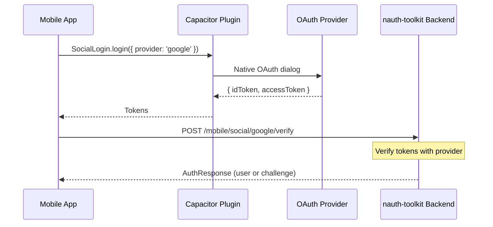

# Native Social Login

Use native OAuth dialogs on iOS and Android instead of web-based redirects. This provides a better UX — users see the native Google/Apple sign-in sheet rather than a browser popup.

## How It Works



**Web flow**: SDK redirects browser to provider, provider redirects back with a code, backend exchanges code for tokens.

**Native flow**: Capacitor plugin shows the native sign-in dialog, returns tokens directly, backend verifies them server-side.

## Installation

```bash npm2yarn
npm install @capgo/capacitor-social-login
```

## Provider Configuration

Initialize social providers on app startup:

```typescript title="src/app/core/services/social-init.ts"
import { SocialLogin } from '@capgo/capacitor-social-login';
import { Capacitor } from '@capacitor/core';

export async function initSocialProviders(config: {
  google: { webClientId: string };
  apple?: { clientId: string; redirectUrl: string };
  facebook?: { appId: string };
}): Promise<void> {
  if (!Capacitor.isNativePlatform()) return;

  await SocialLogin.initialize({
    google: { webClientId: config.google.webClientId },
    apple: config.apple ? {
      clientId: config.apple.clientId,
      redirectUrl: config.apple.redirectUrl,
    } : undefined,
    facebook: config.facebook ? {
      appId: config.facebook.appId,
    } : undefined,
  });
}
```

## Usage

### Detect Platform and Choose Flow

```typescript title="src/app/auth/login/login.component.ts"
import { Component } from '@angular/core';
import { Capacitor } from '@capacitor/core';
import { SocialLogin } from '@capgo/capacitor-social-login';
import { AuthService } from '@nauth-toolkit/client-angular';
import { environment } from '../../../environments/environment';

@Component({
  selector: 'app-login',
  template: `
    <button (click)="loginWithGoogle()">Sign in with Google</button>
    @if (!isAndroid) {
      <button (click)="loginWithApple()">Sign in with Apple</button>
    }
  `,
})
export class LoginComponent {
  isAndroid = Capacitor.getPlatform() === 'android';
  private isMobile = Capacitor.isNativePlatform();

  constructor(private authService: AuthService) {}

  async loginWithGoogle(): Promise<void> {
    if (this.isMobile) {
      await this.nativeLogin('google');
    } else {
      await this.authService.loginWithSocial('google', {
        returnTo: environment.nauthConfig.redirectUrl,
      });
    }
  }

  async loginWithApple(): Promise<void> {
    if (this.isMobile) {
      await this.nativeLogin('apple');
    } else {
      await this.authService.loginWithSocial('apple', {
        returnTo: environment.nauthConfig.redirectUrl,
      });
    }
  }

  private async nativeLogin(provider: 'google' | 'apple' | 'facebook'): Promise<void> {
    const result = await SocialLogin.login({ provider, options: {} });
    const profile = result.result;

    await this.authService.verifyNativeSocial({
      provider,
      idToken: profile.idToken,
      accessToken: profile.accessToken,
    });

    // AuthService emits auth:success or auth:challenge — navigation handled by subscribers
  }
}
```

### React Implementation

```typescript title="src/pages/LoginPage.tsx"
import { SocialLogin } from '@capgo/capacitor-social-login';
import { Capacitor } from '@capacitor/core';
import { useAuth } from '../hooks/useAuth';

export function LoginPage() {
  const { loginWithGoogle } = useAuth();
  const isMobile = Capacitor.isNativePlatform();

  async function handleGoogleLogin() {
    if (isMobile) {
      const result = await SocialLogin.login({
        provider: 'google',
        options: {},
      });
      // Call verifyNativeSocial directly on the client
      // (add to your AuthContext as needed)
    } else {
      await loginWithGoogle();
    }
  }

  return <button onClick={handleGoogleLogin}>Sign in with Google</button>;
}
```

## Platform Notes

### Apple Sign-In

- Only available on iOS and macOS — hide the button on Android
- Requires Apple Developer account with Sign In with Apple capability
- Uses native `ASAuthorizationController` on iOS

### Google Sign-In

- Works on both iOS and Android
- Requires `webClientId` from Google Cloud Console
- Uses Google Identity Services on Android, Google Sign-In SDK on iOS

### Facebook Login

- Works on both iOS and Android
- Requires Facebook App ID from Facebook Developer Console
- Uses the Facebook SDK natively

## Related Documentation

- [Capacitor Setup](./capacitor-setup) - Configure SDK for mobile
- [Social Authentication](../guides/social-auth) - Web-based social auth
- [Challenge Handling](../guides/challenge-handling) - Handle MFA after social login
