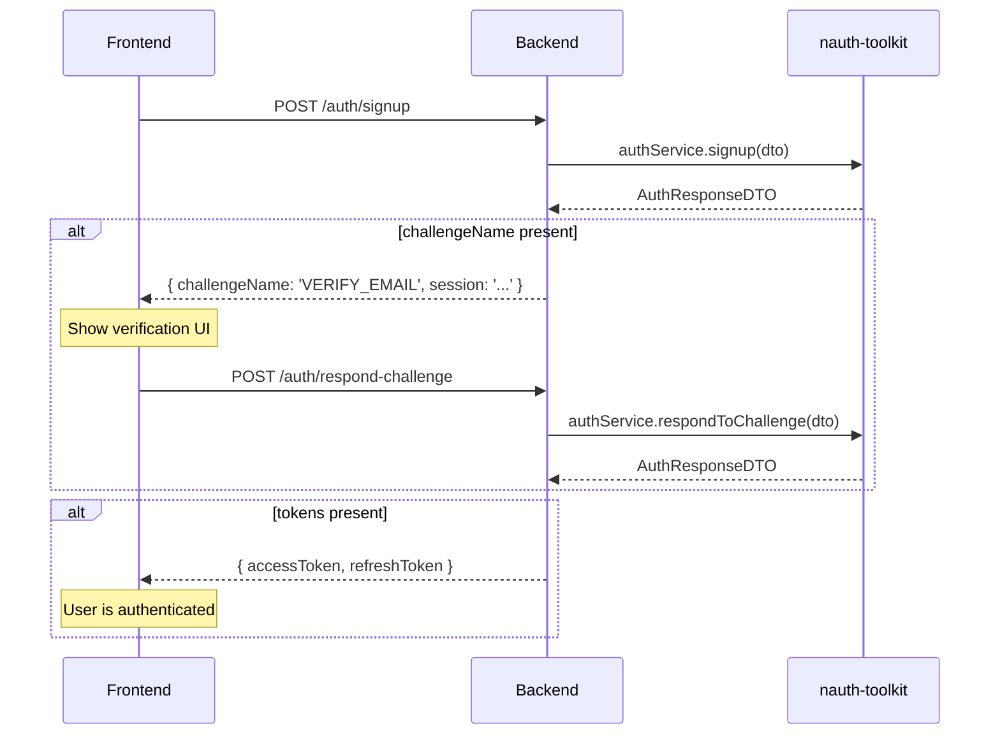

import Tabs from '@theme/Tabs';
import TabItem from '@theme/TabItem';

# Basic Auth Flows

This guide walks through implementing core authentication: signup with email verification, login, challenge handling, token refresh, logout, and password reset.

By the end you will have a working auth layer with these endpoints:

| Endpoint                        | Method | Auth      | Purpose                                        |
| ------------------------------- | ------ | --------- | ---------------------------------------------- |
| `/auth/signup`                  | POST   | Public    | Register a new user                            |
| `/auth/login`                   | POST   | Public    | Authenticate with email + password             |
| `/auth/respond-challenge`       | POST   | Public    | Complete email verification (or any challenge) |
| `/auth/challenge/resend`        | POST   | Public    | Resend verification code                       |
| `/auth/refresh`                 | POST   | Public    | Get new access token using refresh token       |
| `/auth/logout`                  | GET    | Protected | End current session                            |
| `/auth/forgot-password`         | POST   | Public    | Request password reset code                    |
| `/auth/forgot-password/confirm` | POST   | Public    | Reset password with code                       |
| `/auth/change-password`         | POST   | Protected | Change password (authenticated)                |
| `/auth/profile`                 | GET    | Protected | Get current user profile                       |

:::tip Sample apps
The code in this guide is taken directly from the example apps. If you get stuck, clone and run them:

- [`Github Samples & Community`](https://github.com/noorixorg/nauth)
  :::

## Prerequisites

You have completed the [Quick Start](/docs/quick-start/nestjs) for your framework and have:

- nauth-toolkit installed and configured
- A database connection (PostgreSQL or MySQL)
- A storage adapter (database or Redis)
- An email provider configured (use `ConsoleEmailProvider` for development)

The configuration used in this guide:

```typescript
signup: {
  enabled: true,
  verificationMethod: 'email',    // email verification ON
  // phoneVerification is not configured — phone verification OFF
  emailVerification: {
    expiresIn: 3600,               // 1 hour
    resendDelay: 60,               // 1 minute between resends
    rateLimitMax: 3,
    rateLimitWindow: 3600,
  },
},
```

See [Configuration](/docs/concepts/configuration) for the full reference.

## How the Challenge System Works

Before diving into routes, understand the pattern every auth endpoint follows. Instead of separate endpoints for each verification type, nauth-toolkit uses a **single challenge/response loop**:



Every auth operation (`signup`, `login`, social login) returns an [`AuthResponseDTO`](/docs/api/core/dto/auth-response-dto). Check `challengeName`:

- **Present** — the user must complete a challenge (email verification, MFA, etc.). The `session` token identifies this pending flow.
- **Absent** — authentication is complete. Tokens are delivered per your [`tokenDelivery`](/docs/concepts/configuration#token-delivery) config.

This means you only need **one** challenge-handling endpoint for email verification, phone verification, MFA, and forced password change. The `type` field in the request tells nauth-toolkit which challenge you're responding to.

## Signup

Creates a new user account. With `verificationMethod: 'email'`, the response always contains a `VERIFY_EMAIL` challenge instead of tokens.

<Tabs groupId="platform">
<TabItem value="nestjs" label="NestJS" default>

```typescript title="src/auth/auth.controller.ts"
import { Controller, Post, Body, UseGuards, HttpCode, HttpStatus } from '@nestjs/common';
import { AuthService, SignupDTO, AuthResponseDTO, AuthGuard, Public } from '@nauth-toolkit/nestjs';

@UseGuards(AuthGuard)
@Controller('auth')
export class AuthController {
  constructor(private readonly authService: AuthService) {}

  @Public()
  @Post('signup')
  @HttpCode(HttpStatus.CREATED)
  async signup(@Body() dto: SignupDTO): Promise<AuthResponseDTO> {
    return await this.authService.signup(dto);
  }
}
```

[`@UseGuards(AuthGuard)`](/docs/api/nestjs/guards/auth-guard) at class level protects all routes by default. Routes marked [`@Public()`](/docs/api/nestjs/decorators/public) skip JWT validation.

</TabItem>
<TabItem value="express" label="Express">

```typescript title="src/routes/auth.routes.ts"
import { Router, Request, Response, NextFunction, RequestHandler } from 'express';
import { NAuthInstance, ExpressMiddlewareType } from '@nauth-toolkit/core';

export function createAuthRoutes(nauth: NAuthInstance<ExpressMiddlewareType, RequestHandler>): Router {
  const router = Router();
  const { authService } = nauth;

  router.post('/signup', nauth.helpers.public(), async (req: Request, res: Response, next: NextFunction) => {
    try {
      res.status(201).json(await authService.signup(req.body));
    } catch (err) {
      next(err);
    }
  });

  return router;
}
```

`nauth.helpers.public()` marks the route as public (skips JWT validation).

</TabItem>
<TabItem value="fastify" label="Fastify">

```typescript title="src/routes/auth.routes.ts"
import { FastifyInstance } from 'fastify';
import { NAuthInstance } from '@nauth-toolkit/core';

export async function registerAuthRoutes(fastify: FastifyInstance, nauth: NAuthInstance): Promise<void> {
  const { authService } = nauth;

  fastify.post(
    '/signup',
    { preHandler: nauth.helpers.public() as any },
    nauth.adapter.wrapRouteHandler(async (req, res) => {
      res.status(201).json(await authService.signup(req.body as any));
    }) as any,
  );
}
```

`nauth.adapter.wrapRouteHandler()` initializes the request context (client info, CSRF, token delivery) before your handler runs.

</TabItem>
</Tabs>

**Request body** ([`SignupDTO`](/docs/api/core/dto/signup-dto)):

```json
{
  "email": "john@example.com",
  "password": "SecurePass123!",
  "firstName": "John",
  "lastName": "Doe"
}
```

**Response** — with email verification enabled, you always get a challenge:

```json
{
  "challengeName": "VERIFY_EMAIL",
  "session": "a21b654c-2746-4168-acee-c175083a65cd",
  "challengeParameters": {
    "codeDeliveryDestination": "j***@example.com"
  }
}
```

The `session` token is short-lived and scoped to this verification flow. Store it in your frontend state — you will need it for the next step.

:::note Email masking
`codeDeliveryDestination` shows a masked email by default (`j***@example.com`). To return the full email (development only), set `security.maskSensitiveData: false` in your config.
:::

## Respond to Challenge

This is the **single unified endpoint** that handles all challenge types. The `type` field tells nauth-toolkit what you're responding to.

<Tabs groupId="platform">
<TabItem value="nestjs" label="NestJS" default>

```typescript title="src/auth/auth.controller.ts"
import { RespondChallengeDTO } from '@nauth-toolkit/nestjs';

// Inside AuthController class:

@Public()
@Post('respond-challenge')
@HttpCode(HttpStatus.OK)
async respondToChallenge(@Body() dto: RespondChallengeDTO): Promise<AuthResponseDTO> {
  return await this.authService.respondToChallenge(dto);
}
```

</TabItem>
<TabItem value="express" label="Express">

```typescript title="src/routes/auth.routes.ts"
router.post('/respond-challenge', nauth.helpers.public(), async (req: Request, res: Response, next: NextFunction) => {
  try {
    res.json(await authService.respondToChallenge(req.body));
  } catch (err) {
    next(err);
  }
});
```

</TabItem>
<TabItem value="fastify" label="Fastify">

```typescript title="src/routes/auth.routes.ts"
fastify.post(
  '/respond-challenge',
  { preHandler: nauth.helpers.public() as any },
  nauth.adapter.wrapRouteHandler(async (req, res) => {
    res.json(await authService.respondToChallenge(req.body as any));
  }) as any,
);
```

</TabItem>
</Tabs>

### Email verification

After signup, the user receives a 6-digit code via email. Send it back with the session token:

**Request body** ([`RespondChallengeDTO`](/docs/api/core/dto/respond-challenge-dto)):

```json
{
  "session": "a21b654c-2746-4168-acee-c175083a65cd",
  "type": "VERIFY_EMAIL",
  "code": "123456"
}
```

**Success response** — verification complete, tokens issued:

```json
{
  "accessToken": "eyJhbGciOiJIUzI1NiJ9...",
  "refreshToken": "eyJhbGciOiJIUzI1NiJ9...",
  "accessTokenExpiresAt": 1740000900,
  "refreshTokenExpiresAt": 1740604800,
  "authMethod": "password",
  "trusted": false,
  "user": {
    "sub": "a21b654c-2746-4168-acee-c175083a65cd",
    "email": "john@example.com",
    "firstName": "John",
    "lastName": "Doe",
    "isEmailVerified": true
  }
}
```

If MFA is enabled and the user has MFA set up, the response may contain another challenge (`MFA_REQUIRED`) instead of tokens. See the [MFA guide](/docs/guides/mfa/how-mfa-works) for handling that flow.

### Other challenge types (same endpoint)

This same endpoint handles every challenge type. Here are the request shapes for reference:

**Phone verification** (when `verificationMethod: 'phone'` or `'both'`):

```json
{
  "session": "...",
  "type": "VERIFY_PHONE",
  "code": "123456"
}
```

**Phone number collection** — if the user doesn't have a phone number yet (e.g., signed up with email only), you can collect it through the same challenge:

```json
{
  "session": "...",
  "type": "VERIFY_PHONE",
  "phone": "+1234567890"
}
```

After submitting the phone number, the backend sends an SMS and returns the same challenge for code verification.

**MFA verification** (covered in the [MFA guide](/docs/guides/mfa/how-mfa-works)):

```json
{
  "session": "...",
  "type": "MFA_REQUIRED",
  "method": "totp",
  "code": "123456"
}
```

**Forced password change**:

```json
{
  "session": "...",
  "type": "FORCE_CHANGE_PASSWORD",
  "newPassword": "NewSecurePass123!"
}
```

## Resend Code

Users may not receive the verification email in time, or the code may expire. This endpoint resends the code for the current challenge session.

<Tabs groupId="platform">
<TabItem value="nestjs" label="NestJS" default>

```typescript title="src/auth/auth.controller.ts"
import { ResendCodeDTO, ResendCodeResponseDTO } from '@nauth-toolkit/nestjs';

// Inside AuthController class:

@Public()
@Post('challenge/resend')
@HttpCode(HttpStatus.OK)
async resendCode(@Body() dto: ResendCodeDTO): Promise<ResendCodeResponseDTO> {
  return await this.authService.resendCode(dto);
}
```

</TabItem>
<TabItem value="express" label="Express">

```typescript title="src/routes/auth.routes.ts"
router.post('/challenge/resend', nauth.helpers.public(), async (req: Request, res: Response, next: NextFunction) => {
  try {
    res.json(await authService.resendCode(req.body));
  } catch (err) {
    next(err);
  }
});
```

</TabItem>
<TabItem value="fastify" label="Fastify">

```typescript title="src/routes/auth.routes.ts"
fastify.post(
  '/challenge/resend',
  { preHandler: nauth.helpers.public() as any },
  nauth.adapter.wrapRouteHandler(async (req, res) => {
    res.json(await authService.resendCode(req.body as any));
  }) as any,
);
```

</TabItem>
</Tabs>

**Request body** ([`ResendCodeDTO`](/docs/api/core/dto/resend-code-dto)):

```json
{
  "session": "a21b654c-2746-4168-acee-c175083a65cd"
}
```

**Response**:

```json
{
  "destination": "j***@example.com"
}
```

:::warning Rate limiting
Resend is rate-limited by `signup.emailVerification.resendDelay` (default: 60 seconds) and `rateLimitMax` (default: 3 per window). If the user hits the limit, a `429 Too Many Requests` error is returned. See [Rate Limiting](/docs/guides/rate-limiting) for details.
:::

## Login

Authenticates a user with identifier (email, username, or phone) and password. Returns tokens directly, or a challenge if email verification is pending or MFA is required.

<Tabs groupId="platform">
<TabItem value="nestjs" label="NestJS" default>

```typescript title="src/auth/auth.controller.ts"
import { LoginDTO } from '@nauth-toolkit/nestjs';

// Inside AuthController class:

@Public()
@Post('login')
@HttpCode(HttpStatus.OK)
async login(@Body() dto: LoginDTO): Promise<AuthResponseDTO> {
  return await this.authService.login(dto);
}
```

</TabItem>
<TabItem value="express" label="Express">

```typescript title="src/routes/auth.routes.ts"
router.post('/login', nauth.helpers.public(), async (req: Request, res: Response, next: NextFunction) => {
  try {
    res.json(await authService.login(req.body));
  } catch (err) {
    next(err);
  }
});
```

</TabItem>
<TabItem value="fastify" label="Fastify">

```typescript title="src/routes/auth.routes.ts"
fastify.post(
  '/login',
  { preHandler: nauth.helpers.public() as any },
  nauth.adapter.wrapRouteHandler(async (req, res) => {
    res.json(await authService.login(req.body as any));
  }) as any,
);
```

</TabItem>
</Tabs>

**Request body** ([`LoginDTO`](/docs/api/core/dto/login-dto)):

```json
{
  "identifier": "john@example.com",
  "password": "SecurePass123!"
}
```

The `identifier` field accepts email, username, or phone depending on your [`login.identifierType`](/docs/concepts/configuration#login-configuration) config. When not configured, all types are accepted.

**Possible responses:**

| Scenario                                   | Response                                                                |
| ------------------------------------------ | ----------------------------------------------------------------------- |
| Email verified, no MFA                     | `{ accessToken, refreshToken, accessTokenExpiresAt, refreshTokenExpiresAt }` |
| Email not verified                         | `{ challengeName: 'VERIFY_EMAIL', session, challengeParameters }`       |
| MFA required                               | `{ challengeName: 'MFA_REQUIRED', session, challengeParameters }`       |
| MFA setup required (enforcement: REQUIRED) | `{ challengeName: 'MFA_SETUP_REQUIRED', session, challengeParameters }` |
| Password expired                           | `{ challengeName: 'FORCE_CHANGE_PASSWORD', session }`                   |

All challenge responses are handled by the same `/auth/respond-challenge` endpoint documented above.

:::note Account lockout
If `lockout.enabled: true`, failed login attempts from the same IP are tracked. After `maxAttempts` failures within `attemptWindow`, the IP is locked out for `duration` seconds. See [Configuration > Account Lockout](/docs/concepts/configuration#password-security).
:::

## Refresh Token

Issues a new access token using a valid refresh token. The refresh token itself is rotated on every use (a new refresh token is returned). Old refresh tokens are invalidated.

<Tabs groupId="platform">
<TabItem value="nestjs" label="NestJS" default>

```typescript title="src/auth/auth.controller.ts"
import { Req } from '@nestjs/common';
import { RefreshTokenDTO, TokenResponse } from '@nauth-toolkit/nestjs';
import type { Request } from 'express';

// Inside AuthController class:

@Public()
@Post('refresh')
@HttpCode(HttpStatus.OK)
async refresh(@Body() dto: RefreshTokenDTO, @Req() req: Request): Promise<TokenResponse> {
  return await this.authService.refreshToken({
    refreshToken: dto?.refreshToken || req.cookies?.['nauth_refresh_token'],
  });
}
```

</TabItem>
<TabItem value="express" label="Express">

```typescript title="src/routes/auth.routes.ts"
router.post('/refresh', nauth.helpers.public(), async (req: Request, res: Response, next: NextFunction) => {
  try {
    // Cookies mode: fall back to cookie if body token is absent or empty
    const token = req.body?.refreshToken?.trim() || req.cookies?.['nauth_refresh_token'];
    res.json(await authService.refreshToken({ refreshToken: token }));
  } catch (err) {
    next(err);
  }
});
```

</TabItem>
<TabItem value="fastify" label="Fastify">

```typescript title="src/routes/auth.routes.ts"
fastify.post(
  '/refresh',
  { preHandler: nauth.helpers.public() as any },
  nauth.adapter.wrapRouteHandler(async (req, res) => {
    const token = (req.body as any)?.refreshToken?.trim() || req.cookies?.['nauth_refresh_token'];
    res.json(await authService.refreshToken({ refreshToken: token }));
  }) as any,
);
```

</TabItem>
</Tabs>

**Request body** ([`RefreshTokenDTO`](/docs/api/core/dto/refresh-token-dto)) — for `json` token delivery:

```json
{
  "refreshToken": "eyJhbGciOiJIUzI1NiJ9..."
}
```

For `cookies` or `hybrid` mode, the refresh token is sent automatically via the `nauth_refresh_token` httpOnly cookie. The body can be empty — the route handler falls back to the cookie value.

**Response**:

```json
{
  "accessToken": "eyJhbGciOiJIUzI1NiJ9...",
  "refreshToken": "eyJhbGciOiJIUzI1NiJ9...",
  "accessTokenExpiresAt": 1740000900,
  "refreshTokenExpiresAt": 1740604800
}
```

:::warning Reuse detection
If `jwt.refreshToken.reuseDetection: true` (recommended), using an already-rotated refresh token invalidates the **entire token family** and forces re-authentication. This detects token theft — if an attacker replays an old refresh token, all sessions in that family are revoked.
:::

## Logout

Ends the current session and clears authentication cookies. Uses GET to avoid CSRF issues for session destruction.

<Tabs groupId="platform">
<TabItem value="nestjs" label="NestJS" default>

```typescript title="src/auth/auth.controller.ts"
import { Get, Query } from '@nestjs/common';
import { LogoutDTO, LogoutResponseDTO } from '@nauth-toolkit/nestjs';

// Inside AuthController class (no @Public — requires valid JWT):

@Get('logout')
@HttpCode(HttpStatus.OK)
async logout(@Query() dto: LogoutDTO): Promise<LogoutResponseDTO> {
  return await this.authService.logout(dto);
}
```

</TabItem>
<TabItem value="express" label="Express">

```typescript title="src/routes/auth.routes.ts"
// csrf: false — GET requests don't need CSRF protection
router.get(
  '/logout',
  nauth.helpers.requireAuth({ csrf: false }),
  async (req: Request, res: Response, next: NextFunction) => {
    try {
      res.json(await authService.logout(req.query));
    } catch (err) {
      next(err);
    }
  },
);
```

</TabItem>
<TabItem value="fastify" label="Fastify">

```typescript title="src/routes/auth.routes.ts"
fastify.get(
  '/logout',
  { preHandler: nauth.helpers.requireAuth({ csrf: false }) as any },
  nauth.adapter.wrapRouteHandler(async (req, res) => {
    res.json(await authService.logout(req.query as any));
  }) as any,
);
```

</TabItem>
</Tabs>

**Query parameters** ([`LogoutDTO`](/docs/api/core/dto/logout-dto)):

| Parameter  | Type      | Description                                                                  |
| ---------- | --------- | ---------------------------------------------------------------------------- |
| `forgetMe` | `boolean` | Optional. If `true`, also untrusts the device (removes device token cookie). |

**Response**:

```json
{
  "success": true
}
```

In `cookies` or `hybrid` mode, the response also clears the `nauth_access_token`, `nauth_refresh_token`, and `nauth_csrf_token` cookies automatically.

:::note Why GET?
Logout uses GET instead of POST so that:

- No request body is needed
- No CSRF token is required (GET requests are exempt)
- The frontend can trigger logout with a simple redirect or `fetch()`

The `sub` (user ID) is extracted automatically from the JWT in the request. You don't need to pass it in the body.
:::

## Forgot Password

Two-step password reset flow: request a code, then confirm with the code and new password.

### Step 1: Request reset code

<Tabs groupId="platform">
<TabItem value="nestjs" label="NestJS" default>

```typescript title="src/auth/auth.controller.ts"
import { ForgotPasswordDTO, ForgotPasswordResponseDTO } from '@nauth-toolkit/nestjs';

// Inside AuthController class:

@Public()
@Post('forgot-password')
@HttpCode(HttpStatus.OK)
async forgotPassword(@Body() dto: ForgotPasswordDTO): Promise<ForgotPasswordResponseDTO> {
  // baseUrl constructs a clickable link in the email: ${baseUrl}?code=${code}
  dto.baseUrl = `${process.env.FRONTEND_BASE_URL || 'http://localhost:4200'}/auth/reset-password`;
  return await this.authService.forgotPassword(dto);
}
```

</TabItem>
<TabItem value="express" label="Express">

```typescript title="src/routes/auth.routes.ts"
router.post('/forgot-password', nauth.helpers.public(), async (req: Request, res: Response, next: NextFunction) => {
  try {
    // baseUrl used by toolkit to construct the reset link in the email
    res.json(await authService.forgotPassword({ ...req.body, baseUrl: 'http://localhost:4200/auth/reset-password' }));
  } catch (err) {
    next(err);
  }
});
```

</TabItem>
<TabItem value="fastify" label="Fastify">

```typescript title="src/routes/auth.routes.ts"
fastify.post(
  '/forgot-password',
  { preHandler: nauth.helpers.public() as any },
  nauth.adapter.wrapRouteHandler(async (req, res) => {
    res.json(await authService.forgotPassword({
      ...(req.body as any),
      baseUrl: 'http://localhost:4200/auth/reset-password',
    }));
  }) as any,
);
```

</TabItem>
</Tabs>

**Request body** ([`ForgotPasswordDTO`](/docs/api/core/dto/forgot-password-dto)):

```json
{
  "identifier": "john@example.com"
}
```

**Response**:

```json
{
  "success": true,
  "destination": "u***@example.com",
  "deliveryMedium": "email",
  "expiresIn": 900
}
```

:::note Security
The response is always the same regardless of whether the account exists. This prevents user enumeration attacks. The `baseUrl` is optional — if provided, the email includes a clickable reset link; otherwise, only the 6-digit code is sent.
:::

### Step 2: Confirm reset

<Tabs groupId="platform">
<TabItem value="nestjs" label="NestJS" default>

```typescript title="src/auth/auth.controller.ts"
import { ConfirmForgotPasswordDTO, ConfirmForgotPasswordResponseDTO } from '@nauth-toolkit/nestjs';

// Inside AuthController class:

@Public()
@Post('forgot-password/confirm')
@HttpCode(HttpStatus.OK)
async confirmForgotPassword(@Body() dto: ConfirmForgotPasswordDTO): Promise<ConfirmForgotPasswordResponseDTO> {
  return await this.authService.confirmForgotPassword(dto);
}
```

</TabItem>
<TabItem value="express" label="Express">

```typescript title="src/routes/auth.routes.ts"
router.post(
  '/forgot-password/confirm',
  nauth.helpers.public(),
  async (req: Request, res: Response, next: NextFunction) => {
    try {
      res.json(await authService.confirmForgotPassword(req.body));
    } catch (err) {
      next(err);
    }
  },
);
```

</TabItem>
<TabItem value="fastify" label="Fastify">

```typescript title="src/routes/auth.routes.ts"
fastify.post(
  '/forgot-password/confirm',
  { preHandler: nauth.helpers.public() as any },
  nauth.adapter.wrapRouteHandler(async (req, res) => {
    res.json(await authService.confirmForgotPassword(req.body as any));
  }) as any,
);
```

</TabItem>
</Tabs>

**Request body** ([`ConfirmForgotPasswordDTO`](/docs/api/core/dto/forgot-password-dto)):

```json
{
  "identifier": "john@example.com",
  "code": "123456",
  "newPassword": "NewSecurePass123!"
}
```

The new password is validated against your [`password`](/docs/concepts/configuration#password-security) policy (min length, complexity, history, etc.).

## Change Password

Allows an authenticated user to change their current password. Requires the old password for verification.

<Tabs groupId="platform">
<TabItem value="nestjs" label="NestJS" default>

```typescript title="src/auth/auth.controller.ts"
import { ChangePasswordDTO, ChangePasswordResponseDTO } from '@nauth-toolkit/nestjs';

// Inside AuthController class (no @Public — requires valid JWT):

@Post('change-password')
@HttpCode(HttpStatus.OK)
async changePassword(@Body() dto: ChangePasswordDTO): Promise<ChangePasswordResponseDTO> {
  return await this.authService.changePassword(dto);
}
```

</TabItem>
<TabItem value="express" label="Express">

```typescript title="src/routes/auth.routes.ts"
router.post(
  '/change-password',
  nauth.helpers.requireAuth(),
  async (req: Request, res: Response, next: NextFunction) => {
    try {
      res.json(await authService.changePassword(req.body));
    } catch (err) {
      next(err);
    }
  },
);
```

</TabItem>
<TabItem value="fastify" label="Fastify">

```typescript title="src/routes/auth.routes.ts"
fastify.post(
  '/change-password',
  { preHandler: nauth.helpers.requireAuth() as any },
  nauth.adapter.wrapRouteHandler(async (req, res) => {
    res.json(await authService.changePassword(req.body as any));
  }) as any,
);
```

</TabItem>
</Tabs>

**Request body** ([`ChangePasswordDTO`](/docs/api/core/dto/change-password-dto)):

```json
{
  "oldPassword": "SecurePass123!",
  "newPassword": "EvenMoreSecure456!"
}
```

If `password.historyCount` is configured (e.g., `5`), the new password cannot match the last N passwords.

## Get Profile

Returns the authenticated user's profile.

<Tabs groupId="platform">
<TabItem value="nestjs" label="NestJS" default>

```typescript title="src/auth/auth.controller.ts"
import { CurrentUser, IUser, UserResponseDTO } from '@nauth-toolkit/nestjs';

// Inside AuthController class (no @Public — requires valid JWT):

@Get('profile')
async getProfile(@CurrentUser() user: IUser): Promise<UserResponseDTO> {
  return UserResponseDTO.fromEntity(user);
}
```

`@CurrentUser()` extracts the user from the JWT-validated request. `UserResponseDTO.fromEntity()` strips sensitive fields (password hash, etc.) before returning.

</TabItem>
<TabItem value="express" label="Express">

```typescript title="src/routes/auth.routes.ts"
import { IUser, UserResponseDTO } from '@nauth-toolkit/core';

router.get('/profile', nauth.helpers.requireAuth(), (_req: Request, res: Response, next: NextFunction) => {
  try {
    const user = nauth.helpers.getCurrentUser() as IUser;
    res.json(UserResponseDTO.fromEntity(user));
  } catch (err) {
    next(err);
  }
});
```

</TabItem>
<TabItem value="fastify" label="Fastify">

```typescript title="src/routes/auth.routes.ts"
fastify.get(
  '/profile',
  { preHandler: nauth.helpers.requireAuth() as any },
  nauth.adapter.wrapRouteHandler(async (_req, res) => {
    const user = nauth.helpers.getCurrentUser() as IUser;
    res.json(UserResponseDTO.fromEntity(user));
  }) as any,
);
```

</TabItem>
</Tabs>

## Error Handling

Set up a global error handler so [`NAuthException`](/docs/concepts/error-handling) errors are returned as structured JSON.

<Tabs groupId="platform">
<TabItem value="nestjs" label="NestJS" default>

```typescript title="src/main.ts"
import { NestFactory } from '@nestjs/core';
import { ExpressAdapter } from '@nestjs/platform-express';
import cookieParser from 'cookie-parser';
import { NAuthHttpExceptionFilter, NAuthValidationPipe } from '@nauth-toolkit/nestjs';

async function bootstrap(): Promise<void> {
  // ExpressAdapter is required for cookie-based token delivery
  const app = await NestFactory.create(AppModule, new ExpressAdapter());

  // Required for reading nauth_refresh_token and nauth_access_token cookies
  app.use(cookieParser());

  // Translates NAuthException into HTTP responses with error codes
  app.useGlobalFilters(new NAuthHttpExceptionFilter());

  // Validates DTOs using class-validator decorators
  app.useGlobalPipes(new NAuthValidationPipe());

  await app.listen(3000);
}
```

</TabItem>
<TabItem value="express" label="Express">

```typescript title="src/index.ts"
import { NAuthException, getHttpStatusForErrorCode } from '@nauth-toolkit/core';

// After all routes — Express error handler
app.use((error: any, _req: Request, res: Response, _next: NextFunction) => {
  if (error instanceof NAuthException) {
    return res.status(getHttpStatusForErrorCode(error.code)).json(error.toJSON());
  }
  console.error('Unexpected error:', error);
  res.status(500).json({ error: 'Internal server error' });
});
```

</TabItem>
<TabItem value="fastify" label="Fastify">

```typescript title="src/index.ts"
import { NAuthException, getHttpStatusForErrorCode } from '@nauth-toolkit/core';

fastify.setErrorHandler((error, _request, reply) => {
  if (error instanceof NAuthException) {
    return reply.status(getHttpStatusForErrorCode(error.code)).send(error.toJSON());
  }
  fastify.log.error(error);
  reply.status(500).send({ error: 'Internal server error' });
});
```

</TabItem>
</Tabs>

Error responses follow this structure:

```json
{
  "code": "AUTH_INVALID_CREDENTIALS",
  "message": "Invalid email or password",
  "timestamp": "2025-01-15T10:30:00.000Z"
}
```

See [Error Handling](/docs/concepts/error-handling) for the full list of error codes and how to handle them in your frontend.

## Frontend Integration

Here's how the Angular example app handles the auth flow. See the [Angular Quick Start](/docs/quick-start/angular) for full setup details.

### Handling signup + email verification

```typescript title="src/app/signup/signup.component.ts (simplified)"
import { AuthService, AuthResponse } from '@nauth-toolkit/client-angular/standalone';
import { ChallengeOrchestratorService } from '../services/challenge-orchestrator.service';

// Inside SignupComponent:

async onSubmit(): Promise<void> {
  const response: AuthResponse = await this.auth.signup({
    email,
    password,
    firstName,
    lastName,
  });

  // Orchestrator checks response.challengeName and navigates to the correct
  // challenge route (verify-email, mfa-required, etc.) or to the success URL
  await this.orchestrator.handleAuthResponse(response);
}
```

The `ChallengeOrchestratorService` is a service from the sample app that reads `response.challengeName` and routes to the appropriate component — the same pattern applies to any framework.

### Handling login

```typescript title="src/app/login/login.component.ts (simplified)"
// Inside LoginComponent:

async onSubmit(): Promise<void> {
  // AuthService.login() internally calls handleAuthResponse after the request,
  // routing to a challenge or to the success URL automatically
  await this.auth.login(email, password);
}
```

### Resend code

```typescript title="src/app/challenge/otp-verify.component.ts (simplified)"
// Inside OtpVerifyComponent:

async resendCode(): Promise<void> {
  const challenge = this.auth.getCurrentChallenge();
  if (!challenge?.session) return;

  const response = await this.auth.resendCode(challenge.session);
  // response.destination contains the masked email/phone the code was sent to
}
```

## Complete Controller

For reference, here is the complete NestJS controller with all basic auth routes from this guide in a single file:

<details>
<summary>Full auth.controller.ts</summary>

```typescript title="src/auth/auth.controller.ts"
import {
  Controller,
  Post,
  Get,
  Body,
  UseGuards,
  HttpCode,
  HttpStatus,
  Req,
  Query,
  Inject,
  BadRequestException,
} from '@nestjs/common';
import type { Request } from 'express';
import {
  AuthService,
  SignupDTO,
  LoginDTO,
  AuthResponseDTO,
  AuthGuard,
  CurrentUser,
  Public,
  IUser,
  RespondChallengeDTO,
  TokenResponse,
  MFAService,
  LogoutDTO,
  RefreshTokenDTO,
  LogoutResponseDTO,
  ResendCodeDTO,
  ResendCodeResponseDTO,
  ForgotPasswordDTO,
  ForgotPasswordResponseDTO,
  ConfirmForgotPasswordDTO,
  ConfirmForgotPasswordResponseDTO,
  GetSetupDataDTO,
  GetSetupDataResponseDTO,
  GetUserSessionsResponseDTO,
  UserResponseDTO,
  ChangePasswordDTO,
  ChangePasswordResponseDTO,
} from '@nauth-toolkit/nestjs';

@UseGuards(AuthGuard)
@Controller('auth')
export class AuthController {
  constructor(
    private readonly authService: AuthService,
    @Inject(MFAService)
    private readonly mfaService?: MFAService,
  ) {}

  // ── Public endpoints ────────────────────────────────────────────────────

  @Public()
  @Post('signup')
  @HttpCode(HttpStatus.CREATED)
  async signup(@Body() dto: SignupDTO): Promise<AuthResponseDTO> {
    return await this.authService.signup(dto);
  }

  @Public()
  @Post('login')
  @HttpCode(HttpStatus.OK)
  async login(@Body() dto: LoginDTO): Promise<AuthResponseDTO> {
    return await this.authService.login(dto);
  }

  @Public()
  @Post('respond-challenge')
  @HttpCode(HttpStatus.OK)
  async respondToChallenge(@Body() dto: RespondChallengeDTO): Promise<AuthResponseDTO> {
    return await this.authService.respondToChallenge(dto);
  }

  @Public()
  @Post('refresh')
  @HttpCode(HttpStatus.OK)
  async refresh(@Body() dto: RefreshTokenDTO, @Req() req: Request): Promise<TokenResponse> {
    return await this.authService.refreshToken({
      refreshToken: dto?.refreshToken || req.cookies?.['nauth_refresh_token'],
    });
  }

  @Public()
  @Post('forgot-password')
  @HttpCode(HttpStatus.OK)
  async forgotPassword(@Body() dto: ForgotPasswordDTO): Promise<ForgotPasswordResponseDTO> {
    dto.baseUrl = `${process.env.FRONTEND_BASE_URL || 'http://localhost:4200'}/auth/reset-password`;
    return await this.authService.forgotPassword(dto);
  }

  @Public()
  @Post('forgot-password/confirm')
  @HttpCode(HttpStatus.OK)
  async confirmForgotPassword(@Body() dto: ConfirmForgotPasswordDTO): Promise<ConfirmForgotPasswordResponseDTO> {
    return await this.authService.confirmForgotPassword(dto);
  }

  @Public()
  @Post('challenge/resend')
  @HttpCode(HttpStatus.OK)
  async resendCode(@Body() dto: ResendCodeDTO): Promise<ResendCodeResponseDTO> {
    return await this.authService.resendCode(dto);
  }

  @Public()
  @Post('challenge/setup-data')
  @HttpCode(HttpStatus.OK)
  async getSetupData(@Body() dto: GetSetupDataDTO): Promise<GetSetupDataResponseDTO> {
    if (!this.mfaService) {
      throw new BadRequestException('MFA service is not available');
    }
    return await this.mfaService.getSetupData(dto);
  }

  // ── Authenticated endpoints ─────────────────────────────────────────────

  @Get('logout')
  @HttpCode(HttpStatus.OK)
  async logout(@Query() dto: LogoutDTO): Promise<LogoutResponseDTO> {
    return await this.authService.logout(dto);
  }

  @Get('profile')
  async getProfile(@CurrentUser() user: IUser): Promise<UserResponseDTO> {
    return UserResponseDTO.fromEntity(user);
  }

  @Get('sessions')
  @HttpCode(HttpStatus.OK)
  async getUserSessions(): Promise<GetUserSessionsResponseDTO> {
    return await this.authService.getUserSessions();
  }

  @Post('change-password')
  @HttpCode(HttpStatus.OK)
  async changePassword(@Body() dto: ChangePasswordDTO): Promise<ChangePasswordResponseDTO> {
    return await this.authService.changePassword(dto);
  }
}
```

</details>

## What's Next

- **[How MFA Works](/docs/guides/mfa/how-mfa-works)** — Add TOTP, SMS, Email, or Passkey multi-factor authentication
- **[How Social Login Works](/docs/guides/social/how-social-login-works)** — Add Google, Apple, or Facebook OAuth
- **[Admin Operations](/docs/guides/admin-operations)** — Admin signup, password reset, user management
- **[Challenge System](/docs/concepts/challenge-system)** — Deep dive into how challenges work
- **[Token Delivery](/docs/concepts/token-management)** — JSON vs cookies vs hybrid token delivery
- **[Error Handling](/docs/concepts/error-handling)** — Full error code reference
