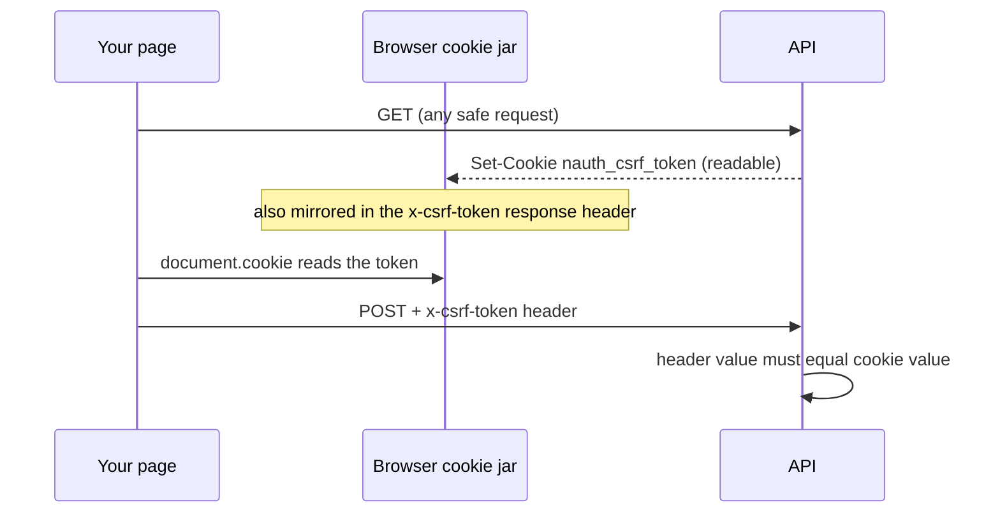

import Tabs from '@theme/Tabs';
import TabItem from '@theme/TabItem';

# Environment Cheat Sheet

In `cookies` and `hybrid` mode the browser, not your code, decides whether auth cookies are stored and sent back. It decides from the flags nauth-toolkit puts on the cookies and from where your frontend and API live. Get one flag wrong and you get logged out immediately after MFA, or `AUTH_CSRF_TOKEN_MISSING` on every POST, or a logout that does nothing. This page gives you the working values for four common topologies.

## The cheat sheet

| # | Frontend | API | `secure` | `sameSite` | `domain` | CORS | Passkey `rpId` |
| --- | --- | --- | --- | --- | --- | --- | --- |
| 1 | `http://localhost:4200` | `http://localhost:3000` | `false` | `lax` | unset | Yes | `localhost` |
| 2 | `http://localhost:4200` | `https://dev.example.com/api` | Not directly supported. See [scenario 2](#2-frontend-on-localhost-api-on-a-remote-host). | | | | |
| 3 | `https://dev.example.com` | `https://dev.example.com/api` | `true` | `lax` | unset | No | `dev.example.com` |
| 4 | `https://dev.example.com` | `https://api.dev.example.com` | `true` | `lax` | `.dev.example.com` | Yes | `dev.example.com` |

Scenarios 3 and 4 are the same site, so `lax` is enough. You do not need `sameSite: 'none'` to talk to a different subdomain: `SameSite` is judged on the registrable domain, and ports and subdomains are not part of it.

## The rule that explains the table

Your frontend page must be able to read the API's CSRF cookie with JavaScript. Everything in the table follows from that.

The access, refresh and device cookies are `HttpOnly`, so script cannot touch them and the browser attaches them for you. The CSRF cookie is deliberately readable, because the frontend has to copy its value into a request header. That copy is the proof the request came from your page rather than someone else's.



A page on `localhost` can never read a cookie belonging to `dev.example.com`, no matter what flags you set. That is why scenario 2 needs a workaround rather than a configuration value.

<details open>
<summary>Vocabulary used in this page</summary>

| Term | Meaning | Reference |
| --- | --- | --- |
| Origin | Scheme, host and port. `localhost:4200` and `localhost:3000` are different origins. Governs CORS. | [same-site vs same-origin](https://web.dev/articles/same-site-same-origin) |
| Site | The registrable domain only, such as `example.com`. Ports and subdomains are ignored. Governs cookies. | same article |
| `HttpOnly` | Script cannot read the cookie; the browser still sends it. | [MDN: Set-Cookie](https://developer.mozilla.org/en-US/docs/Web/HTTP/Reference/Headers/Set-Cookie) |
| `Secure` | Stored and sent over `https://` only. Chrome and Firefox make an exception for `http://localhost`; Safari does not. | [MDN: Secure contexts](https://developer.mozilla.org/en-US/docs/Web/Security/Secure_Contexts) |
| `SameSite` | When the cookie is sent. `strict` only same-site, `lax` also on top-level navigations such as email links and OAuth redirects, `none` always and only with `Secure`. | [MDN: Cookies](https://developer.mozilla.org/en-US/docs/Web/HTTP/Guides/Cookies) |
| `Domain` | Which hosts get the cookie back. Unset means the exact API host only. `.example.com` means every subdomain. Must be a parent of the API host or the browser rejects the cookie outright. | [MDN: Set-Cookie](https://developer.mozilla.org/en-US/docs/Web/HTTP/Reference/Headers/Set-Cookie) |
| CORS | The API must name the exact frontend origin and allow credentials. `*` is rejected when credentials are involved. | [MDN: CORS](https://developer.mozilla.org/en-US/docs/Web/HTTP/Guides/CORS) |
| Double-submit cookie | The CSRF defence used here: a readable cookie plus a matching header. Another site can make the browser send the cookie but cannot read it to build the header. | [OWASP](https://cheatsheetseries.owasp.org/cheatsheets/Cross-Site_Request_Forgery_Prevention_Cheat_Sheet.html) |
| Passkey `rpId` / `origin` | `rpId` must be the page's domain or a parent of it. `origin` must list the exact page origin including port. | [MDN: WebAuthn](https://developer.mozilla.org/en-US/docs/Web/API/Web_Authentication_API) |

</details>

## What the toolkit reads

nauth-toolkit reads config keys, never environment variables. The `COOKIE_*` and `*_BASE_URL` names on this page are only what the example config calls them; in your own app they are whatever you decide. What has to be right is the config key each one feeds.

```typescript title="examples/demo-nestjs/src/config/auth.config.ts"
tokenDelivery: {
  method: 'hybrid',
  cookieOptions: {
    secure: process.env.COOKIE_SECURE === 'true',
    sameSite: (process.env.COOKIE_SAMESITE as 'lax' | 'strict' | 'none') ?? 'lax',
    domain: process.env.COOKIE_DOMAIN,
  },
},
security: {
  csrf: {
    cookieName: 'nauth_csrf_token',
    headerName: 'x-csrf-token',
    cookieOptions: {
      secure: process.env.COOKIE_SECURE === 'true',
      sameSite: (process.env.COOKIE_SAMESITE as 'lax' | 'strict' | 'none') ?? 'lax',
      domain: process.env.COOKIE_DOMAIN,
    },
  },
},
mfa: {
  passkey: {
    rpName: process.env.APP_NAME || 'Nauth App',
    rpId: process.env.PASSKEY_RP_ID || 'localhost',
    origin: getOriginsFromEnv(),
  },
},
social: {
  redirect: {
    frontendBaseUrl: process.env.FRONTEND_BASE_URL || 'http://localhost:4200',
    allowAbsoluteReturnTo: false,
    allowedReturnToOrigins: getOriginsFromEnv(),
  },
  google: {
    callbackUrl: `${process.env.API_BASE_URL || 'http://localhost:3000'}/auth/social/google/callback`,
  },
},
```

`getOriginsFromEnv()` is a local helper in that file: it returns `[FRONTEND_BASE_URL, API_BASE_URL]`, plus both localhost origins when `NODE_ENV` is not `production`.

The CSRF block above is explicit, which is what the sample app does. If you omit `security.csrf.cookieOptions` entirely, `secure`, `sameSite` and `domain` each fall back to the matching `tokenDelivery.cookieOptions` value, so the two cookie sets stay aligned by default. `httpOnly` is forced to `false` for the CSRF cookie whatever you configure.

For the full option reference (`cookieNamePrefix`, `priority`, defaults) see [Configuration > Token Delivery](/docs/concepts/configuration#token-delivery).

### CORS

CORS lives in your bootstrap file, not in nauth-toolkit config.

<Tabs groupId="platform">
<TabItem value="nestjs" label="NestJS" default>

```typescript title="examples/demo-nestjs/src/main.ts"
app.enableCors({
  origin: allowedOrigins,
  credentials: true,
  methods: ['GET', 'POST', 'PUT', 'DELETE', 'PATCH', 'OPTIONS'],
  allowedHeaders: ['Content-Type', 'Authorization', 'X-Device-Id', 'x-csrf-token', 'x-device-token'],
});
```

</TabItem>
<TabItem value="express" label="Express">

```typescript title="examples/starter-express/src/index.ts"
app.use(
  cors({
    origin: [process.env.FRONTEND_BASE_URL || 'http://localhost:4200'],
    credentials: true,
    methods: ['GET', 'POST', 'PUT', 'DELETE', 'PATCH', 'OPTIONS'],
    allowedHeaders: ['Content-Type', 'Authorization', 'X-Device-Id', 'x-csrf-token', 'x-device-token'],
  }),
);
```

</TabItem>
<TabItem value="fastify" label="Fastify">

```typescript title="examples/starter-fastify/src/index.ts"
await fastify.register(fastifyCors, {
  origin: [process.env.FRONTEND_BASE_URL || 'http://localhost:4200'],
  credentials: true,
  methods: ['GET', 'POST', 'PUT', 'DELETE', 'PATCH', 'OPTIONS'],
  allowedHeaders: ['Content-Type', 'Authorization', 'X-Device-Id', 'x-csrf-token', 'x-device-token'],
});
```

</TabItem>
</Tabs>

`credentials: true` and an exact origin are both required. Without them the browser drops the cookies silently.

## 1. Frontend and API both on localhost

Same site, because ports are not part of a site. Different origin, so you still need CORS.

```bash title=".env"
COOKIE_SECURE=false
COOKIE_SAMESITE=lax
# COOKIE_DOMAIN left unset
API_BASE_URL=http://localhost:3000
FRONTEND_BASE_URL=http://localhost:4200
PASSKEY_RP_ID=localhost
```

| Where | Value |
| --- | --- |
| Frontend SDK `baseUrl` | `http://localhost:3000` |
| Google and Facebook redirect URI | `http://localhost:3000/auth/social/google/callback` |
| Apple | Not possible on localhost. See [social provider rules](#social-provider-rules). |

## 2. Frontend on localhost, API on a remote host

Different sites. The browser will not hand a `localhost` page any `dev.example.com` cookie, and `sameSite: 'none'` does not help because the CSRF cookie still cannot be read. Pick one of two workarounds.

### 2a. Dev-server proxy

The browser only ever talks to `localhost:4200`; the dev server forwards `/api` to the real API. Nothing changes on the backend, which keeps its scenario 3 values. Point the SDK `baseUrl` at the relative path `/api`.

<Tabs groupId="frontend">
<TabItem value="angular" label="Angular" default>

```json title="proxy.conf.json"
{
  "/api": {
    "target": "https://dev.example.com",
    "changeOrigin": true,
    "cookieDomainRewrite": "localhost"
  }
}
```

</TabItem>
<TabItem value="react" label="React (Vite)">

```typescript title="vite.config.ts"
export default defineConfig({
  server: {
    proxy: {
      '/api': { target: 'https://dev.example.com', changeOrigin: true, cookieDomainRewrite: 'localhost' },
    },
  },
});
```

</TabItem>
</Tabs>

Password login, email/SMS/TOTP MFA and trusted devices all work. Social login does not, because the OAuth callback stores cookies on `dev.example.com` where the proxied page cannot see them. Passkeys do not either, because the backend's `rpId` is not `localhost`. Safari refuses the backend's `Secure` cookies over `http://localhost`, so use Chrome or Firefox, or serve the dev server over HTTPS.

### 2b. Same-site alias

Make the frontend part of the API's site. Everything works, including social login and passkeys.

1. Point the alias at your machine in `/etc/hosts`. It has to be a subdomain of the same registrable domain as the API, so substitute your own domain for `example.com` throughout this section:

   ```bash title="/etc/hosts"
   127.0.0.1 local.dev.example.com
   ```

2. Issue a certificate the browser will actually trust. [mkcert](https://github.com/FiloSottile/mkcert) installs a local CA and signs for the alias:

   ```bash
   mkcert -install
   mkcert local.dev.example.com
   ```

3. Serve the frontend over HTTPS on that name, passing the certificate:

   ```bash
   ng serve --ssl \
     --ssl-cert local.dev.example.com.pem \
     --ssl-key local.dev.example.com-key.pem \
     --allowed-hosts local.dev.example.com
   ```

   `--allowed-hosts` is the flag people miss. The dev server replies with a "Blocked request" page for any `Host` header it was not told to answer for. Set it permanently as `allowedHosts` under the `serve` options in `angular.json` if you prefer. `--host` only chooses which network interface to bind, and is not what makes the alias reachable.

   Do not rely on bare `--ssl`. With no `--ssl-cert` and `--ssl-key`, Angular falls back to a placeholder certificate issued for `example.org` with no `subjectAltName` at all, and every current browser rejects a certificate that has no SAN matching the host. Worse, if your real domain sends HSTS with `includeSubDomains`, the alias inherits it and the browser gives you no option to click through.

4. Add `https://local.dev.example.com:4200` in three places on the backend: CORS `origin`, `mfa.passkey.origin`, and `social.redirect.allowedReturnToOrigins` alongside `allowAbsoluteReturnTo: true`. All three compare exact origins, so the `:4200` has to be there.

   `allowAbsoluteReturnTo` defaults to `false`, and that default is not harmless here. It forces `returnTo` to be a relative path that resolves to `frontendBaseUrl`'s own origin, so social login completes successfully and then drops you on the deployed frontend rather than your dev server. Turning it on, with the allowlist to keep it safe, is what brings the browser back to `:4200`.

```bash title=".env on the dev.example.com backend"
COOKIE_SECURE=true
COOKIE_SAMESITE=lax
COOKIE_DOMAIN=.dev.example.com
API_BASE_URL=https://dev.example.com/api
FRONTEND_BASE_URL=https://dev.example.com
PASSKEY_RP_ID=dev.example.com
```

`COOKIE_DOMAIN` has to cover the API host and the alias at the same time. `.dev.example.com` manages both here only because the alias is a subdomain of the API's own host. An API living elsewhere under the same registrable domain, `api.example.com` say, needs the nearest shared parent instead: `.example.com`. Ports never appear in this value; cookies ignore them entirely, which is why `:4200` belongs in the three origin settings above and nowhere in the cookie config.

| Where | Value |
| --- | --- |
| Frontend SDK `baseUrl` | `https://dev.example.com/api` |
| Social login call | `loginWithSocial('google', { returnTo: window.location.origin + '/auth/callback' })` |
| Provider redirect URI | The backend's: `https://dev.example.com/api/auth/social/google/callback` |

## 3. Frontend and API on the same origin

The API is served under a path of the frontend's host, usually by a reverse proxy. No CORS, no `domain`, nothing to get wrong. This is how the demo app runs.

```bash title=".env"
COOKIE_SECURE=true
COOKIE_SAMESITE=lax
# COOKIE_DOMAIN left unset
API_BASE_URL=https://dev.example.com/api
FRONTEND_BASE_URL=https://dev.example.com
PASSKEY_RP_ID=dev.example.com
```

| Where | Value |
| --- | --- |
| Frontend SDK `baseUrl` | `https://dev.example.com/api`, or the relative `/api` |
| Provider redirect URI | `https://dev.example.com/api/auth/social/google/callback` |

## 4. Frontend and API on sibling subdomains

Same site, different origin. Needs CORS, and needs `domain` so the frontend host can read the CSRF cookie that the API host sets.

```bash title=".env"
COOKIE_SECURE=true
COOKIE_SAMESITE=lax
COOKIE_DOMAIN=.dev.example.com
API_BASE_URL=https://api.dev.example.com
FRONTEND_BASE_URL=https://dev.example.com
PASSKEY_RP_ID=dev.example.com
```

| Where | Value |
| --- | --- |
| Frontend SDK `baseUrl` | `https://api.dev.example.com` |
| Provider redirect URI | `https://api.dev.example.com/auth/social/google/callback` |

If the API were at `apidev.example.com` instead, `COOKIE_DOMAIN` becomes `.example.com`, the nearest shared parent, and `PASSKEY_RP_ID` stays `dev.example.com`.

## Social provider rules

`callbackUrl` is the backend route including any global prefix such as `/api`, and it must match the provider registration character for character. `frontendBaseUrl` is where the backend sends the browser afterwards.

| Provider | `http://localhost:PORT` | Everything else |
| --- | --- | --- |
| Google | Allowed | HTTPS only |
| Facebook | Allowed while the app is in development mode | HTTPS only |
| Apple | Not allowed: no `localhost`, no `http://` | HTTPS on a public domain. API host under Domains, `callbackUrl` under Return URLs |

To test Apple locally, expose the backend through an HTTPS tunnel and set `API_BASE_URL` to the tunnel URL, or use scenario 3 or 4. Setup details: [Google](/docs/guides/social/google), [Apple](/docs/guides/social/apple), [Facebook](/docs/guides/social/facebook).

## CSRF specifics

CSRF is enforced only in `cookies` and `hybrid` mode, and only on requests that carry an auth cookie. `GET` and `HEAD` are never checked; instead, either one issues a `nauth_csrf_token` cookie when the request arrives without one, so the frontend always holds a token before its first mutating call. The same token is mirrored in the `x-csrf-token` response header. `OPTIONS` is skipped entirely and never issues a token, because browsers omit cookies on preflight and rotating the token there would cause intermittent mismatches.

### Why `GET` and `HEAD` are exempt

CSRF is only a threat to requests that change something. Another site can already make your browser send a `GET` to your API with your cookies attached, and it needs no cooperation from you to do it: an `` tag is enough. What it cannot do is read the response, because the same-origin policy blocks that. An attacker who can trigger a request but never see the result learns nothing, so a token on `GET` would buy no protection.

The exemption is also what makes the scheme work at all. The `GET` is what issues the token, so requiring a token on `GET` would leave a fresh client with no way to obtain its first one.

This rests on an assumption you have to keep true in your own routes: that safe methods have no side effects. A `GET` that mutates state is unprotected no matter what `security.csrf` says. The toolkit's own `GET /auth/logout` is a deliberate exception, marked `csrf: false`, on the grounds that the worst an attacker achieves is signing someone out, while enforcing a token there would strand users whose session had already expired.

| `security.csrf` option | Default | Notes |
| --- | --- | --- |
| `cookieName` | `nauth_csrf_token` | Must match the SDK's `csrf.cookieName`. |
| `headerName` | `x-csrf-token` | Must match the SDK's `csrf.headerName` and appear in CORS `allowedHeaders`. |
| `tokenLength` | `32` | Token size in bytes. |
| `excludedPaths` | `[]` | Path prefixes that skip the check, for webhooks. |
| `cookieOptions` | Falls back to `tokenDelivery.cookieOptions` | `httpOnly` is always `false`. |

The check is also skipped for routes marked public (`@Public()`, `nauth.helpers.public()`), so login and signup need no token, and in `hybrid` mode for any request carrying a Bearer token instead of a cookie, so mobile clients are unaffected. Express and Fastify routes opt out individually with `nauth.helpers.requireAuth({ csrf: false })`. If the header is absent the toolkit also accepts the token in a `_csrf` or `csrfToken` body field.

:::warning[NestJS skips the guard when `security.csrf` is missing]
The NestJS `CsrfGuard` returns early when `config.security.csrf` is undefined, so leaving the block out disables CSRF protection silently rather than falling back to defaults. Always set it in `cookies` and `hybrid` mode.
:::

Full flow: [Token Management > CSRF Protection](/docs/concepts/token-management#csrf-protection).

## Symptom to cause

| Symptom | Cause |
| --- | --- |
| Login or MFA returns 200, the next request is 401 | The cookie was never stored: `secure: true` over `http://` (Safari, or any non-localhost host), a `domain` that is not a parent of the API host, or `sameSite: 'none'` without `secure: true` |
| Cookies visible in DevTools but never sent | Frontend and API are different sites, or CORS is missing `credentials: true` with an exact `origin` |
| `AUTH_CSRF_TOKEN_MISSING` on POST | The page cannot read the CSRF cookie: different site, a `domain` that does not cover the frontend host (scenario 4 without `.dev.example.com`), or a `Secure` cookie on an `http://` page in Safari |
| `AUTH_CSRF_TOKEN_INVALID` on POST | Header and cookie disagree. Usually a stale token after a `cookieName` or `domain` change; clear site data once |
| Logout leaves you logged in | `COOKIE_DOMAIN` changed since the cookie was set, so the clearing `Set-Cookie` targets a different cookie. Clear site data once |
| Social login lands on the wrong app | `frontendBaseUrl` points elsewhere, or the frontend passed an absolute `returnTo` without `allowAbsoluteReturnTo` |
| `redirect_uri_mismatch` from the provider | `callbackUrl` differs from the registered URI in scheme, host, port, or a missing `/api` prefix |
| Passkey registration fails with an origin error | `rpId` is not a parent of the page host, or `origin` does not list the exact page origin including port |

## What's Next

- [Token Management](/docs/concepts/token-management) for delivery modes and the full CSRF flow
- [Configuration > Token Delivery](/docs/concepts/configuration#token-delivery) for every cookie option
- [How Social Login Works](/docs/guides/social/how-social-login-works) for the redirect flow and `returnTo`
- [Passkeys](/docs/guides/mfa/passkey) for `rpId` and `origin`
- [Frontend SDK Configuration](/docs/frontend-sdk/concepts/configuration) for `baseUrl`, `tokenDelivery` and `csrf` on the client
