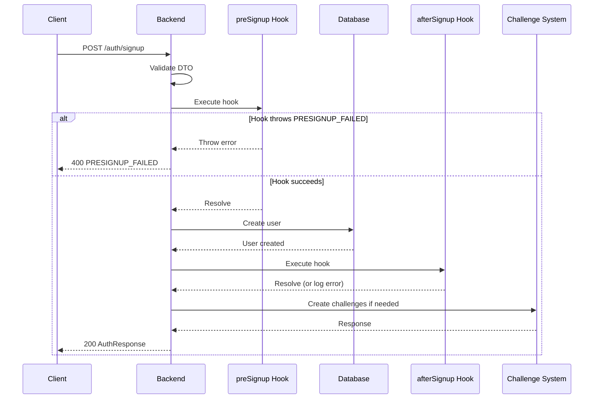
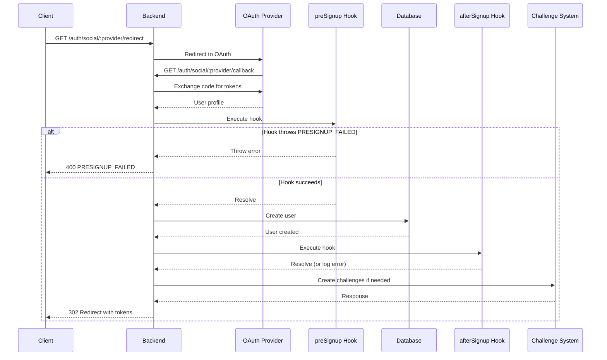

import Tabs from '@theme/Tabs';
import TabItem from '@theme/TabItem';

# Lifecycle Hooks

Lifecycle hooks allow you to extend authentication flows with custom logic at specific points. This guide covers the signup hooks: `preSignup` and `afterSignup`.

This guide assumes you already completed the [Quick Start](/docs/quick-start) and have `AuthModule.forRoot(authConfig)` working.

## Overview

Lifecycle hooks are functions you define in your authentication configuration that are called at specific points in the authentication flow:

- **`preSignup`**: Called before user account creation. Can block signup by throwing an error.
- **`afterSignup`**: Called immediately after account creation, before challenges are created. Non-blocking.

## preSignup Hook

The `preSignup` hook is triggered before user account creation for both password and social signups. Use it to implement custom validation, denylists, invite-only signups, or domain restrictions.

### When It's Called

- **Password signup**: Before user is created in the database
- **Social signup**: Before user is created (for both web redirect and native mobile flows)
- **Admin signup**: Before user is created (both `adminSignup` and `adminSignupSocial`)

### Hook Signature

```typescript
preSignup?: (
  data: unknown, // SignupDTO for password signup, OAuthUserProfile for social signup
  signupType: 'password' | 'social',
  provider?: string, // Only present for social signups
  adminSignup?: boolean, // true for adminSignup/adminSignupSocial, false for regular signup
) => Promise<void>;
```

### Blocking Signup

To block signup, throw `NAuthException` with `AuthErrorCode.PRESIGNUP_FAILED` and a custom message:

```typescript
throw new NAuthException(AuthErrorCode.PRESIGNUP_FAILED, 'This email address is not allowed to sign up');
```

### Configuration

<Tabs groupId="platform">
<TabItem value="nestjs" label="NestJS" default>

```typescript title="src/config/auth.config.ts"
import { NAuthModuleConfig, NAuthException, AuthErrorCode } from '@nauth-toolkit/nestjs';
import { Logger } from '@nestjs/common';

export const authConfig: NAuthModuleConfig = {
  // ... other config ...
  hooks: {
    preSignup: async (data, signupType, provider, adminSignup) => {
      const logger = new Logger('PreSignupHook');

      // Skip validation for admin signups (optional)
      if (adminSignup) {
        logger.log('Admin signup - skipping validation');
        return;
      }

      // Password signup validation
      if (signupType === 'password') {
        const dto = data as any; // SignupDTO

        // Check denylist
        if (await denylistService.isBlocked(dto.email)) {
          throw new NAuthException(AuthErrorCode.PRESIGNUP_FAILED, 'This email address is not allowed to sign up');
        }

        // Invite-only signup
        if (!(await inviteService.isInvited(dto.email))) {
          throw new NAuthException(
            AuthErrorCode.PRESIGNUP_FAILED,
            'Signup requires an invitation. Please contact support.',
          );
        }
      }

      // Social signup validation
      if (signupType === 'social') {
        const profile = data as any; // OAuthUserProfile

        // Block specific domains
        if (profile.email?.endsWith('@blocked-domain.com')) {
          throw new NAuthException(AuthErrorCode.PRESIGNUP_FAILED, 'Signups from this email domain are not allowed');
        }

        // Custom validation
        if (!(await externalService.validateSignup(profile.email, provider))) {
          throw new NAuthException(AuthErrorCode.PRESIGNUP_FAILED, 'Signup validation failed. Please contact support.');
        }
      }
    },
  },
};
```

</TabItem>
<TabItem value="express" label="Express">

```typescript
import { NAuthConfig, NAuthException, AuthErrorCode } from '@nauth-toolkit/core';

export const authConfig: NAuthConfig = {
  // ... other config ...
  hooks: {
    preSignup: async (data, signupType, provider, adminSignup) => {
      // Skip validation for admin signups (optional)
      if (adminSignup) {
        return;
      }

      // Password signup validation
      if (signupType === 'password') {
        const dto = data as any; // SignupDTO

        // Check denylist
        if (await denylistService.isBlocked(dto.email)) {
          throw new NAuthException(AuthErrorCode.PRESIGNUP_FAILED, 'This email address is not allowed to sign up');
        }
      }

      // Social signup validation
      if (signupType === 'social') {
        const profile = data as any; // OAuthUserProfile

        // Block specific domains
        if (profile.email?.endsWith('@blocked-domain.com')) {
          throw new NAuthException(AuthErrorCode.PRESIGNUP_FAILED, 'Signups from this email domain are not allowed');
        }
      }
    },
  },
};
```

</TabItem>
<TabItem value="fastify" label="Fastify">

```typescript
import { NAuthConfig, NAuthException, AuthErrorCode } from '@nauth-toolkit/core';

export const authConfig: NAuthConfig = {
  // ... other config ...
  hooks: {
    preSignup: async (data, signupType, provider, adminSignup) => {
      // Skip validation for admin signups (optional)
      if (adminSignup) {
        return;
      }

      // Password signup validation
      if (signupType === 'password') {
        const dto = data as any; // SignupDTO

        // Check denylist
        if (await denylistService.isBlocked(dto.email)) {
          throw new NAuthException(AuthErrorCode.PRESIGNUP_FAILED, 'This email address is not allowed to sign up');
        }
      }

      // Social signup validation
      if (signupType === 'social') {
        const profile = data as any; // OAuthUserProfile

        // Block specific domains
        if (profile.email?.endsWith('@blocked-domain.com')) {
          throw new NAuthException(AuthErrorCode.PRESIGNUP_FAILED, 'Signups from this email domain are not allowed');
        }
      }
    },
  },
};
```

</TabItem>
</Tabs>

### Use Cases

- **Denylist validation**: Block specific email addresses or domains
- **Invite-only signups**: Require invitation codes or tokens
- **External validation**: Call external services to validate signup eligibility
- **Domain restrictions**: Block or allow specific email domains
- **Custom business rules**: Implement any custom validation logic

### Error Handling

- If the hook throws `NAuthException` with `PRESIGNUP_FAILED`, the signup is blocked and the error message is returned to the client
- If the hook throws any other error, it is wrapped in `PRESIGNUP_FAILED` with the error message
- If the hook resolves successfully, signup proceeds normally

## afterSignup Hook

The `afterSignup` hook is triggered immediately after account creation for both password and social signups. Called before any challenges are created, so the user account exists but may not be fully verified.

### When It's Called

- **Password signup**: Immediately after user is created, before email/phone verification challenges
- **Social signup**: Immediately after user is created (for both web redirect and native mobile flows)
- **Admin signup**: Immediately after user is created (both `adminSignup` and `adminSignupSocial`)

### Hook Signature

```typescript
afterSignup?: (
  user: any,
  metadata?: {
    requiresVerification?: boolean;
    signupType?: 'password' | 'social';
    provider?: string;
  },
) => Promise<void>;
```

**Parameters:**

- `user` - Framework-agnostic user entity (TypeORM/Prisma/Mongoose/etc.)
- `metadata` - Signup metadata
  - `requiresVerification` - Whether user needs to complete verification challenges
  - `signupType` - Type of signup: 'password' or 'social'
  - `provider` - Social provider name (only present for social signups)

### Non-Blocking

The `afterSignup` hook is non-blocking. If it throws an error, the error is logged but signup continues. The user account has already been created.

### Configuration

<Tabs groupId="platform">
<TabItem value="nestjs" label="NestJS" default>

```typescript title="src/config/auth.config.ts"
import { NAuthModuleConfig } from '@nauth-toolkit/nestjs';
import { Logger } from '@nestjs/common';

export const authConfig: NAuthModuleConfig = {
  // ... other config ...
  hooks: {
    afterSignup: async (user, metadata) => {
      const logger = new Logger('AfterSignupHook');

      // Send welcome email
      try {
        await emailService.sendWelcomeEmail(user.email, {
          signupType: metadata?.signupType,
          provider: metadata?.provider,
        });
      } catch (error) {
        logger.error(`Failed to send welcome email: ${error}`);
      }

      // Create user profile in external system
      try {
        await externalService.createProfile({
          userId: user.sub,
          email: user.email,
          firstName: user.firstName,
          lastName: user.lastName,
          signupType: metadata?.signupType,
          provider: metadata?.provider,
        });
      } catch (error) {
        logger.error(`Failed to create external profile: ${error}`);
      }

      // Track signup analytics
      try {
        analytics.track('user_signup', {
          userId: user.sub,
          email: user.email,
          signupType: metadata?.signupType,
          provider: metadata?.provider,
          requiresVerification: metadata?.requiresVerification,
        });
      } catch (error) {
        logger.error(`Failed to track analytics: ${error}`);
      }

      // Initialize user data
      try {
        await userDataService.initializeUser(user.sub);
      } catch (error) {
        logger.error(`Failed to initialize user data: ${error}`);
      }
    },
  },
};
```

</TabItem>
<TabItem value="express" label="Express">

```typescript
import { NAuthConfig } from '@nauth-toolkit/core';

export const authConfig: NAuthConfig = {
  // ... other config ...
  hooks: {
    afterSignup: async (user, metadata) => {
      // Send welcome email
      try {
        await emailService.sendWelcomeEmail(user.email, {
          signupType: metadata?.signupType,
          provider: metadata?.provider,
        });
      } catch (error) {
        console.error('Failed to send welcome email:', error);
      }

      // Create user profile in external system
      try {
        await externalService.createProfile({
          userId: user.sub,
          email: user.email,
          signupType: metadata?.signupType,
          provider: metadata?.provider,
        });
      } catch (error) {
        console.error('Failed to create external profile:', error);
      }

      // Track analytics
      try {
        analytics.track('user_signup', {
          userId: user.sub,
          signupType: metadata?.signupType,
          provider: metadata?.provider,
        });
      } catch (error) {
        console.error('Failed to track analytics:', error);
      }
    },
  },
};
```

</TabItem>
<TabItem value="fastify" label="Fastify">

```typescript
import { NAuthConfig } from '@nauth-toolkit/core';

export const authConfig: NAuthConfig = {
  // ... other config ...
  hooks: {
    afterSignup: async (user, metadata) => {
      // Send welcome email
      try {
        await emailService.sendWelcomeEmail(user.email, {
          signupType: metadata?.signupType,
          provider: metadata?.provider,
        });
      } catch (error) {
        fastify.log.error(`Failed to send welcome email: ${error}`);
      }

      // Create user profile in external system
      try {
        await externalService.createProfile({
          userId: user.sub,
          email: user.email,
          signupType: metadata?.signupType,
          provider: metadata?.provider,
        });
      } catch (error) {
        fastify.log.error(`Failed to create external profile: ${error}`);
      }

      // Track analytics
      try {
        analytics.track('user_signup', {
          userId: user.sub,
          signupType: metadata?.signupType,
          provider: metadata?.provider,
        });
      } catch (error) {
        fastify.log.error(`Failed to track analytics: ${error}`);
      }
    },
  },
};
```

</TabItem>
</Tabs>

### Use Cases

- **Send welcome emails**: Send personalized welcome messages to new users
- **Create external profiles**: Create user profiles in external systems (CRM, analytics, etc.)
- **Track analytics**: Record signup events for analytics and monitoring
- **Initialize user data**: Set up default data, preferences, or configurations
- **Send notifications**: Notify admins or other systems about new signups

### Error Handling

- Hook errors are logged but do not block signup
- The user account has already been created when the hook is called
- Wrap external service calls in try-catch to prevent hook failures from affecting other operations

## Hook Execution Flow

### Password Signup Flow



### Social Signup Flow



## Metadata Reference

### preSignup Parameters

| Parameter     | Type                     | Description                                                       |
| ------------- | ------------------------ | ----------------------------------------------------------------- |
| `data`        | `unknown`                | SignupDTO for password signup, OAuthUserProfile for social signup |
| `signupType`  | `'password' \| 'social'` | Type of signup                                                    |
| `provider`    | `string \| undefined`    | Social provider name (only present for social signups)            |
| `adminSignup` | `boolean \| undefined`   | true for adminSignup/adminSignupSocial, false for regular signup  |

### afterSignup Parameters

| Parameter  | Type                                                                                                      | Description                                                   |
| ---------- | --------------------------------------------------------------------------------------------------------- | ------------------------------------------------------------- |
| `user`     | `any`                                                                                                     | Framework-agnostic user entity (TypeORM/Prisma/Mongoose/etc.) |
| `metadata` | `{ requiresVerification?: boolean; signupType?: 'password' \| 'social'; provider?: string } \| undefined` | Signup metadata                                               |

## Error Codes

| Code               | When                        | Details                        |
| ------------------ | --------------------------- | ------------------------------ |
| `PRESIGNUP_FAILED` | preSignup hook throws error | Custom error message from hook |

## Related

- [Authentication Routes](/docs/features/routes)
- [Social Login](/docs/features/social-login)
- [Admin Operations](/docs/features/admin-operations)
- [NAuthConfig Interface](/docs/api/core/interfaces/nauth-config)
