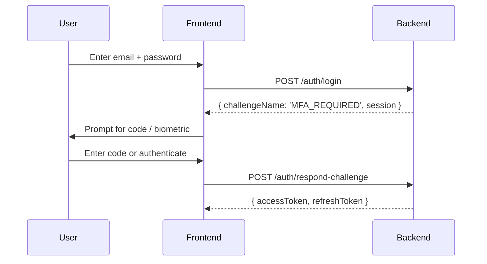

import Tabs from '@theme/Tabs';
import TabItem from '@theme/TabItem';

# How MFA Works

Add a second layer of security beyond passwords. After users authenticate with their credentials, they verify their identity using a second factor. This guide covers the shared MFA architecture, configuration, and endpoints that apply to all methods. The method-specific guides cover setup and login for each type.

## Supported Methods

| Method | User Experience | Security | Best For |
| --- | --- | --- | --- |
| [**Email**](/docs/guides/mfa/email) | 6-digit code via email | Medium | Onboarding, backup option |
| [**SMS**](/docs/guides/mfa/sms) | 6-digit code via text message | Medium | Users without authenticator apps |
| [**TOTP**](/docs/guides/mfa/totp) | Code from authenticator app (Google Authenticator, Authy) | High | Most users (offline, no cost) |
| [**Passkey**](/docs/guides/mfa/passkey) | Biometric (Face ID, Touch ID) or security key (YubiKey) | Very High | Modern devices, phishing-resistant |

Users can enroll **multiple devices per method** (e.g., two TOTP apps, or laptop Touch ID + phone Face ID). Each device is managed independently.

:::tip Sample apps
MFA is implemented in the [nauth example apps](https://github.com/noorixorg/nauth) — see the NestJS, Express, and Fastify examples for MFA management routes, challenge helpers, and the Angular example for `mfa-setup.component.ts`, `otp-verify.component.ts`, and `passkey-setup.component.ts`.
:::

## Prerequisites

You have completed the [Basic Auth Flows](/docs/guides/basic-auth) guide and have working signup, login, and challenge endpoints.

## Configuration

```typescript
import { MFAMethod } from '@nauth-toolkit/core';

mfa: {
  enabled: true,
  enforcement: 'OPTIONAL',            // OPTIONAL | REQUIRED | ADAPTIVE
  allowedMethods: [
    MFAMethod.EMAIL,
    MFAMethod.SMS,
    MFAMethod.TOTP,
    MFAMethod.PASSKEY,
  ],

  // Device trust — lets users skip MFA on recognized devices
  rememberDevices: 'user_opt_in',      // 'always' | 'user_opt_in' | 'never'
  rememberDeviceDays: 30,
  bypassMFAForTrustedDevices: true,

  // Grace period for REQUIRED enforcement (days before enforcement kicks in)
  gracePeriod: 7,

  // Skip MFA for social login users
  requireForSocialLogin: false,

  // TOTP settings
  issuer: 'YourAppName',              // Shown in authenticator apps
  totp: {
    window: 1,                         // Allow ±1 time step (30s tolerance)
    stepSeconds: 30,
    digits: 6,
    algorithm: 'sha1',
  },

  // Passkey (WebAuthn) settings
  passkey: {
    rpName: 'Your App Name',
    rpId: 'yourdomain.com',
    origin: ['https://yourdomain.com'],
    timeout: 60000,
    userVerification: 'preferred',
    authenticatorAttachment: 'platform',
  },
},
```

See [Configuration > MFA](/docs/concepts/configuration#multi-factor-authentication) for the full reference.

## Enforcement Modes

| Mode | Behavior | Best For |
| --- | --- | --- |
| `OPTIONAL` | Users can enable MFA in settings. MFA only checked if enrolled. | Consumer apps |
| `REQUIRED` | All users must set up MFA. Login returns `MFA_SETUP_REQUIRED` until they do. Grace period configurable. | Enterprise, compliance |
| `ADAPTIVE` | Same setup requirement as `REQUIRED`. After enrollment, MFA challenges are only triggered by risk signals (new device, new country, impossible travel). | Optimal security/UX balance |

**REQUIRED enforcement** prompts users to set up MFA after login. During the grace period (`gracePeriod` days), users can log in without MFA. After the grace period, login is blocked until MFA is configured.

**ADAPTIVE enforcement** has the same setup requirement as `REQUIRED` — users must enroll MFA (subject to the same grace period). The difference is what happens after enrollment: instead of always challenging, the risk engine evaluates each login and only triggers MFA when risk is elevated. See [Adaptive MFA](#adaptive-mfa) below.

## How MFA Works

### Login with MFA (already set up)



1. Login returns `MFA_REQUIRED` with `availableMethods` and `preferredMethod`
2. For code-based methods (email, SMS), a code is sent automatically
3. For TOTP, the user opens their authenticator app
4. For Passkey, the frontend calls WebAuthn browser API
5. User completes the challenge via `/auth/respond-challenge`

### Forced setup (REQUIRED enforcement)

1. Login returns `MFA_SETUP_REQUIRED` with `allowedMethods`
2. Frontend calls `/auth/challenge/setup-data` with the chosen method
3. For email/SMS: if already verified, setup auto-completes; otherwise a code is sent
4. For TOTP: a QR code and manual entry key are returned
5. For Passkey: WebAuthn registration options are returned
6. User completes setup via `/auth/respond-challenge`

### Self-service setup (from security settings)

1. Authenticated user calls `POST /auth/mfa/setup-data` with the method
2. Method-specific setup data is returned
3. User verifies with `POST /auth/mfa/verify-setup`
4. MFA device is registered

## Shared Endpoints

These endpoints are the same regardless of MFA method.

### MFA Status

Check whether the current user has MFA enabled and which methods are enrolled.

<Tabs groupId="platform">
<TabItem value="nestjs" label="NestJS" default>

```typescript title="src/auth/mfa.controller.ts"
import { Controller, Get, Post, Delete, Body, Param, UseGuards, HttpCode, HttpStatus, Inject } from '@nestjs/common';
import { AuthGuard, MFAService } from '@nauth-toolkit/nestjs';
import { Optional, Inject } from '@nestjs/common';

@UseGuards(AuthGuard)
@Controller('auth/mfa')
export class MfaController {
  constructor(
    @Optional() @Inject(MFAService)
    private readonly mfaService?: MFAService,
  ) {}

  @Get('status')
  async getStatus() {
    return await this.mfaService!.getMfaStatus();
  }
}
```

</TabItem>
<TabItem value="express" label="Express">

```typescript title="src/routes/auth.routes.ts"
const { mfaService } = nauth;

router.get('/mfa/status', nauth.helpers.requireAuth(), async (_req: Request, res: Response, next: NextFunction) => {
  try {
    res.json(await mfaService!.getMfaStatus());
  } catch (err) { next(err); }
});
```

</TabItem>
<TabItem value="fastify" label="Fastify">

```typescript title="src/routes/auth.routes.ts"
fastify.get('/auth/mfa/status', { preHandler: [nauth.helpers.requireAuth()] },
  nauth.adapter.wrapRouteHandler(async (_req, res) => {
    res.json(await mfaService.getMfaStatus());
  }) as any
);
```

</TabItem>
</Tabs>

**Response:**

```json
{
  "enabled": false,
  "required": false,
  "configuredMethods": [],
  "availableMethods": ["email", "sms", "totp", "passkey"],
  "hasBackupCodes": false,
  "mfaExempt": false,
  "mfaExemptReason": null,
  "mfaExemptGrantedAt": null
}
```

### Setup and Verify (Self-Service)

All methods use the same two endpoints. Only the request/response payloads differ.

<Tabs groupId="platform">
<TabItem value="nestjs" label="NestJS" default>

```typescript title="src/auth/mfa.controller.ts"
// Inside MfaController class:

@Post('setup-data')
@HttpCode(HttpStatus.OK)
async setup(@Body() dto: SetupMFADTO) {
  return await this.mfaService.setup(dto);
}

@Post('verify-setup')
@HttpCode(HttpStatus.OK)
async verifySetup(@Body() dto: SetupMFADTO) {
  const provider = this.mfaService.getProvider(dto.methodName);
  const deviceId = await provider.verifySetup(dto.setupData);
  return { deviceId };
}
```

</TabItem>
<TabItem value="express" label="Express">

```typescript title="src/routes/auth.routes.ts"
router.post('/mfa/setup-data', nauth.helpers.requireAuth(), async (req: Request, res: Response, next: NextFunction) => {
  try {
    res.json(await mfaService.setup(req.body));
  } catch (err) { next(err); }
});

router.post('/mfa/verify-setup', nauth.helpers.requireAuth(), async (req: Request, res: Response, next: NextFunction) => {
  try {
    const provider = mfaService.getProvider(req.body.methodName);
    const deviceId = await provider.verifySetup(req.body.setupData);
    res.json({ deviceId });
  } catch (err) { next(err); }
});
```

</TabItem>
<TabItem value="fastify" label="Fastify">

```typescript title="src/routes/auth.routes.ts"
import { SetupMFADTO } from '@nauth-toolkit/core';

fastify.post('/auth/mfa/setup-data', { preHandler: [nauth.helpers.requireAuth()] },
  nauth.adapter.wrapRouteHandler(async (req, res) => {
    res.json(await mfaService.setup(req.body as any));
  }) as any
);

fastify.post('/auth/mfa/verify-setup', { preHandler: [nauth.helpers.requireAuth()] },
  nauth.adapter.wrapRouteHandler(async (req, res) => {
    const body = req.body as SetupMFADTO;
    const provider = mfaService.getProvider(body.methodName);
    const deviceId = await provider.verifySetup(body.setupData);
    res.json({ deviceId });
  }) as any
);
```

</TabItem>
</Tabs>

See each method-specific guide for the request/response payloads: [Email](/docs/guides/mfa/email), [SMS](/docs/guides/mfa/sms), [TOTP](/docs/guides/mfa/totp), [Passkey](/docs/guides/mfa/passkey).

### Challenge Helpers (Login Flow)

During login, these public endpoints support the MFA challenge:

<Tabs groupId="platform">
<TabItem value="nestjs" label="NestJS" default>

```typescript title="src/auth/auth.controller.ts"
// Already in AuthController from Basic Auth guide:

@Public()
@Post('challenge/setup-data')
@HttpCode(HttpStatus.OK)
async getSetupData(@Body() dto: GetSetupDataDTO): Promise<GetSetupDataResponseDTO> {
  if (!this.mfaService) throw new BadRequestException('MFA service is not available');
  return await this.mfaService.getSetupData(dto);
}

// For Passkey — get WebAuthn assertion options:
@Public()
@Post('challenge/challenge-data')
@HttpCode(HttpStatus.OK)
async getChallengeData(@Body() dto: any) {
  if (!this.mfaService) throw new BadRequestException('MFA service is not available');
  return await this.mfaService.getChallengeData(dto);
}
```

</TabItem>
<TabItem value="express" label="Express">

```typescript title="src/routes/auth.routes.ts"
router.post('/challenge/setup-data', nauth.helpers.public(), async (req: Request, res: Response, next: NextFunction) => {
  try {
    res.json(await mfaService.getSetupData(req.body));
  } catch (err) { next(err); }
});

router.post('/challenge/challenge-data', nauth.helpers.public(), async (req: Request, res: Response, next: NextFunction) => {
  try {
    res.json(await mfaService.getChallengeData(req.body));
  } catch (err) { next(err); }
});
```

</TabItem>
<TabItem value="fastify" label="Fastify">

```typescript title="src/routes/auth.routes.ts"
fastify.post('/auth/challenge/setup-data', { preHandler: [nauth.helpers.public()] },
  nauth.adapter.wrapRouteHandler(async (req, res) => {
    res.json(await mfaService.getSetupData(req.body as any));
  }) as any
);

fastify.post('/auth/challenge/challenge-data', { preHandler: [nauth.helpers.public()] },
  nauth.adapter.wrapRouteHandler(async (req, res) => {
    res.json(await mfaService.getChallengeData(req.body as any));
  }) as any
);
```

</TabItem>
</Tabs>

- `challenge/setup-data` — used during `MFA_SETUP_REQUIRED` (forced setup at login)
- `challenge/challenge-data` — used during `MFA_REQUIRED` for Passkey (WebAuthn assertion options), SMS (sends code, returns masked phone), or Email (sends code, returns masked email)

### Device Management

<Tabs groupId="platform">
<TabItem value="nestjs" label="NestJS" default>

```typescript title="src/auth/mfa.controller.ts"
// Inside MfaController class:

@Get('devices')
async getDevices() {
  return await this.mfaService.getUserDevices({});
}

@Post('devices/:deviceId/preferred')
@HttpCode(HttpStatus.OK)
async setPreferred(@Param('deviceId') deviceId: string) {
  return await this.mfaService.setPreferredDevice({ deviceId } as any);
}

@Delete('devices/:deviceId')
@HttpCode(HttpStatus.OK)
async removeDevice(@Param('deviceId') deviceId: string) {
  return await this.mfaService.removeDevice({ deviceId } as any);
}
```

</TabItem>
<TabItem value="express" label="Express">

```typescript title="src/routes/auth.routes.ts"
router.get('/mfa/devices', nauth.helpers.requireAuth(), async (_req: Request, res: Response, next: NextFunction) => {
  try {
    res.json(await mfaService.getUserDevices({}));
  } catch (err) { next(err); }
});

router.post('/mfa/devices/:deviceId/preferred', nauth.helpers.requireAuth(), async (req: Request, res: Response, next: NextFunction) => {
  try {
    res.json(await mfaService.setPreferredDevice(req.params as any));
  } catch (err) { next(err); }
});

router.delete('/mfa/devices/:deviceId', nauth.helpers.requireAuth(), async (req: Request, res: Response, next: NextFunction) => {
  try {
    res.json(await mfaService.removeDevice(req.params as any));
  } catch (err) { next(err); }
});
```

</TabItem>
<TabItem value="fastify" label="Fastify">

```typescript title="src/routes/auth.routes.ts"
fastify.get('/auth/mfa/devices', { preHandler: [nauth.helpers.requireAuth()] },
  nauth.adapter.wrapRouteHandler(async (_req, res) => {
    res.json(await mfaService.getUserDevices({}));
  }) as any
);

fastify.post('/auth/mfa/devices/:deviceId/preferred', { preHandler: [nauth.helpers.requireAuth()] },
  nauth.adapter.wrapRouteHandler(async (req, res) => {
    res.json(await mfaService.setPreferredDevice(req.params as any));
  }) as any
);

fastify.delete('/auth/mfa/devices/:deviceId', { preHandler: [nauth.helpers.requireAuth()] },
  nauth.adapter.wrapRouteHandler(async (req, res) => {
    res.json(await mfaService.removeDevice(req.params as any));
  }) as any
);
```

</TabItem>
</Tabs>

**List devices response:**

```json
{
  "devices": [
    {
      "id": 42,
      "type": "email",
      "name": "j***@example.com",
      "isPreferred": true,
      "isActive": true,
      "createdAt": "2025-01-10T08:00:00.000Z"
    }
  ]
}
```

:::warning Last device removal
If the user removes their **only** MFA device, MFA is automatically disabled. If `enforcement: 'REQUIRED'`, they'll be prompted to set up MFA again on the next login.
:::

## Frontend Integration

The Angular example app handles MFA with dedicated components:

**`otp-verify.component.ts`** — handles `MFA_REQUIRED` challenges. Detects the MFA method and adjusts UI accordingly:

```typescript title="Angular — otp-verify.component.ts (simplified)"
import { getMFAMethod, AuthChallenge, type MFACodeResponse } from '@nauth-toolkit/client';

// In component:
readonly challenge = this.auth.challenge;            // signal
readonly mfaMethod = computed(() => getMFAMethod(this.challenge()));  // 'email' | 'sms' | 'totp' | 'passkey'
readonly isTotp = computed(() => this.mfaMethod() === 'totp');

// TOTP: "Enter code from your authenticator app"
// Email/SMS: "We sent a code to j***@example.com"
// Passkey: handled by passkey-setup.component.ts

async onSubmit(code: string): Promise<void> {
  const response = await this.auth.respondToChallenge({
    type: AuthChallenge.MFA_REQUIRED,
    session: this.challenge().session,
    method: this.mfaMethod(),
    code,
  } as MFACodeResponse);

  this.orchestrator.handleAuthResponse(response);
}
```

**`mfa-setup.component.ts`** — handles `MFA_SETUP_REQUIRED` with method selection and auto-completion detection:

```typescript title="Angular — mfa-setup.component.ts (simplified)"
async selectMethod(method: 'email' | 'sms'): Promise<void> {
  const { setupData } = await this.auth.getSetupData(this.challenge().session, method);

  if (setupData.autoCompleted) {
    // Email/phone already verified — complete immediately
    await this.auth.respondToChallenge({
      type: AuthChallenge.MFA_SETUP_REQUIRED,
      session: this.challenge().session,
      method,
      setupData: { deviceId: setupData.deviceId },
    });
    this.router.navigate(['/dashboard']);
  } else {
    // Code sent — navigate to OTP entry
    this.router.navigate(['/auth/challenge/mfa-setup-required/verify'], {
      queryParams: { method },
    });
  }
}
```

The challenge orchestrator routes `MFA_SETUP_REQUIRED` to the setup component and `MFA_REQUIRED` to the OTP or passkey component based on `preferredMethod`.

## Adaptive MFA

When `enforcement: 'ADAPTIVE'`, the risk engine evaluates each login and decides whether to require MFA:

| Risk Factor | Default Points | Description |
| --- | --- | --- |
| `new_device` | 25 | First login from unknown device fingerprint |
| `new_ip` | 15 | Login from new IP address (only if country unchanged) |
| `new_country` | 25 | Login from different country than usual |
| `impossible_travel` | 40 | Physically impossible travel (e.g., Tokyo to NYC in 1 hour) |
| `suspicious_activity` | 30 | Recent failed logins or security events |
| `recent_password_reset` | 40 | Password changed after last successful login |

Risk scores (0-100) map to actions:

| Score | Default Action | Behavior |
| --- | --- | --- |
| 0-20 (Low) | `allow` | Proceed without MFA |
| 21-50 (Medium) | `require_mfa` | MFA challenge required |
| 51-100 (High) | `require_mfa` | MFA required (configure `block_signin` to block outright) |

```typescript
mfa: {
  enforcement: 'ADAPTIVE',
  adaptive: {
    triggers: ['new_device', 'new_country', 'impossible_travel', 'recent_password_reset'],

    // Optional: customize risk weights
    riskWeights: { impossible_travel: 100 },

    // Optional: customize thresholds and actions
    riskLevels: {
      low:    { maxScore: 20,  action: 'allow',       notifyUser: false },
      medium: { maxScore: 50,  action: 'require_mfa', notifyUser: true },
      high:   { maxScore: 100, action: 'require_mfa', notifyUser: true },  // 'block_signin' for stricter policy
    },
  },
},
```

Location-based triggers (`new_country`, `impossible_travel`) require [Geolocation](/docs/guides/geolocation) configured.

:::note Smart deduplication
The system excludes `new_ip` when `new_country` or `impossible_travel` is detected to prevent double-counting.
:::

## Profile Changes and MFA

When a user updates their email or phone number, associated MFA devices are **permanently deleted** for security:

| Profile Change | MFA Impact |
| --- | --- |
| Email updated | All Email MFA devices deleted |
| Phone updated | All SMS MFA devices deleted |

If the deleted device(s) were the user's only MFA method, MFA is automatically disabled. With `enforcement: 'REQUIRED'`, they'll be prompted to re-enroll on the next login.

All MFA device deletions are logged with event type `MFA_DEVICE_REMOVED`:

```json
{
  "eventType": "MFA_DEVICE_REMOVED",
  "userId": "user-sub",
  "reason": "email_changed",
  "metadata": {
    "devicesDeleted": 1,
    "mfaDisabled": false
  }
}
```

## Error Codes

| Error Code | Reason | User Action |
| --- | --- | --- |
| `MFA_REQUIRED` | Login requires MFA | Prompt for MFA code |
| `MFA_INVALID_CODE` | Code is incorrect | Try again |
| `MFA_EXPIRED_CODE` | Code expired (5-10 min) | Request new code |
| `MFA_NO_DEVICES` | MFA enabled but no devices enrolled | Contact support |
| `MFA_CHALLENGE_EXPIRED` | MFA challenge timed out | Re-login |
| `MFA_SETUP_INVALID` | Setup verification failed | Re-scan QR / check time sync |
| `MFA_METHOD_NOT_ALLOWED` | Method not enabled in config | Use different method |
| `MFA_ALREADY_SETUP` | Method already enrolled | Remove old device first |
| `SIGNIN_BLOCKED_HIGH_RISK` | Adaptive MFA blocked login | Wait or contact support |

## What's Next

Choose a method to implement:

- **[Email MFA](/docs/guides/mfa/email)** — Simplest to set up, uses your existing email provider
- **[SMS MFA](/docs/guides/mfa/sms)** — Requires an SMS provider (AWS SNS)
- **[TOTP MFA](/docs/guides/mfa/totp)** — Most popular, works offline, QR code setup
- **[Passkey MFA](/docs/guides/mfa/passkey)** — Most secure, biometric/hardware key authentication
