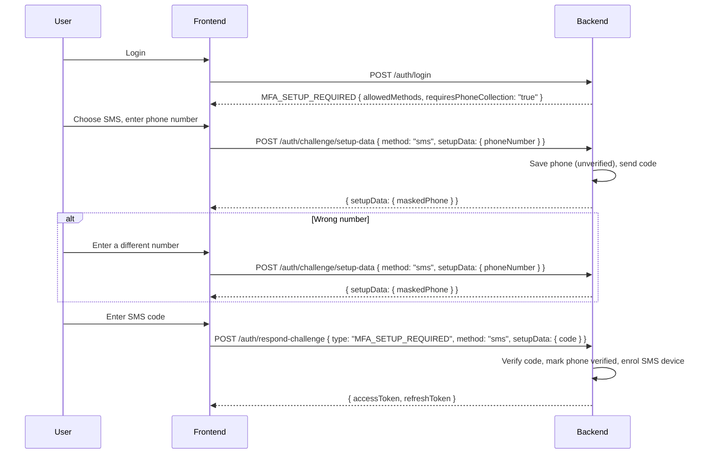

import Tabs from '@theme/Tabs';
import TabItem from '@theme/TabItem';

# SMS MFA

Add SMS-based multi-factor authentication. By the end of this guide you will have MFA working via text message. SMS MFA uses the **same backend routes** as [Email MFA](/docs/guides/mfa/email) — only the configuration and request/response payloads differ.

| Endpoint | Method | Auth | Purpose |
| --- | --- | --- | --- |
| `/auth/mfa/status` | GET | Protected | Check MFA enrollment status |
| `/auth/mfa/setup-data` | POST | Protected | Initiate SMS MFA setup (sends code) |
| `/auth/mfa/verify-setup` | POST | Protected | Confirm setup with SMS code |
| `/auth/mfa/devices` | GET | Protected | List enrolled MFA devices |
| `/auth/mfa/devices/:id/preferred` | POST | Protected | Set preferred MFA device |
| `/auth/mfa/devices/:id` | DELETE | Protected | Remove an MFA device |
| `/auth/respond-challenge` | POST | Public | Complete MFA challenge during login |
| `/auth/challenge/setup-data` | POST | Public | Get setup data during forced MFA setup |
| `/auth/challenge/resend` | POST | Public | Resend MFA verification code |

:::tip[Sample apps]
SMS MFA is configured in the [nauth example apps](https://github.com/noorixorg/nauth-toolkit) using `ConsoleSMSProvider` (logs to stdout). See the NestJS, Express, and Fastify examples.
:::

:::warning[SMS Security]
SMS is vulnerable to SIM swapping attacks. Consider offering SMS as a secondary option alongside TOTP or Passkey, which are more resistant to interception.
:::

## Prerequisites

- [Basic Auth Flows](/docs/guides/basic-auth) are working (signup, login, challenge endpoints)
- `MFAMethod.SMS` is in `mfa.allowedMethods` (Step 2)

A phone number on the account is **not** a prerequisite. If the user has none (email-only signup, social login), they type one in during SMS setup and the first SMS code verifies it. No separate phone-verification challenge and no profile update call are needed. The guide works with any `signup.verificationMethod`:

| `signup.verificationMethod` | Phone at SMS setup time |
| --- | --- |
| `'phone'` or `'both'` | Already verified during signup (or collected by `VERIFY_PHONE`). Setup auto-completes without a code. |
| `'email'` or `'none'` | Not on file. The user supplies it in `setupData.phoneNumber` and verifies it with the code. |

## Step 1: Install

```bash npm2yarn
npm install @nauth-toolkit/mfa-sms @nauth-toolkit/sms-console
```

For production, install one of the production SMS providers:

```bash npm2yarn
npm install @nauth-toolkit/mfa-sms @nauth-toolkit/sms-twilio
```

```bash npm2yarn
npm install @nauth-toolkit/mfa-sms @nauth-toolkit/sms-aws-sns
```

## Step 2: Configure

```typescript title="config/auth.config.ts"
import { MFAMethod } from '@nauth-toolkit/core';
import { ConsoleSMSProvider } from '@nauth-toolkit/sms-console';

smsProvider: new ConsoleSMSProvider(),    // Logs SMS to console (dev only)

mfa: {
  enabled: true,
  enforcement: 'OPTIONAL',
  allowedMethods: [MFAMethod.SMS],

  rememberDevices: 'user_opt_in',
  rememberDeviceDays: 30,
  bypassMFAForTrustedDevices: true,
},
```

For production with Twilio:

```typescript title="config/auth.config.ts"
import { TwilioSMSProvider } from '@nauth-toolkit/sms-twilio';

smsProvider: new TwilioSMSProvider({
  accountSid: process.env.TWILIO_ACCOUNT_SID!,
  authToken: process.env.TWILIO_AUTH_TOKEN!,
  fromNumber: process.env.TWILIO_FROM_NUMBER!,
}),
```

For production with AWS SNS:

```typescript title="config/auth.config.ts"
import { AWSSMSProvider } from '@nauth-toolkit/sms-aws-sns';

smsProvider: new AWSSMSProvider({
  region: 'us-east-1',
  originationNumber: process.env.AWS_SMS_ORIGINATION || '+12345678901',
  accessKeyId: process.env.AWS_ACCESS_KEY_ID,
  secretAccessKey: process.env.AWS_SECRET_ACCESS_KEY,
}),
```

## Step 3: Add Backend Routes

:::note[Already have MFA routes?]
If you already set up routes for another MFA method (Email, TOTP, Passkey), the same routes handle SMS — just add `MFAMethod.SMS` to `allowedMethods` in your config and skip to [Step 4](#step-4-frontend--mfa-setup-security-settings).
:::

### MFA management routes (protected — user must be logged in)

<Tabs groupId="platform">
<TabItem value="nestjs" label="NestJS" default>

```typescript title="src/auth/mfa.controller.ts"
import { Controller, Get, Post, Delete, Body, Param, UseGuards, HttpCode, HttpStatus, Inject } from '@nestjs/common';
import { AuthGuard, MFAService } from '@nauth-toolkit/nestjs';

@UseGuards(AuthGuard)
@Controller('auth/mfa')
export class MfaController {
  constructor(
    @Optional() @Inject(MFAService)
    private readonly mfaService?: MFAService,
  ) {}

  @Get('status')
  async getStatus() {
    return await this.mfaService.getMfaStatus();
  }

  @Post('setup-data')
  @HttpCode(HttpStatus.OK)
  async setup(@Body() dto: any) {
    return await this.mfaService.setup(dto);
  }

  @Post('verify-setup')
  @HttpCode(HttpStatus.OK)
  async verifySetup(@Body() dto: any) {
    const provider = this.mfaService.getProvider(dto.methodName);
    const deviceId = await provider.verifySetup(dto.setupData);
    return { deviceId };
  }

  @Get('devices')
  async getDevices() {
    return await this.mfaService.getUserDevices({});
  }

  @Post('devices/:deviceId/preferred')
  @HttpCode(HttpStatus.OK)
  async setPreferred(@Param('deviceId') deviceId: string) {
    return await this.mfaService.setPreferredDevice({ deviceId } as any);
  }

  @Delete('devices/:deviceId')
  @HttpCode(HttpStatus.OK)
  async removeDevice(@Param('deviceId') deviceId: string) {
    return await this.mfaService.removeDevice({ deviceId } as any);
  }
}
```

Register the controller in your auth module.

</TabItem>
<TabItem value="express" label="Express">

```typescript title="src/routes/mfa.routes.ts"
import { Router, Request, Response, NextFunction } from 'express';

export function createMfaRoutes(nauth, mfaService): Router {
  const router = Router();

  router.get('/status', nauth.helpers.requireAuth(), async (_req: Request, res: Response, next: NextFunction) => {
    try { res.json(await mfaService.getMfaStatus()); } catch (err) { next(err); }
  });

  router.post('/setup-data', nauth.helpers.requireAuth(), async (req: Request, res: Response, next: NextFunction) => {
    try { res.json(await mfaService.setup(req.body)); } catch (err) { next(err); }
  });

  router.post('/verify-setup', nauth.helpers.requireAuth(), async (req: Request, res: Response, next: NextFunction) => {
    try {
      const provider = mfaService.getProvider(req.body.methodName);
      const deviceId = await provider.verifySetup(req.body.setupData);
      res.json({ deviceId });
    } catch (err) { next(err); }
  });

  router.get('/devices', nauth.helpers.requireAuth(), async (_req: Request, res: Response, next: NextFunction) => {
    try { res.json(await mfaService.getUserDevices({})); } catch (err) { next(err); }
  });

  router.post('/devices/:deviceId/preferred', nauth.helpers.requireAuth(), async (req: Request, res: Response, next: NextFunction) => {
    try { res.json(await mfaService.setPreferredDevice(req.params as any)); } catch (err) { next(err); }
  });

  router.delete('/devices/:deviceId', nauth.helpers.requireAuth(), async (req: Request, res: Response, next: NextFunction) => {
    try { res.json(await mfaService.removeDevice(req.params as any)); } catch (err) { next(err); }
  });

  return router;
}

// Mount: app.use('/auth/mfa', createMfaRoutes(nauth, mfaService))
```

</TabItem>
<TabItem value="fastify" label="Fastify">

```typescript title="src/routes/mfa.routes.ts"
import { FastifyInstance } from 'fastify';

export async function registerMfaRoutes(fastify: FastifyInstance, nauth, mfaService): Promise<void> {
  fastify.get('/auth/mfa/status', { preHandler: [nauth.helpers.requireAuth()] },
    nauth.adapter.wrapRouteHandler(async (_req, res) => {
      res.json(await mfaService.getMfaStatus());
    }) as any
  );

  fastify.post('/auth/mfa/setup-data', { preHandler: [nauth.helpers.requireAuth()] },
    nauth.adapter.wrapRouteHandler(async (req, res) => {
      res.json(await mfaService.setup(req.body as any));
    }) as any
  );

  fastify.post('/auth/mfa/verify-setup', { preHandler: [nauth.helpers.requireAuth()] },
    nauth.adapter.wrapRouteHandler(async (req, res) => {
      const body = req.body as any;
      const provider = mfaService.getProvider(body.methodName);
      const deviceId = await provider.verifySetup(body.setupData);
      res.json({ deviceId });
    }) as any
  );

  fastify.get('/auth/mfa/devices', { preHandler: [nauth.helpers.requireAuth()] },
    nauth.adapter.wrapRouteHandler(async (_req, res) => {
      res.json(await mfaService.getUserDevices({}));
    }) as any
  );

  fastify.post('/auth/mfa/devices/:deviceId/preferred', { preHandler: [nauth.helpers.requireAuth()] },
    nauth.adapter.wrapRouteHandler(async (req, res) => {
      res.json(await mfaService.setPreferredDevice(req.params as any));
    }) as any
  );

  fastify.delete('/auth/mfa/devices/:deviceId', { preHandler: [nauth.helpers.requireAuth()] },
    nauth.adapter.wrapRouteHandler(async (req, res) => {
      res.json(await mfaService.removeDevice(req.params as any));
    }) as any
  );
}
```

</TabItem>
</Tabs>

### Challenge helper route (public — used during login)

Add to your existing auth controller/routes from the [Basic Auth Flows](/docs/guides/basic-auth) guide:

<Tabs groupId="platform">
<TabItem value="nestjs" label="NestJS" default>

```typescript title="src/auth/auth.controller.ts"
// Add to your existing AuthController:

@Public()
@Post('challenge/setup-data')
@HttpCode(HttpStatus.OK)
async getSetupData(@Body() dto: any) {
  if (!this.mfaService) throw new BadRequestException('MFA service is not available');
  return await this.mfaService.getSetupData(dto);
}
```

</TabItem>
<TabItem value="express" label="Express">

```typescript title="src/routes/auth.routes.ts"
// Add to your existing auth routes:

router.post('/challenge/setup-data', nauth.helpers.public(), async (req: Request, res: Response, next: NextFunction) => {
  try { res.json(await mfaService.getSetupData(req.body)); } catch (err) { next(err); }
});
```

</TabItem>
<TabItem value="fastify" label="Fastify">

```typescript title="src/routes/auth.routes.ts"
// Add to your existing auth routes:

fastify.post('/auth/challenge/setup-data', { preHandler: [nauth.helpers.public()] },
  nauth.adapter.wrapRouteHandler(async (req, res) => {
    res.json(await mfaService.getSetupData(req.body as any));
  }) as any
);
```

</TabItem>
</Tabs>

## Step 4: Frontend — MFA Setup (Security Settings)

### Initiate setup

```
POST /auth/mfa/setup-data
```

**Request body** ([`SetupMFADTO`](/docs/api/core/dto/setup-mfa-dto)):

```json
{
  "methodName": "sms",
  "setupData": {
    "phoneNumber": "+14155552671"
  }
}
```

`setupData.phoneNumber` (E.164) is required when the account has no phone number and optional otherwise.

**Possible responses:**

| Scenario | Response |
| --- | --- |
| `phoneNumber` supplied | Number saved to the account (unverified), code sent: `{ "setupData": { "maskedPhone": "+1***2671" } }` |
| No `phoneNumber`, phone on file already verified | `{ "setupData": { "autoCompleted": true, "deviceId": 43 } }`. MFA is enabled, skip the verify step. |
| No `phoneNumber`, phone on file not verified | Code sent to the phone on file: `{ "setupData": { "maskedPhone": "+1***2671" } }` |
| No `phoneNumber`, no phone on file | `PHONE_REQUIRED` error |
| `phoneNumber` not E.164 | `INVALID_PHONE_FORMAT` error |
| `phoneNumber` already on another account | `PHONE_EXISTS` error, unless `signup.allowDuplicatePhones` is `true` |

Show an input field for the user to enter the code they received. To change the number, call the endpoint again with a different `phoneNumber`; to resend, call it again without one (`signup.phoneVerification.resendDelay` applies).

:::note[Supplying a different number]
A `phoneNumber` that differs from the phone on file replaces it, marks it unverified, and sends the code to the new number. Any existing SMS MFA device is removed, exactly as when the phone is changed through `PUT /auth/profile`. The [phoneChanged hook](/docs/api/core/hooks/phone-changed-hook) fires so you can notify the account email.
:::

### Verify setup

```
POST /auth/mfa/verify-setup
```

**Request body:**

```json
{
  "methodName": "sms",
  "setupData": {
    "code": "123456"
  }
}
```

**Response:**

```json
{
  "deviceId": 43
}
```

MFA is now enabled. The next login triggers an `MFA_REQUIRED` challenge via SMS.

### Frontend setup example

```typescript title="React — SMS MFA setup (simplified)"
// phoneNumber comes from a phone input shown when the user has no phone on file
const handleSetupSms = async (phoneNumber?: string) => {
  const { setupData } = await fetch('/auth/mfa/setup-data', {
    method: 'POST',
    headers: { 'Content-Type': 'application/json' },
    body: JSON.stringify({ methodName: 'sms', setupData: phoneNumber ? { phoneNumber } : undefined }),
  }).then(r => r.json());

  if (setupData.autoCompleted) {
    // Phone was already verified — MFA is enabled, nothing more to do
    return;
  }

  setMaskedPhone(setupData.maskedPhone);
  setShowCodeInput(true);
};

const handleVerify = async (code: string) => {
  const { deviceId } = await fetch('/auth/mfa/verify-setup', {
    method: 'POST',
    headers: { 'Content-Type': 'application/json' },
    body: JSON.stringify({ methodName: 'sms', setupData: { code } }),
  }).then(r => r.json());

  // MFA is enabled
};
```

## Step 5: Frontend — MFA Challenge (Login)

When a user with SMS MFA logs in, the login response contains an `MFA_REQUIRED` challenge. A code is sent to their phone automatically.

### Login response (MFA enabled user)

```
POST /auth/login
```

```json
{
  "challengeName": "MFA_REQUIRED",
  "session": "a21b654c-2746-4168-acee-c175083a65cd",
  "challengeParameters": {
    "availableMethods": ["sms"],
    "preferredMethod": "sms",
    "destination": "+1***5678",
    "deliveryMedium": "SMS"
  }
}
```

### Complete the challenge

```
POST /auth/respond-challenge
```

**Request body:**

```json
{
  "session": "a21b654c-2746-4168-acee-c175083a65cd",
  "type": "MFA_REQUIRED",
  "method": "sms",
  "code": "123456"
}
```

**Response** — tokens are issued (same structure as [Email MFA](/docs/guides/mfa/email#complete-the-challenge)).

### Frontend challenge example

```typescript title="React — SMS MFA challenge (simplified)"
const handleMfaChallenge = async (code: string) => {
  const response = await fetch('/auth/respond-challenge', {
    method: 'POST',
    headers: { 'Content-Type': 'application/json' },
    body: JSON.stringify({
      session: pendingChallenge.session,
      type: 'MFA_REQUIRED',
      method: 'sms',
      code,
    }),
  }).then(r => r.json());

  if (response.accessToken) {
    // Login complete
  }
};
```

## Forced Setup (REQUIRED Enforcement)

When `enforcement: 'REQUIRED'` (or `'ADAPTIVE'` once the [grace period](/docs/concepts/configuration#grace-period) ends), users without MFA receive an `MFA_SETUP_REQUIRED` challenge after login. The challenge tells the frontend whether the account has a phone number. If it does not, the user types one in with the SMS choice and the first code verifies it. The flow mirrors phone collection in the `VERIFY_PHONE` challenge: send the number, get a code, send the code.



### Login response (no MFA set up)

```json
{
  "challengeName": "MFA_SETUP_REQUIRED",
  "session": "a21b654c-2746-4168-acee-c175083a65cd",
  "challengeParameters": {
    "allowedMethods": ["sms", "totp"],
    "requiresPhoneCollection": "true",
    "instructions": "Multi-factor authentication setup is required before you can login"
  }
}
```

`requiresPhoneCollection` is present (as the string `"true"`) only when SMS is an allowed method and the account has no phone number. Use it to show a phone input before requesting the code. It is a UI hint: the next step accepts a `phoneNumber` whether or not the flag is set, so a "use a different number" option works for every user.

### Get setup data during login

```
POST /auth/challenge/setup-data
```

**Request body** ([`GetSetupDataDTO`](/docs/api/core/dto/get-setup-data-dto)):

```json
{
  "session": "a21b654c-2746-4168-acee-c175083a65cd",
  "method": "sms",
  "setupData": {
    "phoneNumber": "+14155552671"
  }
}
```

`setupData.phoneNumber` (E.164) is required when `requiresPhoneCollection` was set and optional otherwise. The challenge `session` stays the same throughout.

**Possible responses:**

| Scenario | Response |
| --- | --- |
| `phoneNumber` supplied | Number saved to the account (unverified), code sent: `{ "setupData": { "maskedPhone": "+1***2671" } }` |
| No `phoneNumber`, phone on file already verified | `{ "setupData": { "autoCompleted": true, "deviceId": 43 } }` |
| No `phoneNumber`, phone on file not verified | Code sent to the phone on file: `{ "setupData": { "maskedPhone": "+1***2671" } }` |
| No `phoneNumber`, no phone on file | `PHONE_REQUIRED` error |
| `phoneNumber` not E.164 | `INVALID_PHONE_FORMAT` error |
| `phoneNumber` already on another account | `PHONE_EXISTS` error, unless `signup.allowDuplicatePhones` is `true` |

### Change the number or resend the code

Both reuse `POST /auth/challenge/setup-data` with the same `session`:

- **Change the number**: send a different `phoneNumber`. The previous number is replaced and the code goes to the new one.
- **Resend**: send no `phoneNumber`. The code goes to the phone on file. `signup.phoneVerification.resendDelay` applies and `RATE_LIMIT_RESEND` is returned when it is called too soon. `POST /auth/challenge/resend` does not handle `MFA_SETUP_REQUIRED`.

:::warning[Changing a verified phone]
A `phoneNumber` that differs from an already verified phone replaces it and resets verification; the code goes to the new number. This is the same outcome as changing the phone through `PUT /auth/profile`, and the [phoneChanged hook](/docs/api/core/hooks/phone-changed-hook) fires so the account email can be notified. Enable the `phoneChanged` notification if you want that alert delivered automatically.
:::

### Complete the challenge

**If auto-completed:**

```json
{
  "session": "a21b654c-2746-4168-acee-c175083a65cd",
  "type": "MFA_SETUP_REQUIRED",
  "method": "sms",
  "setupData": { "deviceId": 43 }
}
```

**If code verification needed:**

```json
{
  "session": "a21b654c-2746-4168-acee-c175083a65cd",
  "type": "MFA_SETUP_REQUIRED",
  "method": "sms",
  "setupData": { "code": "123456" }
}
```

Both are sent to `POST /auth/respond-challenge`. Verifying the code marks the phone as verified on the account and enrols the SMS device, then tokens are issued (or the next challenge, if any).

### Frontend example

The Angular demo handles the phone input inside the MFA setup screen, then reuses the OTP screen for the code:

```typescript title="Angular — mfa-setup.component.ts (simplified)"
import { NAuthClientError, NAuthErrorCode, requiresPhoneCollection } from '@nauth-toolkit/client';

async selectMethod(method: 'sms' | 'email'): Promise<void> {
  // The challenge already says whether the account has a phone: show the form up front
  const challenge = this.challenge();
  if (method === 'sms' && challenge && requiresPhoneCollection(challenge)) {
    this.selectedMethod.set('sms');
    this.collectingPhone.set(true); // phone input; submitPhone() continues from there
    return;
  }

  try {
    await this.startCodeSetup(method);
  } catch (err) {
    // Authenticated (account settings) flow has no challenge to inspect: the backend says so
    if (method === 'sms' && err instanceof NAuthClientError && err.code === NAuthErrorCode.SIGNUP_PHONE_REQUIRED) {
      this.selectedMethod.set('sms');
      this.collectingPhone.set(true);
      return;
    }
    this.handleError(err);
  }
}

async submitPhone(): Promise<void> {
  const phoneNumber = (this.phoneForm.get('phone')?.value as string).replace(/[\s_]/g, '');
  await this.startCodeSetup('sms', { phoneNumber });
}

// Shared by method selection and the phone form; also what "Resend" calls (no setupData)
private async startCodeSetup(method: 'sms' | 'email', setupData?: Record<string, unknown>): Promise<void> {
  const result = this.isAuthenticatedFlow()
    ? await this.auth.getClient().setupMfaDevice(method, setupData)
    : await this.auth.getSetupData(this.challenge()!.session, method, setupData);

  if (result.setupData['autoCompleted'] === true) {
    // Phone already verified: show the success screen, then respond with { deviceId }
    this.setupData.set({ autoCompleted: true, deviceId: result.setupData['deviceId'] as number });
    return;
  }

  // Code sent. The OTP screen offers "Use a different number" (back here with ?collectPhone=1)
  this.router.navigate(['/auth/challenge/mfa-setup-required/verify'], {
    queryParams: { method, maskedDestination: result.setupData['maskedPhone'] ?? result.setupData['maskedEmail'] },
  });
}
```

`NAuthErrorCode.SIGNUP_PHONE_REQUIRED` is the wire value of the server's `PHONE_REQUIRED` code.

```typescript title="Angular — otp-verify.component.ts (simplified)"
await this.auth.respondToChallenge({
  type: AuthChallenge.MFA_SETUP_REQUIRED,
  session: this.challenge().session,
  method: 'sms',
  setupData: { code },
});
```

:::note[Signup with phone verification]
When `signup.verificationMethod` is `'phone'` or `'both'`, the phone is collected and verified by the `VERIFY_PHONE` challenge before MFA setup is reached, so `requiresPhoneCollection` is never set on `MFA_SETUP_REQUIRED` and SMS setup auto-completes. See [Basic Auth Flows > Other challenge types](/docs/guides/basic-auth#other-challenge-types-same-endpoint).
:::

## What's Next

- **[Email MFA](/docs/guides/mfa/email)** — Email verification codes (simplest to set up)
- **[TOTP MFA](/docs/guides/mfa/totp)** — Authenticator apps (Google Authenticator, Authy, 1Password)
- **[Passkey MFA](/docs/guides/mfa/passkey)** — Biometric authentication (Face ID, Touch ID, YubiKey)
- **[How MFA Works](/docs/guides/mfa/how-mfa-works)** — Adaptive MFA, error codes, device trust, enforcement modes
