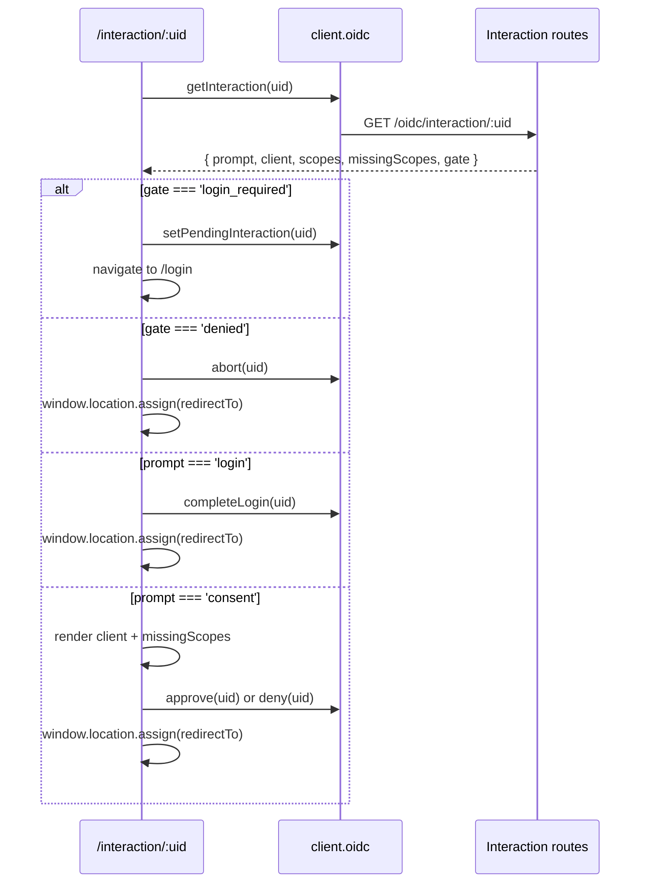

# Building the Consent Screen

The provider redirects the browser to your `interactionUrl` whenever it needs a user to log in or approve access. That page is yours to build. This guide walks through it with the frontend SDK's `oidc` namespace, so there is no hand-written HTTP.

:::tip Sample app
`examples/demo-angular` in the [nauth-toolkit repository](https://github.com/noorixorg/nauth-toolkit) has the complete page, including a scope list and the "not you?" affordance.
:::

## Prerequisites

You have [set up the provider](/docs/guides/oauth-provider/setup) and the interaction routes are mounted. The frontend SDK needs to know where they are:

```typescript title="src/app/app.config.ts"
const config: NAuthClientConfig = {
  baseUrl: 'https://api.example.com',
  authPathPrefix: '/auth',
  tokenDelivery: 'cookies',
  oidc: {
    // Defaults to `{baseUrl}/oidc/interaction`, which matches the shipped
    // controller under a global prefix. Set it if you moved the routes.
    basePath: 'https://api.example.com/oidc/interaction',
    // The route below that renders this page. Defaults to '/interaction'.
    interactionPath: '/interaction',
  },
};
```

Add the route. It must be **unguarded** — an anonymous visitor is exactly the case that has to render, because the page's job is then to send them to login and remember where to come back to.

```typescript title="src/app/app.routes.ts"
{
  path: 'interaction/:uid',
  loadComponent: () => import('./oidc/interaction.component').then((m) => m.OidcInteractionComponent),
}
```

## The shape of the page



Two things to build for:

**There are two interaction ids.** The login step and the consent step are separate interactions. The page must tolerate being entered under an id it has not seen.

**`redirectTo` leaves your app entirely.** Use `window.location.assign(redirectTo)`, never a router navigation — the provider resumes the authorization request and redirects on to the client from there.

## Loading the interaction

```typescript title="src/app/oidc/interaction.component.ts"
import { Component, OnInit, inject, signal } from '@angular/core';
import { ActivatedRoute, Router } from '@angular/router';
import { AuthService, type OIDCInteractionState } from '@nauth-toolkit/client-angular/standalone';

@Component({ selector: 'app-oidc-interaction', standalone: true, templateUrl: './interaction.component.html' })
export class OidcInteractionComponent implements OnInit {
  private readonly route = inject(ActivatedRoute);
  private readonly router = inject(Router);
  private readonly auth = inject(AuthService);

  readonly view = signal<'loading' | 'consent' | 'error'>('loading');
  readonly state = signal<OIDCInteractionState | null>(null);

  async ngOnInit(): Promise<void> {
    const uid = this.route.snapshot.paramMap.get('uid');
    if (!uid) {
      this.view.set('error');
      return;
    }

    try {
      const state = await this.auth.oidc.getInteraction(uid);
      this.state.set(state);

      if (state.gate === 'denied') {
        // The account cannot authorize anything — tell the client, don't strand the user.
        this.leave(await this.auth.oidc.abort(uid));
        return;
      }

      if (state.gate === 'login_required') {
        await this.auth.oidc.setPendingInteraction(uid);
        void this.router.navigate(['/login']);
        return;
      }

      await this.auth.oidc.clearPendingInteraction();

      if (state.prompt === 'login') {
        // Already signed in: complete the login step without showing anything.
        this.leave(await this.auth.oidc.completeLogin(uid));
        return;
      }

      this.view.set('consent');
    } catch {
      this.view.set('error');
    }
  }

  private leave(result: { redirectTo: string }): void {
    window.location.assign(result.redirectTo);
  }
}
```

`state` is an [`OIDCInteractionState`](/docs/frontend-sdk/api/types/oidc-interaction-state). Render `state.client.clientName` (falling back to `clientId`), `state.client.logoUri`, and `state.missingScopes` — the scopes still needing consent, which is a shorter list than `state.scopes` when the user has approved this client before.

## Recording the decision

```typescript title="src/app/oidc/interaction.component.ts"
// Inside OidcInteractionComponent:
async approve(): Promise<void> {
  const uid = this.state()?.uid;
  if (!uid) return;
  this.leave(await this.auth.oidc.approve(uid));
}

async deny(): Promise<void> {
  const uid = this.state()?.uid;
  if (!uid) return;
  this.leave(await this.auth.oidc.deny(uid));
}
```

`approve(uid, scopes?)` grants everything that was asked for unless you pass a narrowed list — pass one if your screen lets the user untick individual scopes. `deny(uid)` resolves the request with `access_denied`, which is what the relying party should see.

## Returning after login

If the user was not signed in, they went to `/login` and your challenge chain ran — possibly several steps of it. Something has to bring them back, and which of these two you want depends on how your app navigates.

### With navigationHandler

If you let the SDK drive navigation, `navigationHandler` is a single chokepoint that sees every terminal navigation:

```typescript title="src/app/app.config.ts"
navigationHandler: (url: string): void => {
  if (url.startsWith('/auth/challenge')) {
    void router.navigateByUrl(url);
    return;
  }

  void (async (): Promise<void> => {
    const oidc = injector.get(AuthService).oidc;
    const pending = await oidc.takePendingInteraction();
    void router.navigateByUrl(pending ? oidc.interactionRoute(pending) : url);
  })();
},
```

No guard, no route changes.

### With oidcReturnGuard

If your own challenge components call `router.navigate()` themselves once a challenge completes, they never reach `navigationHandler`. Guard the *destination* instead, which catches every such path without touching any of them:

```typescript title="src/app/app.routes.ts"
import { authGuard, oidcReturnGuard } from '@nauth-toolkit/client-angular/standalone';

{
  path: 'dashboard',
  loadComponent: () => import('./dashboard/dashboard.component').then((m) => m.DashboardComponent),
  canActivate: [authGuard(), oidcReturnGuard()],
}
```

Put it on every route a freshly logged-in user can land on. See [`oidcReturnGuard`](/docs/frontend-sdk/angular/guards#oidcreturnguard).

Both read the same stash. Whichever you use consumes it, so a later visit to the same route is not diverted a second time.

:::note Why a stash and not a query parameter
The login that follows may run several challenge steps, each with its own URL. A query parameter does not survive that; the session-scoped stash does.
:::

## Handling errors

The backend answers with an [`NAuthClientError`](/docs/frontend-sdk/api/nauth-client-error) carrying a code you can act on:

| Code | Status | What to do |
| --- | --- | --- |
| `OIDC_INTERACTION_NOT_FOUND` | 404 | Expired or already resolved. Tell the user to start again from the application |
| `OIDC_LOGIN_REQUIRED` | 401 | Re-stash `details.uid`, send the user through login, resume |

`OIDC_LOGIN_REQUIRED` is the one that matters in practice: users linger on consent screens, and a session can lapse between the screen rendering and the button being pressed.

A `denied` account is **not** an error. `approve()` and `completeLogin()` resolve normally and hand back a `redirectTo` that carries `access_denied` to the relying party — navigate to it as usual.

```typescript title="src/app/oidc/interaction.component.ts"
import { NAuthClientError, NAuthErrorCode } from '@nauth-toolkit/client-angular/standalone';

try {
  this.leave(await this.auth.oidc.approve(uid));
} catch (error) {
  if (error instanceof NAuthClientError && error.code === NAuthErrorCode.OIDC_LOGIN_REQUIRED) {
    await this.auth.oidc.setPendingInteraction(uid);
    void this.router.navigate(['/login']);
    return;
  }
  this.view.set('error');
}
```

## Without Angular

The `oidc` namespace lives on `NAuthClient`, so it is framework-agnostic — the Angular service is a thin wrapper over it:

```typescript
import { NAuthClient } from '@nauth-toolkit/client';

const client = new NAuthClient({ baseUrl: 'https://api.example.com', tokenDelivery: 'cookies' });
const state = await client.oidc.getInteraction(uid);
```

The return guard is Angular-specific. In another framework, do the same read-and-navigate in whatever runs after login — `client.oidc.takePendingInteraction()` and `client.oidc.interactionRoute(uid)` are all it needs.

## What's Next

- [`OIDCOperations`](/docs/frontend-sdk/api/oidc-operations) — the full SDK reference for `client.oidc`
- [Single logout](/docs/guides/oauth-provider/single-logout) — ending the provider's session when the user signs out
- [Registering clients](/docs/guides/oauth-provider/registering-clients) — where `clientName` and `logoUri` come from
- [Challenge Handling](/docs/frontend-sdk/guides/challenge-handling) — the login chain the detour runs through
