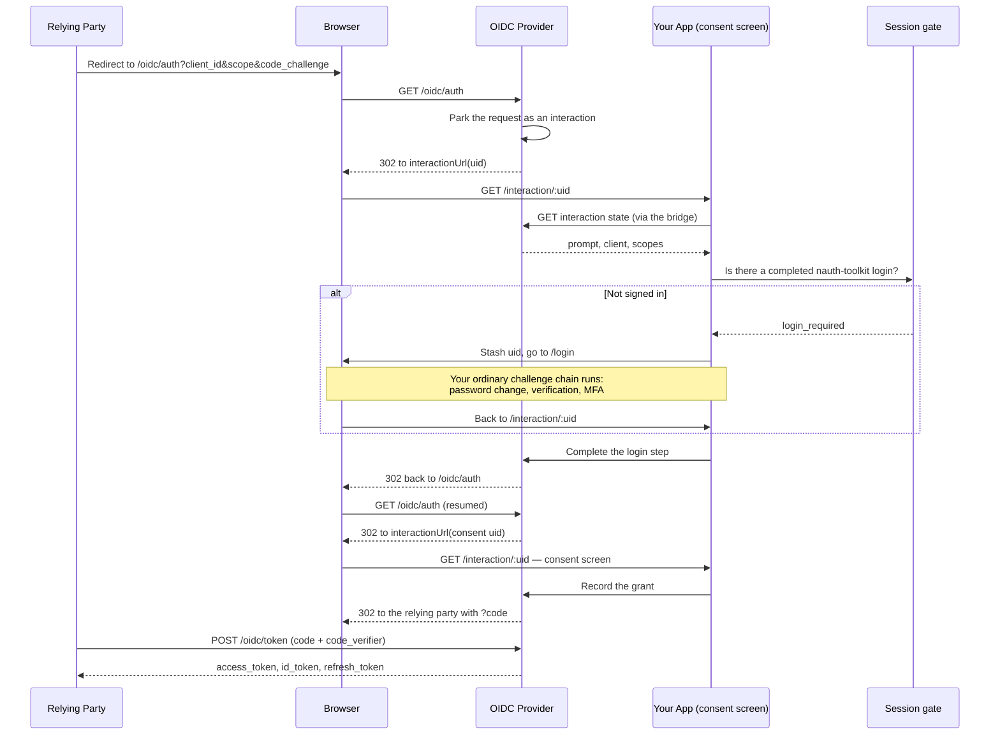

# How the OpenID Connect Provider Works

`@nauth-toolkit/oidc-provider` turns your nauth-toolkit application into an OAuth 2.0 authorization server and OpenID Connect provider, so other applications can offer "Sign in with your app".

The protocol itself is implemented by [`oidc-provider`](https://github.com/panva/node-oidc-provider) — OpenID Certified, MIT licensed. nauth-toolkit owns no protocol code. It supplies three things and nothing else: **storage**, **accounts**, and a **login and consent bridge**.

:::tip[Sample apps]
The provider is wired up end to end in the [nauth-toolkit repository](https://github.com/noorixorg/nauth-toolkit) — see `examples/demo-nestjs` for the backend and `examples/demo-angular` for the consent screen and a third-party relying party built on a certified client library.
:::

## When to use this — and when not to

This is for letting **other applications** sign users in with accounts they already hold
here: "Sign in with your app", a partner integration, a first-party mobile or desktop
client that wants standard OAuth rather than the nauth-toolkit SDK.

:::warning[Not a replacement for your own login]
Do not route your own application's sign-in through the OpenID Connect provider. Use
[`AuthService`](/docs/api/core/services/auth-service) and the
[frontend SDK](/docs/frontend-sdk/overview) for that, as you already do.

The protocol endpoints do not carry nauth-toolkit's controls:

| | nauth-toolkit's own login | The provider's protocol endpoints |
| --- | --- | --- |
| Rate limiting | Per-identifier and per-IP, per operation, with account lockout — see [Rate Limiting](/docs/guides/rate-limiting) | A coarse per-endpoint limiter you mount yourself ([`createOIDCRateLimiter`](/docs/api/oidc-provider/rate-limiter)); no lockout, no per-account counters |
| Audit trail | Every event type in [`AuthAuditEventType`](/docs/api/core/enums/auth-audit-event-type) — attempts, failures, MFA, sessions, devices | The four `OIDC_*` events below. Token issuance, refresh, introspection and revocation are **not** recorded |
| Adaptive risk, device trust, lockout | Full | Not applied to the protocol endpoints |
| Hooks | Full [lifecycle hooks](/docs/concepts/lifecycle-hooks) | Not invoked by the protocol endpoints |

The **login inside the flow is a different matter** — that is nauth-toolkit's own login,
and it keeps everything: the challenge chain, adaptive MFA, lockout, rate limits and
audit records all apply, exactly as they would if the user had signed in directly. What
is missing is coverage of the OAuth surface *around* it.
:::

## What you keep

Your existing login is unchanged. When the provider needs a user, it redirects to your own application, where the full challenge chain runs — forced password change, email and phone verification, MFA setup and verification, adaptive risk — and only then is the login reported as complete. You do not modify a challenge component or special-case a route.

## The flow

Note the two interaction ids. The login step and the consent step are separate interactions, so a consent screen must tolerate being entered under an id it has not seen before.

## The pieces

| Piece | What it does |
| --- | --- |
| [`createNAuthOIDCProvider()`](/docs/api/oidc-provider/create-provider) | Builds the provider on nauth-toolkit's storage and users |
| [`mountOIDCProviderNest()`](/docs/api/oidc-provider/mounting) / [`mountOIDCProviderExpress()`](/docs/api/oidc-provider/mounting) | Attaches it to the platform instance, before your body parsers |
| [`OIDCInteractionBridge`](/docs/api/oidc-provider/interaction-bridge) | Drives the login and consent steps from your own routes |
| [`createOIDCInteractionController()`](/docs/api/oidc-provider/interaction-controller) | The four NestJS interaction routes, registered for you |
| [`OIDCSessionTerminator`](/docs/api/oidc-provider/session-terminator) | Ends the provider's own SSO sessions and grants when a user logs out |
| [`createOIDCRateLimiter()`](/docs/api/oidc-provider/rate-limiter) | Rate limits the provider's endpoints, which your own limiter does not reach |

### What the provider's endpoints bypass

They are attached to the platform instance, not to your framework's router, so guards, interceptors, pipes and filters never see them. Two consequences you have to handle: rate limiting is yours to mount ([`createOIDCRateLimiter`](/docs/api/oidc-provider/rate-limiter)), and with NestJS `setGlobalPrefix('api')` does not apply to them.

The interaction routes are the opposite — ordinary routes inside your guard chain, because the session check reads the current user from request context.

### Session verdicts

Before an authorization request is released, the account is re-read from the database rather than trusted from the access token, so a user disabled, locked, or newly required to change their password mid-session cannot have an id_token minted for a third party. The verdict arrives on the consent screen as `gate`:

| Verdict | Meaning | What your page does |
| --- | --- | --- |
| `authenticated` | A completed login stands behind the request | Continue |
| `login_required` | Recoverable — no session, forced password change, unverified email | Stash the interaction id, send the user through login, return |
| `denied` | Account disabled, locked, or gone | Resolve the interaction with `access_denied` so the relying party is told |

### Audit events

The consent flow writes to your ordinary audit trail, with the relying party attached, unless you set `auditLogs.enabled: false`. Client info (IP, device, user agent) is filled in as it is for any other event.

| Event | When | Metadata |
| --- | --- | --- |
| `OIDC_ACCESS_DENIED` | The gate refused the account | `clientId`, `interactionUid`, `requestedScopes`, `reason` |
| `OIDC_CONSENT_DENIED` | The user refused the request | `clientId`, `interactionUid`, `requestedScopes` |
| `OIDC_CONSENT_GRANTED` | The user approved | `clientId`, `interactionUid`, `requestedScopes`, `grantedScopes` |
| `OIDC_LOGIN_COMPLETED` | A login was released to a relying party | `clientId`, `interactionUid`, `requestedScopes` |

Query them like any other event through [`AuthAuditService`](/docs/api/core/services/auth-audit-service).

## Hardened away from upstream defaults

| | `oidc-provider` default | Here |
| --- | --- | --- |
| Response types | `code`, `id_token`, `code id_token`, `none` | **`code` only** — no implicit or hybrid flow |
| PKCE | Required for public clients | **Required for every client** (RFC 9700) |
| Introspection / revocation | Disabled | Enabled, and a client may reach **only its own** tokens |
| Refresh tokens | Require the `offline_access` scope | Issued whenever the client registers the grant |
| Artifact lifetimes | Warn-on-default | Set explicitly |
| Built-in dev login screens | Enabled | **Disabled** — nauth-toolkit owns login |

## Storage

Every provider artifact — sessions, grants, authorization codes, access and refresh tokens, interactions — lives in your existing [`StorageAdapter`](/docs/concepts/storage). **No new tables and no migrations.**

Use Redis in production. The database adapter is fine for low traffic; the in-memory adapter is single-instance only and loses every session on restart.

## Default artifact lifetimes

| Artifact | TTL |
| --- | --- |
| `AuthorizationCode` | 60 seconds |
| `AccessToken` | 1 hour |
| `IdToken` | 1 hour |
| `Interaction` | 15 minutes |
| `RefreshToken` | 30 days |
| `Session` | 14 days |
| `Grant` | 14 days |

Override any of them through [`extraConfiguration`](/docs/api/oidc-provider/create-provider#extraconfiguration).

## What's Next

- [Set up the provider](/docs/guides/oauth-provider/setup) — install, configure, and mount it
- [Register clients](/docs/guides/oauth-provider/registering-clients) — confidential and public clients, redirect URIs, scopes
- [Build the consent screen](/docs/guides/oauth-provider/consent-screen) — the frontend SDK's `oidc` namespace
- [Single logout](/docs/guides/oauth-provider/single-logout) — end the provider's sessions when a user signs out
