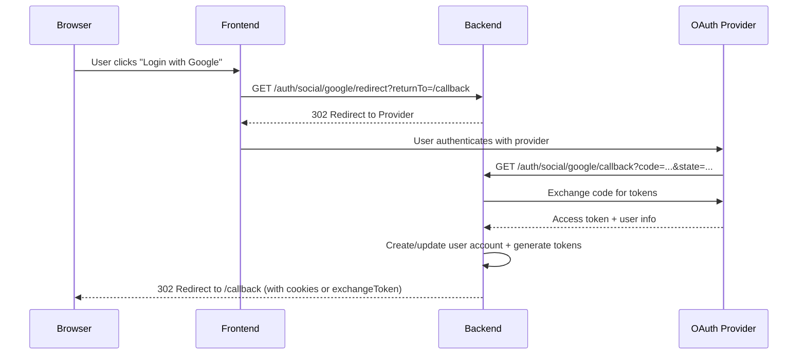
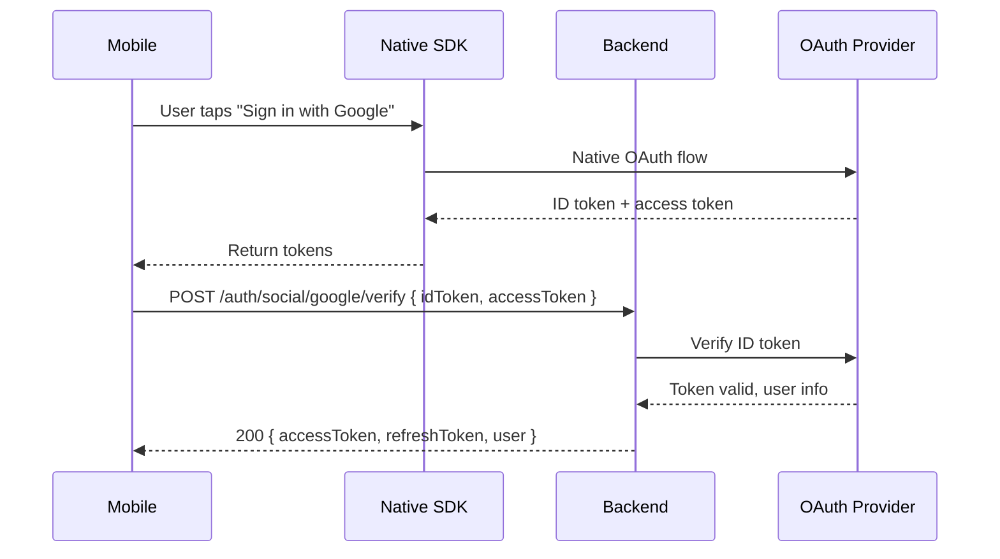

import Tabs from '@theme/Tabs';
import TabItem from '@theme/TabItem';

# How Social Login Works

Add Google, Apple, or Facebook sign-in to your app. nauth-toolkit uses a **redirect-first** OAuth flow: the backend owns the entire OAuth lifecycle. The frontend just opens a URL and handles the redirect back.

## Supported Providers

| Provider | Package | Notes |
| --- | --- | --- |
| [**Google**](/docs/guides/social/google) | `@nauth-toolkit/social-google` | Web OAuth + native mobile token verification |
| [**Apple**](/docs/guides/social/apple) | `@nauth-toolkit/social-apple` | JWT client secret auto-managed, `form_post` callback |
| [**Facebook**](/docs/guides/social/facebook) | `@nauth-toolkit/social-facebook` | Standard OAuth 2.0 |

:::tip Sample apps
Social login is implemented in the [nauth example apps](https://github.com/noorixorg/nauth-toolkit) — see the NestJS, Express, and Fastify examples for social routes, and the React/Angular examples for frontend callback handling.
:::

## Prerequisites

You have completed the [Basic Auth Flows](/docs/guides/basic-auth) guide and have working signup, login, and challenge endpoints. You also need:

- OAuth credentials from at least one provider (Google Cloud Console, Apple Developer, or Facebook Developer)
- A decision on [Token Delivery](/docs/concepts/token-management) mode: `cookies` (web), `json` (mobile/SPA), or `hybrid`

## How the Flow Works



**Cookies mode:** Tokens are set as httpOnly cookies during the redirect. No further action needed.

**JSON mode:** The redirect includes an `exchangeToken` query parameter. The frontend calls `POST /auth/social/exchange` to receive tokens in the response body.

**Challenges after social login:** If MFA or phone verification is required, the redirect includes an `exchangeToken` regardless of delivery mode. The frontend calls `/auth/social/exchange` to receive the challenge, completes it, then receives tokens.

## Configuration

```typescript title="config/auth.config.ts"
social: {
  redirect: {
    frontendBaseUrl: 'https://app.example.com',

    // Prevent open redirects — only allow relative returnTo paths
    allowAbsoluteReturnTo: false,
    allowedReturnToOrigins: ['https://app.example.com'],
  },

  google: {
    enabled: true,
    clientId: process.env.GOOGLE_CLIENT_ID,
    clientSecret: process.env.GOOGLE_CLIENT_SECRET,
    callbackUrl: 'https://api.example.com/auth/social/google/callback',
    scopes: ['openid', 'email', 'profile'],
    autoLink: true,        // Auto-link if email matches existing account
    allowSignup: true,     // Allow new user creation via social login
  },

  apple: {
    enabled: true,
    clientId: process.env.APPLE_CLIENT_ID,
    teamId: process.env.APPLE_TEAM_ID,
    keyId: process.env.APPLE_KEY_ID,
    privateKeyPem: process.env.APPLE_PRIVATE_KEY_PEM,
    callbackUrl: 'https://api.example.com/auth/social/apple/callback',
    scopes: ['name', 'email'],
  },

  facebook: {
    enabled: true,
    clientId: process.env.FACEBOOK_CLIENT_ID,
    clientSecret: process.env.FACEBOOK_CLIENT_SECRET,
    callbackUrl: 'https://api.example.com/auth/social/facebook/callback',
    scopes: ['email', 'public_profile'],
  },
},
```

See [Configuration > Social Login](/docs/concepts/configuration#social-authentication) for the full reference including OAuth parameters, native mobile settings, and advanced options.

### OAuth Parameters

Control provider behavior on a per-request basis:

| Provider | Key Parameters |
| --- | --- |
| **Google** | `prompt` (`select_account`, `consent`, `none`), `hd` (restrict to Workspace domain), `login_hint` |
| **Facebook** | `auth_type` (`rerequest`, `reauthenticate`), `display` (`page`, `popup`, `touch`) |
| **Apple** | `nonce` (ID token validation) |

Parameters can be set as defaults in config (`oauthParams`) or per-request from the frontend.

## Shared Routes

All providers use the same route structure. The `SocialRedirectHandler` handles the logic — your routes just delegate to it. In Express/Fastify, access it via `nauth.socialRedirect` (returned by `NAuth.create()`). In NestJS, inject it via the constructor.

| Endpoint | Method | Auth | Purpose |
| --- | --- | --- | --- |
| `/auth/social/:provider/redirect` | GET | Public | Start OAuth flow (redirects to provider) |
| `/auth/social/:provider/callback` | GET | Public | Provider callback (Google/Facebook) |
| `/auth/social/:provider/callback` | POST | Public | Provider callback (Apple `form_post`) |
| `/auth/social/exchange` | POST | Public | Exchange `exchangeToken` for tokens or challenge |
| `/auth/social/:provider/verify` | POST | Public | Native mobile token verification |

### Web OAuth Routes

<Tabs groupId="platform">
<TabItem value="nestjs" label="NestJS" default>

```typescript title="src/auth/social-redirect.controller.ts"
import { Controller, Get, Post, Param, Query, Body, Redirect } from '@nestjs/common';
import {
  Public,
  SocialRedirectHandler,
  AuthResponseDTO,
  SocialCallbackFormDTO,
  SocialCallbackQueryDTO,
  SocialRedirectCallbackResponseDTO,
  SocialExchangeDTO,
  StartSocialRedirectQueryDTO,
  StartSocialRedirectResponseDTO,
  TokenDelivery,
} from '@nauth-toolkit/nestjs';

@Controller('auth/social')
export class SocialRedirectController {
  constructor(private readonly socialRedirect: SocialRedirectHandler) {}

  @Public()
  @Redirect()
  @Get(':provider/redirect')
  async start(
    @Param('provider') provider: string,
    @Query() dto: StartSocialRedirectQueryDTO,
  ): Promise<StartSocialRedirectResponseDTO> {
    return await this.socialRedirect.start(provider, dto);
  }

  @Public()
  @Redirect()
  @Get(':provider/callback')
  async callbackGet(
    @Param('provider') provider: string,
    @Query() dto: SocialCallbackQueryDTO,
  ): Promise<SocialRedirectCallbackResponseDTO> {
    return await this.socialRedirect.callback(provider, dto);
  }

  // Apple uses POST with form_post response mode
  @Public()
  @Redirect()
  @Post(':provider/callback')
  async callbackPost(
    @Param('provider') provider: string,
    @Body() dto: SocialCallbackFormDTO,
  ): Promise<SocialRedirectCallbackResponseDTO> {
    return await this.socialRedirect.callback(provider, dto);
  }

  @Public()
  @Post('exchange')
  @TokenDelivery('json')
  async exchange(@Body() dto: SocialExchangeDTO): Promise<AuthResponseDTO> {
    return await this.socialRedirect.exchange(dto.exchangeToken);
  }
}
```

</TabItem>
<TabItem value="express" label="Express">

```typescript title="src/routes/social.routes.ts"
import { Router, Request, Response, NextFunction } from 'express';
import { SocialRedirectHandler } from '@nauth-toolkit/core';

// Mount: app.use('/auth/social', createSocialRoutes(nauth, nauth.socialRedirect!))
export function createSocialRoutes(nauth, socialRedirect: SocialRedirectHandler): Router {
  const router = Router();

  router.get('/:provider/redirect', nauth.helpers.public(), async (req: Request, res: Response, next: NextFunction) => {
    try {
      const { url } = await socialRedirect.start(req.params.provider, req.query);
      res.redirect(url);
    } catch (err) { next(err); }
  });

  router.get('/:provider/callback', nauth.helpers.public(), async (req: Request, res: Response, next: NextFunction) => {
    try {
      const { url } = await socialRedirect.callback(req.params.provider, req.query);
      res.redirect(url);
    } catch (err) { next(err); }
  });

  // Apple uses form_post response mode — requires a POST callback handler
  router.post('/:provider/callback', nauth.helpers.public(), async (req: Request, res: Response, next: NextFunction) => {
    try {
      const { url } = await socialRedirect.callback(req.params.provider, req.body);
      res.redirect(url);
    } catch (err) { next(err); }
  });

  router.post('/exchange', nauth.helpers.public(), nauth.helpers.tokenDelivery('json'),
    async (req: Request, res: Response, next: NextFunction) => {
      try {
        res.json(await socialRedirect.exchange(req.body.exchangeToken));
      } catch (err) { next(err); }
    }
  );

  return router;
}
```

</TabItem>
<TabItem value="fastify" label="Fastify">

```typescript title="src/routes/social.routes.ts"
import { FastifyInstance } from 'fastify';
import { SocialRedirectHandler } from '@nauth-toolkit/core';

export async function registerSocialRoutes(fastify: FastifyInstance, nauth, socialRedirect: SocialRedirectHandler) {
  fastify.get('/auth/social/:provider/redirect', { preHandler: [nauth.helpers.public()] },
    nauth.adapter.wrapRouteHandler(async (req, res) => {
      const { url } = await socialRedirect.start(String((req.params as any).provider), req.query);
      (res.raw as any).redirect(url, 302);
    }) as any
  );

  fastify.get('/auth/social/:provider/callback', { preHandler: [nauth.helpers.public()] },
    nauth.adapter.wrapRouteHandler(async (req, res) => {
      const { url } = await socialRedirect.callback(String((req.params as any).provider), req.query);
      (res.raw as any).redirect(url, 302);
    }) as any
  );

  // Apple uses form_post response mode — requires a POST callback handler
  fastify.post('/auth/social/:provider/callback', { preHandler: [nauth.helpers.public()] },
    nauth.adapter.wrapRouteHandler(async (req, res) => {
      const { url } = await socialRedirect.callback(String((req.params as any).provider), req.body as any);
      (res.raw as any).redirect(url, 302);
    }) as any
  );

  fastify.post('/auth/social/exchange',
    { preHandler: [nauth.helpers.public(), nauth.helpers.tokenDelivery('json')] },
    nauth.adapter.wrapRouteHandler(async (req, res) => {
      res.json(await socialRedirect.exchange((req.body as any).exchangeToken ?? ''));
    }) as any
  );
}
```

</TabItem>
</Tabs>

### Native Mobile Verification

For Capacitor/React Native apps that receive tokens directly from native SDKs (Google Sign-In SDK, Facebook SDK, etc.):

<Tabs groupId="platform">
<TabItem value="nestjs" label="NestJS" default>

```typescript title="src/auth/social-redirect.controller.ts"
import { Inject, BadRequestException, Optional } from '@nestjs/common';
import { VerifyTokenDTO } from '@nauth-toolkit/nestjs';
import { GoogleSocialAuthService } from '@nauth-toolkit/social-google/nestjs';
import { AppleSocialAuthService } from '@nauth-toolkit/social-apple/nestjs';
import { FacebookSocialAuthService } from '@nauth-toolkit/social-facebook/nestjs';

// Inside SocialRedirectController:
constructor(
  private readonly socialRedirect: SocialRedirectHandler,
  @Optional() @Inject(GoogleSocialAuthService)
  private readonly googleAuth?: GoogleSocialAuthService,
  @Optional() @Inject(AppleSocialAuthService)
  private readonly appleAuth?: AppleSocialAuthService,
  @Optional() @Inject(FacebookSocialAuthService)
  private readonly facebookAuth?: FacebookSocialAuthService,
) {}

@Public()
@Post(':provider/verify')
async verifyNative(@Body() dto: VerifyTokenDTO): Promise<AuthResponseDTO> {
  const provider = dto.provider;

  if (provider === 'google') {
    if (!this.googleAuth) throw new BadRequestException('Google OAuth is not configured');
    return await this.googleAuth.verifyToken(dto);
  }

  if (provider === 'apple') {
    if (!this.appleAuth) throw new BadRequestException('Apple OAuth is not configured');
    return await this.appleAuth.verifyToken(dto);
  }

  if (provider === 'facebook') {
    if (!this.facebookAuth) throw new BadRequestException('Facebook OAuth is not configured');
    return await this.facebookAuth.verifyToken(dto);
  }

  throw new BadRequestException(`Unsupported provider: ${provider}`);
}
```

</TabItem>
<TabItem value="express" label="Express">

```typescript title="src/routes/social.routes.ts"
router.post('/:provider/verify', nauth.helpers.public(), async (req: Request, res: Response, next: NextFunction) => {
  try {
    const provider = req.params.provider;
    if (provider === 'google') {
      if (!nauth.googleAuth) return res.status(400).json({ error: 'Google OAuth is not configured' });
      return res.json(await nauth.googleAuth.verifyToken(req.body));
    }
    res.status(400).json({ error: `Unsupported provider: ${provider}` });
  } catch (err) { next(err); }
});
```

</TabItem>
<TabItem value="fastify" label="Fastify">

```typescript title="src/routes/social.routes.ts"
fastify.post('/auth/social/:provider/verify', { preHandler: [nauth.helpers.public()] },
  nauth.adapter.wrapRouteHandler(async (req, res) => {
    const provider = (req.params as any).provider;
    if (provider === 'google') {
      if (!nauth.googleAuth) { res.status(400).json({ error: 'Google OAuth is not configured' }); return; }
      res.json(await nauth.googleAuth.verifyToken(req.body as any));
      return;
    }
    res.status(400).json({ error: `Unsupported provider: ${provider}` });
  }) as any
);
```

</TabItem>
</Tabs>



Native mobile apps **always use JSON mode** — tokens are returned in the response body.

### Web vs Native Comparison

| Aspect | Web (Redirect-First) | Native Mobile (Token Verify) |
| --- | --- | --- |
| **Flow** | Backend redirects to provider, then callback | Native SDK authenticates, app sends tokens |
| **Endpoints** | `/redirect`, `/callback`, `/exchange` | `/verify` |
| **Token Delivery** | Cookies or JSON (via exchange) | JSON (always) |
| **Exchange Needed** | Only when challenge pending (cookies mode) | Never — tokens from verify directly |
| **Frontend SDK** | `loginWithSocial()`, `exchangeSocialRedirect()` | `verifyNativeSocial()` |

## Account Linking

When a user signs in with a social provider and their email matches an existing account:

| Setting | Behavior |
| --- | --- |
| `autoLink: true` | Social account is automatically linked to the existing account |
| `autoLink: false` | Returns an error — user must explicitly link via security settings |
| `allowSignup: true` | New users can create accounts via social login |
| `allowSignup: false` | Only existing users can use social login |

Users can manage linked accounts from their security settings:

| Endpoint | Method | Auth | Purpose |
| --- | --- | --- | --- |
| `/auth/social/linked` | GET | Protected | List linked social accounts |
| `/auth/social/link` | POST | Protected | Link a social account |
| `/auth/social/unlink` | POST | Protected | Unlink a social account |
| `/auth/social/can-set-password` | GET | Protected | Check if social-only user can set a password |
| `/auth/social/set-password` | POST | Protected | Set password for social-only user |

:::note Session auth method
After social login, `authMethod` is set to the provider name (e.g., `google`, `apple`, `facebook`) instead of `password`. This is available in the response and stored on the cached user as `sessionAuthMethod`.
:::

## Challenges After Social Login

Social login can return challenges (MFA, phone verification) just like password login. The challenge is returned via the exchange endpoint:

1. Backend redirect includes `exchangeToken` in the callback URL
2. Frontend calls `POST /auth/social/exchange` with the `exchangeToken`
3. Exchange returns the challenge (e.g., `MFA_REQUIRED`)
4. Frontend completes the challenge via `/auth/respond-challenge`
5. Tokens are issued

In **cookies mode** without challenges, tokens are set as cookies during the redirect — no exchange call needed.

## Frontend Integration

### Start social login

```typescript
// Using the frontend SDK:
await client.loginWithSocial('google', {
  returnTo: '/auth/callback',
  appState: 'invite-code-123',  // Optional, returned after flow
});

// With OAuth parameter overrides:
await client.loginWithSocial('google', {
  returnTo: '/dashboard',
  oauthParams: { prompt: 'select_account', hd: 'company.com' },
});
```

### Handle the callback

The backend redirects back to your `returnTo` URL with:

- **Cookies mode (no challenge):** Just `appState` — tokens are already set as cookies
- **Cookies mode (challenge):** `exchangeToken` + `appState` — call exchange, complete challenge, receive cookies
- **JSON mode:** `exchangeToken` + `appState` — always call exchange to receive tokens

For Angular, use the `socialRedirectCallbackGuard` for a guard-only callback route. For React, handle the `exchangeToken` query parameter in your callback page.

The `appState` value you pass to `loginWithSocial()` is returned in the callback URL as a query parameter. It's also stored in the SDK (accessible via `getLastOauthState()`). Use it for invite codes, referral tracking, or deep-link targets.

See the [Frontend Social Authentication Guide](/docs/frontend-sdk/guides/social-auth) for complete implementation examples.

:::info Security notes
- **`appState` is not secret** — it appears in browser history and logs
- **Open redirect protection** — keep `allowAbsoluteReturnTo: false` unless you truly need absolute return URLs
- **Cluster-safe** — OAuth `state` is stored via transient `StorageAdapter` (Redis/DB), so the flow works across multiple containers
:::

:::warning Apple form_post
Apple uses POST with `form_post` response mode for callbacks. Ensure your backend can parse `application/x-www-form-urlencoded` bodies. Express handles this by default; Fastify requires the `@fastify/formbody` plugin.
:::

## Error Codes

| Error Code | Reason | User Action |
| --- | --- | --- |
| `SOCIAL_CONFIG_MISSING` | Provider not enabled in config | Check backend configuration |
| `SOCIAL_TOKEN_INVALID` | OAuth flow failed (denied, expired) | Try again |
| `SOCIAL_EMAIL_REQUIRED` | Provider did not return a verified email | Verify email with provider first |
| `SOCIAL_ACCOUNT_LINKED` | Social account linked to another user | Unlink from other account first |
| `SOCIAL_ACCOUNT_NOT_FOUND` | Social account not linked to any user | Link the account or sign in differently |
| `SOCIAL_ACCOUNT_EXISTS` | Provider and provider ID already registered | Use existing account or sign in with that account |
| `SIGNUP_DISABLED` | `allowSignup: false` and no matching account | Contact admin or sign up with email |
| `VALIDATION_FAILED` | Request payload failed validation | Check request parameters |

## What's Next

Choose a provider to set up:

- **[Google OAuth](/docs/guides/social/google)** — Most common, supports web + native mobile
- **[Apple OAuth](/docs/guides/social/apple)** — Required for iOS apps with third-party login
- **[Facebook OAuth](/docs/guides/social/facebook)** — Standard OAuth 2.0
